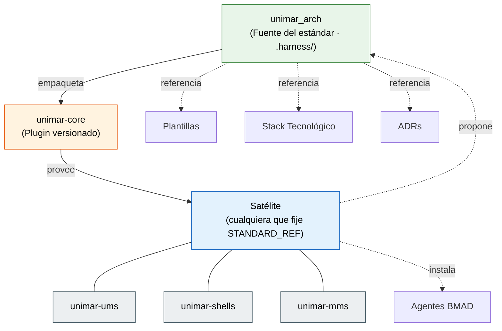

# Reglas de Repositorios Satélite

<p align="right">
  
  
  
  
</p>

> **Propietario:** Architecture Board
> **Alcance:** Todo repositorio satélite que derive de `unimar_arch` como base arquitectónica

---

## Propósito

`unimar_arch` es el repositorio de arquitectura de producto de Unimar y sirve como **fuente autoritativa de plantillas, estándares y reglas** para todos los repositorios satélite. Estas reglas aseguran que los satélites se mantengan alineados con la gobernanza corporativa sin duplicación de esfuerzo.

Un satélite es **vigente** cuando **consume el plugin**: declara `unimar-core` en el `STANDARD_REF` de su workflow de gobernanza. Hoy lo son [`unimar-ums`](https://github.com/unimar-peru/unimar-ums), [`unimar-shells`](https://github.com/unimar-peru/unimar-shells) y [`unimar-mms`](https://github.com/unimar-peru/unimar-mms).

`unimar_tms` **no** es vigente: quedó fuera de alcance permanente por decisión de su propietario (G-002) y nunca tuvo `gobernanza.yml`, de modo que jamás consumió el plugin. Nombrarlo vigente reclamaba conformidad a quien no la debe, y callaba a los que sí. La lista se deriva del criterio, no de la costumbre: si un repositorio no fija `STANDARD_REF`, no está en ella.

---

## Modelo de Herencia

El estándar **no se copia en el satélite**: se distribuye como el plugin versionado [`unimar-core`](https://github.com/unimar-peru/unimar-marketplace), y su versión es su identidad. Lo respalda el [ADR-0062](../reference/architecture/adrs/core/0062-estandar-distribuido-como-plugin-versionado.es.md).



La arista `propone` es el bucle de retorno: el satélite consulta al padre con `check-upstream.mjs` —que compara la versión del estándar en uso con la última publicada— y le devuelve cambios con `propose-upstream.mjs`, que exige trazabilidad a un gap local (SD-02). S-16 le prohíbe editar el estándar, así que ese es su único camino legítimo, y por eso ambos scripts **viajan en el plugin**: un canal de retorno que el satélite no puede ejecutar no es un canal.

Las aristas no son todas iguales, y confundirlas fue durante meses la causa de la deriva:

| Vía | Qué | Por qué |
| :--- | :--- | :--- |
| **Provisión** | Reglas, validadores, hooks, subagentes, corpus de ADRs | Viajan dentro del plugin. Nada se copia, así que nada puede derivar. Actualizar el estándar es subir de versión. |
| **Referencia** | Plantillas, ADRs, estándares, stack | Se enlazan. Una corrección en `unimar_arch` alcanza al satélite sin tocarlo. |
| **Instalación** | Agentes BMAD | Los genera `bmad-method`. Se hereda la **versión**, no los archivos (S-17). |
| **Materialización** | `.editorconfig`, `.markdownlint.json`, `GAPS.md`, `MADUREZ.md`, `CONTRIBUTING.md`, el esqueleto de directorios, la raíz de fuente, puertas | Se crean una vez desde las plantillas del plugin, y a partir de ahí el satélite las mantiene. |

> **El empaquetado ya no es manual.** `package-plugin.mjs --sync` genera el plugin desde la fuente según el contrato [`plugin.manifest.json`](https://github.com/unimar-peru/unimar_arch/blob/main/.harness/plugin.manifest.json), y `--check` falla en el CI del core si lo publicado diverge. Antes de existir ese gate, el plugin llegó a quedarse cuatro commits atrás y `validate-docs.mjs` **retrocedió** a una versión anterior a su propio arreglo, sin que nada lo detectara.

---

## Inicio Rápido — Crear o actualizar un satélite

> **Meta:** dejar un repositorio hijo conforme a <!--censo:reglas.S.primera-->S-01<!--/censo--> … <!--censo:reglas.S.ultima-->S-25<!--/censo-->, sin copiar el estándar.
> **Requisitos:** Node.js 24 LTS ([ADR-0067](../reference/architecture/adrs/core/0067-runtime-node-24-lts.es.md)). **No** hace falta clonar `unimar_arch`.

### 1. Instalar el estándar

El estándar viaja en el plugin. El satélite no lo copia, no lo ancla y no lo vigila: lo **consume**.

```bash
claude plugin marketplace add unimar-peru/unimar-marketplace
claude plugin enable unimar-core@unimar
```

En una máquina corporativa la versión la fija managed settings (`enabledPlugins`), y el satélite la recibe sin instalación manual.

Los validadores viven en el caché del plugin. Para localizar la copia instalada e invocarlos desde un script o a mano:

```bash
# La copia instalada la declara el cliente en installed_plugins.json: se lee
# de ahí, no del número mayor del caché, que nunca se recoge (ADR-0169 §2.6).
UNIMAR_CORE=$(node -e '
  const registro = process.env.HOME + "/.claude/plugins/installed_plugins.json";
  let entrada;
  try { entrada = (require(registro).plugins?.["unimar-core@unimar"] ?? [])[0]; } catch {}
  if (!entrada?.installPath) {
    console.error("unimar-core no está instalado; ejecuta: claude plugin enable unimar-core@unimar");
    process.exit(1);
  }
  console.log(entrada.installPath);
')
```

> **Por qué no se elige «la última del caché».** El estándar resolvía esta ruta con `ls` del caché ordenado por versión, y esa heurística **solo dice la verdad si la serie de versiones es monótona**. Los directorios del caché no se recogen nunca —una máquina de referencia conserva veinte, desde `0.1.0`—, así que en cuanto la línea vigente deja de ser la de número mayor ([ADR-0169](../reference/architecture/adrs/core/0169-linea-de-version-en-fase-de-diseno-declarada.es.md) §2.4), el orden elige para siempre un estándar viejo y **nada lo delata**: el gate local juzgaría con una versión y el CI con otra, cada uno coherente consigo mismo. El cliente ya declara qué instaló, como hecho y no como inferencia, en `~/.claude/plugins/installed_plugins.json` (entrada `unimar-core@unimar`, campo `installPath`), y esa lectura es correcta con serie monótona y sin ella (ADR-0169 §2.6). Se usa Node porque es requisito del estándar ([ADR-0067](../reference/architecture/adrs/core/0067-runtime-node-24-lts.es.md)); `jq` no lo es, y por eso no aparece. **Límite declarado:** si el cliente no actualiza su registro, la lectura devuelve lo que el cliente cree — que es justamente lo que el resto del estándar necesita saber. No comprueba que ese directorio corresponda a la etiqueta que fija `STANDARD_REF` en el CI.

### 2. Materializar los archivos de gobernanza

Un satélite nuevo no inventa su `GAPS.md` ni su `MADUREZ.md`. Los materializa desde las plantillas que el plugin empaqueta, ya con el esquema correcto — columna `Dim.` en madurez, columna `Apertura` en gaps:

```bash
# Con Claude Code, la skill lo hace y explica cada archivo:
#   /unimar-core:unimar-satelite-init
#
# A mano:
cp "$UNIMAR_CORE/templates/MADUREZ.md"        MADUREZ.md
cp "$UNIMAR_CORE/templates/GAPS.md"           GAPS.md
cp "$UNIMAR_CORE/templates/DECISIONS.md"      DECISIONS.md
cp "$UNIMAR_CORE/templates/CONTRIBUTING.md"   CONTRIBUTING.md # solo si no existe
cp "$UNIMAR_CORE/templates/CLAUDE.md"         CLAUDE.md       # solo si no existe
cp "$UNIMAR_CORE/templates/README.md"         README.md       # solo si no existe
cp "$UNIMAR_CORE/templates/AGENTS.md"         AGENTS.md       # solo si no existe
cp "$UNIMAR_CORE/templates/.markdownlint.json"  .markdownlint.json
cp "$UNIMAR_CORE/templates/.markdownlintignore" .markdownlintignore
cp "$UNIMAR_CORE/templates/.lintstagedrc.json"  .lintstagedrc.json
cp "$UNIMAR_CORE/templates/.editorconfig"     .editorconfig   # solo si no existe
cp "$UNIMAR_CORE/templates/.gitignore"        .gitignore      # solo si no existe
mkdir -p .husky .github/workflows
cp "$UNIMAR_CORE/templates/husky-pre-commit.sh"   .husky/pre-commit
cp "$UNIMAR_CORE/templates/husky-commit-msg.sh"   .husky/commit-msg
cp "$UNIMAR_CORE/templates/gobernanza.yml"        .github/workflows/gobernanza.yml
chmod +x .husky/pre-commit .husky/commit-msg
```

El hook `commit-msg` es una puerta aparte, y no por comodidad: `pre-commit` juzga `HEAD` y sus
antecesores, o sea todo salvo el commit que se está creando, cuyo mensaje aún no existe. Sin este
hook, una referencia colgante pasa al escribirse y bloquea al **siguiente** commit, cuando el
mensaje ya está publicado y corregirlo exige reescribir historia (SD-02).

`.editorconfig` es **extensible**: si ya existe no se sobrescribe, para que el satélite añada las reglas de su runtime. `CONTRIBUTING.md` también: si el satélite ya tiene el suyo, se le añade lo que falte —en particular la sección **Contribuir al núcleo**— en vez de pisarlo.

### 2.b Taxonomía, contribución y raíz de fuente (S-18)

La [taxonomía de satélite](../taxonomy/taxonomia-repositorio-satelite.md) **se referencia, no se copia**. El satélite no mantiene una versión local del documento: materializa el esqueleto que prescribe.

```bash
mkdir -p docs reference/governance/gaps
mkdir -p src && touch src/.gitkeep      # raíz de fuente por defecto
```

`src/` es la raíz de fuente **única y obligatoria en todo arquetipo** ([ADR-0107](../reference/architecture/adrs/core/0107-src-raiz-de-fuente-unica.es.md)). La raíz del repositorio no aloja código: solo gobernanza documental y configuración. Un monorepo coloca sus `apps/`, `libs/` y `packages/` **bajo `src/`** (`src/apps`, `src/libs`, `src/packages`); el _workspace_ del orquestador (`nx.json`, `package.json`) permanece en la **raíz del repositorio** (una sola raíz de _workspace_, [ADR-0066](../reference/architecture/adrs/core/0066-alcance-de-nx-en-monorepos-poliglotas.es.md)). Nx opera desde la raíz y descubre los proyectos bajo `src/`. Un satélite sin código ejecutable declara S-18 como `N/A`, con el porqué.

`CONTRIBUTING.md` no es papeleo. Es donde el satélite aprende que **no puede editar el estándar** y cuál es su único camino legítimo para cambiarlo: registrar el hallazgo en `GAPS.md`, consultar `check-upstream.mjs` y proponerlo con `propose-upstream.mjs` como PR a `unimar_arch`. Un satélite sin esa sección tiene la puerta cerrada y ninguna llave.

### 3. Verificar la conformidad

Se invocan **desde la raíz del satélite**. El cwd es el repositorio que se valida; la ubicación del script es irrelevante:

```bash
node "$UNIMAR_CORE/scripts/validate-madurez.mjs" --fix       # S-19
node "$UNIMAR_CORE/scripts/validate-gaps.mjs" --fix          # S-20
node "$UNIMAR_CORE/scripts/validate-correspondencia.mjs"     # S-19, S-20
node "$UNIMAR_CORE/scripts/validate-docs.mjs"                # S-09, S-10, SD-06
node "$UNIMAR_CORE/scripts/validate-trazabilidad.mjs"        # SD-02
node "$UNIMAR_CORE/scripts/validate-satellite-base.mjs"      # S-01 … S-05, S-13
node "$UNIMAR_CORE/scripts/validate-triaje.mjs"              # S-15, S-16
node "$UNIMAR_CORE/scripts/validate-estructura-satelite.mjs" # S-16, S-18
node "$UNIMAR_CORE/scripts/validate-ubicacion-artefactos.mjs" # S-01…S-05, S-18
node "$UNIMAR_CORE/scripts/validate-prd-index.mjs"           # S-25
node "$UNIMAR_CORE/scripts/validate-s24-fase1.mjs"          # S-24
node "$UNIMAR_CORE/scripts/validate-criterios.mjs"           # SD-04 (aviso)
node "$UNIMAR_CORE/scripts/validate-gates-locales.mjs"       # S-23 (aviso)
node "$UNIMAR_CORE/scripts/validate-suite.mjs"                # ADR-0120 (aviso)
```

El orden importa: `validate-gaps` deriva las dimensiones válidas de la columna `Dim.` de `MADUREZ.md`, y `validate-correspondencia` cruza los dos archivos ya normalizados.

Con Claude Code, la skill `validar-gobernanza` del plugin corre el barrido entero en un paso.

### 3.b Madurez y gaps (S-19, S-20)

El satélite mantiene dos archivos en su raíz:

- **`MADUREZ.md`** — dos dimensiones en escala TOGAF ACMM 1..5: los 5 pilares Well-Architected y las 5 fases del SDLC. Un nivel ≥ 2 exige evidencia enlazada; un nivel < 5 exige declarar el camino al siguiente. La columna **`Dim.`** da a cada casilla el token con el que sus gaps la referencian, y de ella derivan los validadores las dimensiones válidas.
- **`GAPS.md`** — registro único. Los pendientes van siempre primero, después por criticidad y luego por complejidad. Cada gap apunta a una dimensión de `MADUREZ.md` y declara su **`Apertura`** en `AAAA-MM-DD`. **Cerrar un gap exige evidencia**: commit, PR o ADR.

Cada casilla de madurez con nivel < 5 **debe** tener al menos un gap en su dimensión. No es una recomendación: lo comprueba `validate-correspondencia.mjs`.

El hook de pre-commit ejecuta madurez y gaps con `--fix` y vuelve a poner los archivos en el índice, de modo que el estado del gap se actualiza en cada commit sin trabajo manual.

Para proyectar el radar en una sesión: `node "$UNIMAR_CORE/scripts/validate-madurez.mjs" --render`

### 4. Instalar los agentes BMAD (S-17)

El satélite **no copia** los agentes: los instala. La versión autoritativa es la declarada en [`_bmad/_config/manifest.yaml`](https://github.com/unimar-peru/unimar_arch/blob/main/_bmad/_config/manifest.yaml) de `unimar_arch`.

```bash
npx bmad-method install --action quick-update
```

El runner (`.claude/`, `.opencode/`, `.agents/`) lo elige cada satélite y se declara en su `DECISIONS.md`. Lo que se hereda es la versión de BMAD y el contenido de `_bmad/_config`, no los archivos generados por el runner.

El estándar corporativo es **Claude Code**, cuyo target es `.claude/skills`:

```bash
npx bmad-method@6.8.0 install --yes --tools claude-code
```

### 4.b Los rulesets de agentes (S-21, S-22)

El satélite **no materializa** rulesets ni subagentes: los recibe. El plugin empaqueta los siete subagentes BMAD, cada uno con su ruleset vinculante, sus validadores obligatorios y su allowlist de herramientas. `apply-agent-config.mjs` es una herramienta de la fuente, no del satélite.

El plugin también registra sus propios hooks, fuera del repositorio:

- **`PreToolUse`** → `hook-guard-standard.mjs` **deniega** con razón cualquier escritura bajo `.harness/`, `.claude/agents/` o `.claude/settings.json`. Es _fail-closed_: si no puede evaluar la operación, bloquea. Y es _parent-aware_: en `unimar_arch` — que se reconoce por publicar [`catalog.json`](https://github.com/unimar-peru/unimar_arch/blob/main/.harness/catalog.json) — la autoría de `.harness/` sí es legítima.

Con `allowManagedHooksOnly: true` en managed settings, el satélite no puede registrar el hook, quitarlo ni modificarlo. Un guardián al que el vigilado puede despedir no es un guardián.

El catálogo de todo lo disponible en la fuente — reglas, scripts, rulesets — vive en [`catalog.json`](https://github.com/unimar-peru/unimar_arch/blob/main/.harness/catalog.json), legible por máquina. `validate-catalog.mjs` comprueba que cada script exista y que cada regla citada esté declarada: **el catálogo no puede mentir sobre lo que hay.**

### 5. Encadenar las puertas (S-12)

El satélite ejecuta la validación antes de cada commit y, sobre todo, en el servidor. La plantilla `templates/husky-pre-commit.sh` ya localiza el plugin y encadena los <!--censo:validadores.satelite:palabra-->catorce<!--/censo--> validadores de §3; la plantilla `templates/gobernanza.yml` hace lo propio en CI.

> **Esta cifra no se teclea: la computa `validate-conteos.mjs` del bloque de §3.** Decía «siete» mientras el bloque listaba ocho y la plantilla encadenaba nueve — tres números para el mismo hecho ([G-130](https://github.com/unimar-peru/unimar_arch/blob/main/GAPS.md)). Lo que el censo **no** alcanza es la plantilla: el manifiesto la declara `propiedadDelPlugin`, no vive en esta fuente y ninguna puerta la cruza contra este bloque. Que hoy coincidan es un arreglo, no un control.

Activación del hook, una vez por clon:

```bash
node "$UNIMAR_CORE/scripts/install-hooks.mjs"
```

git no puede activarlo al clonar: ejecutar la configuración que trae un repositorio recién clonado sería ejecutar código ajeno, y git se niega por diseño. Por eso la activación es un comando explícito, y `install-hooks.mjs --check` responde si está hecha.

> **El hook local no es la garantía.** Se evade con `--no-verify`, y sin `core.hooksPath` ni siquiera existe. El límite de merge inevadible es el CI del satélite, que fija la versión del estándar en `STANDARD_REF` y la obtiene haciendo checkout del marketplace. Fijarla a un tag (`unimar-core-0.6.0`) da builds reproducibles; apuntar a `main` hace que el comportamiento del CI cambie porque alguien publicó.

### 5.b Gates locales de calidad y seguridad (S-23)

Los controles de calidad y seguridad se ejecutan en **local** —máquina del desarrollador y git hooks—, no en servicios administrados del proveedor ([ADR-0106](../reference/architecture/adrs/core/0106-seguridad-calidad-local-first.es.md)). La postura de seguridad **no depende** de la cuota, el saldo ni la disponibilidad de GitHub Actions: el caso que lo motivó fue un satélite que se quedó sin poder validar seguridad al agotarse la cuota de Actions.

El satélite cablea en sus hooks los gates que su stack permita, y `validate-gates-locales.mjs` lo comprueba como **aviso** (gateable cuando la adopción madure):

| Gate | Mecanismo local |
| :--- | :--- |
| Escáner de secretos | gitleaks con baseline versionado |
| Auditoría de dependencias | `npm audit`, `dotnet list --vulnerable` u equivalente del stack |
| Linters / SAST | linters del stack + analizadores del compilador (no CodeQL-servicio) |
| Pruebas + coverage | pruebas del stack con **umbral de coverage** que falla por debajo |
| Formato de commits | commitlint / Conventional Commits (hook `commit-msg`) |

El CI del proveedor, si existe, es un checkpoint de merge **redundante** y una capa de publicación **opcional** (P-LOCAL-03); nunca el mecanismo de seguridad ni un prerequisito. Reintroducirlo como puerta de seguridad exige un ADR que amplíe ADR-0106 (P-LOCAL-02).

### 6. Registrar el triaje

Cada satélite triaja las <!--censo:reglas.S:palabra-->veinticinco<!--/censo--> reglas en su `DECISIONS.md`, **con estos identificadores**. Ver la [Guía de Herencia](../reference/governance/standards/onboarding/guia-herencia-repositorio-hijo.md) para la semántica de `Adopt` / `Extend` / `Override` / `N/A` y el orden de precedencia.

### 7. Declarar el tipo de repositorio (ADR-0069)

Un satélite es un **producto** —un sistema con usuarios, entornos y despliegue— o una **librería** que otros repositorios consumen y que no se despliega. El [ADR-0069](../reference/architecture/adrs/core/0069-tipo-de-repositorio-libreria-o-producto.es.md) hace de esa distinción parte del estándar, para no medir una librería con la vara de un producto sin recurrir a un `Override` que S-15 prohíbe.

El satélite lo declara en la **cabecera de gobernanza de su `DECISIONS.md`**, junto a `STANDARD_REF`:

```markdown
> **Tipo de repositorio:** libreria
```

Los valores canónicos son `producto` y `libreria`. El **defecto es `producto`**: un satélite que no lo declara se comporta exactamente como hasta ahora, así que ningún satélite existente cambia sin decidirlo. El helper `lib/tipo.mjs` lee el campo y `validate-estructura-satelite.mjs` rechaza un valor no canónico —una clasificación que nadie comprueba mediría con la vara equivocada, el riesgo que el propio ADR-0069 nombra—. El tipo declarado condiciona:

| Ámbito | `producto` (defecto) | `libreria` |
|---|---|---|
| Ramas ([ADR-0050](../reference/architecture/adrs/core/0050-estrategia-ramificacion-gitflow.es.md)) | `main`, `develop`, `qa`, `uat` | `main`, `develop` |
| Artefactos SDLC (S-01 … S-05) | Obligatorios según fase | No obligatorios; su equivalente es el corpus de ADRs locales |
| README y metadatos | Portal de cuatro secciones ([ADR-0159](../reference/architecture/adrs/core/0159-plantillas-del-estandar-con-fuente-y-forma.es.md)), con el Flujo SDLC por fase y sus hubs | Portal de cuatro secciones ([ADR-0159](../reference/architecture/adrs/core/0159-plantillas-del-estandar-con-fuente-y-forma.es.md)); el Flujo SDLC cubre instalación, SemVer, API pública y límites |
| Madurez (S-19) | Escalado, SLA, DORA | Overhead por llamada, corrección de la librería, cadencia de release |

---

## Reglas de Herencia (S-01 a S-25)

| ID | Regla | Descripción | Operación Permitida |
|---|---|---|---|
| **S-01** | Plantillas Base | Todo artefacto SDLC en satélite debe basarse en las plantillas de [`reference/governance/sdlc/04-plantillas-artefactos/`](../reference/governance/sdlc/04-plantillas-artefactos/README.md) | `Adopt` / `Extend` / `Override` |
| **S-02** | Formato Canónico | Las historias funcionales en satélite deben seguir la estructura con: tabla de navegación, diagrama Mermaid, lista de secciones numeradas | `Adopt` / `Extend` |
| **S-03** | Diagramas Mermaid Obligatorios | Toda historia funcional y épica debe incluir al menos un diagrama Mermaid de flujo o secuencia | `Adopt` / `Extend` |
| **S-04** | Requisitos Técnicos Aislados | La sección 3 de toda historia de usuario debe tener: bounded context, dependencias, restricciones, ADRs relevantes, notas | `Adopt` / `Extend` |
| **S-05** | Actores y Stakeholders | La sección 2 de toda historia de usuario debe incluir actor principal, actores secundarios, diagrama de secuencia, tabla de interacciones | `Adopt` / `Extend` |
| **S-06** | Trazabilidad a ADRs | Cada decisión técnica en satélite debe referenciar un ADR de `unimar_arch`. Si no existe, crear el ADR en `unimar_arch` primero | `Adopt` |
| **S-07** | Stack Tecnológico Autorizado | Solo usar tecnologías del [stack aprobado](../reference/architecture/stack-tecnologico-autorizado-agnostico.es.md). Si se requiere nueva tecnología, solicitar ADR en `unimar_arch` | `Adopt` / `Override` solo con nuevo ADR |
| **S-08** | Versión SemVer en Plantillas | Toda plantilla en satélite debe mantener su versión SemVer en los badges y sincronizar con `unimar_arch` | `Adopt` / `Extend` |
| **S-09** | Idioma Único | Toda la documentación en satélite debe estar en español, salvo excepciones declaradas en [`terminology-glossary.md`](./terminology-glossary.md) | `Adopt` |
| **S-10** | Referencias Relativas | Los enlaces internos entre artefactos deben ser rutas relativas desde la ubicación del archivo | `Adopt` |
| **S-11** | Badges Uniformados | Los badges de licencia, mantenedor y versión deben seguir el formato estándar de `unimar_arch` | `Adopt` / `Extend` |
| **S-12** | Validación Pre-Commit | Antes de cada commit en satélite, ejecutar el mismo script de validación que en `unimar_arch` | `Adopt` |
| **S-13** | Historial de Cambios | Todo artefacto debe mantener tabla de historial de cambios con versión, fecha, autor y descripción | `Adopt` / `Extend` |
| **S-14** | Guía de Estilo | El formato de diagramas, tablas y secciones debe seguir la guía de estilo de `unimar_arch` | `Adopt` / `Extend` |
| **S-15** | Decisiones Locales | Las decisiones locales del satélite deben registrarse en un `DECISIONS.md` local y nunca contradecir un ADR de `unimar_arch`. Cuando una decisión local merezca un **ADR propio**, su identificador es **`ADR-<SIGLA>-NNN`**: la sigla del sistema según el [catálogo](../reference/architecture/catalogo-sistemas-suite.es.md), y `NNN` una secuencia propia desde `001`. Un satélite que **no sea un sistema** del catálogo declara su prefijo en `DECISIONS.md`, y no puede coincidir con una sigla `Ratificada`. **Las cuatro cifras a secas (`ADR-NNNN`) son el espacio de identidad del núcleo y un satélite no las usa**: un mismo número en dos repositorios son dos decisiones distintas con el mismo nombre, y «ver ADR-0064» deja de tener respuesta. El ADR local lleva el mismo front-matter que el del núcleo (`adr`, `estado`, `supersede`, `deprecia_reglas`): sin él, `validate-adr-status.mjs` no puede leerlo y la decisión es opaca para toda máquina | `Adopt` |
| **S-16** | Estándar Provisto, no Copiado | El satélite **no contiene** `.harness/`, ni `inherited.lock`, ni copia alguna de reglas o validadores. El estándar lo provee el plugin `unimar-core`, y la versión consumida se fija explícitamente en el CI del satélite. Editar el estándar desde un satélite es imposible por hook y, si se intentara fuera del agente, el CI lo rechaza. El camino para cambiarlo es proponerlo en `unimar_arch` | `Adopt` |
| **S-17** | Agentes BMAD | El satélite instala BMAD con `npx bmad-method install`, en la misma versión que declara `_bmad/_config/manifest.yaml` de `unimar_arch`. Los archivos generados por el runner no se heredan; el runner elegido se declara en `DECISIONS.md` | `Adopt` / `Extend` |
| **S-18** | Taxonomía, Contribución y Raíz de Fuente | El satélite **referencia** la [taxonomía de repositorio satélite](../taxonomy/taxonomia-repositorio-satelite.md), que rige su documentación; no la copia. Materializa el esqueleto de directorios que prescribe, su `CONTRIBUTING.md` —que **debe** documentar el bucle de retorno al núcleo— y la **raíz de fuente `src/`**, única y obligatoria en todo arquetipo ([ADR-0107](../reference/architecture/adrs/core/0107-src-raiz-de-fuente-unica.es.md)), creada vacía con `.gitkeep`. Un monorepo anida sus sub-raíces (`libs/`, `apps/`, `packages/`) **dentro** de `src/`, no en el nivel superior; un satélite sin código ejecutable triaja S-18 como `N/A`. Materializa además `.markdownlint.json` sin divergencia y `.editorconfig` como base extensible. La taxonomía **no gobierna** la nomenclatura de los artefactos de código del runtime | `Adopt` / `Extend` |
| **S-19** | Medición de Madurez | El satélite mantiene `MADUREZ.md` en su raíz, con las dos dimensiones y la escala TOGAF ACMM 1..5. Un nivel ≥ 2 exige evidencia enlazada; un nivel < 5 exige declarar el camino al siguiente. Verificado por `validate-madurez.mjs` | `Adopt` |
| **S-20** | Registro Único de Gaps | El satélite mantiene `GAPS.md` en su raíz. Los pendientes van siempre primero, ordenados por criticidad y luego por complejidad. Cada gap apunta a una dimensión de `MADUREZ.md`. Un gap `Cerrado` exige evidencia. El estado se actualiza y se reordena en cada commit vía `validate-gaps.mjs --fix` | `Adopt` |
| **S-21** | Rulesets de Agentes | El satélite **recibe** del plugin los subagentes BMAD, cada uno con el ruleset de [`agent-rulesets.md`](./agent-rulesets.md), sus validadores y su allowlist de herramientas. No los materializa ni los edita: `.claude/agents/` y `.claude/settings.json` son zona protegida por `hook-guard-standard.mjs`. Los hooks del plugin hacen cumplir S-16 y S-20 sin depender de que el agente las recuerde. El catálogo [`catalog.json`](https://github.com/unimar-peru/unimar_arch/blob/main/.harness/catalog.json) enumera reglas, scripts y rulesets de la fuente, y `validate-catalog.mjs` comprueba que no mienta | `Adopt` |
| **S-22** | Reglas Spec-Driven | El satélite adopta [`spec-driven-rules.md`](./spec-driven-rules.md), reglas SD-01 a SD-08. La especificación precede a la implementación; la evidencia precede a la afirmación | `Adopt` |
| **S-23** | Gates de Calidad y Seguridad Local-First | Los controles de calidad y seguridad se ejecutan en **local** —máquina del desarrollador y git hooks— sin depender de GitHub Actions ni de servicios de seguridad del proveedor ([ADR-0106](../reference/architecture/adrs/core/0106-seguridad-calidad-local-first.es.md), P-LOCAL-01). El satélite cablea en sus hooks los gates que su stack permita: escáner de secretos (gitleaks), auditoría de dependencias (`npm audit` / `dotnet list --vulnerable`), linters/SAST del stack, pruebas con **umbral de coverage** que falla por debajo, y formato de commits (commitlint). El CI del proveedor **no** es la puerta de seguridad por defecto; reintroducirlo como gate exige un ADR que amplíe ADR-0106 (P-LOCAL-02). La publicación de evidencias al proveedor, si existe, es opcional (P-LOCAL-03) | `Adopt` / `Extend` |
| **S-24** | Fase 1 Define, el Tablero Planifica | Los artefactos de **Fase 1 — Concepción y Descubrimiento** (PRD, Backlog Ágil, Épica, Historia de Usuario, Lienzo de Descubrimiento, Caso de Negocio, Estimación Preliminar) **definen y ordenan** el trabajo —épicas, historias, prioridad, tallas relativas, dependencias y una **propuesta de secuencia** de sprints— y **no declaran tiempo de calendario** ([ADR-0134](../reference/architecture/adrs/core/0134-fase-1-define-el-backlog-el-tablero-posee-el-tiempo.es.md) D2). Quedan prohibidos en ellos: fechas de inicio, fin, entrega o despliegue; quarters o meses como horizonte de entrega; diagramas `gantt` o cualquier eje temporal absoluto; duraciones de sprint expresadas como calendario; y métricas de ejecución en curso (velocity real, burn-down, % de avance, desvío de cronograma). **Excepción:** la fecha documental del propio artefacto —aprobación, revisión, historial de cambios (S-13)—, que describe al documento y no a la entrega. El **esfuerzo sí** se estima, en unidades de capacidad —puntos de historia, sprints de equipo, personas— y nunca convertido en calendario (D3). La secuencia de sprints se expresa como grafo de precedencia, no como gantt (D4). Todo Backlog Ágil **debe** enlazar su iniciativa en el **tablero SDLC**, que es la fuente única de fechas, línea base, ruta crítica, valor ganado y avance real ([ADR-0087](../reference/architecture/adrs/core/0087-tablero-ejecutivo-iniciativas-directorio-central.es.md), [ADR-0089](../reference/architecture/adrs/core/0089-app-oficial-sdlc-bd-relacional.es.md), [ADR-0100](../reference/architecture/adrs/core/0100-gestion-valor-ganado-cronograma-tablero.es.md)). El **ejecutor** es `validate-s24-fase1.mjs` ([ADR-0128](../reference/architecture/adrs/core/0128-politica-como-codigo-ejecutor-derivado.es.md)), en **dos niveles**: bloquea lo que no admite lectura benigna —el diagrama `gantt`, el eje temporal, el trimestre como horizonte y las fechas de entrega declaradas por nombre— y avisa de lo heurístico, porque un gate ruidoso que bloquea es peor que no tenerlo (SD-06). La **excepción de S-13 es parte del ejecutor, no una omisión**: marcar las fechas del historial empujaría a falsearlo para pasar la puerta | `Adopt` |
| **S-25** | Índice de Iniciativas Publicado | Todo satélite **de tipo producto con PRDs** (`prds > 0`; una `libreria` no autora PRDs y triaja `N/A`) **debe generar, publicar y mantener** su `initiatives-index.json` en `<pages_url>/reporting/data/initiatives-index.json`, alcanzable, declarando de quién es (`satellite`) y **listando en `documentos[].ref` todos los PRDs que el repo autora**. Sin esta obligación la federación de PRDs queda inerte: el tablero está construido para **leer** el índice ([ADR-0087](../reference/architecture/adrs/core/0087-tablero-ejecutivo-iniciativas-directorio-central.es.md), [ADR-0088](../reference/architecture/adrs/core/0088-bd-sdlc-app-control-sdlc.es.md), [ADR-0137](../reference/architecture/adrs/core/0137-sincronizacion-selectiva-de-prds.es.md)) pero **nadie lo producía**, y un PRD sin publicar no aparece en el directorio central ([ADR-0140](../reference/architecture/adrs/core/0140-publicacion-obligatoria-indice-iniciativas-satelite.es.md), cierra [G-244](https://github.com/unimar-peru/unimar_arch/blob/main/GAPS.md)). Esta regla §3 es el **ejecutor primario** —fuerza el **arranque**, que ningún gate del tablero alcanza (no hay a qué colgarlo antes de la primera publicación)—; el gate F1 del tablero cubre la **continuidad** ([ADR-0140](../reference/architecture/adrs/core/0140-publicacion-obligatoria-indice-iniciativas-satelite.es.md) §2.2). El **ejecutor** es `validate-prd-index.mjs`, que nace con la regla ([ADR-0128](../reference/architecture/adrs/core/0128-politica-como-codigo-ejecutor-derivado.es.md)): descubre los PRDs del repo por su identificador auto-declarado y **solo LEE** —el core exige y verifica, no genera, copia ni repara el índice ajeno ([ADR-0088](../reference/architecture/adrs/core/0088-bd-sdlc-app-control-sdlc.es.md) §2.3)— y falla si el índice falta o no los lista. La verificación de **alcanzabilidad remota** (HTTP 200 al registrar la evidencia) es del gate F1, no de esta puerta local | `Adopt` |

> **Condicionamiento por tipo (ADR-0069).** Las reglas **S-01 a S-05** y **S-24** rigen los artefactos SDLC de **producto** (historias, épicas, PRD, backlog). En un satélite `tipo: libreria` no son obligatorias: una capacidad crosscutting no tiene usuarios ni features, y su «qué» y «por qué» viven en el corpus de ADRs locales. Un satélite de librería triaja S-01 … S-05 y S-24 como `N/A` **en función de su tipo declarado**, no por conveniencia; el resto de reglas aplica igual a ambos tipos. Ver el paso [7. Declarar el tipo de repositorio](#7-declarar-el-tipo-de-repositorio-adr-0069).

---

## Operaciones de Herencia

| Operación | Símbolo | Significado |
|---|---|---|
| **Adopt** | `A` | Tomar la regla/plantilla tal cual de `unimar_arch` sin modificaciones |
| **Extend** | `E` | Tomar la regla/plantilla y añadir extensiones locales que no contradigan el original |
| **Override** | `O` | Reemplazar la regla/plantilla localmente solo cuando esté explícitamente permitido y con ADR local que lo justifique |
| **N/A** | — | La regla no aplica al satélite por contexto |

---

## Catálogo de Plantillas Disponibles para Herencia

| Plantilla | Archivo Fuente | Fase SDLC | Operación Sugerida |
|---|---|---|---|
| Historia Funcional (con épicas) | [`plantilla-historia-funcional-fuente.es.md`](../reference/governance/sdlc/04-plantillas-artefactos/fuente/plantilla-historia-funcional-fuente.es.md) | Fase 2 | `Adopt` |
| Historia de Usuario | [`plantilla-historia-usuario-fuente.es.md`](../reference/governance/sdlc/04-plantillas-artefactos/fuente/plantilla-historia-usuario-fuente.es.md) | Fase 1 | `Adopt` |
| Historia Técnica | [`plantilla-historia-tecnica-fuente.es.md`](../reference/governance/sdlc/04-plantillas-artefactos/fuente/plantilla-historia-tecnica-fuente.es.md) | Fase 3 | `Adopt` |
| épica | [`plantilla-epica-fuente.es.md`](../reference/governance/sdlc/04-plantillas-artefactos/fuente/plantilla-epica-fuente.es.md) | Fase 1 | `Adopt` |
| ADR | [`plantilla-adr-fuente.es.md`](../reference/governance/sdlc/04-plantillas-artefactos/fuente/plantilla-adr-fuente.es.md) | Fase 2 | `Adopt` |
| PRD | [`plantilla-prd-fuente.es.md`](../reference/governance/sdlc/04-plantillas-artefactos/fuente/plantilla-prd-fuente.es.md) | Fase 1 | `Adopt` |
| Backlog Ágil | [`plantilla-backlog-agil-fuente.es.md`](../reference/governance/sdlc/04-plantillas-artefactos/fuente/plantilla-backlog-agil-fuente.es.md) | Fase 1 | `Adopt` |
| Reporte de Pruebas | [`plantilla-reporte-pruebas-fuente.es.md`](../reference/governance/sdlc/04-plantillas-artefactos/fuente/plantilla-reporte-pruebas-fuente.es.md) | Fase 4 | `Adopt` |
| Notas de Lanzamiento | [`plantilla-notas-lanzamiento-fuente.es.md`](../reference/governance/sdlc/04-plantillas-artefactos/fuente/plantilla-notas-lanzamiento-fuente.es.md) | Fase 5 | `Adopt` |

---

## Validadores de Cumplimiento

Todos se ejecutan **desde la raíz del satélite**. Ver el [Inicio Rápido](#inicio-rápido--crear-o-actualizar-un-satélite).

Los que **provee el plugin**, y por tanto todo satélite puede correr:

| Script | Verifica | Reglas |
| :--- | :--- | :--- |
| `validate-satellite-base.mjs` | Estructura de los artefactos SDLC | S-01 … S-05, S-13 |
| `validate-docs.mjs` | Encoding UTF-8, texto mutilado, enlaces y trazabilidad | S-09, S-10, SD-06 |
| `validate-madurez.mjs` | Que cada nivel de madurez tenga evidencia y camino declarado; recalcula la puntuación | S-19 |
| `validate-gaps.mjs` | Orden canónico del registro de gaps, contadores, fecha de apertura, y que ningún cierre carezca de evidencia | S-20 |
| `validate-correspondencia.mjs` | Que cada casilla de madurez con nivel < 5 tenga al menos un gap en su dimensión | S-19, S-20 |
| `validate-trazabilidad.mjs` | Que ninguna referencia `G-NNN` o `ADR-NNNN` cuelgue, en ambos sentidos. Juzga **tus commits aún sin publicar**; con `--mensaje` juzga el mensaje que estás escribiendo, que es cuando todavía se puede corregir. Una cita a otro repositorio se califica `<repositorio>#<id>` y queda fuera del barrido local | SD-02 |
| `validate-criterios.mjs` | Criterios de aceptación con adjetivo vago y sin ancla medible. **Aviso**, no puerta | SD-04 |
| `validate-triaje.mjs` | Que `DECISIONS.md` triaje **todas** las reglas de herencia, con operación canónica y justificación. Un `Override` exige enlazar su ADR | S-15, S-16 |
| `validate-estructura-satelite.mjs` | Que el satélite tenga raíz de fuente declarada, `CONTRIBUTING.md` con el bucle de retorno, el esqueleto de la taxonomía, ningún `.harness/` y ningún marcador de plantilla sin sustituir | S-16, S-18 |
| `validate-prd-index.mjs` | Que un satélite de producto con PRDs publique su `initiatives-index.json` (`reporting/data/`) y liste en él todos los PRDs del repo. Solo lectura; no genera ni repara el índice. No aplica en la fuente ni en una librería | S-25 |
| `validate-s24-fase1.mjs` | Que los artefactos de Fase 1 ordenen sin fechar. **Bloquea** lo exacto —`gantt`, `dateFormat`/`axisFormat`, trimestre como horizonte, fechas de inicio/fin/entrega/despliegue— y **avisa** de lo heurístico —rangos de fecha, cadencia de sprint como calendario, métricas de ejecución en curso—; con `--strict` los avisos también bloquean. Exceptúa el historial de cambios (S-13) y las fechas documentales. No aplica en la fuente ni en una librería | S-24 |
| `check-upstream.mjs` · `propose-upstream.mjs` | El bucle de retorno hacia el padre: consultar la versión publicada y abrir la propuesta con trazabilidad a un gap | S-16, S-06, SD-02 |
| `validate-adr-status.mjs` | Que el estado de cada ADR sea legible por máquina | S-06 |
| `install-hooks.mjs` | Apunta `core.hooksPath` a `.husky/`; con `--check`, falla si el hook no está activo | S-12 |
| `hook-guard-standard.mjs` | Hook `PreToolUse`: deniega escritura bajo `.harness/`, `.claude/agents/` y `.claude/settings.json`. _Parent-aware_ y _fail-closed_ | S-16, S-21 |

Los que son **herramientas de la fuente** y no viajan al satélite:

| Script | Verifica | Reglas |
| :--- | :--- | :--- |
| `validate-proteccion-rama.mjs` | Que la protección de rama **declarada** en `.harness/proteccion-ramas.json` siga siendo la **efectiva** en GitHub. Es el único control del estándar que vive fuera del repositorio: ningún diff lo muestra y ninguna revisión lo cubre (G-312). Duro en CI, aviso en local | S-16 |
| `package-plugin.mjs` | Publica el plugin desde la fuente (`--sync`) y falla si lo publicado divergió (`--check`) | S-16 |
| `validate-catalog.mjs` | Que `catalog.json` no anuncie scripts inexistentes ni reglas no declaradas | S-21 |
| `apply-agent-config.mjs` | Materializa los rulesets sobre el runner del core y, con `--target`, regenera los subagentes del plugin; `--check` detecta la deriva | S-21, S-22 |
| `hook-sync-gaps.mjs` | Hook `Stop`: normaliza `GAPS.md` y bloquea cierres sin evidencia | S-20 |

> **Retirados en la versión 1.0.0.** `validate-inherited.mjs`, `validate-heredogram.mjs` e `inherited.lock` pertenecían a la herencia por copia que [ADR-0062](../reference/architecture/adrs/core/0062-estandar-distribuido-como-plugin-versionado.es.md) abolió. Se han eliminado. Mientras existieron, `check-upstream.mjs` y `propose-upstream.mjs` exigían un `inherited.lock` que S-16 prohíbe al satélite: el bucle de retorno abortaba en su primera línea, y ningún satélite conforme podía proponer un cambio al estándar. Ahora ambos derivan la versión en uso de la ubicación del propio script y viajan en el plugin.

`validate-satellite-base.mjs` comprueba en concreto:

1. Que todas las historias funcionales y épicas tengan diagrama Mermaid
2. Que la sección 3 (Requisitos Técnicos) esté completa
3. Que la sección 2 (Actores) esté presente
4. Que los ADRs referenciados existan en `unimar_arch`
5. Que los enlaces relativos no estén rotos
6. Que el encoding sea UTF-8 limpio

```bash
node "$UNIMAR_CORE/scripts/validate-satellite-base.mjs" --verbose
node "$UNIMAR_CORE/scripts/validate-docs.mjs"
```

> **Nota de alcance.** `validate-docs.mjs` detecta BOM, `U+FFFD`, mojibake, CRLF y **texto mutilado**: prosa a la que se le han caído las tildes o la eñe, que sigue siendo UTF-8 perfectamente válido y que ninguna comprobación de encoding delata. Lo hace con un diccionario de formas imposibles en español (`satlite`, `estndar`) más una regla de sufijo para `-ción`/`-sión`. Es una heurística sobre prosa, no un corrector: no juzga ortografía ni gramática.

---

## Excepciones

Las excepciones a estas reglas deben ser aprobadas por el Architecture Board y documentadas en el `DECISIONS.md` del satélite con la operación `Override`.

---

<p align="center">
  
  
</p>

<p align="center">
  <strong>© Unimar S.A.</strong> · RUC 20100412447 · Operador Logístico Aduanero desde 1978<br>
  Última revisión: 2026-07-10
</p>
