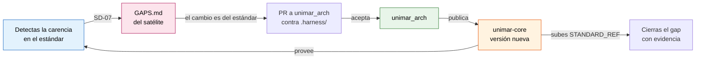

# Guía de Contribución — NOMBRE_DEL_SATELITE

> **Estado:** Activo | **Propietario:** Unimar S.A. | **Reglas:** S-06, S-16, S-18, SD-05, SD-07, SD-08

Este repositorio es un **satélite** de [`unimar_arch`](https://github.com/unimar-peru/unimar_arch). No define el estándar: lo consume, versionado, desde el plugin `unimar-core`.

## Principios

1. **Idioma único (SD-08).** Toda contribución va en español. No se aceptan pares bilingües ni archivos `.en.md`.
2. **Taxonomía heredada (S-18).** La estructura de este repositorio la rige la [Taxonomía de Repositorio Satélite](https://github.com/unimar-peru/unimar_arch/blob/main/taxonomy/taxonomia-repositorio-satelite.md) — `kebab-case`, sin directorios sin scope. Se **referencia, no se copia**: no mantengas una versión local.
3. **Frontera de carpetas.** Documentación en `reference/`, planificación en `docs/`, código ejecutable en `RAIZ_DE_FUENTE`. No mezclar.
4. **El estándar no se edita desde aquí (S-16).** Este repositorio no contiene `.harness/`. `.claude/agents/` y `.claude/settings.json` son zona protegida. Ver [Contribuir al núcleo](#contribuir-al-núcleo).
5. **Enlaces relativos (S-10).** Desde la ubicación del archivo, y deben resolver. Un enlace roto falla la tarea (SD-06).
6. **Evidencia antes que afirmación (SD-05).** Una decisión referencia su ADR; un gap cerrado, su commit o PR. Sin prueba enlazada se registra el pendiente en [`GAPS.md`](./GAPS.md), no se afirma.

## Proceso

1. **Rama.** Desde la rama de integración, con prefijo `docs/`, `feat/` o `fix/` según el cambio.
2. **Especificación primero (SD-01).** Un cambio de comportamiento arranca de su artefacto SDLC. Las correcciones triviales —typo, enlace roto, formato— están exentas.
3. **Trazabilidad a ADRs (S-06).** Toda decisión técnica referencia un ADR **aceptado** de `unimar_arch`. Si no existe, se crea allí primero. Nunca se resuelve inventando la decisión aquí.
4. **Registrar hallazgos (SD-07).** Todo gap, oportunidad, riesgo o deuda que descubras va a [`GAPS.md`](./GAPS.md) con su dimensión de madurez, criticidad y complejidad — nunca solo en el cuerpo del PR.
5. **Validar antes del commit.** El barrido completo, en un paso:

   ```bash
   # Con Claude Code:
   #   /unimar-core:validar-gobernanza
   #
   # A mano, localizando el plugin:
   # La copia instalada la declara el cliente en installed_plugins.json: se lee
   # de ahí, no del número mayor del caché, que nunca se recoge (ADR-0169 §2.6).
   UNIMAR_CORE=$(node -e '
     const { resolve } = require("path");
     const registro = process.env.HOME + "/.claude/plugins/installed_plugins.json";
     let entradas = [];
     try { entradas = require(registro).plugins?.["unimar-core@unimar"] ?? []; } catch {}
     const aqui = process.cwd();
     const entrada = entradas.find((e) => e.projectPath && resolve(e.projectPath) === aqui)
       ?? entradas.find((e) => e.scope === "user")
       ?? entradas[0];
     if (!entrada?.installPath) {
       console.error("unimar-core no está instalado; ejecuta: claude plugin enable unimar-core@unimar");
       process.exit(1);
     }
     console.log(entrada.installPath);
   ')
   node "$UNIMAR_CORE/scripts/validate-madurez.mjs" --fix
   node "$UNIMAR_CORE/scripts/validate-gaps.mjs" --fix
   node "$UNIMAR_CORE/scripts/validate-correspondencia.mjs"
   node "$UNIMAR_CORE/scripts/validate-docs.mjs"
   node "$UNIMAR_CORE/scripts/validate-trazabilidad.mjs"
   node "$UNIMAR_CORE/scripts/validate-satellite-base.mjs"
   node "$UNIMAR_CORE/scripts/validate-triaje.mjs"
   ```

6. **Build y pruebas del runtime.**

   ```bash
   COMANDO_BUILD
   COMANDO_PRUEBAS
   ```

7. **Hook de pre-commit.** No se activa al clonar: git se niega por diseño a ejecutar la configuración de un repositorio ajeno. Una vez por clon:

   ```bash
   node "$UNIMAR_CORE/scripts/install-hooks.mjs"
   ```

   El hook local se evade con `--no-verify`. **La puerta inevadible es el CI**, que fija la versión del estándar en `STANDARD_REF`.

## Contribuir al núcleo

Este satélite **no puede** modificar el estándar: ni sus reglas, ni sus validadores, ni sus subagentes. Un hook `PreToolUse` deniega la escritura y el CI la rechaza. Eso no es una limitación, es lo que impide que veintidós reglas deriven en tantas variantes como repositorios.

El camino de vuelta es explícito:



1. **Registra el hallazgo** en [`GAPS.md`](./GAPS.md), con dimensión, criticidad y complejidad. Un hallazgo no registrado se olvida.
2. **Comprueba si ya está resuelto** aguas arriba: puede que la versión del plugin que consumes esté atrasada. Compara la que tienes instalada con la última publicada.

   ```bash
   cat "$UNIMAR_CORE/.claude-plugin/plugin.json" | grep version
   gh release list --repo unimar-peru/unimar-marketplace --limit 1
   ```

3. **Abre la propuesta como PR en `unimar_arch`**, contra la fuente del estándar (`.harness/`), nunca contra una copia local. Si el cambio es una decisión técnica, lleva su ADR.

   ```bash
   gh pr create --repo unimar-peru/unimar_arch --title "..." --body "Origen: NOMBRE_DEL_SATELITE, gap G-NNN"
   ```

4. **Cuando el núcleo acepte y publique**, sube la versión del plugin en `STANDARD_REF` y cierra el gap **con la evidencia enlazada**: el PR del núcleo, o el tag de la versión que lo trae.

Si necesitas apartarte de una regla sin cambiarla para todos, eso es un `Override`, se declara en [`DECISIONS.md`](./DECISIONS.md) y **exige un ADR local que lo justifique**. Un `Override` sin ADR lo rechaza `validate-triaje.mjs`.

## Estructura del repositorio

| Ruta | Contenido | Autoridad |
| :--- | :--- | :--- |
| `RAIZ_DE_FUENTE` | Código ejecutable del satélite | Manda la convención del runtime, no `kebab-case` |
| `docs/` | Artefactos de planificación e implementación | Taxonomía documental |
| `reference/` | Corpus documental propio | Taxonomía documental |
| `reference/governance/gaps/` | Fichas de detalle y evidencia de los gaps | S-20 |
| `MADUREZ.md`, `GAPS.md` | Gobernanza viva. Se repuntúan solos en cada commit | S-19, S-20 |
| `DECISIONS.md` | Triaje de las reglas de herencia y decisiones locales | S-15 |
| `.claude/agents/`, `.claude/settings.json` | Zona protegida. Los provee el plugin | S-21 |

---

## Historial de Cambios

| Versión | Fecha | Autor | Descripción |
| :--- | :--- | :--- | :--- |
| 1.0.0 | FECHA_DE_HOY | NOMBRE_DEL_SATELITE | Materialización desde la plantilla del plugin `unimar-core` |

---

<p align="center">
  <strong>© Unimar S.A.</strong> · RUC 20100412447 · Operador Logístico Aduanero desde 1978
</p>
