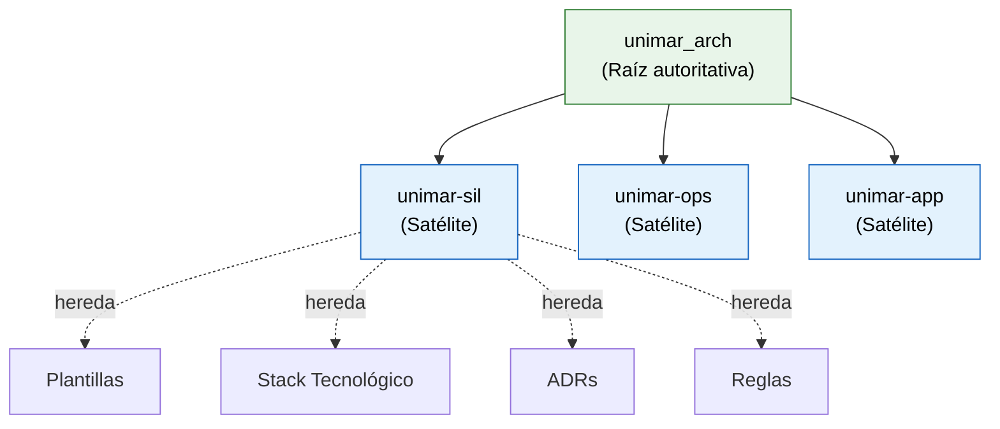

# Reglas de Repositorios Satélite

<p align="right">
  
  
  
  
</p>

> **Propietario:** Architecture Board
> **Alcance:** Todo repositorio satélite que derive de `unimar_arch` como base arquitectónica

---

## Propósito

`unimar_arch` es el repositorio de arquitectura de producto de Unimar y serve como **fuente autoritativa de plantillas, estándares y reglas** para todos los repositorios satélite (como `unimar-sil`, `unimar-ops`, etc.). Estas reglas aseguran que los satélites se mantengan alineados con la gobernanza corporativa sin duplicación de esfuerzo.

---

## Modelo de Herencia



---

## Reglas de Herencia (S-01 a S-15)

| ID | Regla | Descripcin | Operacin Permitida |
|---|---|---|---|
| **S-01** | Plantillas Base | Todo artefacto SDLC en satlite debe basarse en las plantillas de [`reference/governance/sdlc/04-plantillas-artefactos/`](../../reference/governance/sdlc/04-plantillas-artefactos/README.md) | `Adopt` / `Extend` / `Override` |
| **S-02** | Formato Canónico | Las historias funcionales en satlite deben seguir la estructura con: tabla de navegacin, diagrama Mermaid, lista de secciones numeradas | `Adopt` / `Extend` |
| **S-03** | Diagramas Mermaid Obligatorios | Toda historia funcional y épica debe incluir al menos un diagrama Mermaid de flujo o secuencia | `Adopt` / `Extend` |
| **S-04** | Requisitos Técnicos Aislados | La seccin 3 de toda historia de usuario debe tener: bounded context, dependencias, restricciones, ADRs relevantes, notas | `Adopt` / `Extend` |
| **S-05** | Actores y Stakeholders | La seccin 2 de toda historia de usuario debe incluir actor principal, actores secundarios, diagrama de secuencia, tabla de interacciones | `Adopt` / `Extend` |
| **S-06** | Trazabilidad a ADRs | Cada decisin tcnica en satlite debe referenciar un ADR de `unimar_arch`. Si no existe, crear el ADR en `unimar_arch` primero | `Adopt` |
| **S-07** | Stack Tecnológico Autorizado | Solo usar tecnologas del stack aprobado. Si se requiere nueva tecnologa, solicitar ADR en `unimar_arch` | `Adopt` / `Override` slo con nuevo ADR |
| **S-08** | Versin SemVer en Plantillas | Toda plantilla en satlite debe mantener su versin SemVer en los badges y sincronizar con `unimar_arch` | `Adopt` / `Extend` |
| **S-09** | Idioma nico | Toda la documentacin en satlite debe estar en espaol, salvo excepciones declaradas en [`terminology-glossary.md`](./terminology-glossary.md) | `Adopt` |
| **S-10** | Referencias Relativas | Los enlaces internos entre artefactos deben ser rutas relativas desde la ubicacin del archivo | `Adopt` |
| **S-11** | Badges Uniformados | Los badges de licencia, mantenedor y versin deben seguir el formato estndar de `unimar_arch` | `Adopt` / `Extend` |
| **S-12** | Validacin Pre-Commit | Antes de cada commit en satlite, ejecutar el mismo script de validacin que en `unimar_arch` | `Adopt` |
| **S-13** | Historial de Cambios | Todo artefacto debe mantener tabla de historial de cambios con versin, fecha, autor y descripcin | `Adopt` / `Extend` |
| **S-14** | Gua de Estilo | El formato de diagrams, tablas y secciones debe seguir la gua de estilo de `unimar_arch` | `Adopt` / `Extend` |
| **S-15** | Decisiones Locales | Las decisiones locales del satlite deben registrarse en un `DECISIONS.md` local y nunca contradecir un ADR de `unimar_arch` | `Adopt` |

---

## Operaciones de Herencia

| Operacin | Smbolo | Significado |
|---|---|---|
| **Adopt** | `A` | Tomar la regla/plantilla tal cual de `unimar_arch` sin modificaciones |
| **Extend** | `E` | Tomar la regla/plantilla y aadir extensiones locales que no contradigan el original |
| **Override** | `O` | Reemplazar la regla/plantilla localmente slo cuando est explcitamente permitido y con ADR local que lo justifique |
| **N/A** | — | La regla no aplica al satlite por contexto |

---

## Catlogo de Plantillas Disponibles para Herencia

| Plantilla | Archivo Fuente | Fase SDLC | Operacin Sugerida |
|---|---|---|---|
| Historia Funcional (con épicas) | [`plantilla-historia-funcional-fuente.es.md`](../../reference/governance/sdlc/04-plantillas-artefactos/fuente/plantilla-historia-funcional-fuente.es.md) | Fase 2 | `Adopt` |
| Historia de Usuario | [`plantilla-historia-usuario-fuente.es.md`](../../reference/governance/sdlc/04-plantillas-artefactos/fuente/plantilla-historia-usuario-fuente.es.md) | Fase 1 | `Adopt` |
| Historia Técnica | [`plantilla-historia-tecnica-fuente.es.md`](../../reference/governance/sdlc/04-plantillas-artefactos/fuente/plantilla-historia-tecnica-fuente.es.md) | Fase 3 | `Adopt` |
| épica | [`plantilla-epica-fuente.es.md`](../../reference/governance/sdlc/04-plantillas-artefactos/fuente/plantilla-epica-fuente.es.md) | Fase 1 | `Adopt` |
| ADR | [`plantilla-adr-fuente.es.md`](../../reference/governance/sdlc/04-plantillas-artefactos/fuente/plantilla-adr-fuente.es.md) | Fase 2 | `Adopt` |
| PRD | [`plantilla-prd-fuente.es.md`](../../reference/governance/sdlc/04-plantillas-artefactos/fuente/plantilla-prd-fuente.es.md) | Fase 1 | `Adopt` |
| Backlog Ágil | [`plantilla-backlog-agil-fuente.es.md`](../../reference/governance/sdlc/04-plantillas-artefactos/fuente/plantilla-backlog-agil-fuente.es.md) | Fase 1 | `Adopt` |
| Reporte de Pruebas | [`plantilla-reporte-pruebas-fuente.es.md`](../../reference/governance/sdlc/04-plantillas-artefactos/fuente/plantilla-reporte-pruebas-fuente.es.md) | Fase 4 | `Adopt` |
| Notas de Lanzamiento | [`plantilla-notas-lanzamiento-fuente.es.md`](../../reference/governance/sdlc/04-plantillas-artefactos/fuente/plantilla-notas-lanzamiento-fuente.es.md) | Fase 5 | `Adopt` |

---

## Validador de Cumplimiento

El script `.harness/scripts/validate-satellite-base.mjs` verifica automticamente:

1. Que todas las historias funcionales y épicas tengan diagrama Mermaid
2. Que la seccin 3 (Requisitos Técnicos) est completa
3. Que la seccin 2 (Actores) est presente
4. Que los ADRs referenciados existan en `unimar_arch`
5. Que los enlaces relativos no estn rotos
6. Que el encoding sea UTF-8 limpio

Para ejecutar en el satlite:
```bash
node .harness/scripts/validate-satellite-base.mjs --base https://raw.githubusercontent.com/mhernandez-unimar/unimar_arch/main
```

---

## Excepciones

Las excepciones a estas reglas deben ser aprobadas por el Architecture Board y documentadas en el `DECISIONS.md` del satlite con la operacin `Override`.

---

<p align="center">
  
  
</p>

<p align="center">
  <strong>© Unimar S.A.</strong> · RUC 20100412447 · Operador Logístico Aduanero desde 1978<br>
  Última revisión: 2026-06-08
</p>