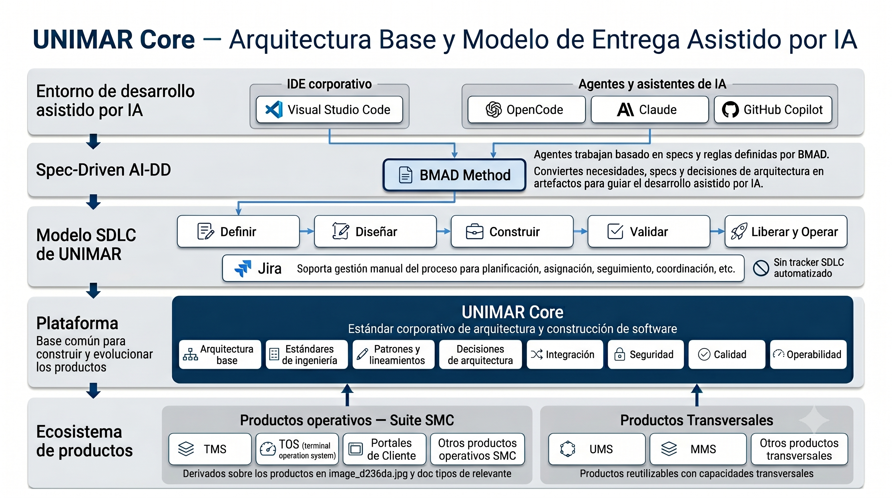

# Estándar Corporativo de Software — UNIMAR

> **Repositorio corporativo de arquitectura de software de Unimar S.A.**

 

**Unimar Arch es el corpus arquitectónico corporativo del operador logístico aduanero Unimar S.A. (desde 1978).** 
Define estándares arquitectónicos reutilizables, reglas de gobernanza, ADRs, patrones 
y guía operativa que los productos satélite heredan y especializan.

> *Separar conceptualmente antes de separar físicamente.*

 

  
   
  <strong>Figura 1:</strong> Modelo conceptual de la arquitectura corporativa Unimar — traza la relación entre capas de negocio, dominio y tecnología.

 
 

---

## 1. Orientación

<strong>Puntos de entrada primarios</strong>

> **Meta:** Acelerar la localización de los artefactos más consultados del repositorio.
> **Objetivos:** Reducir el tiempo de onboarding, unificar el lenguaje corporativo, dar visibilidad a las decisiones activas.

| Enlace (URL) | Descripción | Meta / Objetivo | Tipificación |
|---|---|---|---|
| [Índice de Navegación](./reference/navigation/MASTER_INDEX.md) | Navegación completa del repositorio | Localizar cualquier artefacto rápidamente | Índice de navegación |
| [Estándar Arquitectónico Corporativo](./reference/architecture/estandar-arquitectonico-suite-unimar.es.md) | Línea base reusable de la suite UNIMAR (incorpora Directivas, Baseline Agnóstica, ADRs, SDLC y Patrones) | Centralizar estándares arquitectónicos | Baseline de arquitectura |
| [Glosario](./reference/governance/glosario.md) | Terminología controlada del proyecto | Unificar lenguaje corporativo | Referencia |
| [Modelo de Trazabilidad](./reference/governance/sdlc/modelo-trazabilidad.es.md) | Cadena de evidencia end-to-end | Vincular requerimientos, artefactos y pruebas | Guía |
| [Flujo Asistido con AI (opcional)](./reference/flujo-asistido-ai/README.md) | Guía práctica para ejecutar el SDLC completo con agentes BMAD | Alternativa asistida a la producción manual de artefactos | Guía |
| <a href="reference/assets/unimar_core_executive_presentation.html" target="_blank" rel="noopener">Presentación Ejecutiva UNIMAR Core →</a> | Presentación interactiva del modelo arquitectónico UNIMAR Core (7 diapositivas) | Comunicar visión, alcance y valor de UNIMAR Core a stakeholders | Presentación ejecutiva |

<strong>Primeros pasos por rol</strong>

> **Propósito:** Onboarding autoguiado — cada perfil encuentra su primera lectura según su responsabilidad, sin tener que leer el corpus completo.

| Rol | ¿Qué busca? | Comenzar por | Luego revisar |
|---|---|---|---|
| **Arquitecto** | Estándares, ADRs, blueprints, NFRs | [Estándar Arquitectónico Corporativo](./reference/architecture/estandar-arquitectonico-suite-unimar.es.md) — baseline reusable de la suite Unimar | [Blueprint de Referencia](./reference/architecture/blueprints/blueprint-referencia.es.md) — topología y stack de referencia |
| **Desarrollador** | Cómo implementar siguiendo el SDLC | [Framework SDLC](./reference/governance/sdlc/02-ingenieria/framework-sdlc-enfoque-construccion.es.md) — proceso y definición de hecho | [Patrones Canónicos](./reference/architecture/canonical-patterns/README.md) — patrones de implementación |
| **QA** | Gates, calidad, métricas | [Gates de Calidad](./reference/governance/sdlc/gates-calidad.es.md) — checkpoints y criterios de promoción | [ADR-0052 — Aislamiento Unit Testing](./reference/architecture/adrs/core/0052-estrategia-aislamiento-pruebas-unitarias.es.md) — estrategia de pruebas |
| **Producto / PM** | PRD, trazabilidad, road map | [Índice Fase 1](./reference/navigation/indices/fase-1-concepcion-descubrimiento.md) — PRD, backlog, descubrimiento | [Modelo de Trazabilidad](./reference/governance/sdlc/modelo-trazabilidad.es.md) — cadena de artefactos end-to-end |
| **Agente IA (BMAD)** | Reglas, skills, flujo asistido | [AGENTS.md](./AGENTS.md) — reglas y convenciones para agentes | [Flujo Asistido con AI (opcional)](./reference/flujo-asistido-ai/README.md) — guía práctica del SDLC con agentes BMAD |
| **Cualquier rol** | Navegación general | — | [Índice de Navegación](./reference/navigation/MASTER_INDEX.md) — ruteo exhaustivo del repositorio |

<strong>Plan de Capacitación y Adopción SDLC</strong>

> **Meta:** Acelerar la adopción metodológica del estándar arquitectónico corporativo.
> **Objetivos:** Definir el roadmap de coaching, los artefactos requeridos por fase y unificar la comprensión del ciclo de vida (SDLC).

| Enlace (URL) | Descripción | Meta / Objetivo | Tipificación |
|---|---|---|---|
| [Plan de Capacitación SDLC](./docs/planning-artifacts/plan-implementacion-arquitectura.md) | Estrategia y roadmap formativo por módulos SDLC | Guiar la transferencia de conocimiento arquitectónico | Plan de adopción |
| [Cronograma Optimizado (8 semanas)](./docs/planning-artifacts/coaching-arquitectura/cronograma-optimizado.md) | Timeline con 2 sesiones/semana de 2h + revisión sábado, carga ligera (6 h/semana) | Adoptar el SDLC en 8 semanas con enfoque de auto-aprendizaje guiado | Cronograma |
| [Glosario de Capacitación](./docs/planning-artifacts/coaching-arquitectura/glosario-capacitacion.md) | Diccionario rápido de acrónimos y conceptos UNIMAR | Unificar la terminología del programa de coaching | Referencia |
| [Directorio de Herramientas](./docs/planning-artifacts/coaching-arquitectura/herramientas-referencia.md) | Lista de tecnologías, propósito y enlaces externos | Centralizar las herramientas del ecosistema SDLC | Referencia |
| [Guía del Facilitador](./docs/planning-artifacts/coaching-arquitectura/guia-facilitador.md) | Manual exclusivo para el entrenador con agendas detalladas | Estandarizar la ejecución de sesiones y talleres | Guía |
| [Prompt Library Central](./docs/planning-artifacts/coaching-arquitectura/prompts/README.md) | 52 prompts accionables organizados por módulo SDLC | Generar artefactos con IA de forma estructurada | Prompt library |

## 2. Ciclo de Vida del Producto (SDLC)

<strong>Fase 1 — Concepción y Descubrimiento</strong>

> **Meta:** Validar la idea de producto, alinear el objetivo de negocio y obtener aprobación antes de diseñar.
> **Objetivos:** Capturar el dolor del cliente, definir alcance, estimar viabilidad y congelar requisitos.

**Gate:** Aprobación de Negocio — Alcance Congelado

| Enlace (URL) | Meta / Objetivo |
|---|---|
| [Índice de Fase 1 →](./reference/navigation/indices/fase-1-concepcion-descubrimiento.md) | Portal completo con PRD, backlog, historias, lienzo de descubrimiento y estimaciones |

<strong>Fase 2 — Diseño y Arquitectura</strong>

> **Meta:** Producir el diseño arquitectónico detallado y registrar las decisiones técnicas del producto.
> **Objetivos:** Definir topología, registrar ADRs, especificar contratos y alinear al equipo con el blueprint corporativo.

**Gate:** Baseline de Diseño Aprobado

| Enlace (URL) | Meta / Objetivo |
|---|---|
| [Índice de Fase 2 →](./reference/navigation/indices/fase-2-diseno-arquitectura.md) | Portal completo con blueprints, stack, ADRs, historias funcionales y NFRs |

<strong>Fase 3 — Construcción</strong>

> **Meta:** Implementar historias técnicas aplicando estándares, CI/CD y gates de calidad.
> **Objetivos:** Cumplir métricas bloqueantes (cobertura ≥80%, complejidad ≤15), código limpio y merges validados.

**Gate:** Build Exitoso — Merge de PR Autorizado

| Enlace (URL) | Meta / Objetivo |
|---|---|
| [Índice de Fase 3 →](./reference/navigation/indices/fase-3-construccion.md) | Portal completo con historias técnicas, framework SDLC, CI/CD y estándares de código |

<strong>Fase 4 — Validación y QA</strong>

> **Meta:** Validar que el release candidate cumple métricas de calidad, cobertura y seguridad.
> **Objetivos:** Ejecutar estrategias de prueba, sellar RC y asegurar que no hay regresiones críticas.

**Gate:** RC Sellado

| Enlace (URL) | Meta / Objetivo |
|---|---|
| [Índice de Fase 4 →](./reference/navigation/indices/fase-4-validacion-qa.md) | Portal completo con reportes de pruebas, estrategias de testing y seguridad |

<strong>Fase 5 — Entrega y Operaciones</strong>

> **Meta:** Desplegar a producción, verificar telemetría y asegurar monitoreo continuo.
> **Objetivos:** Ejecutar release, validar rollback, activar observabilidad y declarar entrega completa.

**Gate:** Producción Activa — Monitoreo Nominal

| Enlace (URL) | Meta / Objetivo |
|---|---|
| [Índice de Fase 5 →](./reference/navigation/indices/fase-5-entrega-operaciones.md) | Portal completo con release, observabilidad e infraestructura |

## 3. Hubs Transversales

<strong>Documentos que gobiernan todo el ciclo de vida</strong>

> **Meta:** Centralizar las disciplinas que aplican en todas las fases del SDLC.
> **Objetivos:** Un solo punto de entrada por área transversal, sin enlaces dispersos a documentos individuales.

| Categoría | Hub | ¿Qué contiene? | Para quién / Cuándo | Meta |
| :-------- | :-- | :------------- | :------------------- | :--- |
| Arquitectura | [Hub de Arquitectura →](./reference/architecture/README.md) | Estándar corporativo de suite, ADRs, blueprints C4, stacks por runtime (.NET/Node.js/Android), NFRs, patrones canónicos | Arquitectos al definir topología y decisiones técnicas; equipos al adoptar stack autorizado | Centralizar activos arquitectónicos reutilizables |
| Gobernanza | [Hub de Gobernanza →](./reference/governance/README.md) | SDLC con gates y trazabilidad, estándares de ingeniería (API, frontend, integraciones, BD, monitoreo), glosario (550+ términos), taxonomía, plantillas por fase, **informes ejecutivos** (análisis SCM, licencias IA) | Todos los roles: establece las reglas del ciclo de vida que cada proyecto debe seguir | Centralizar políticas y estándares del ciclo de vida |
| Operaciones | [Hub de Operaciones →](./reference/operations/README.md) | Estrategia de observabilidad (LGTM + Prometheus), métricas RED/USE, runbooks, SLIs/SLOs, herramientas con instalación/uso/licencia | DevOps al monitorear producción; desarrolladores al instrumentar código | Centralizar guías operativas y telemetría |
| Infraestructura | [Hub de Infraestructura →](./reference/infrastructure/README.md) | Topología multi-AZ, DR por escenario, componentes (K8s, Ingress, Vault, RabbitMQ, Redis, MinIO), herramientas con instalación/uso/licencia | DevOps al aprovisionar entornos; arquitectos al diseñar topología | Centralizar activos de infraestructura cloud |
| Plantillas SDLC | [Hub de Plantillas →](./reference/governance/sdlc/04-plantillas-artefactos/README.md) | 12 plantillas por fase con fuente copiable y ejemplo renderizado UMS (PRD, ADR, HF, HT, backlog, épica, etc.) | Cualquier rol que deba producir un artefacto del SDLC según su fase | Estandarizar artefactos del SDLC en todo el ciclo de vida |

---

## 4. Contribución

<strong>Cómo colaborar con el corpus arquitectónico de Unimar</strong>

> **Meta:** Canalizar y gobernar las contribuciones de todos los equipos internos de Unimar.
> **Objetivos:** (1) Definir quién puede contribuir y qué, (2) establecer un flujo de aprobación claro por tipo de cambio, (3) proveer plantillas y reglas para mantener la calidad del repositorio.

| Enlace | ¿Qué contiene? | Para quién | Meta |
| :----- | :------------- | :--------- | :--- |
| [Hub de Contribución →](./reference/contribucion/README.md) | Roles, categorías de cambio, estrategia de aprobación, flujo Mermaid, plantilla de propuesta, reglas y restricciones | Cualquier persona que quiera proponer cambios, desde programadores hasta analistas de negocio | Centralizar y gobernar las contribuciones al corpus |

---

  <strong>© Unimar S.A.</strong> · RUC 20100412447 · Operador Logístico Aduanero desde 1978 · Última revisión: 2026-06-09

