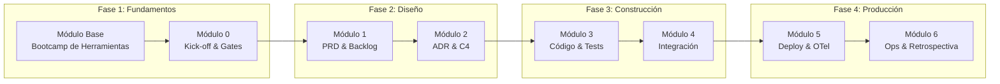

# Coaching de Arquitectura — Programa de Adopción SDLC

> **Estado:** Activo | **Versión:** 1.0 | **Owner:** Architecture Board UNIMAR

---

## Visión General

Este directorio contiene el **programa completo de coaching SDLC** para la adopción de estándares arquitectónicos en UNIMAR. El programa transforma la cultura de ingeniería mediante 8 módulos prácticos que van desde la configuración de herramientas hasta la operación en producción.

**Meta:** Evolucionar de un modelo de desarrollo en silos a una **cultura de ingeniería predecible, altamente gobernada y asistida por IA**.

---

## Mapa del Programa



---

## Roadmap de Modulos

| Módulo | Duración | Propósito | Entregable Certificado | Hub |
| :--- | :--- | :--- | :--- | :--- |
| **Base** | 2 sem | Nivelación de herramientas (VS Code, Git, OpenCode, BMAD) | Entorno configurado + 1er PR exitoso | [Hub](./hubs/modulo-base.md) |
| **0** | 2 días | Alinear organización bajo Manifiesto y Quality Gates | Acta de Kick-off firmada | [Hub](./hubs/modulo-0.md) |
| **1** | 1 sem | Trazar Bounded Contexts y Backlog BDD | PRD + Backlog validados | [Hub](./hubs/modulo-1.md) |
| **2** | 2 sem | Modelar arquitectura técnica y funcional | ADR + Diagramas C4 | [Hub](./hubs/modulo-2.md) |
| **3** | 3 sem | Programar API con Arquitectura Hexagonal | Código operativo + PRs aprobados | [Hub](./hubs/modulo-3.md) |
| **4** | 2 sem | Aplicar Pirámide de Testing con Testcontainers | Test Summary Report (RC Sellado) | [Hub](./hubs/modulo-4.md) |
| **5** | 1 sem | Crear Dockerfile + Pipeline CI/CD + OTel | Release Notes operativas | [Hub](./hubs/modulo-5.md) |
| **6** | 4 sem | Troubleshooting + Simulacro + Retrospectiva | Runbook + Radar de Madurez | [Hub](./hubs/modulo-6.md) |

**Duración total:** 8 semanas (~2 meses) · **32 horas de sesiones** · **16 horas de revisión sabatina** · **4-6 h/semana de trabajo asíncrono**

---

## Estructura del Directorio

```
coaching-arquitectura/
├── README.md                 # Este archivo — Portal de navegación
├── plan-implementacion-arquitectura.md  # Roadmap ejecutivo
├── q-truck-baseline.md       # Caso de estudio Q-Track
├── glosario-capacitacion.md  # Términos y acrónimos
├── herramientas-referencia.md # Stack tecnológico
├── guia-facilitador.md       # Manual del entrenador
│
├── hubs/                     # Hubs de sesión por módulo
│   ├── modulo-base.md
│   ├── modulo-0.md
│   ├── modulo-1.md
│   ├── modulo-2.md
│   ├── modulo-3.md
│   ├── modulo-4.md
│   ├── modulo-5.md
│   └── modulo-6.md
│
├── templates/                # Templates y ejemplos por módulo
│   ├── modulo-base-template.md
│   ├── modulo-base-formato-base.md
│   ├── modulo-base-ejemplo-q-track.md
│   ├── modulo-0-template.md
│   ├── modulo-0-formato-base.md
│   ├── modulo-0-ejemplo-q-track.md
│   └── ... (módulos 1-6)
│   │
│   └── artefactos/           # Plantillas de artefactos
│       ├── prd-plantilla.md
│       ├── prd-ejemplo-q-track.md
│       ├── backlog-bdd-plantilla.md
│       ├── backlog-bdd-ejemplo-q-track.md
│       └── ... (22 archivos)
│   │
│   └── tests/
│       └── logs/             # Logs de ejemplo para Test Summary Report
│           ├── test-001.md
│           ├── test-002.md
│           └── ... (5 archivos)
│
├── prompts/                  # Prompt Libraries para IA
│   ├── modulo-base-prompts.md
│   ├── modulo-0-prompts.md
│   ├── modulo-1-prompts.md
│   ├── modulo-2-prompts.md
│   ├── modulo-3-prompts.md
│   ├── modulo-4-prompts.md
│   ├── modulo-5-prompts.md
│   └── modulo-6-prompts.md
│
└── artefactos/               # Hubs de artefactos por módulo
    ├── modulo-base.md
    ├── modulo-0.md
    ├── modulo-1.md
    ├── modulo-2.md
    ├── modulo-3.md
    ├── modulo-4.md
    ├── modulo-5.md
    └── modulo-6.md
```

---

## Roles y Responsabilidades

| Rol | Responsabilidades | Participa en Módulos |
| :--- | :--- | :--- |
| **Facilitador** | Ejecutar sesiones, validar Quality Gates, mentoría | Todos (Base-6) |
| **Participante** | Completar talleres, entregar artefactos, aplicar en producción | Todos (Base-6) |
| **Architecture Board** | Aprobar ADRs, validar estándares, certificar módulos | 0, 2, 4, 6 |
| **Product Owner** | Validar PRD, backlog, criterios de aceptación | 1, 4, 5 |
| **Tech Lead** | Revisar código, aprobar PRs, guiar arquitectura | 2, 3, 5 |
| **QA Lead** | Validar tests, sellar RC, aprobar despliegue | 4, 5, 6 |

---

## Enlaces Rápidos

### Documentación Principal
- [Cronograma Optimizado (8 semanas)](./cronograma-optimizado.md) — Timeline con 2 sesiones/semana + revisión sábado
- Plan de Implementación — Roadmap ejecutivo
- [Guía del Facilitador](./guia-facilitador.md) — Manual del entrenador
- [Q-Track Baseline](./q-truck-baseline.md) — Caso de estudio
- [Glosario](./glosario-capacitacion.md) — Términos y acrónimos
- [Herramientas](./herramientas-referencia.md) — Stack tecnológico

### Prompt Libraries (IA)
- [Módulo Base](./prompts/modulo-base-prompts.md) — 6 prompts
- [Módulo 0](./prompts/modulo-0-prompts.md) — 6 prompts
- [Módulo 1](./prompts/modulo-1-prompts.md) — 6 prompts
- [Módulo 2](./prompts/modulo-2-prompts.md) — 8 prompts
- [Módulo 3](./prompts/modulo-3-prompts.md) — 7 prompts
- [Módulo 4](./prompts/modulo-4-prompts.md) — 6 prompts
- [Módulo 5](./prompts/modulo-5-prompts.md) — 6 prompts
- [Módulo 6](./prompts/modulo-6-prompts.md) — 7 prompts

### Recursos Externos
- [BMAD Method v6.8.0](https://bmadmethod.com/) — Framework de planificación
- [OpenCode](https://opencode.ai) — IA corporativa
- [Modelo C4](https://c4model.com/) — Diagramas de arquitectura
- [Arquitectura Hexagonal](https://alistair.cockburn.us/hexagonal-architecture/) — Patrón arquitectónico

---

## Metricas del Programa

| Métrica | Objetivo | Última Medición | Estado |
| :--- | :--- | :--- | :--- |
| **Módulos Completados** | 8/8 | 0/8 | En progreso |
| **Quality Gates Aprobados** | 40/40 | 0/40 | En progreso |
| **Cobertura de Tests** | >= 80% | N/A | Pendiente |
| **Incidentes en Producción** | <= 2 | 0 | Sin incidentes |
| **Satisfacción del Equipo** | >= 4/5 | N/A | Pendiente |

---

## Quick Start

### Para Facilitadores

1. **Preparación:**
   ```bash
   # Clonar repositorio
   git clone https://github.com/mhernandez-unimar/unimar_arch.git
   cd unimar_arch/docs/planning-artifacts/coaching-arquitectura
   
   # Verificar herramientas
   node --version  # Debe ser v20+
   npm install -g @bmad/method  # BMAD Method CLI
   ```

2. **Revisar:**
   - [Guía del Facilitador](./guia-facilitador.md) — Agendas y propósitos
   - Prompt Library del módulo — Prompts para IA
   - Hub del módulo — Secuencia didáctica completa

3. **Ejecutar:**
   - Abrir sesión con propósito y agenda (15 min)
   - Facilitar taller práctico (2-3 horas)
   - Validar Quality Gate (15 min)
   - Certificar módulo en hub correspondiente

### Para Participantes

1. **Completar Módulo Base:**
   - Instalar VS Code, Git, Node.js, Docker
   - Configurar OpenCode en VS Code
   - Crear primer PR exitoso

2. **Progresar secuencialmente:**
   - Módulo 0 → Módulo 1 → ... → Módulo 6
   - No avanzar sin Quality Gate aprobado

3. **Aplicar en producción:**
   - Cada módulo produce artefactos reales
   - Usar prompts de IA para acelerar
   - Documentar lecciones aprendidas

---

## Soporte

| Canal | Propósito | Enlace |
| :--- | :--- | :--- |
| **GitHub Issues** | Bugs en documentación, enlaces rotos | [Issues](https://github.com/mhernandez-unimar/unimar_arch/issues) |
| **Architecture Board** | Aprobación de ADRs, waivers de Quality Gates | architecture-board@unimar.com.pe |
| **Facilitador** | Dudas de sesiones, validación de artefactos | [Contacto en Teams] |
| **BMAD Method** | Soporte del framework, comandos | `/bmad-help` en OpenCode |

---

## Historial de Revisiones

| Versión | Fecha | Cambios Principales | Autor |
| :--- | :--- | :--- | :--- |
| **1.2** | 2026-06-17 | Cronograma Optimizado (8 semanas). Se eliminaron versiones estándar y agresiva. | Architecture Board |
| **1.1** | 2026-06-16 | Cronograma Agresivo (6 semanas) + Perfiles participantes detallados | Architecture Board |
| **1.0** | 2026-06-16 | Creación del portal de navegación + Cronograma (12 semanas) | Architecture Board |
| **0.9** | 2026-06-15 | Fix de 8 enlaces rotos en hubs | Architecture Board |
| **0.8** | 2026-06-14 | Prompt Libraries completas (46 prompts) | Architecture Board |

---

<div align="center">
  <sub>Unimar Arch | Coaching de Arquitectura SDLC</sub>
</div>

---

<p align="center">
  
  
  
</p>

<p align="center">
  <strong>© Unimar S.A.</strong> · RUC 20100412447 · Operador Logístico Aduanero desde 1978<br>
  Última revisión: 2026-06-16
</p>
