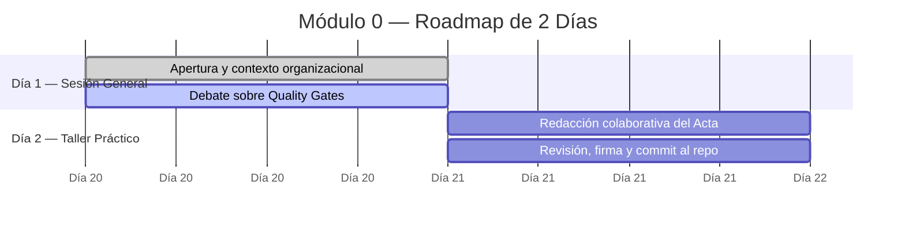
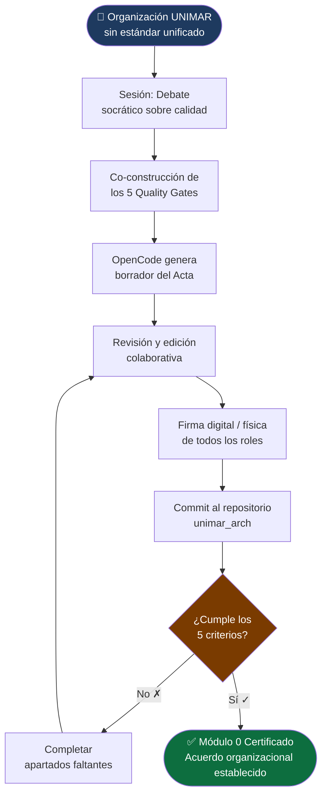
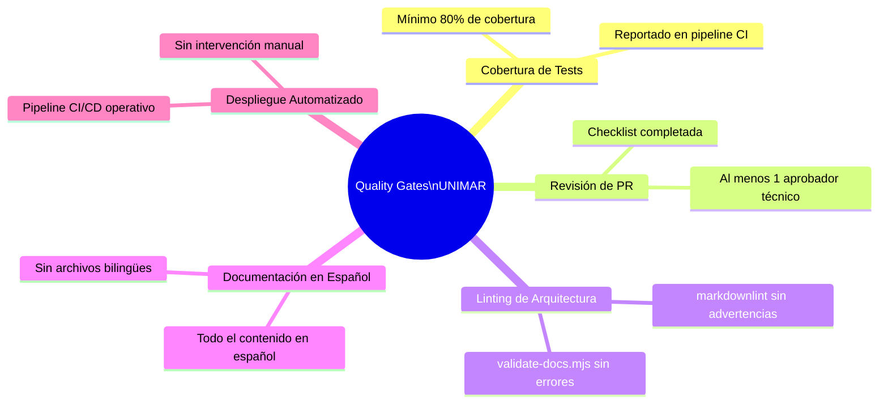

# Módulo 0: Visión, Gates y Kick-off

> **Ruta de navegación:** [Plan de Implementación](../../plan-implementacion-arquitectura.md) → Módulo 0

---

## 1. Propósito Ejecutivo

El Módulo 0 es el acto fundacional del programa. Antes de escribir una sola línea de código o modelo de arquitectura, la organización entera necesita alinearse bajo un mismo contrato intelectual: el **Manifiesto de Ingeniería de UNIMAR**. Sin esta sincronización, cada módulo posterior operaría sobre suposiciones distintas, generando inconsistencias que se vuelven costosas de corregir en fases avanzadas del SDLC.

El valor de negocio es la **eliminación del ruido organizacional**: al finalizar este kick-off, todos los participantes —desde el Gerente de Procesos hasta el Desarrollador Junior— comparten la misma definición de calidad, los mismos umbrales de los Quality Gates corporativos y el mismo vocabulario técnico. El Acta de Kick-off resultante es el primer artefacto auditable del programa y la evidencia formal de que la organización se comprometió con el estándar antes de iniciar la construcción.

---

## 2. Duración Estimada

| Modalidad | Tiempo |
| :--- | :--- |
| Sesión General (Teoría + Debate) | 1 sesión × 1.5 horas |
| Taller Práctico (Redacción del Acta) | 1 sesión × 2 horas |
| **Total de calendario** | **2 días** (sesión + taller en días consecutivos) |

---

## 3. Entregable Certificado (Quality Gate)

| # | Criterio | Forma de verificación |
| :--- | :--- | :--- |
| 1 | Acta de Kick-off redactada con firmas (físicas o digitales) de todos los participantes | Documento en repositorio con historial de commits |
| 2 | Visión del programa declarada en el Acta con las métricas objetivo (ej. reducción de fallos en producción) | Sección "Métricas de Éxito" del Acta con al menos 3 KPIs concretos |
| 3 | Los 5 Quality Gates corporativos comprendidos y aceptados formalmente | Sección "Gates Aceptados" en el Acta con firma de cada rol representado |
| 4 | Cronograma de módulos revisado y aprobado por los patrocinadores | Gantt enlazado al Acta desde el repositorio |
| 5 | Al menos un riesgo identificado y un mitigador definido | Sección "Riesgos y Mitigadores" con al menos 1 entrada completa |

> **Regla de Oro:** No se inicia el Módulo 1 sin el Acta firmada y commiteada al repositorio.

---

## 4. Estrategia de Sesión

La estrategia es el **"Contrato Social"**: en lugar de presentar el estándar como una imposición jerárquica, el facilitador lidera una sesión socrática donde el equipo co-construye la definición de qué significa "calidad" en el contexto de UNIMAR. El facilitador guía —no dicta— las respuestas.

El debate deliberado en torno a los Quality Gates crea apropiación: cuando el equipo define colectivamente que "cobertura de tests < 80% es inaceptable", esa cifra deja de ser un número impuesto y se convierte en un estándar propio. Al cerrar con la firma del Acta, se materializa ese contrato social en un artefacto formal.

OpenCode participa desde el inicio: el facilitador usa la IA para generar un borrador del Acta en vivo durante la sesión, demostrando que la documentación no es una carga posterior sino un subproducto natural del proceso de trabajo.

---

## 5. Plan de Trabajo Progresivo (Roadmap)

### Hitos clave

| Hito | Día | Descripción |
| :--- | :--- | :--- |
| **H1** Visión declarada | 1 | Todos los participantes validan el objetivo del programa |
| **H2** Gates aceptados | 1 | Los 5 Quality Gates reciben aprobación verbal del equipo |
| **H3** Acta redactada | 2 | Documento en borrador con todos los apartados completos |
| **H4** Acta firmada y commiteada | 2 | Quality Gate superado — PR mergeado a `develop` |

---

## 6. Secuencia Didáctica y Actividades (How-to)

### Fase 1 — Explicación (Sesión General, Día 1)

1. **Apertura: El costo del desorden (15 min):** El facilitador presenta 2-3 casos reales de UNIMAR donde la ausencia de estándar generó retrabajo, rollbacks de emergencia o pérdida de trazabilidad.
2. **Presentación del Manifiesto de Ingeniería (20 min):** Lectura guiada del documento [Manifiesto de Ingeniería](../../../../reference/governance/standards/engineering/manifiesto-ingenieria.md). Énfasis en los valores no negociables.
3. **Debate socrático: ¿Qué es calidad para nosotros? (30 min):** El facilitador lanza preguntas abiertas. El equipo responde y el facilitador mapea las respuestas a los Quality Gates formales. Se usa pizarra o Miro.
4. **Presentación formal de los 5 Gates (15 min):** Cobertura de tests, revisión de PR, linting de arquitectura, documentación en español, despliegue sin intervención manual.
5. **Q&A y cierre del Día 1 (10 min):** Se distribuye la Plantilla de Acta para pre-leer antes del taller.

### Fase 2 — Demostración (Inicio Taller, Día 2)

6. **OpenCode genera el borrador del Acta en vivo (20 min):** El facilitador usa OpenCode con el prompt: *"Genera un Acta de Kick-off para el programa de adopción SDLC de Q-Track de UNIMAR, incluyendo: visión, participantes, Quality Gates, cronograma y riesgos."*
7. **Revisión crítica del borrador (15 min):** El equipo señala qué falta, qué sobra y qué está incorrecto. Se edita en vivo.

### Fase 3 — Práctica Guiada (Taller, Día 2)

8. **Completar sección por sección en grupo (45 min):** Cada rol completa la sección que le corresponde: Procesos rellena los KPIs, Desarrollo valida los Gates técnicos, Gerencia firma la sección de patrocinio.
9. **Commit del Acta al repositorio (15 min):** `git add`, `git commit -m "docs: acta de kick-off modulo-0 firmada"`, `git push`.

### Fase 4 — Validación

10. **Verificación de los 5 criterios (15 min):** El facilitador revisa cada criterio del Quality Gate contra el documento commiteado.
11. **Apertura del PR y merge (10 min):** PR aprobado = Módulo 0 certificado.

---

## 7. Recursos, Herramientas y Referencias

| Herramienta / Recurso | Propósito | Enlace |
| :--- | :--- | :--- |
| **Manifiesto de Ingeniería UNIMAR** | Marco normativo base del debate | [reference/governance/standards/engineering/manifiesto-ingenieria.md](../../../../reference/governance/standards/engineering/manifiesto-ingenieria.md) |
| **Miro / Microsoft Whiteboard** | Pizarra colaborativa para el debate socrático | [https://miro.com](https://miro.com) |
| **OpenCode (extensión VS Code)** | Generación del borrador del Acta en vivo | Intranet UNIMAR |
| **Microsoft Teams** | Plataforma de grabación de la sesión | Intranet UNIMAR |
| **Repositorio `unimar_arch`** | Destino del Acta comprometida | [https://github.com/mhernandez-unimar/unimar_arch](https://github.com/mhernandez-unimar/unimar_arch) |
| **Guía del Facilitador** | Agenda detallada por minutos | [../guia-facilitador.md](../guia-facilitador.md) |
| **Glosario de Capacitación** | Referencia de términos UNIMAR | [../glosario-capacitacion.md](../glosario-capacitacion.md) |

---

## 8. Artefactos Entregables y Hub Exclusivo

### Artefactos generados durante este módulo

| # | Artefacto | Descripción | Responsable |
| :--- | :--- | :--- | :--- |
| 1 | **Acta de Kick-off** | Documento formal con visión, participantes, Gates aceptados, cronograma y riesgos | Facilitador + equipo |
| 2 | **Registro de riesgos inicial** | Lista de riesgos identificados durante el debate con mitigadores propuestos | Todos los roles |

### Hub Exclusivo de Artefactos — Módulo 0

| Recurso | Enlace |
| :--- | :--- |
| **Plantilla vacía — Acta de Kick-off** | [Template Vacía](../templates/modulo-0-template.md) |
| **Ejemplo completo Q-Track** | [Ejemplo Q-Track](../templates/modulo-0-ejemplo-q-track.md) |
| **Artefactos del módulo** | [Artefactos Módulo 0](../artefactos/modulo-0.md) |

---

## 9. Diagramas Conceptuales

### Diagrama 1 — Flujo del Kick-off al Contrato Formal

### Diagrama 2 — Los 5 Quality Gates de UNIMAR

---

*Documento generado bajo el estándar del corpus arquitectónico de UNIMAR · Idioma: Español · Versión: 1.0*

---

## Prompts Recomendados para este Módulo

| Actividad | Prompt | Enlace |
| :--- | :--- | :--- |
| **Manifiesto** | Resumir Manifiesto de Ingeniería | [modulo-0-prompts.md#prompt-1](../prompts/modulo-0-prompts.md#prompt-1-resumir-manifiesto) |
| **Debate Socrático** | Generar preguntas para debate de calidad | [modulo-0-prompts.md#prompt-2](../prompts/modulo-0-prompts.md#prompt-2-facilitar-debate) |
| **Quality Gates** | Explicar los 5 Gates corporativos | [modulo-0-prompts.md#prompt-3](../prompts/modulo-0-prompts.md#prompt-3-explicar-quality-gates) |
| **Acta de Kick-off** | Generar borrador del Acta | [modulo-0-prompts.md#prompt-4](../prompts/modulo-0-prompts.md#prompt-4-generar-acta) |
| **Revisión de Acta** | Checklist de revisión antes de firmar | [modulo-0-prompts.md#prompt-5](../prompts/modulo-0-prompts.md#prompt-5-revisar-acta) |
| **Firma Digital** | Generar comandos Git para commitear | [modulo-0-prompts.md#prompt-6](../prompts/modulo-0-prompts.md#prompt-6-generar-comandos-git) |

> **Tip:** Todos los prompts están optimizados para copy-paste en OpenCode.
