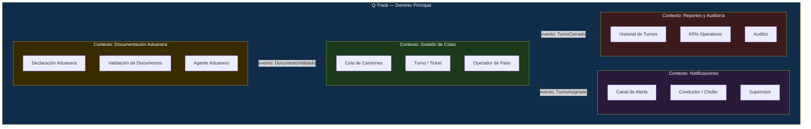

# Módulo 1: Requisitos y Producto

> **Ruta de navegación:** [Plan de Implementación](../../plan-implementacion-arquitectura.md) → Módulo 1

---

## 1. Propósito Ejecutivo

El Módulo 1 es donde la visión estratégica del Kick-off se transforma en **contratos de software formales y ejecutables**. Sin un Product Requirements Document (PRD) sólido y un Backlog Ágil bien estructurado, el equipo de desarrollo construye sobre suposiciones; cada suposición incorrecta es deuda técnica futura y retrabajo costoso.

El valor de negocio es claro: este módulo asegura que **Q-Track** —el Gestor de Colas de Camiones— sea definido antes de ser construido. El equipo aprende a trazar los **Bounded Contexts** del dominio logístico aduanero de UNIMAR, a escribir criterios de aceptación en BDD (Behaviour-Driven Development) y a priorizar el Backlog usando valor de negocio como métrica principal. Al finalizar, el PRD y el Backlog Ágil de Q-Track son los documentos rector y de trabajo de todos los módulos técnicos posteriores.

---

## 2. Duración Estimada

| Modalidad | Tiempo |
| :--- | :--- |
| Sesión General (Teoría) | 1 sesión × 1.5 horas |
| Taller Práctico (Hands-on) | 2 sesiones × 3 horas c/u |
| **Total de calendario** | **1 semana** (pre-work + sesiones + certificación) |

---

## 3. Entregable Certificado (Quality Gate)

| # | Criterio | Forma de verificación |
| :--- | :--- | :--- |
| 1 | PRD de Q-Track redactado usando la plantilla BMAD, con Visión, Problema, Objetivos, Usuarios y Alcance completos | Archivo `.md` commiteado en `docs/planning-artifacts/` |
| 2 | Al menos 3 Bounded Contexts del dominio logístico identificados y documentados en el PRD | Sección "Contextos de Dominio" con diagrama de mapa de contextos |
| 3 | Backlog Ágil con mínimo 10 Historias de Usuario en formato BDD (`Given / When / Then`) | Archivo de backlog con criterios de aceptación verificables |
| 4 | Historias priorizadas por valor de negocio (MoSCoW o similar) con justificación documentada | Columna de prioridad y justificación en el backlog |
| 5 | PRD y Backlog revisados y aprobados por el facilitador mediante PR | PR en GitHub con aprobación registrada |

> **Regla de Oro:** El PRD no aprobado bloquea el inicio del Módulo 2. No se diseña lo que no está definido.

---

## 4. Estrategia de Sesión

La estrategia es **"Product Thinking Before Code Thinking"**: antes de hablar de tablas, endpoints o contenedores, el equipo debe responder las tres preguntas de producto: *¿Para quién construimos Q-Track? ¿Qué problema resuelve? ¿Cómo sabremos que lo resolvimos?*

El facilitador usa el agente **John (PM)** de BMAD como demostración en vivo: el equipo observa cómo la IA puede generar un borrador de PRD a partir de una descripción del problema, y luego aprende que su rol es criticar, refinar y validar ese borrador —no partir de una página en blanco.

El enfoque BDD convierte las Historias de Usuario de aspiraciones vagas a contratos ejecutables que el equipo de QA puede usar directamente como casos de prueba en el Módulo 4, creando trazabilidad real desde requisitos hasta tests.

---

## 5. Plan de Trabajo Progresivo (Roadmap)

```mermaid
gantt
    title Módulo 1 — Roadmap de 1 Semana
    dateFormat  YYYY-MM-DD
    axisFormat  Día %d

    section Pre-work
    Leer q-truck-baseline.md              :done,    pre, 2025-01-27, 1d

    section Sesión General
    Teoría: PRD, BDD y Bounded Contexts   :         s1, 2025-01-28, 1d

    section Taller Práctico 1
    Mapeo de Bounded Contexts de Q-Track  :         t1, 2025-01-29, 1d

    section Taller Práctico 2
    Redacción del PRD y Backlog BDD        :         t2, 2025-01-30, 1d

    section Certificación
    Revisión de PR y Quality Gate          :         cert, 2025-01-31, 1d
```

### Hitos clave

| Hito | Día | Descripción |
| :--- | :--- | :--- |
| **H1** Contextos mapeados | 3 | Diagrama de Bounded Contexts de Q-Track completado |
| **H2** PRD en borrador | 4 | Todas las secciones del PRD completadas |
| **H3** Backlog con BDD | 4 | 10+ historias con criterios `Given/When/Then` |
| **H4** Quality Gate | 5 | PR aprobado — Módulo 1 certificado |

---

## 6. Secuencia Didáctica y Actividades (How-to)

### Fase 1 — Explicación (Sesión General)

1. **¿Qué es un PRD y por qué importa? (15 min):** Comparación entre un proyecto con PRD vs. sin PRD. Casos del sector logístico aduanero.
2. **Bounded Contexts en DDD (20 min):** Explicación de Domain-Driven Design. Identificación de contextos en el dominio de UNIMAR: gestión de camiones, colas, documentación aduanera, notificaciones.
3. **BDD: Historias ejecutables (25 min):** Formato `Given / When / Then`. Ejercicio corto: el facilitador transforma una Historia de Usuario ambigua en formato BDD frente al grupo.
4. **Agente John (PM) en vivo (20 min):** El facilitador usa OpenCode con el agente PM para generar el borrador inicial del PRD de Q-Track.
5. **Q&A y distribución de plantillas (10 min)**

### Fase 2 — Demostración (Taller 1)

6. **Facilitador mapea Bounded Contexts de Q-Track en vivo (30 min):** Usando el documento `q-truck-baseline.md` como fuente de verdad. Herramienta: diagrama Mermaid en VS Code.
7. **Identificación de entidades clave (20 min):** Camión, Cola, Operador, Turno, Documento Aduanero. El facilitador las clasifica por contexto.

### Fase 3 — Práctica Guiada (Taller 1, continuación)

8. **Equipos mapean sus propios contextos (60 min):** En grupos de 2-3 personas, usando la plantilla de Bounded Contexts. El facilitador rota entre los grupos.
9. **Consolidación del mapa de contextos del grupo (30 min):** Se elige el mapa consensuado que irá al PRD.

### Fase 4 — Práctica Independiente (Taller 2)

10. **Redacción individual del PRD (60 min):** Cada participante completa una sección: Visión, Problema, Objetivos, Usuarios, Alcance, Fuera de Alcance.
11. **Escritura del Backlog en BDD (60 min):** El equipo escribe 10+ historias de usuario para Q-Track con criterios BDD. El facilitador valida en tiempo real que el formato sea correcto.
12. **Commit y push del PRD y Backlog (20 min):** `git commit -m "feat: prd y backlog agil q-track modulo-1"`.

### Fase 5 — Validación

13. **Apertura del PR y revisión cruzada (30 min):** Un compañero revisa el PRD de otro.
14. **Verificación de los 5 criterios del Quality Gate (20 min)**
15. **Merge oficial (10 min):** Quality Gate superado.

---

## 7. Recursos, Herramientas y Referencias

| Herramienta / Recurso | Propósito | Enlace |
| :--- | :--- | :--- |
| **Agente John (PM) — BMAD** | Generación del borrador de PRD con IA | `bmad-agent-pm` en OpenCode |
| **Q-Track Baseline** | Documento fuente de requisitos del producto | [../q-truck-baseline.md](../q-truck-baseline.md) |
| **Domain-Driven Design Reference** | Guía de referencia de Bounded Contexts | [https://www.domainlanguage.com/ddd/reference/](https://www.domainlanguage.com/ddd/reference/) |
| **BDD con Gherkin** | Referencia del lenguaje Given/When/Then | [https://cucumber.io/docs/gherkin/](https://cucumber.io/docs/gherkin/) |
| **Miro / Excalidraw** | Mapeo visual de Bounded Contexts | [https://excalidraw.com/](https://excalidraw.com/) |
| **OpenCode (extensión VS Code)** | IA corporativa para generación de PRD | Intranet UNIMAR |
| **Guía del Facilitador** | Agenda detallada por minutos | [../guia-facilitador.md](../guia-facilitador.md) |
| **Glosario de Capacitación** | Diccionario UNIMAR | [../glosario-capacitacion.md](../glosario-capacitacion.md) |

---

## 8. Artefactos Entregables y Hub Exclusivo

### Artefactos generados durante este módulo

| # | Artefacto | Descripción | Responsable |
| :--- | :--- | :--- | :--- |
| 1 | **PRD de Q-Track** | Documento de requisitos de producto completo y validado | Equipo + facilitador |
| 2 | **Backlog Ágil con BDD** | 10+ historias de usuario con criterios `Given/When/Then` priorizadas | Equipo |
| 3 | **Mapa de Bounded Contexts** | Diagrama de los dominios funcionales de Q-Track | Equipo |

### Hub Exclusivo de Artefactos — Módulo 1

| Recurso | Enlace |
| :--- | :--- |
| **Plantilla vacía — PRD y Backlog** | [Template Vacía](../templates/modulo-1-template.md) |
| **Ejemplo completo Q-Track** | [Ejemplo Q-Track](../templates/modulo-1-ejemplo-q-track.md) |
| **Artefactos del módulo** | [Artefactos Módulo 1](../artefactos/modulo-1.md) |

---

## 9. Diagramas Conceptuales

### Diagrama 1 — Bounded Contexts de Q-Track



### Diagrama 2 — Flujo de Creación del PRD al Backlog

```mermaid
flowchart LR
    A[q-truck-baseline.md\nFuente de requisitos] --> B[Agente John PM\nGenera borrador PRD]
    B --> C[Revisión crítica\ndel equipo]
    C --> D[PRD validado\ncon Bounded Contexts]
    D --> E[Backlog Ágil\nHistorias BDD]
    E --> F[Priorización\nMoSCoW]
    F --> G[Commit al\nrepositorio]
    G --> H[PR revisado\npor facilitador]
    H --> I([✅ Quality Gate\nMódulo 1 Certificado])

    style A fill:#1e3a5f,color:#ffffff
    style I fill:#0d6e3f,color:#ffffff
```



---

*Documento generado bajo el estándar del corpus arquitectónico de UNIMAR · Idioma: Español · Versión: 1.0*

---

## Prompts Recomendados para este Módulo

| Actividad | Prompt | Enlace |
| :--- | :--- | :--- |
| **Bounded Contexts** | Explicar DDD para equipo mixto | [modulo-1-prompts.md#prompt-1](../prompts/modulo-1-prompts.md#prompt-1-explicar-bounded-contexts) |
| **Identificar Contextos** | Mapear contextos del dominio | [modulo-1-prompts.md#prompt-2](../prompts/modulo-1-prompts.md#prompt-2-identificar-contextos) |
| **PRD** | Generar borrador completo de PRD | [modulo-1-prompts.md#prompt-3](../prompts/modulo-1-prompts.md#prompt-3-generar-prd) |
| **Historias BDD** | Generar backlog de 10-15 historias | [modulo-1-prompts.md#prompt-4](../prompts/modulo-1-prompts.md#prompt-4-generar-historias-bdd) |
| **Priorización** | Facilitar sesión MoSCoW | [modulo-1-prompts.md#prompt-5](../prompts/modulo-1-prompts.md#prompt-5-priorizar-moscow) |
| **Validación** | Checklist de validación del PRD | [modulo-1-prompts.md#prompt-6](../prompts/modulo-1-prompts.md#prompt-6-validar-prd) |

> **Tip:** Todos los prompts están optimizados para copy-paste en OpenCode.
