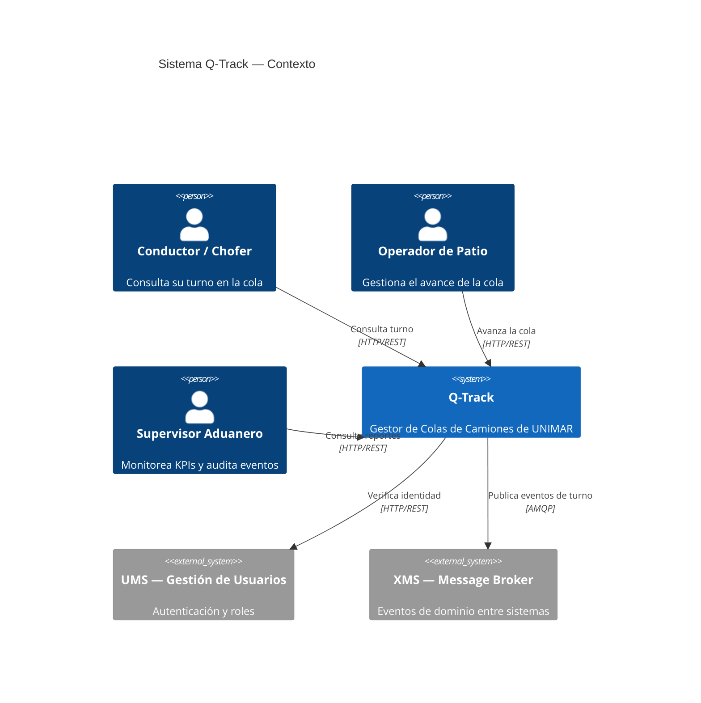
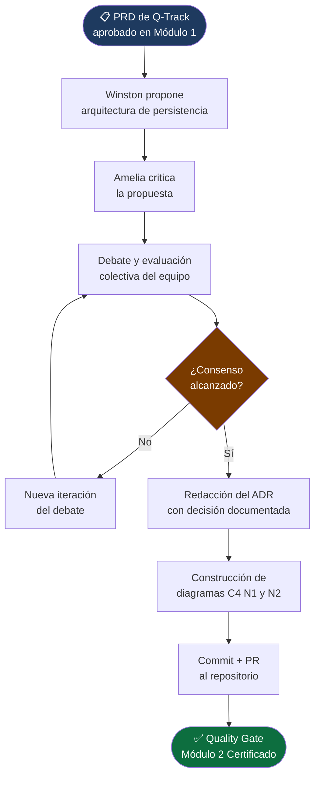

# Módulo 2: Diseño y Arquitectura

> **Ruta de navegación:** [Plan de Implementación](../../plan-implementacion-arquitectura.md) → Módulo 2

---

## 1. Propósito Ejecutivo

El Módulo 2 es la traducción del lenguaje de negocio al lenguaje de máquinas. Con el PRD y el Backlog de Q-Track como insumos, el equipo construye el modelo técnico que gobernará todas las decisiones de implementación posteriores: **qué tecnologías se usan, por qué y bajo qué restricciones**.

El valor de negocio es la **reducción del riesgo técnico**: una arquitectura documentada y debatida por todo el equipo (no impuesta por una sola persona) es más resiliente, más fácil de mantener y más sencilla de incorporar en el onboarding de nuevos integrantes. Los dos entregables —el **ADR de Persistencia** y el **modelo C4 de Q-Track**— se convierten en el contrato técnico que todos los desarrolladores respetan durante la fase de construcción, eliminando las decisiones de diseño improvisadas en el calor del sprint.

El debate de agentes (Winston el Arquitecto vs. Amelia la Desarrolladora) introduce al equipo en la práctica de la **revisión adversarial de arquitectura**: antes de construir, siempre se cuestiona.

---

## 2. Duración Estimada

| Modalidad | Tiempo |
| :--- | :--- |
| Sesión General (Teoría) | 1 sesión × 1.5 horas |
| Taller Práctico (Hands-on) | 3 sesiones × 3 horas c/u |
| **Total de calendario** | **2 semanas** (incluye debate de agentes, modelado y certificación) |

---

## 3. Entregable Certificado (Quality Gate)

| # | Criterio | Forma de verificación |
| :--- | :--- | :--- |
| 1 | ADR de Persistencia de Q-Track completo (Contexto, Decisión, Consecuencias, Alternativas rechazadas) | Archivo `adrs/` en el repositorio con número secuencial |
| 2 | Diagrama C4 — Nivel 1 (Contexto del Sistema) de Q-Track en Mermaid | Bloque `mermaid` renderizable en el documento de arquitectura |
| 3 | Diagrama C4 — Nivel 2 (Contenedores) de Q-Track en Mermaid | Bloque `mermaid` con los contenedores principales identificados |
| 4 | Al menos 1 alternativa técnica rechazada documentada en el ADR con justificación de negocio | Sección "Alternativas Rechazadas" con razonamiento completo |
| 5 | ADR y modelos C4 revisados y aprobados mediante PR por el facilitador | PR en GitHub con aprobación registrada |

> **Regla de Oro:** No se escribe código en el Módulo 3 de componentes que no tengan ADR o modelo C4 aprobado.

---

## 4. Estrategia de Sesión

La estrategia es el **"Debate Estructurado de Agentes"**: en lugar de que el facilitador presente una arquitectura como verdad absoluta, se simula un debate en tiempo real entre dos perspectivas complementarias usando los agentes BMAD:

- **Winston (Arquitecto):** Propone la arquitectura desde la perspectiva de mantenibilidad, escalabilidad y principios SOLID.
- **Amelia (Desarrolladora):** Cuestiona la propuesta desde la realidad de la implementación: complejidad de setup, curva de aprendizaje del equipo, tiempo de delivery.

El equipo observa el debate, extrae los argumentos de cada lado y toma la decisión colectiva, documentándola en el ADR. Este proceso enseña que las decisiones arquitectónicas no son verdades técnicas absolutas sino **compromisos informados** entre múltiples restricciones.

Los modelos C4 se construyen progresivamente: primero el contexto (la vista de negocio), luego los contenedores (la vista técnica), asegurando que todos los roles —incluso los no técnicos— puedan seguir el modelo.

---

## 5. Plan de Trabajo Progresivo (Roadmap)

```mermaid
gantt
    title Módulo 2 — Roadmap de 2 Semanas
    dateFormat  YYYY-MM-DD
    axisFormat  Sem %W

    section Pre-work (Semana 1)
    Leer ADRs existentes en reference/adrs/  :done,    pre, 2025-02-03, 1d
    Revisar PRD validado del Módulo 1        :done,    pre2, 2025-02-03, 1d

    section Sesión General (Semana 1)
    Teoría: C4, ADRs y Arquitectura Hexagonal :        s1, 2025-02-04, 1d

    section Taller 1 — Debate de Agentes (Semana 1)
    Winston vs Amelia: Debate de persistencia  :        t1, 2025-02-05, 1d
    Decisión colectiva y borrador de ADR       :        t1b, 2025-02-06, 1d

    section Taller 2 — Modelado C4 (Semana 2)
    Diagrama C4 Nivel 1 (Contexto)            :        t2, 2025-02-10, 1d
    Diagrama C4 Nivel 2 (Contenedores)        :        t2b, 2025-02-11, 1d

    section Taller 3 — Revisión y Certificación (Semana 2)
    Revisión cruzada de ADR y C4              :        t3, 2025-02-12, 1d
    PR final y Quality Gate                   :        cert, 2025-02-13, 1d
```

### Hitos clave

| Hito | Semana | Descripción |
| :--- | :--- | :--- |
| **H1** Decisión de arquitectura tomada | 1 | Debate concluido, decisión documentada |
| **H2** ADR en borrador | 1 | Todas las secciones del ADR completas |
| **H3** C4 Nivel 1 completado | 2 | Diagrama de contexto renderizable |
| **H4** C4 Nivel 2 completado | 2 | Diagrama de contenedores renderizable |
| **H5** Quality Gate | 2 | PR aprobado — Módulo 2 certificado |

---

## 6. Secuencia Didáctica y Actividades (How-to)

### Fase 1 — Explicación (Sesión General)

1. **¿Qué es un ADR y cuándo se escribe? (15 min):** El facilitador muestra un ADR real del repositorio `reference/architecture/adrs/`. Explica la estructura: Contexto, Decisión, Consecuencias.
2. **El modelo C4 explicado (25 min):** Los 4 niveles (Contexto, Contenedores, Componentes, Código). En este módulo se construyen Nivel 1 y 2.
3. **Arquitectura Hexagonal de Q-Track (20 min):** Cómo la Arquitectura Hexagonal protege la lógica de negocio de los detalles de infraestructura (base de datos, transporte HTTP).
4. **Introducción al debate Winston vs. Amelia (20 min):** El facilitador explica cómo se usarán los agentes BMAD para simular perspectivas técnicas distintas.

### Fase 2 — Demostración (Taller 1, Debate de Agentes)

5. **Activar Winston (Arquitecto) en OpenCode (15 min):** El facilitador lanza: *"Winston, propón la arquitectura de persistencia para Q-Track considerando: alta disponibilidad, trazabilidad de turnos y consultas de auditoría frecuentes."*
6. **Activar Amelia (Desarrolladora) en OpenCode (15 min):** *"Amelia, critica la propuesta de Winston desde la perspectiva de complejidad de implementación y tiempo de entrega del equipo actual de UNIMAR."*
7. **Debate en vivo (30 min):** El equipo escucha, hace preguntas a cada agente y extrae los argumentos más sólidos de cada lado.

### Fase 3 — Práctica Guiada (Taller 1, continuación)

8. **Votación y decisión colectiva (20 min):** El equipo vota la decisión de persistencia con justificación.
9. **Redacción del ADR en grupo (60 min):** Usando la plantilla del hub, se completa el ADR sección por sección.

### Fase 4 — Práctica Independiente (Taller 2, Modelado C4)

10. **Construir C4 Nivel 1 en Mermaid (60 min):** Cada participante construye su versión del diagrama de contexto en VS Code.
11. **Consolidar el C4 Nivel 1 del equipo (30 min):** Se elige la versión más completa y se refina colectivamente.
12. **Construir C4 Nivel 2 en Mermaid (60 min):** Identificación de los contenedores: API REST, Base de Datos, Message Broker, Frontend Web.
13. **Commit del ADR y modelos C4 al repositorio (15 min)**

### Fase 5 — Validación (Taller 3)

14. **Revisión cruzada (30 min):** Un equipo revisa el ADR de otro buscando inconsistencias entre la decisión y el diagrama C4.
15. **Verificación de los 5 criterios del Quality Gate (20 min)**
16. **PR aprobado y merge (10 min):** Módulo 2 certificado.

---

## 7. Recursos, Herramientas y Referencias

| Herramienta / Recurso | Propósito | Enlace |
| :--- | :--- | :--- |
| **Agente Winston (Arquitecto) — BMAD** | Propuesta de arquitectura desde perspectiva de diseño | `bmad-agent-architect` en OpenCode |
| **Agente Amelia (Desarrolladora) — BMAD** | Crítica de arquitectura desde perspectiva de implementación | `bmad-agent-dev` en OpenCode |
| **ADRs existentes en unimar_arch** | Referencia de ADRs ya aprobados | `reference/architecture/adrs/` |
| **Modelo C4 — Referencia oficial** | Documentación del framework C4 | [https://c4model.com/](https://c4model.com/) |
| **Mermaid.js** | Renderizado de diagramas C4 y flujos | [https://mermaid.js.org/](https://mermaid.js.org/) |
| **Arquitectura Hexagonal (Ports & Adapters)** | Referencia del patrón arquitectónico | [https://alistair.cockburn.us/hexagonal-architecture/](https://alistair.cockburn.us/hexagonal-architecture/) |
| **Guía del Facilitador** | Agenda por minutos para el debate de agentes | [../guia-facilitador.md](../guia-facilitador.md) |

---

## 8. Artefactos Entregables y Hub Exclusivo

### Artefactos generados durante este módulo

| # | Artefacto | Descripción | Responsable |
| :--- | :--- | :--- | :--- |
| 1 | **ADR de Persistencia de Q-Track** | Decisión arquitectónica documentada con alternativas rechazadas | Equipo + facilitador |
| 2 | **Diagrama C4 Nivel 1 — Contexto** | Vista de alto nivel del sistema Q-Track y sus actores externos | Equipo |
| 3 | **Diagrama C4 Nivel 2 — Contenedores** | Vista técnica de los contenedores del sistema Q-Track | Equipo |

### Hub Exclusivo de Artefactos — Módulo 2

| Recurso | Enlace |
| :--- | :--- |
| **Plantilla vacía — ADR y C4** | [Template Vacía](../templates/modulo-2-template.md) |
| **Ejemplo completo Q-Track** | [Ejemplo Q-Track](../templates/modulo-2-ejemplo-q-track.md) |
| **Artefactos del módulo** | [Artefactos Módulo 2](../artefactos/modulo-2.md) |

---

## 9. Diagramas Conceptuales

### Diagrama 1 — C4 Nivel 1: Contexto del Sistema Q-Track



### Diagrama 2 — Flujo del Debate de Agentes al ADR



---

*Documento generado bajo el estándar del corpus arquitectónico de UNIMAR · Idioma: Español · Versión: 1.0*

---

## Prompts Recomendados para este Módulo

| Actividad | Prompt | Enlace |
| :--- | :--- | :--- |
| **ADRs** | Explicar Architecture Decision Records | [modulo-2-prompts.md#prompt-1](../prompts/modulo-2-prompts.md#prompt-1-explicar-adrs) |
| **Modelo C4** | Explicar los 4 niveles de C4 | [modulo-2-prompts.md#prompt-2](../prompts/modulo-2-prompts.md#prompt-2-explicar-c4) |
| **Hexagonal** | Explicar Arquitectura Hexagonal | [modulo-2-prompts.md#prompt-3](../prompts/modulo-2-prompts.md#prompt-3-explicar-hexagonal) |
| **Winston** | Generar propuesta de arquitectura | [modulo-2-prompts.md#prompt-4](../prompts/modulo-2-prompts.md#prompt-4-winston-propuesta) |
| **Amelia** | Generar crítica a propuesta | [modulo-2-prompts.md#prompt-5](../prompts/modulo-2-prompts.md#prompt-5-amelia-crítica) |
| **Generar ADR** | Redactar ADR completo | [modulo-2-prompts.md#prompt-6](../prompts/modulo-2-prompts.md#prompt-6-generar-adr) |
| **C4 Nivel 1** | Generar diagrama de Contexto | [modulo-2-prompts.md#prompt-7](../prompts/modulo-2-prompts.md#prompt-7-generar-c4-n1) |
| **C4 Nivel 2** | Generar diagrama de Contenedores | [modulo-2-prompts.md#prompt-8](../prompts/modulo-2-prompts.md#prompt-8-generar-c4-n2) |

> **Tip:** Todos los prompts están optimizados para copy-paste en OpenCode.
