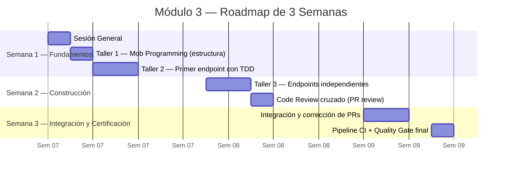
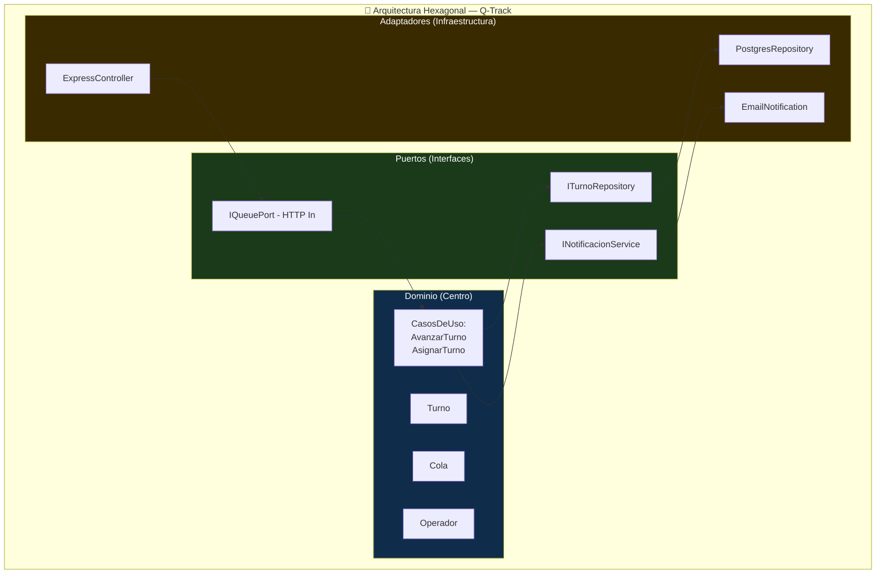
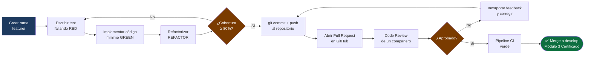

# Módulo 3: Desarrollo y Code Review

> **Ruta de navegación:** [Plan de Implementación](../../plan-implementacion-arquitectura.md) → Módulo 3

---

## 1. Propósito Ejecutivo

El Módulo 3 es donde el equipo convierte los contratos documentales (PRD, ADR, C4) en **software ejecutable y revisable**. La construcción del API REST de Q-Track no es un ejercicio académico: es la primera vez que el equipo de UNIMAR escribe código bajo el estándar corporativo completo —con Arquitectura Hexagonal, GitFlow, Quality Gates de cobertura y revisión de PR obligatoria.

El valor de negocio es doble: por un lado, el equipo produce un activo de software real (el API de Q-Track) que sirve como referencia de implementación para futuros proyectos de la Suite Operativa. Por otro lado, el proceso de Code Review cruzado instala una práctica cultural crítica: el código nunca llega a `develop` sin pasar por los ojos de otro desarrollador y por los Quality Gates automáticos del pipeline de CI.

Al finalizar, el equipo no solo sabe escribir código —sabe escribir **código bajo estándar**, que es la diferencia entre un entregable y un activo corporativo.

---

## 2. Duración Estimada

| Modalidad | Tiempo |
| :--- | :--- |
| Sesión General (Teoría) | 1 sesión × 1.5 horas |
| Taller Práctico (Hands-on) | 4 sesiones × 3 horas c/u |
| **Total de calendario** | **3 semanas** (sprints de desarrollo + revisión + certificación) |

---

## 3. Entregable Certificado (Quality Gate)

| # | Criterio | Forma de verificación |
| :--- | :--- | :--- |
| 1 | Al menos 3 endpoints del API de Q-Track implementados y documentados (ej. `POST /turnos`, `GET /turnos/{id}`, `PATCH /turnos/{id}/avanzar`) | Endpoints operativos verificados con `curl` o Postman |
| 2 | Arquitectura Hexagonal respetada: lógica de negocio en el dominio, sin dependencias directas a frameworks en las entidades | Revisión de estructura de carpetas y ausencia de imports de framework en entidades |
| 3 | Cobertura de tests unitarios ≥ 80% en la capa de dominio | Reporte de cobertura generado (`npx jest --coverage`) adjunto al PR |
| 4 | Al menos 1 Pull Request aprobado por un compañero (reviewer) con comentarios registrados | PR en GitHub con aprobación y al menos 2 comentarios de revisión técnica |
| 5 | Pipeline de CI local ejecutado sin errores (lint + tests) | Log de ejecución del pipeline adjunto como evidencia en el PR |

> **Regla de Oro:** Ningún código llega a `develop` con cobertura inferior al 80% o sin revisión de PR. El pipeline de CI es el árbitro objetivo.

---

## 4. Estrategia de Sesión

La estrategia es **"Coding Dojo con Estándar Corporativo"**: el equipo no aprende a programar en abstracto —aprende a programar el producto real de UNIMAR (Q-Track) bajo las reglas reales de la organización.

La sesión usa el formato **Mob Programming** para los talleres iniciales: toda la pantalla del facilitador, todo el equipo sugiere, una persona escribe. Esto asegura que todos vean en tiempo real cómo se aplica la Arquitectura Hexagonal, cómo se escribe un test que precede al código (TDD lite) y cómo se abre un PR que pasa el Quality Gate.

En los talleres independientes, cada participante construye su propio endpoint, sigue el mismo patrón demostrado y lo somete a Code Review cruzado. El rol de Reviewer —no solo de Author— es parte del Quality Gate: revisar código de otro es tan importante como escribir el propio.

OpenCode actúa como asistente continuo: los participantes aprenden a prompts específicos para generar boilerplate, pero también a validar que el código generado respeta la Arquitectura Hexagonal antes de aceptarlo.

---

## 5. Plan de Trabajo Progresivo (Roadmap)

### Hitos clave

| Hito | Semana | Descripción |
| :--- | :--- | :--- |
| **H1** Estructura hexagonal creada | 1 | Scaffolding del proyecto Q-Track con capas definidas |
| **H2** Primer endpoint funcional | 1 | `POST /turnos` con test unitario ≥ 80% cobertura |
| **H3** Todos los endpoints | 2 | 3+ endpoints implementados por cada participante |
| **H4** PRs revisados | 2 | Code Review cruzado completado |
| **H5** Quality Gate | 3 | Pipeline CI verde + PR mergeado |

---

## 6. Secuencia Didáctica y Actividades (How-to)

### Fase 1 — Explicación (Sesión General)

1. **Arquitectura Hexagonal en 20 minutos (20 min):** El facilitador dibuja el hexágono en vivo: Dominio en el centro, Puertos como interfaces, Adaptadores como implementaciones. Muestra cómo Q-Track aplica este patrón.
2. **TDD "lite" para la lógica de negocio (20 min):** Ciclo Red-Green-Refactor demostrado con un caso de Q-Track: "Un turno no puede avanzar si está en estado CERRADO".
3. **El rol del Code Review (20 min):** El facilitador muestra un PR real con comentarios técnicos constructivos. Explica la diferencia entre nitpicking y revisión de calidad real.
4. **Pipeline de CI local (20 min):** Demostración de `npm run lint && npm test -- --coverage`. Cómo leer el reporte de cobertura.

### Fase 2 — Demostración (Taller 1, Mob Programming)

5. **Facilitar la creación de la estructura del proyecto (45 min):** El facilitador escribe, el equipo dicta. Se crean: `domain/`, `application/`, `infrastructure/`, `ports/`. Se explica cada decisión en tiempo real.
6. **Primer test unitario en mob (30 min):** Test de la entidad `Turno`: `Turno.avanzar()` debe lanzar error si estado es `CERRADO`. Test escrito primero, luego la implementación.
7. **Primera implementación que pasa el test (30 min):** Implementación mínima del método en la entidad.

### Fase 3 — Práctica Guiada (Taller 2)

8. **Cada participante crea su rama feature/ (10 min):** `feature/modulo3-endpoint-turnos-[nombre]`.
9. **Implementar `POST /turnos` con TDD (90 min):** Test → Implementación → Refactor. El facilitador monitorea y sugiere mejoras sin escribir el código.
10. **Ejecutar reporte de cobertura (20 min):** Verificar que la capa de dominio supera el 80%.
11. **Commit y push (10 min)**

### Fase 4 — Práctica Independiente (Taller 3)

12. **Implementar `GET /turnos/{id}` y `PATCH /turnos/{id}/avanzar` (90 min):** Trabajo independiente con OpenCode disponible como asistente.
13. **Abrir PR en GitHub (20 min):** Descripción del PR con: cambios realizados, cobertura alcanzada, capturas de evidencia.
14. **Code Review cruzado (60 min):** Cada participante revisa el PR de un compañero. Mínimo 2 comentarios técnicos.

### Fase 5 — Validación (Taller 4 + Certificación)

15. **Corrección de comentarios del Code Review (60 min):** Los autores incorporan el feedback y hacen `push` de los cambios.
16. **Ejecución del pipeline CI completo (20 min):** `npm run lint && npm test -- --coverage`. Log adjunto al PR.
17. **Verificación de los 5 criterios (15 min)**
18. **Merge oficial (10 min):** Quality Gate superado — Módulo 3 certificado.

---

## 7. Recursos, Herramientas y Referencias

| Herramienta / Recurso | Propósito | Enlace |
| :--- | :--- | :--- |
| **Agente Amelia (Dev) — BMAD** | Asistencia en implementación y revisión de código | `bmad-agent-dev` en OpenCode |
| **Node.js + TypeScript** | Runtime y lenguaje de implementación del API | [https://nodejs.org/](https://nodejs.org/) |
| **Jest** | Framework de testing unitario con cobertura | [https://jestjs.io/](https://jestjs.io/) |
| **Postman / curl** | Verificación manual de endpoints | [https://www.postman.com/](https://www.postman.com/) |
| **ESLint** | Linting estático del código TypeScript | [https://eslint.org/](https://eslint.org/) |
| **ADR de Persistencia de Q-Track** | Restricciones técnicas aprobadas en Módulo 2 | `reference/architecture/adrs/` |
| **Arquitectura Hexagonal** | Referencia del patrón de diseño | [https://alistair.cockburn.us/hexagonal-architecture/](https://alistair.cockburn.us/hexagonal-architecture/) |
| **Guía del Facilitador** | Agenda por minutos del mob programming | [../guia-facilitador.md](../guia-facilitador.md) |

---

## 8. Artefactos Entregables y Hub Exclusivo

### Artefactos generados durante este módulo

| # | Artefacto | Descripción | Responsable |
| :--- | :--- | :--- | :--- |
| 1 | **Código fuente del API de Q-Track** | Implementación con Arquitectura Hexagonal (al menos 3 endpoints) | Equipo |
| 2 | **Reporte de cobertura de tests** | Evidencia de ≥ 80% en capa de dominio | Participante (por PR) |
| 3 | **Pull Requests aprobados** | Historial de revisiones técnicas con comentarios | Equipo |

### Hub Exclusivo de Artefactos — Módulo 3

| Recurso | Enlace |
| :--- | :--- |
| **Plantilla vacía — Estructura del PR y Checklist de Code Review** | [Template Vacía](../templates/modulo-3-template.md) |
| **Ejemplo completo Q-Track** | [Ejemplo Q-Track](../templates/modulo-3-ejemplo-q-track.md) |
| **Artefactos del módulo** | [Artefactos Módulo 3](../artefactos/modulo-3.md) |

---

## 9. Diagramas Conceptuales

### Diagrama 1 — Arquitectura Hexagonal de Q-Track

### Diagrama 2 — Ciclo del Desarrollo al PR Aprobado

---

*Documento generado bajo el estándar del corpus arquitectónico de UNIMAR · Idioma: Español · Versión: 1.0*

---

## Prompts Recomendados para este Módulo

| Actividad | Prompt | Enlace |
| :--- | :--- | :--- |
| **Hexagonal** | Repasar Arquitectura Hexagonal | [modulo-3-prompts.md#prompt-1](../prompts/modulo-3-prompts.md#prompt-1-repasar-hexagonal) |
| **Estructura** | Generar estructura NestJS | [modulo-3-prompts.md#prompt-2](../prompts/modulo-3-prompts.md#prompt-2-generar-estructura) |
| **Entidad** | Generar entidad de dominio pura | [modulo-3-prompts.md#prompt-3](../prompts/modulo-3-prompts.md#prompt-3-generar-entidad) |
| **Caso de Uso** | Generar caso de uso con DI | [modulo-3-prompts.md#prompt-4](../prompts/modulo-3-prompts.md#prompt-4-generar-caso-de-uso) |
| **Tests** | Generar tests unitarios con Jest | [modulo-3-prompts.md#prompt-5](../prompts/modulo-3-prompts.md#prompt-5-generar-tests) |
| **Code Review** | Generar review con checklist | [modulo-3-prompts.md#prompt-6](../prompts/modulo-3-prompts.md#prompt-6-revisar-código) |
| **Cobertura** | Identificar código sin tests | [modulo-3-prompts.md#prompt-7](../prompts/modulo-3-prompts.md#prompt-7-mejorar-cobertura) |

> **Tip:** Todos los prompts están optimizados para copy-paste en OpenCode.
