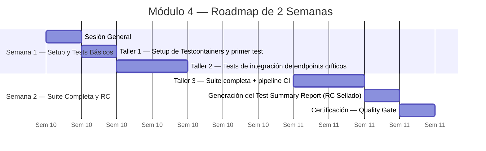
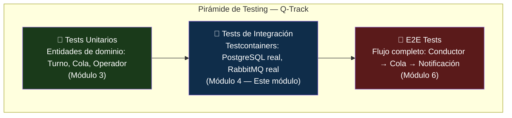

# Módulo 4: Calidad e Integración

> **Ruta de navegación:** [Plan de Implementación](../../plan-implementacion-arquitectura.md) → Módulo 4

---

## 1. Propósito Ejecutivo

El Módulo 4 cierra el ciclo de construcción con la práctica que más frecuentemente se omite bajo presión de tiempo y que más caro cuesta cuando se omite: **las pruebas de integración sobre infraestructura real**. No sobre mocks, no sobre bases de datos en memoria —sobre contenedores reales levantados en el CI local del desarrollador mediante Testcontainers.

El valor de negocio es la **reducción del riesgo de regresión**: cuando el código de Q-Track llega a producción, el equipo ya lo habrá ejecutado contra una base de datos real, un message broker real y un motor de notificaciones real en cientos de escenarios de borde. El **Test Summary Report (RC Sellado)** que se genera es la evidencia formal de que Q-Track está listo para Release Candidate —un artefacto que el área de Operaciones y Gerencia puede leer, entender y firmar.

La Pirámide de Testing establece el balance correcto: muchos tests unitarios rápidos en la base, tests de integración selectivos en el medio, y la validación E2E al tope. Este módulo construye los dos niveles inferiores y deja preparada la base para el E2E del Módulo 6.

---

## 2. Duración Estimada

| Modalidad | Tiempo |
| :--- | :--- |
| Sesión General (Teoría) | 1 sesión × 1.5 horas |
| Taller Práctico (Hands-on) | 3 sesiones × 3 horas c/u |
| **Total de calendario** | **2 semanas** (incluye setup de Testcontainers, pruebas y certificación) |

---

## 3. Entregable Certificado (Quality Gate)

| # | Criterio | Forma de verificación |
| :--- | :--- | :--- |
| 1 | Suite de tests de integración con Testcontainers ejecutándose localmente sin errores | Log de `npm run test:integration` con todos los tests en verde |
| 2 | Al menos 5 escenarios de integración cubiertos (flujos críticos de Q-Track: crear turno, avanzar, cerrar, consultar, notificar) | Reporte de Jest con descripción de cada test |
| 3 | Cobertura de integración documentada con porcentaje específico de cobertura de ramas del adaptador de base de datos | Reporte de cobertura adjunto al PR |
| 4 | Test Summary Report (RC Sellado) generado y commiteado en el repositorio | Documento `.md` con resultados, versión, fecha y firma del facilitador |
| 5 | Pipeline de CI ejecuta tests de integración automáticamente en cada push a `develop` | Configuración del pipeline visible en el repositorio |

> **Regla de Oro:** Un RC Sellado con tests rojos no existe. Si hay tests en rojo, el RC no se emite y el equipo continúa en el taller.

---

## 4. Estrategia de Sesión

La estrategia es **"Tests que Fallan Primero"**: el facilitador deliberadamente muestra cómo un test de integración detecta errores que los tests unitarios con mocks no detectaron. Esta demostración viva —ver un bug real encontrado por un test de integración— es el argumento más efectivo para convencer al equipo de que los tests de integración no son opcionales.

Testcontainers elimina el argumento de "no tengo la base de datos disponible": cualquier máquina con Docker puede levantar en segundos un contenedor PostgreSQL o RabbitMQ efímero, ejecutar los tests y destruirlo. El equipo aprende que la infraestructura de tests es código, no configuración manual.

El formato de Test Summary Report enseña a comunicar calidad hacia audiencias no técnicas: Gerencia no lee logs de Jest, pero sí puede leer un reporte estructurado que dice "100% de los escenarios críticos pasaron" con la firma del responsable técnico.

---

## 5. Plan de Trabajo Progresivo (Roadmap)



### Hitos clave

| Hito | Semana | Descripción |
| :--- | :--- | :--- |
| **H1** Testcontainers configurado | 1 | Docker + Testcontainers levantando PostgreSQL |
| **H2** Primer test de integración verde | 1 | Test de `POST /turnos` contra base de datos real |
| **H3** Suite de 5 escenarios | 1 | Todos los flujos críticos cubiertos |
| **H4** Pipeline CI verde | 2 | Tests de integración en cada push a `develop` |
| **H5** RC Sellado emitido | 2 | Test Summary Report commiteado y firmado |

---

## 6. Secuencia Didáctica y Actividades (How-to)

### Fase 1 — Explicación (Sesión General)

1. **La Pirámide de Testing explicada con Q-Track (20 min):** El facilitador mapea cada nivel de la pirámide a un componente real de Q-Track: tests unitarios de entidades de dominio, tests de integración de adaptadores, tests E2E del flujo completo.
2. **¿Por qué los mocks nos mienten? (15 min):** Demostración de un mock que pasa todos los tests pero falla en producción por un tipo de dato incorrecto. El bug que solo el test de integración habría detectado.
3. **Testcontainers en 10 minutos (20 min):** Qué es, cómo funciona, qué requiere (Docker en local). Demostración de un contenedor PostgreSQL efímero levantando y destruyéndose en el terminal.
4. **El Test Summary Report como artefacto de negocio (15 min):** Cómo se lee, qué comunica y por qué Gerencia lo necesita firmado.

### Fase 2 — Demostración (Taller 1)

5. **Instalar y configurar Testcontainers en el proyecto Q-Track (30 min):** El facilitador instala en vivo: `npm install @testcontainers/postgresql`. Configura el script de test de integración.
6. **Primer test de integración en vivo (60 min):** Test de `POST /turnos` que escribe en PostgreSQL real y verifica que los datos persisten correctamente. El facilitador explica cada línea.
7. **Ver el contenedor levantarse y destruirse (15 min):** El equipo observa `docker ps` durante y después del test.

### Fase 3 — Práctica Guiada (Taller 2)

8. **Cada participante replica el primer test en su proyecto (45 min):** Con el facilitador monitoreando.
9. **Escribir los 5 escenarios críticos de Q-Track en grupo (90 min):** Crear turno, avanzar turno, cerrar turno, consultar cola, verificar notificación. Se asigna uno a cada participante.
10. **Ejecutar la suite completa y verificar que todos pasan (20 min)**

### Fase 4 — Práctica Independiente (Taller 3)

11. **Integrar los tests de integración al pipeline CI (60 min):** Modificar el archivo de configuración del pipeline para incluir `npm run test:integration` en el flujo de `push` a `develop`.
12. **Generar el reporte de cobertura del adaptador de base de datos (30 min)**
13. **Redactar el Test Summary Report con OpenCode (60 min):** Usando el prompt: *"Genera un Test Summary Report (RC Sellado) para Q-Track v1.0 con los siguientes resultados de tests..."*

### Fase 5 — Validación (Certificación)

14. **Commit del Test Summary Report (15 min)**
15. **Verificación de los 5 criterios del Quality Gate (20 min)**
16. **PR revisado y mergeado (15 min):** RC Sellado = Módulo 4 certificado.

---

## 7. Recursos, Herramientas y Referencias

| Herramienta / Recurso | Propósito | Enlace |
| :--- | :--- | :--- |
| **Testcontainers** | Contenedores efímeros para tests de integración | [https://testcontainers.com/](https://testcontainers.com/) |
| **Docker Desktop** | Motor de contenedores requerido por Testcontainers | [https://www.docker.com/products/docker-desktop/](https://www.docker.com/products/docker-desktop/) |
| **Jest** | Runner de tests con soporte para integración | [https://jestjs.io/](https://jestjs.io/) |
| **PostgreSQL (Testcontainer)** | Base de datos real efímera para los tests | [https://node.testcontainers.org/modules/postgresql/](https://node.testcontainers.org/modules/postgresql/) |
| **OpenCode (extensión VS Code)** | Generación del Test Summary Report | Intranet UNIMAR |
| **Pirámide de Testing — Referencia** | Marco conceptual de la estrategia de testing | [https://martinfowler.com/articles/practical-test-pyramid.html](https://martinfowler.com/articles/practical-test-pyramid.html) |
| **Guía del Facilitador** | Agenda detallada por minutos | [../guia-facilitador.md](../guia-facilitador.md) |

---

## 8. Artefactos Entregables y Hub Exclusivo

### Artefactos generados durante este módulo

| # | Artefacto | Descripción | Responsable |
| :--- | :--- | :--- | :--- |
| 1 | **Suite de tests de integración** | 5+ escenarios críticos de Q-Track ejecutándose contra infraestructura real | Equipo |
| 2 | **Test Summary Report (RC Sellado)** | Documento formal con resultados de tests, cobertura y firma del responsable | Facilitador + equipo |
| 3 | **Configuración del pipeline CI** | Pipeline que ejecuta tests de integración automáticamente | Equipo |

### Hub Exclusivo de Artefactos — Módulo 4

| Recurso | Enlace |
| :--- | :--- |
| **Plantilla vacía — Test Summary Report (RC Sellado)** | [Template Vacía](../templates/modulo-4-template.md) |
| **Ejemplo completo Q-Track** | [Ejemplo Q-Track](../templates/modulo-4-ejemplo-q-track.md) |
| **Artefactos del módulo** | [Artefactos Módulo 4](../artefactos/modulo-4.md) |

---

## 9. Diagramas Conceptuales

### Diagrama 1 — La Pirámide de Testing de Q-Track



### Diagrama 2 — Flujo de Testcontainers en el Pipeline

```mermaid
flowchart LR
    A[git push\na develop] --> B[Pipeline CI\nse activa]
    B --> C[npm run lint\n✓ Sin errores]
    C --> D[npm run test:unit\n✓ Cobertura ≥ 80%]
    D --> E[Docker levanta\ncontenedor PostgreSQL]
    E --> F[npm run test:integration\nTests contra DB real]
    F --> G{¿Todos los tests\nen verde?}
    G -- No ✗ --> H[Pipeline FALLA\nNotificación al equipo]
    G -- Sí ✓ --> I[Reporte de cobertura\ngenerado]
    I --> J[Test Summary Report\n(RC Sellado) emitido]
    J --> K([✅ Quality Gate\nMódulo 4 Certificado])

    style A fill:#1e3a5f,color:#ffffff
    style K fill:#0d6e3f,color:#ffffff
    style G fill:#7a3b00,color:#ffffff
    style H fill:#5a1a1a,color:#ffffff
```

---

*Documento generado bajo el estándar del corpus arquitectónico de UNIMAR · Idioma: Español · Versión: 1.0*

---

## Prompts Recomendados para este Módulo

| Actividad | Prompt | Enlace |
| :--- | :--- | :--- |
| **Pirámide** | Explicar Pirámide de Testing | [modulo-4-prompts.md#prompt-1](../prompts/modulo-4-prompts.md#prompt-1-explicar-pirámide) |
| **Testcontainers** | Configurar Testcontainers | [modulo-4-prompts.md#prompt-2](../prompts/modulo-4-prompts.md#prompt-2-configurar-testcontainers) |
| **Tests Integración** | Generar 5 escenarios de tests | [modulo-4-prompts.md#prompt-3](../prompts/modulo-4-prompts.md#prompt-3-generar-tests-integración) |
| **Tests E2E** | Generar tests de flujos completos | [modulo-4-prompts.md#prompt-4](../prompts/modulo-4-prompts.md#prompt-4-generar-tests-e2e) |
| **Reporte** | Generar Test Summary Report | [modulo-4-prompts.md#prompt-5](../prompts/modulo-4-prompts.md#prompt-5-generar-reporte) |
| **Validar RC** | Checklist de validación final | [modulo-4-prompts.md#prompt-6](../prompts/modulo-4-prompts.md#prompt-6-validar-rc) |

> **Tip:** Todos los prompts están optimizados para copy-paste en OpenCode.
