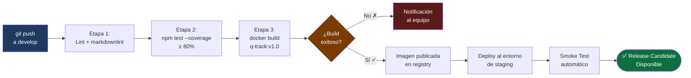
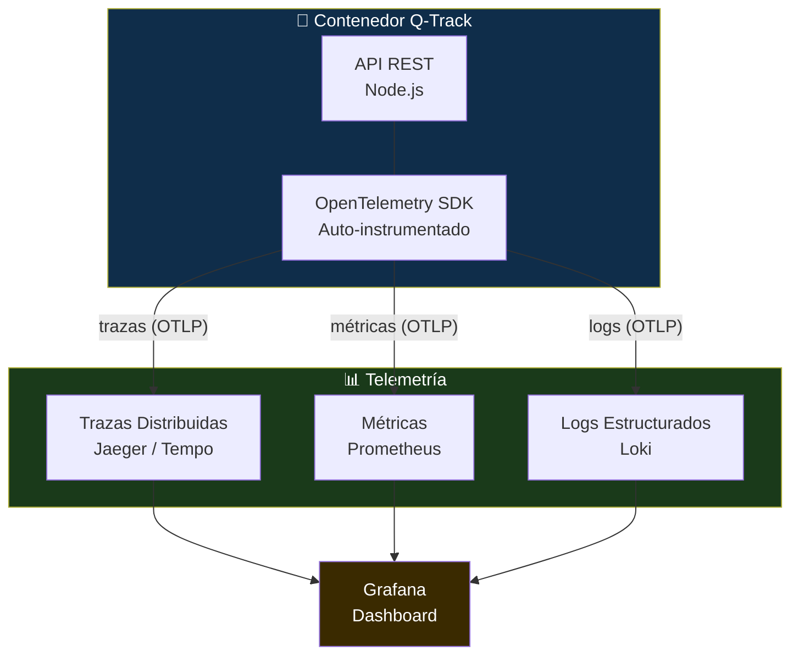

# Módulo 5: Infraestructura y Despliegue

> **Ruta de navegación:** [Plan de Implementación](../../plan-implementacion-arquitectura.md) → Módulo 5

---

## 1. Propósito Ejecutivo

El Módulo 5 es la transición del software de "funciona en mi máquina" a **"funciona en cualquier máquina de forma predecible y observable"**. El API de Q-Track, probado y certificado en los módulos anteriores, se empaqueta en un contenedor Docker, se despliega a través de un pipeline automatizado y se instrumenta con telemetría (OpenTelemetry) para que cualquier fallo en producción sea trazable, no un misterio.

El valor de negocio es la **eliminación del factor humano en los despliegues**: cuando el pipeline de CI/CD de Q-Track está configurado correctamente, el despliegue de una nueva versión es un evento determinista —no una operación manual propensa a errores. Las Notas de Lanzamiento (Release Notes) que se producen como entregable certificado son el comunicado formal a Operaciones y Gerencia de qué cambió, qué se probó y qué se puede esperar de la nueva versión.

La integración de OpenTelemetry desde el inicio (no como afterthought) asegura que Q-Track nace observable: métricas, trazas distribuidas y logs estructurados son ciudadanos de primera clase del sistema, no adornos opcionales.

---

## 2. Duración Estimada

| Modalidad | Tiempo |
| :--- | :--- |
| Sesión General (Teoría) | 1 sesión × 1.5 horas |
| Taller Práctico (Hands-on) | 2 sesiones × 3 horas c/u |
| **Total de calendario** | **1 semana** (Dockerfile, pipeline, OTel y Release Notes) |

---

## 3. Entregable Certificado (Quality Gate)

| # | Criterio | Forma de verificación |
| :--- | :--- | :--- |
| 1 | `Dockerfile` de Q-Track creado y la imagen construida sin errores (`docker build`) | Log de `docker build -t q-track:v1.0 .` sin errores |
| 2 | Contenedor Q-Track ejecutándose localmente con `docker run` y endpoints respondiendo | Respuesta exitosa de `curl http://localhost:3000/turnos` desde el contenedor |
| 3 | Pipeline CI/CD configurado con al menos 3 etapas: lint, test, build de imagen Docker | Archivo de configuración del pipeline visible en el repositorio |
| 4 | Instrumentación OpenTelemetry básica activa: al menos trazas de los endpoints REST y métricas de latencia | Log de la traza generada por una petición al API visible en la terminal |
| 5 | Notas de Lanzamiento (Release Notes) v1.0 de Q-Track redactadas y commiteadas | Documento `.md` con versión, fecha, cambios, calidad y firma del facilitador |

> **Regla de Oro:** Una imagen Docker que no pasa el `docker run` no es un entregable. El despliegue debe ser reproducible en cualquier máquina del equipo.

---

## 4. Estrategia de Sesión

La estrategia es **"Infrastructure as Code desde el minuto cero"**: el Dockerfile y la configuración del pipeline no son archivos de configuración secundarios que se escriben al final —son parte del repositorio, versionados, revisados en PR y tan importantes como el código de negocio.

El facilitador usa el modelo "Build → Ship → Run" de Docker para estructurar pedagógicamente el taller: primero se entiende cómo Docker empaqueta el código (Build), luego cómo el pipeline lo envía al registry (Ship), y finalmente cómo el contenedor corre en el servidor objetivo (Run).

OpenTelemetry se introduce con el enfoque "zero-code instrumentation first": antes de escribir código de telemetría manual, el equipo experimenta la instrumentación automática —que ya captura trazas de HTTP en Node.js sin modificar una sola línea del código de negocio. Esto elimina la excusa de "agregar telemetría toma tiempo".

---

## 5. Plan de Trabajo Progresivo (Roadmap)

```mermaid
gantt
    title Módulo 5 — Roadmap de 1 Semana
    dateFormat  YYYY-MM-DD
    axisFormat  Día %d

    section Día 1 — Sesión General
    Teoría: Docker, CI/CD y OpenTelemetry        :         s1, 2025-03-24, 1d

    section Día 2-3 — Taller 1: Docker y Pipeline
    Dockerfile multi-stage de Q-Track            :         t1a, 2025-03-25, 1d
    Configuración del pipeline CI/CD             :         t1b, 2025-03-26, 1d

    section Día 4 — Taller 2: OTel y Release Notes
    Instrumentación OpenTelemetry                :         t2a, 2025-03-27, 0.5d
    Redacción de Release Notes                   :         t2b, 2025-03-27, 0.5d

    section Día 5 — Certificación
    Quality Gate: Build + Run + Pipeline         :         cert, 2025-03-28, 1d
```

### Hitos clave

| Hito | Día | Descripción |
| :--- | :--- | :--- |
| **H1** Imagen Docker construida | 2 | `docker build` exitoso en todos los equipos |
| **H2** Contenedor ejecutándose | 2 | Endpoints respondiendo desde contenedor |
| **H3** Pipeline CI/CD configurado | 3 | 3 etapas operativas en cada push |
| **H4** OTel activo | 4 | Trazas visibles en la terminal |
| **H5** Release Notes emitidas | 4 | Documento commiteado y firmado |
| **H6** Quality Gate | 5 | Todos los criterios cumplidos — Módulo 5 certificado |

---

## 6. Secuencia Didáctica y Actividades (How-to)

### Fase 1 — Explicación (Sesión General)

1. **El problema del "funciona en mi máquina" (15 min):** El facilitador narra un caso de UNIMAR donde un despliegue manual falló por diferencias de versión de Node.js entre entornos. Docker como solución.
2. **Dockerfile Multi-stage: Build → Runtime (20 min):** Explicación de las dos etapas: imagen de build (con compilador TypeScript) e imagen de runtime (solo el JavaScript compilado, sin devDependencies).
3. **Pipelines de CI/CD: del commit al servidor (20 min):** Las 3 etapas clave: Lint + Test, Build de imagen Docker, Deploy (simulado localmente).
4. **OpenTelemetry: observabilidad desde el inicio (20 min):** Los tres pilares: Métricas, Trazas, Logs. Demostración de la instrumentación automática de Node.js.
5. **Las Release Notes como comunicación ejecutiva (15 min):** Estructura: versión, cambios, calidad certificada, responsable. No es solo un changelog —es un compromiso.

### Fase 2 — Demostración (Taller 1, Docker)

6. **Escribir el Dockerfile multi-stage de Q-Track en vivo (45 min):**
   - Stage 1 (`builder`): `FROM node:20-alpine AS builder`, instalación de deps, compilación TypeScript.
   - Stage 2 (`runtime`): `FROM node:20-alpine`, copiar solo `dist/` y `package.json`, `npm ci --only=production`.
7. **Ejecutar `docker build` y revisar las capas (20 min):** El equipo observa la construcción capa por capa.
8. **Ejecutar `docker run` y probar los endpoints (20 min):** `curl http://localhost:3000/turnos` desde el contenedor.

### Fase 3 — Práctica Guiada (Taller 1, continuación — Pipeline)

9. **Cada participante crea su Dockerfile en su rama feature/ (45 min)**
10. **Configurar el pipeline CI/CD (60 min):** El facilitador guía la configuración de las 3 etapas. Los participantes configuran en sus propios repositorios.

### Fase 4 — Práctica Independiente (Taller 2, OTel + Release Notes)

11. **Instalar OpenTelemetry SDK (20 min):** `npm install @opentelemetry/sdk-node @opentelemetry/auto-instrumentations-node`.
12. **Configurar la instrumentación automática (40 min):** Crear `tracing.ts` y registrarlo en el entry point de Q-Track.
13. **Verificar trazas en la terminal (20 min):** Hacer un request al API y ver la traza en los logs.
14. **Redactar las Release Notes v1.0 con OpenCode (40 min):** Usando el prompt: *"Genera las Release Notes de Q-Track v1.0 para UNIMAR, incluyendo: descripción de la versión, cambios incluidos, calidad certificada (Test Summary Report Módulo 4), instrucciones de despliegue."*
15. **Commit y PR de todos los artefactos (15 min)**

### Fase 5 — Validación

16. **Verificación de los 5 criterios del Quality Gate (20 min)**
17. **PR revisado y mergeado (10 min):** Release Notes firmadas + Pipeline verde = Módulo 5 certificado.

---

## 7. Recursos, Herramientas y Referencias

| Herramienta / Recurso | Propósito | Enlace |
| :--- | :--- | :--- |
| **Docker Desktop** | Motor de contenedores | [https://www.docker.com/products/docker-desktop/](https://www.docker.com/products/docker-desktop/) |
| **OpenTelemetry para Node.js** | SDK de instrumentación | [https://opentelemetry.io/docs/languages/js/](https://opentelemetry.io/docs/languages/js/) |
| **GitHub Actions / Pipelines** | Plataforma de CI/CD | [https://docs.github.com/en/actions](https://docs.github.com/en/actions) |
| **Docker Hub** | Registry de imágenes (o registry corporativo de UNIMAR) | [https://hub.docker.com/](https://hub.docker.com/) |
| **OpenCode (extensión VS Code)** | Generación de Release Notes | Intranet UNIMAR |
| **Test Summary Report (Módulo 4)** | Insumo para las Release Notes | `artefactos/modulo-4.md` |
| **Guía del Facilitador** | Agenda por minutos | [../guia-facilitador.md](../guia-facilitador.md) |

---

## 8. Artefactos Entregables y Hub Exclusivo

### Artefactos generados durante este módulo

| # | Artefacto | Descripción | Responsable |
| :--- | :--- | :--- | :--- |
| 1 | **Dockerfile de Q-Track** | Imagen multi-stage optimizada para producción | Equipo |
| 2 | **Configuración del pipeline CI/CD** | Pipeline con 3 etapas (lint, test, build) | Equipo |
| 3 | **Configuración de OpenTelemetry** | Instrumentación automática de trazas y métricas | Equipo |
| 4 | **Notas de Lanzamiento (Release Notes) v1.0** | Documento ejecutivo de la primera versión certificada de Q-Track | Facilitador + equipo |

### Hub Exclusivo de Artefactos — Módulo 5

| Recurso | Enlace |
| :--- | :--- |
| **Plantilla vacía — Dockerfile y Release Notes** | [Template Vacía](../templates/modulo-5-template.md) |
| **Ejemplo completo Q-Track** | [Ejemplo Q-Track](../templates/modulo-5-ejemplo-q-track.md) |
| **Artefactos del módulo** | [Artefactos Módulo 5](../artefactos/modulo-5.md) |

---

## 9. Diagramas Conceptuales

### Diagrama 1 — Pipeline CI/CD de Q-Track



### Diagrama 2 — Arquitectura de Observabilidad con OpenTelemetry



---

*Documento generado bajo el estándar del corpus arquitectónico de UNIMAR · Idioma: Español · Versión: 1.0*

---

## Prompts Recomendados para este Módulo

| Actividad | Prompt | Enlace |
| :--- | :--- | :--- |
| **Multi-Stage** | Explicar Docker multi-stage | [modulo-5-prompts.md#prompt-1](../prompts/modulo-5-prompts.md#prompt-1-explicar-multi-stage) |
| **Dockerfile** | Generar Dockerfile optimizado | [modulo-5-prompts.md#prompt-2](../prompts/modulo-5-prompts.md#prompt-2-generar-dockerfile) |
| **Pipeline** | Generar pipeline CI/CD | [modulo-5-prompts.md#prompt-3](../prompts/modulo-5-prompts.md#prompt-3-generar-pipeline) |
| **OpenTelemetry** | Instrumentar OTel | [modulo-5-prompts.md#prompt-4](../prompts/modulo-5-prompts.md#prompt-4-instrumentar-otel) |
| **Release Notes** | Generar Release Notes completas | [modulo-5-prompts.md#prompt-5](../prompts/modulo-5-prompts.md#prompt-5-generar-release-notes) |
| **Despliegue** | Checklist de despliegue | [modulo-5-prompts.md#prompt-6](../prompts/modulo-5-prompts.md#prompt-6-checklist-despliegue) |

> **Tip:** Todos los prompts están optimizados para copy-paste en OpenCode.
