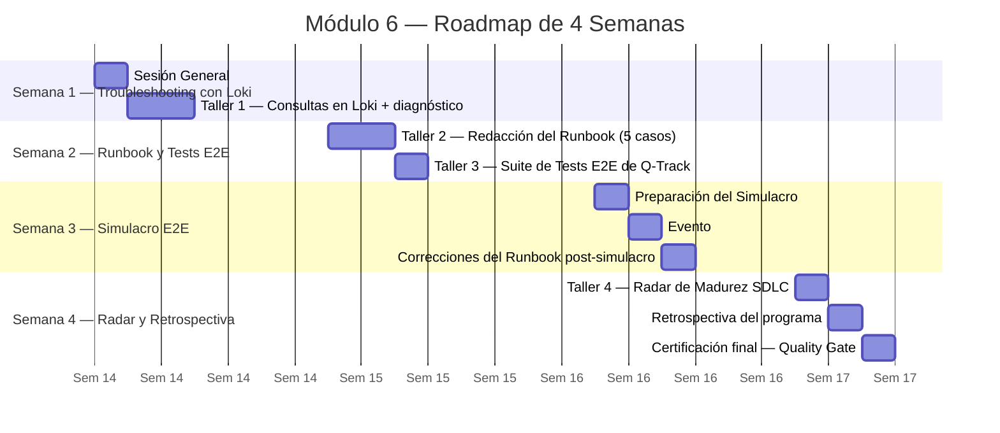
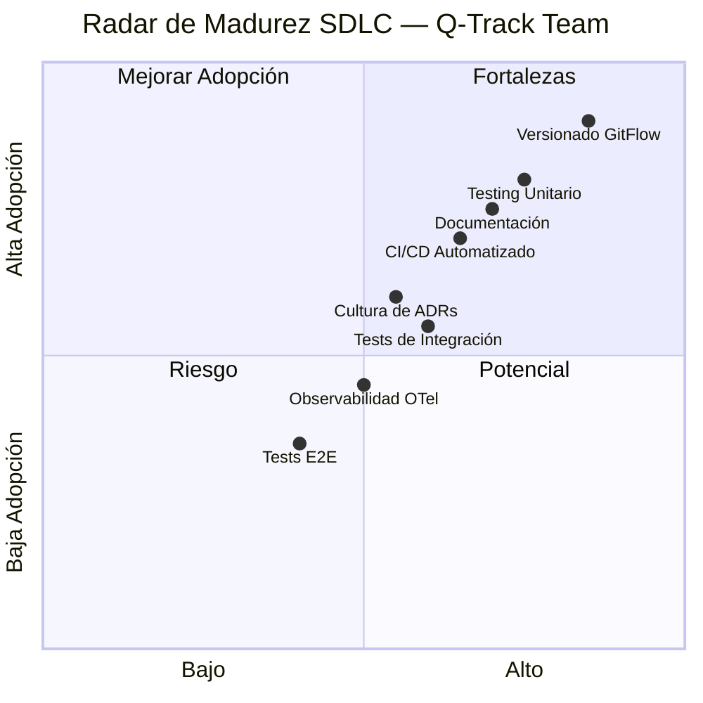

# Módulo 6: Soporte y Retrospectiva

> **Ruta de navegación:** [Plan de Implementación](../../plan-implementacion-arquitectura.md) → Módulo 6

---

## 1. Propósito Ejecutivo

El Módulo 6 es el cierre del ciclo completo. Con Q-Track en producción (o en staging certificado), el equipo enfrenta la fase que más se parece a la operación real de UNIMAR: **mantener, diagnosticar y mejorar un sistema vivo**. El troubleshooting con Loki sobre logs reales, la simulación E2E del flujo completo de un camión en la cola y la elaboración del Radar de Madurez SDLC son los tres pilares de este módulo.

El valor de negocio es la **transferencia del conocimiento a la operación**: el Runbook que se produce es el manual que cualquier ingeniero de guardia puede usar a las 2 AM para diagnosticar un incidente en Q-Track sin necesidad de llamar al desarrollador original. La Auditoría de Simulacro demuestra que el equipo puede operar bajo presión. El Radar de Madurez cierra el programa con una medición honesta de cuánto creció el equipo y qué falta para alcanzar el nivel objetivo de madurez de ingeniería de UNIMAR.

Este módulo marca la graduación: el equipo no solo construyó Q-Track —aprendió a sostenerlo.

---

## 2. Duración Estimada

| Modalidad | Tiempo |
| :--- | :--- |
| Sesión General (Teoría) | 1 sesión × 1.5 horas |
| Taller Práctico (Hands-on) | 4 sesiones × 3 horas c/u |
| Simulacro E2E (Evento especial) | 1 evento × 4 horas |
| **Total de calendario** | **4 semanas** (troubleshooting, runbook, simulacro y radar) |

---

## 3. Entregable Certificado (Quality Gate)

| # | Criterio | Forma de verificación |
| :--- | :--- | :--- |
| 1 | Runbook de Q-Track completado con al menos 5 escenarios de incidentes documentados (síntoma, diagnóstico, resolución) | Documento `.md` commiteado en el repositorio con cada sección completa |
| 2 | Auditoría de Simulacro aprobada: el equipo diagnosticó y resolvió un incidente inyectado por el facilitador en ≤ 30 minutos usando Loki | Registro de tiempo y pasos de diagnóstico en el acta del simulacro |
| 3 | Tests E2E del flujo crítico de Q-Track (conductor → cola → turno → notificación) ejecutándose en verde | Log de la suite E2E adjunto al PR |
| 4 | Radar de Madurez SDLC completado con puntuación en cada eje y plan de mejora para los ejes con puntuación < 3 | Documento con radar Mermaid y tabla de acciones de mejora |
| 5 | Retrospectiva del programa completada con al menos 3 lecciones aprendidas y 3 acciones concretas de mejora | Documento de retrospectiva commiteado |

> **Regla de Oro:** El Runbook es un artefacto vivo, no un documento para archivar. Si no puede usarse en un incidente real, no está completo.

---

## 4. Estrategia de Sesión

La estrategia es **"Producción Simulada"**: desde la primera sesión del módulo, el facilitador trata el entorno de staging de Q-Track como si fuera producción real. Los participantes responden a incidentes, consultan Loki, leen métricas en Grafana y documentan sus pasos —exactamente como lo harían en un turno de guardia real.

El **Simulacro E2E** es el momento de mayor tensión controlada del programa: el facilitador inyecta un error deliberado en el sistema (una migración fallida, un timeout en la base de datos, un endpoint respondiendo con error 500) y el equipo tiene 30 minutos para diagnosticar y resolver el problema usando únicamente el Runbook y las herramientas de observabilidad (Loki, Grafana). Este ejercicio de presión controlada revela los vacíos del Runbook y los fortalece en tiempo real.

El **Radar de Madurez SDLC** cierra el programa con honestidad: usando los 8 ejes del estándar de madurez de ingeniería de UNIMAR, el equipo se auto-evalúa, el facilitador valida y el gap hacia el nivel objetivo se convierte en el plan de trabajo del trimestre siguiente.

---

## 5. Plan de Trabajo Progresivo (Roadmap)



### Hitos clave

| Hito | Semana | Descripción |
| :--- | :--- | :--- |
| **H1** Consultas Loki dominadas | 1 | Equipo puede filtrar logs por servicio, nivel y ventana de tiempo |
| **H2** Runbook v1 completado | 2 | 5 escenarios documentados con síntoma, diagnóstico y resolución |
| **H3** Suite E2E verde | 2 | Tests del flujo completo ejecutándose sin errores |
| **H4** Simulacro aprobado | 3 | Incidente resuelto en ≤ 30 minutos |
| **H5** Radar completado | 4 | Puntuación en 8 ejes con plan de mejora |
| **H6** Quality Gate final | 4 | Todos los criterios cumplidos — Módulo 6 y programa certificados |

---

## 6. Secuencia Didáctica y Actividades (How-to)

### Fase 1 — Explicación (Sesión General)

1. **¿Qué es un Runbook y por qué salva a la gente a las 2 AM? (15 min):** El facilitador muestra un incidente real (anonimizado) de UNIMAR y explica cómo un Runbook existente habría reducido el MTTR en >60%.
2. **Loki en 20 minutos (20 min):** Cómo funciona Loki, cómo se instalan los agentes (Promtail), cómo se escriben queries LogQL básicas para filtrar logs de Q-Track.
3. **Tests E2E: cuándo y cuáles (15 min):** El papel del E2E en la pirámide. Los tests E2E de Q-Track cubren el flujo crítico de negocio, no cada combinación posible.
4. **El Radar de Madurez SDLC (20 min):** Los 8 ejes del estándar de UNIMAR. Cómo se puntúa (1 a 5). Qué significa cada nivel.
5. **El Simulacro: reglas del juego (10 min):** Se explica la dinámica del ejercicio de la Semana 3.

### Fase 2 — Demostración (Taller 1, Loki)

6. **Levantar el stack de observabilidad con Docker Compose (30 min):** Loki + Grafana + Promtail sobre el contenedor de Q-Track.
7. **Queries LogQL en vivo (30 min):** El facilitador ejecuta queries reales: filtrar por `service_name`, por nivel de log `error`, por ventana de tiempo durante una prueba de carga.
8. **Identificar un error plantado en vivo (30 min):** El facilitador inyecta un error en Q-Track y el equipo lo detecta usando Loki.

### Fase 3 — Práctica Guiada (Taller 2, Runbook)

9. **Estructura del Runbook (15 min):** Cada sección: Nombre del incidente, Síntomas, Diagnóstico (pasos numerados), Resolución, Escalado.
10. **Documentar los 5 escenarios críticos de Q-Track (120 min):** Escenario 1: API no responde. Escenario 2: Turno no avanza. Escenario 3: Notificaciones detenidas. Escenario 4: Base de datos saturada. Escenario 5: Pipeline CI fallando.

### Fase 4 — Práctica Independiente (Taller 3, Tests E2E)

11. **Escribir la suite E2E del flujo crítico (120 min):** Usando el framework de testing elegido (ej. Playwright o Supertest para API E2E). Flujo: `POST /turnos` → `GET /turnos/{id}` → `PATCH /turnos/{id}/avanzar` → verificar notificación.
12. **Ejecutar la suite E2E y verificar que esté verde (30 min)**

### Fase 5 — Simulacro E2E (Evento Semana 3)

13. **El facilitador inyecta el incidente (5 min):** Sin decir qué falló ni dónde.
14. **El equipo diagnostica y resuelve (≤ 30 min):** Solo pueden usar el Runbook y las herramientas de observabilidad (Loki, Grafana).
15. **Debriefing post-simulacro (30 min):** El facilitador revela el error, el equipo compara su diagnóstico con la causa real. Se actualizan los vacíos del Runbook.

### Fase 6 — Radar y Retrospectiva (Taller 4)

16. **Auto-evaluación en los 8 ejes del Radar (60 min):** Cada participante puntúa individualmente, se promedian y se consolidan con debate donde hay discrepancias.
17. **Definir acciones de mejora para ejes con puntuación < 3 (30 min)**
18. **Retrospectiva del programa (45 min):** ¿Qué salió bien? ¿Qué falló? ¿Qué haríamos diferente?

### Fase 7 — Certificación Final

19. **Verificación de los 5 criterios del Quality Gate (20 min)**
20. **PR final del programa (15 min):** Merge del Runbook, Auditoría del Simulacro, Tests E2E y Radar.
21. **Acto de cierre:** El facilitador declara el programa completado y entrega los certificados digitales.

---

## 7. Recursos, Herramientas y Referencias

| Herramienta / Recurso | Propósito | Enlace |
| :--- | :--- | :--- |
| **Loki** | Sistema de agregación de logs | [https://grafana.com/oss/loki/](https://grafana.com/oss/loki/) |
| **Grafana** | Visualización de logs y métricas | [https://grafana.com/grafana/](https://grafana.com/grafana/) |
| **Promtail** | Agente de recolección de logs para Loki | [https://grafana.com/docs/loki/latest/send-data/promtail/](https://grafana.com/docs/loki/latest/send-data/promtail/) |
| **LogQL** | Lenguaje de consultas de Loki | [https://grafana.com/docs/loki/latest/query/](https://grafana.com/docs/loki/latest/query/) |
| **Playwright** | Tests E2E de extremo a extremo | [https://playwright.dev/](https://playwright.dev/) |
| **OpenCode (extensión VS Code)** | Generación del Runbook y Retrospectiva | Intranet UNIMAR |
| **Skill bmad-retrospective** | Workflow BMAD para retrospectivas formales | `bmad-retrospective` en OpenCode |
| **Guía del Facilitador** | Guión del simulacro por minutos | [../guia-facilitador.md](../guia-facilitador.md) |

---

## 8. Artefactos Entregables y Hub Exclusivo

### Artefactos generados durante este módulo

| # | Artefacto | Descripción | Responsable |
| :--- | :--- | :--- | :--- |
| 1 | **Runbook de Q-Track** | Manual de diagnóstico con 5 escenarios de incidentes documentados | Equipo |
| 2 | **Auditoría de Simulacro** | Acta del simulacro E2E con tiempos, pasos y resultado | Facilitador |
| 3 | **Suite de Tests E2E** | Tests del flujo crítico completo de Q-Track | Equipo |
| 4 | **Radar de Madurez SDLC** | Puntuación en 8 ejes con plan de mejora | Equipo + facilitador |
| 5 | **Retrospectiva del programa** | Lecciones aprendidas y acciones concretas de mejora | Equipo |

### Hub Exclusivo de Artefactos — Módulo 6

| Recurso | Enlace |
| :--- | :--- |
| **Plantilla vacía — Runbook y Radar de Madurez** | [Template Vacía](../templates/modulo-6-template.md) |
| **Ejemplo completo Q-Track** | [Ejemplo Q-Track](../templates/modulo-6-ejemplo-q-track.md) |
| **Artefactos del módulo** | [Artefactos Módulo 6](../artefactos/modulo-6.md) |

---

## 9. Diagramas Conceptuales

### Diagrama 1 — Flujo del Simulacro E2E

```mermaid
flowchart TD
    A([🔴 Facilitador inyecta\nel incidente en Q-Track]) --> B[Equipo detecta anomalía\nvia Grafana / Loki]
    B --> C[Consulta LogQL:\n{service=q-track} |= error]
    C --> D[Identificar el patrón\ndel error en logs]
    D --> E{¿Coincide con\nun caso del Runbook?}
    E -- Sí --> F[Seguir pasos\ndel Runbook]
    E -- No --> G[Escalar y documentar\nnuevo caso]
    F --> H[Aplicar la resolución\ndocumentada]
    G --> H
    H --> I{¿Sistema\nrecuperado?}
    I -- No --> C
    I -- Sí --> J[Documentar tiempos\ny pasos en el Acta]
    J --> K([✅ Simulacro Aprobado\nMTTR ≤ 30 minutos])

    style A fill:#5a1a1a,color:#ffffff
    style K fill:#0d6e3f,color:#ffffff
    style E fill:#7a3b00,color:#ffffff
    style I fill:#7a3b00,color:#ffffff
```

### Diagrama 2 — Radar de Madurez SDLC de UNIMAR



### Diagrama 3 — Flujo Completo del Programa SDLC

```mermaid
flowchart LR
    MB([Módulo Base\nEntorno + GitFlow]) --> M0[Módulo 0\nKick-off + Gates]
    M0 --> M1[Módulo 1\nPRD + Backlog]
    M1 --> M2[Módulo 2\nADR + C4]
    M2 --> M3[Módulo 3\nCódigo + Code Review]
    M3 --> M4[Módulo 4\nTests + RC Sellado]
    M4 --> M5[Módulo 5\nDocker + Pipeline + OTel]
    M5 --> M6[Módulo 6\nRunbook + Simulacro + Radar]
    M6 --> CERT([🏆 Equipo UNIMAR\nCertificado en SDLC])

    style MB fill:#1e3a5f,color:#ffffff
    style CERT fill:#0d6e3f,color:#ffffff
    style M0 fill:#2a1a0a,color:#ffffff
    style M1 fill:#1a2a1a,color:#ffffff
    style M2 fill:#2a0a1a,color:#ffffff
    style M3 fill:#0a1a2a,color:#ffffff
    style M4 fill:#1a0a2a,color:#ffffff
    style M5 fill:#2a1a0a,color:#ffffff
    style M6 fill:#1a2a2a,color:#ffffff
```



---

*Documento generado bajo el estándar del corpus arquitectónico de UNIMAR · Idioma: Español · Versión: 1.0*

---

## Prompts Recomendados para este Módulo

| Actividad | Prompt | Enlace |
| :--- | :--- | :--- |
| **Stack Observabilidad** | Explicar Loki + Grafana + Promtail | [modulo-6-prompts.md#prompt-1](../prompts/modulo-6-prompts.md#prompt-1-explicar-stack) |
| **Promtail** | Configurar Promtail | [modulo-6-prompts.md#prompt-2](../prompts/modulo-6-prompts.md#prompt-2-configurar-promtail) |
| **LogQL** | Generar 10 consultas LogQL | [modulo-6-prompts.md#prompt-3](../prompts/modulo-6-prompts.md#prompt-3-generar-logql) |
| **Runbook** | Generar Runbook con 5 escenarios | [modulo-6-prompts.md#prompt-4](../prompts/modulo-6-prompts.md#prompt-4-generar-runbook) |
| **Simulacro** | Facilitar simulacro de incidente | [modulo-6-prompts.md#prompt-5](../prompts/modulo-6-prompts.md#prompt-5-facilitar-simulacro) |
| **Retrospectiva** | Facilitar retrospectiva de programa | [modulo-6-prompts.md#prompt-6](../prompts/modulo-6-prompts.md#prompt-6-facilitar-retrospectiva) |
| **Radar** | Generar Radar de Madurez SDLC | [modulo-6-prompts.md#prompt-7](../prompts/modulo-6-prompts.md#prompt-7-generar-radar) |

> **Tip:** Todos los prompts están optimizados para copy-paste en OpenCode.
