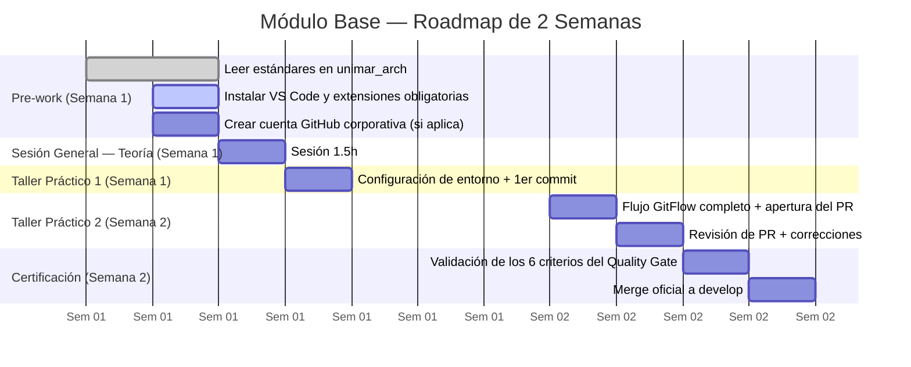
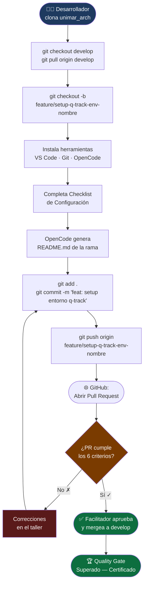
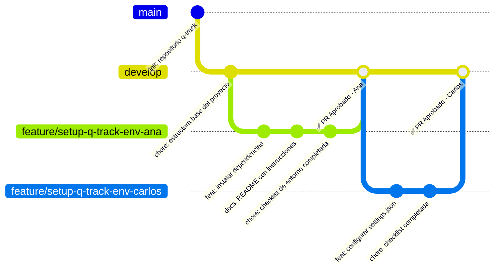
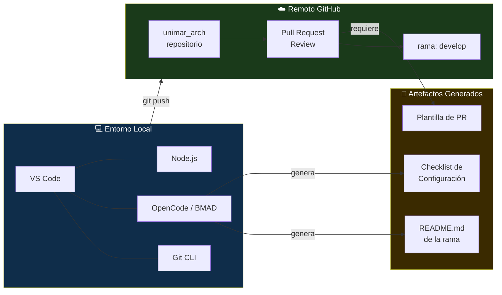

# Módulo: Base — Bootcamp SDLC (Entorno, Versionado e IA)

> **Ruta de navegación:** [Plan de Implementación](../../plan-implementacion-arquitectura.md) → Módulo Base

---

## 1. Propósito Ejecutivo

El Módulo Base es la **piedra angular** del programa de adopción del SDLC corporativo de UNIMAR. Su valor de negocio es directo: sin un entorno estandarizado, toda capacitación posterior es frágil, ya que cada participante operaría desde una configuración distinta, generando fricción técnica y desvíos de proceso que contaminan la calidad de los entregables.

Este módulo garantiza que **cada integrante del equipo** —sin importar su rol (Desarrollo, QA, Procesos, Infraestructura)— parta desde un punto de control común: con las mismas herramientas instaladas, el mismo flujo de ramas (GitFlow) comprendido y la Inteligencia Artificial corporativa (OpenCode / BMAD) activa en su máquina. Al superar este bootcamp, el equipo habrá demostrado que puede colaborar bajo el estándar de versionado de UNIMAR, lo que convierte cada commit futuro en un artefacto trazable, revisable y auditable.

---

## 2. Duración Estimada

| Modalidad | Tiempo |
| :--- | :--- |
| Sesión General (Teoría) | 1 sesión × 1.5 horas |
| Taller Práctico (Hands-on) | 2 sesiones × 3 horas c/u (con break de 15 min a los 90 min) |
| **Total de calendario** | **2 semanas** (incluye pre-work y certificación) |

---

## 3. Entregable Certificado (Quality Gate)

Para que el módulo sea dado por **APROBADO**, el participante debe cumplir los siguientes criterios de forma simultánea:

| # | Criterio | Forma de verificación |
| :--- | :--- | :--- |
| 1 | VS Code instalado con las extensiones obligatorias activas (OpenCode, GitLens, Markdownlint) | Captura de pantalla del panel de extensiones |
| 2 | Git instalado y configurado con `user.name` y `user.email` corporativos | Salida de `git config --list` verificada por el facilitador |
| 3 | Repositorio `unimar_arch` clonado y rama `develop` actualizada | Salida de `git log --oneline -5` en la rama `develop` |
| 4 | Rama `feature/setup-q-track-env-[nombre]` creada siguiendo GitFlow | Registro visible en GitHub bajo el repositorio del equipo |
| 5 | Pull Request (PR) abierto con la Checklist de Configuración completada | PR visible en GitHub con estado de revisión aprobado por el facilitador |
| 6 | PR mergeado sin conflictos a `develop` | Historial del repositorio sin commits de merge forzado |

> **Regla de Oro:** No se avanza al Módulo 0 si cualquiera de los 6 criterios anteriores está incompleto. El participante repite el taller práctico hasta certificarse.

---

## 4. Estrategia de Sesión

La estrategia pedagógica se basa en el modelo **"See One, Do One, Teach One"** adaptado al contexto técnico de UNIMAR:

1. **Ver (See):** El facilitador demuestra en vivo cada paso del flujo, desde la instalación de VS Code hasta el merge del PR, con comentarios en tiempo real sobre el *por qué* de cada decisión (ej. por qué usamos GitFlow en lugar de commits directos a `main`).

2. **Hacer (Do):** El participante replica exactamente los mismos pasos en su propia máquina. El facilitador monitorea mediante pantalla compartida y resuelve bloqueos en el momento.

3. **Enseñar (Teach):** Cada participante explica brevemente —al abrir su PR— qué hizo y por qué. Esta micro-presentación fuerza la asimilación y detecta vacíos conceptuales antes de avanzar.

La IA (OpenCode) está presente desde el inicio no como un asistente opcional, sino como un **actor del flujo**: el participante debe usarla para generar el `README.md` inicial de su rama, experimentando desde el primer día que la IA amplifica su productividad dentro del SDLC, no la reemplaza.

---

## 5. Plan de Trabajo Progresivo (Roadmap)

### Hitos clave

| Hito | Semana | Descripción |
| :--- | :--- | :--- |
| **H1** Pre-work completo | 1 | Herramientas instaladas, lectura de estándares hecha |
| **H2** Primer commit | 1 | `git commit` exitoso en rama `feature/` personal |
| **H3** PR abierto | 2 | Pull Request con Checklist completada |
| **H4** Certificación | 2 | PR aprobado y mergeado → Quality Gate superado |

---

## 6. Secuencia Didáctica y Actividades (How-to)

### Fase 1 — Explicación (Sesión General, 1.5 horas)

1. **Apertura ejecutiva (10 min):** El facilitador explica el "costo del caos": qué pasa cuando no existe GitFlow en producción (bugs en `main`, rollbacks manuales, culpas cruzadas).
2. **Marco teórico GitFlow (20 min):** Diagrama en vivo de las ramas (`main`, `develop`, `feature/`, `release/`, `hotfix/`). Regla: nadie comitea directamente a `main` ni a `develop`.
3. **Introducción a OpenCode y BMAD (25 min):** Demostración de cómo OpenCode genera un PRD básico y un ADR desde el chat de VS Code. Énfasis: la IA sigue las plantillas del repositorio, no inventa.
4. **Cierre teórico + Q&A (15 min):** Revisión del Quality Gate del módulo. Se distribuye la Checklist de Configuración.

### Fase 2 — Demostración (Inicio del Taller Práctico 1)

5. **El facilitador instala en vivo (30 min):** Instalación de VS Code, Git y todas las extensiones desde cero en su propia máquina, narrando cada paso.
6. **Clon del repositorio en vivo (15 min):** `git clone`, `git checkout develop`, `git pull`. Se explica la relación entre el repositorio local y el remoto.
7. **Creación de rama feature/ en vivo (15 min):** `git checkout -b feature/setup-q-track-env-facilitador`. Se explica la convención de nombres.

### Fase 3 — Práctica Guiada (Taller Práctico 1, continuación)

8. **Replicación individual (60 min):** Cada participante sigue los mismos pasos en su máquina con el facilitador disponible.
9. **Uso de OpenCode para generar README.md (20 min):** Los participantes abren OpenCode y usan el prompt estandarizado: *"Genera un README.md para la rama de configuración del entorno de Q-Track según las convenciones de unimar_arch."*
10. **Primer commit y push (10 min):** `git add .`, `git commit -m "feat: setup entorno q-track"`, `git push origin feature/setup-q-track-env-[nombre]`.

### Fase 4 — Práctica Independiente (Taller Práctico 2)

11. **Completar la Checklist de Configuración (45 min):** Cada participante llena la checklist y la añade como archivo al PR.
12. **Abrir el Pull Request en GitHub (30 min):** Se siguen las instrucciones de la plantilla de PR: título, descripción, lista de cambios, capturas de pantalla como evidencia.
13. **Revisión cruzada (30 min):** Dos participantes intercambian sus PRs y dejan comentarios técnicos. Aprenden el rol de *Reviewer*.

### Fase 5 — Validación y Certificación

14. **Verificación de los 6 criterios del Quality Gate (30 min):** El facilitador revisa cada PR contra la tabla de criterios.
15. **Correcciones y re-apertura (variable):** Los participantes que no cumplan algún criterio lo corrigen en el mismo taller.
16. **Merge oficial (15 min):** El facilitador mergea los PRs aprobados a `develop` como acto formal de certificación.

---

## 7. Recursos, Herramientas y Referencias

| Herramienta / Recurso | Propósito | Enlace |
| :--- | :--- | :--- |
| **VS Code** | Editor principal de desarrollo | [https://code.visualstudio.com/](https://code.visualstudio.com/) |
| **Git (CLI)** | Control de versiones | [https://git-scm.com/downloads](https://git-scm.com/downloads) |
| **GitHub Desktop** | Cliente visual de Git (opcional para roles no técnicos) | [https://desktop.github.com/](https://desktop.github.com/) |
| **OpenCode (extensión VS Code)** | IA corporativa BMAD integrada al editor | Intranet / repositorio de extensiones UNIMAR |
| **GitLens (extensión VS Code)** | Visualización de historial y autoría | [https://marketplace.visualstudio.com/items?itemName=eamodio.gitlens](https://marketplace.visualstudio.com/items?itemName=eamodio.gitlens) |
| **Markdownlint (extensión VS Code)** | Validación de documentación Markdown | [https://marketplace.visualstudio.com/items?itemName=DavidAnson.vscode-markdownlint](https://marketplace.visualstudio.com/items?itemName=DavidAnson.vscode-markdownlint) |
| **Node.js** | Ejecución de scripts de validación (`validate-docs.mjs`) | [https://nodejs.org/](https://nodejs.org/) |
| **Repositorio `unimar_arch`** | Corpus arquitectónico corporativo | [https://github.com/mhernandez-unimar/unimar_arch](https://github.com/mhernandez-unimar/unimar_arch) |
| **Documentación GitFlow** | Referencia estándar de la estrategia de ramas | [https://nvie.com/posts/a-successful-git-branching-model/](https://nvie.com/posts/a-successful-git-branching-model/) |
| **Guía del Facilitador** | Manual interno con agendas y artefactos | [../guia-facilitador.md](../guia-facilitador.md) |
| **Glosario de Capacitación** | Diccionario de acrónimos y términos UNIMAR | [../glosario-capacitacion.md](../glosario-capacitacion.md) |

---

## 8. Artefactos Entregables y Hub Exclusivo

### Artefactos generados durante este módulo

| # | Artefacto | Descripción | Responsable |
| :--- | :--- | :--- | :--- |
| 1 | **Checklist de Configuración de Entorno** | Lista de verificación que evidencia cada paso de la instalación completado | Participante |
| 2 | **Plantilla de Pull Request (PR)** | Documento estructurado que describe los cambios, evidencias y criterios cumplidos | Participante |
| 3 | **README.md de la rama feature/** | Documentación generada con OpenCode que describe el propósito de la rama | Participante (con IA) |

### Hub Exclusivo de Artefactos — Módulo Base

> Accede directamente a las plantillas oficiales de este módulo para iniciar tu trabajo:

| Recurso | Enlace |
| :--- | :--- |
| **Plantilla vacía — Checklist de Configuración** | [Template Vacía](../templates/modulo-base-template.md) |
| **Ejemplo completo Q-Track** | [Ejemplo Q-Track](../templates/modulo-base-ejemplo-q-track.md) |
| **Artefactos del módulo (resumen de entregables)** | [Artefactos Módulo Base](../artefactos/modulo-base.md) |

> **Nota sobre el ejemplo Q-Track:** El ejemplo lleno simula el proceso real de configurar el entorno del proyecto **Q-Track** (el Gestor Rápido de Colas de Camiones de UNIMAR), incluyendo el `settings.json` de VS Code, el `setup.sh` de dependencias y el primer PR con la rama `feature/setup-q-track-env` mergeada a `develop`.

---

## 9. Diagramas Conceptuales

### Diagrama 1 — Flujo GitFlow: Del Commit Local al PR Exitoso

### Diagrama 2 — Mapa de Ramas GitFlow en el Contexto de UNIMAR

### Diagrama 3 — Ecosistema de Herramientas del Bootcamp

---

*Documento generado bajo el estándar del corpus arquitectónico de UNIMAR · Idioma: Español · Versión: 1.0*

---

## Prompts Recomendados para este Módulo

| Actividad | Prompt | Enlace |
| :--- | :--- | :--- |
| **Casos de Caos** | Casos reales de problemas sin estándares | [modulo-base-prompts.md#prompt-1](../prompts/modulo-base-prompts.md#prompt-1-casos-de-caos-técnico) |
| **GitFlow** | Explicación visual de GitFlow | [modulo-base-prompts.md#prompt-2](../prompts/modulo-base-prompts.md#prompt-2-explicar-gitflow) |
| **Demo BMAD** | Demo de generación de README con IA | [modulo-base-prompts.md#prompt-3](../prompts/modulo-base-prompts.md#prompt-3-demo-bmad) |
| **Instalación** | Checklist de herramientas | [modulo-base-prompts.md#prompt-4](../prompts/modulo-base-prompts.md#prompt-4-checklist-de-instalación) |
| **README** | Generar README de rama | [modulo-base-prompts.md#prompt-5](../prompts/modulo-base-prompts.md#prompt-5-generar-readme) |
| **Verificación** | Validar configuración del entorno | [modulo-base-prompts.md#prompt-6](../prompts/modulo-base-prompts.md#prompt-6-verificar-configuración) |

> **Tip:** Todos los prompts están optimizados para copy-paste en OpenCode.
