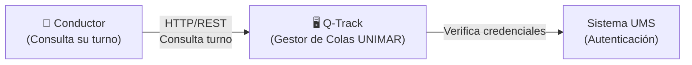
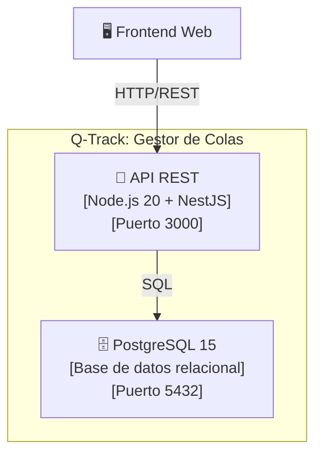

# Prompt Library — Módulo 2 (Diseño y Arquitectura)

> **Módulo:** Módulo 2 · **Tipo:** Biblioteca de Prompts para IA  
> **Herramientas:** OpenCode, BMAD Method v6.8.0, Agente Winston (Arquitecto), Agente Amelia (Dev)

---

## Propósito

Este documento contiene los prompts exactos para ejecutar cada actividad del Módulo 2 con asistencia de IA. Copia y pega cada prompt en OpenCode o tu asistente de IA preferido.

---

## Agenda con Prompts

| Bloque | Actividad | Duración | Prompt |
| :--- | :--- | :--- | :--- |
| 1 | Teoría: ¿Qué es un ADR y cuándo se escribe? | 15 min | [Prompt 1: Explicar ADRs](#prompt-1-explicar-adrs) |
| 2 | El modelo C4: Nivel 1 y Nivel 2 | 25 min | [Prompt 2: Explicar C4](#prompt-2-explicar-c4) |
| 3 | Arquitectura Hexagonal de Q-Track | 20 min | [Prompt 3: Explicar Hexagonal](#prompt-3-explicar-hexagonal) |
| 5 | Winston propone arquitectura de persistencia | 15 min | [Prompt 4: Winston Propuesta](#prompt-4-winston-propuesta) |
| 6 | Amelia critica la propuesta | 15 min | [Prompt 5: Amelia Crítica](#prompt-5-amelia-crítica) |
| 9 | Redacción del ADR sección por sección | 60 min | [Prompt 6: Generar ADR](#prompt-6-generar-adr) |
| 10 | Construcción del C4 Nivel 1 | 60 min | [Prompt 7: Generar C4 N1](#prompt-7-generar-c4-n1) |
| 11 | Construcción del C4 Nivel 2 | 60 min | [Prompt 8: Generar C4 N2](#prompt-8-generar-c4-n2) |

---

## Prompt 1: Explicar ADRs

**Propósito:** Generar explicación clara de Architecture Decision Records (ADRs).

**Cuándo usar:** Bloque 1 — 15 min

**Prompt:**

```
Actúa como un Architecture Board explicando ADRs a un equipo de desarrollo que nunca los ha usado.

Explica qué es un Architecture Decision Record (ADR) y por qué es importante documentar decisiones arquitectónicas.

Incluye:

1. **Definición simple:** ¿Qué es un ADR en 1 oración?
2. **Analogía cotidiana:** (ej: "es como el acta de una reunión de condominio donde se decide algo importante")
3. **Estructura de un ADR:**
   - Contexto: ¿Qué problema estamos resolviendo?
   - Decisión: ¿Qué decidimos hacer?
   - Consecuencias: ¿Qué pasa por esta decisión? (positivas, negativas, neutras)
   - Alternativas Rechazadas: ¿Qué más consideramos y por qué no lo elegimos?
4. **Ejemplo real:** Muestra un ADR completo de un repositorio de referencia (ej: ADR de persistencia)
5. **¿Cuándo escribir un ADR?**
   - Decisiones que son difíciles de revertir
   - Decisiones que afectan múltiples componentes
   - Decisiones con trade-offs significativos
6. **Beneficios:**
   - Nueva gente entiende por qué el sistema es como es
   - Evita debates repetidos ("ya discutimos esto, mira el ADR-003")
   - Rastreo de evolución arquitectónica

Formato de salida:
- Definición en negrita
- Analogía con viñetas
- Estructura con ejemplo
- Lista de cuándo escribir
- Tabla de beneficios

Audiencia: Desarrolladores, Tech Leads, arquitectos junior.
Tono: Didáctico, con ejemplos concretos de la industria.
Duración de lectura: 10 minutos máximo.
```

**Salida esperada:** Explicación clara con ejemplo real de ADR.

---

## Prompt 2: Explicar C4

**Propósito:** Generar explicación del modelo C4 (Context, Containers, Components, Code).

**Cuándo usar:** Bloque 2 — 25 min

**Prompt:**

```
Actúa como un arquitecto de software experto en el modelo C4 enseñando a un equipo técnico.

Explica el modelo C4 para documentación de arquitectura de software.

Incluye:

1. **Los 4 niveles del modelo C4:**
   - **Nivel 1: Contexto** — El sistema en su entorno (actores, sistemas externos)
   - **Nivel 2: Contenedores** — Las unidades tecnológicas dentro del sistema (API, BD, Frontend)
   - **Nivel 3: Componentes** — Los módulos dentro de cada contenedor
   - **Nivel 4: Código** — Clases y métodos (opcional, generalmente en el IDE)

2. **Diagrama Mermaid de ejemplo** para cada nivel (usa Q-Track como ejemplo)

3. **¿Por qué C4?**
   - Abstracción progresiva: de lo general a lo específico
   - Audiencia apropiada: Nivel 1 para negocio, Nivel 2 para arquitectos, Nivel 3-4 para devs
   - Herramientas simples: Mermaid, draw.io, sin herramientas costosas

4. **Errores comunes:**
   - Mezclar niveles en un mismo diagrama
   - Demasiado detalle en Nivel 1 (negocio no entiende clases)
   - Muy poco detalle en Nivel 2 (arquitectos no pueden guiar implementación)

5. **Cuándo usar cada nivel:**
   - Nivel 1: Kick-off, onboard de negocio, documentación ejecutiva
   - Nivel 2: Diseño arquitectónico, ADRs, documentación técnica
   - Nivel 3: Diseño detallado, refactorización, documentación de componentes
   - Nivel 4: Code review, documentación de APIs, IDE

Formato de salida:
- Lista de los 4 niveles con descripción
- Diagrama Mermaid por nivel
- Tabla de "Cuándo usar"
- Lista de errores comunes

Audiencia: Arquitectos, Tech Leads, desarrolladores senior.
Tono: Técnico pero accesible, enfocado en aplicación práctica.
```

**Salida esperada:** Guía visual de los 4 niveles con ejemplos Mermaid.

---

## Prompt 3: Explicar Hexagonal

**Propósito:** Generar explicación de Arquitectura Hexagonal (Ports & Adapters).

**Cuándo usar:** Bloque 3 — 20 min

**Prompt:**

```
Actúa como un arquitecto de software experto en Arquitectura Hexagonal (Ports & Adapters).

Explica Arquitectura Hexagonal a un equipo de desarrollo que viene de trabajar con arquitecturas en capas tradicionales (MVC, N-Tiers).

Incluye:

1. **Definición simple:** ¿Qué es Arquitectura Hexagonal en 1 oración?
2. **Diagrama Mermaid** mostrando:
   - Dominio en el centro (entidades, casos de uso)
   - Puertos (interfaces) alrededor del dominio
   - Adaptadores (implementaciones) conectados a los puertos
   - Flechas apuntando hacia adentro (dependencias hacia el dominio)

3. **Comparación con N-Tiers:**
   | N-Tiers | Hexagonal |
   | :--- | :--- |
   | Capa de dominio depende de BD | BD depende de dominio (interface) |
   | Cambiar BD afecta dominio | Cambiar BD no afecta dominio |
   | Tests requieren BD levantada | Tests con mocks, sin BD |

4. **Beneficios clave:**
   - **Independencia tecnológica:** Cambiar PostgreSQL por MongoDB no afecta reglas de negocio
   - **Testabilidad:** Tests unitarios sin infraestructura real
   - **Enfoque en dominio:** El código de negocio es el protagonista, no la BD o el framework

5. **Ejemplo Q-Track:**
   - Dominio: Entidad `Turno`, caso de uso `AsignarTurno`
   - Puerto: Interfaz `TurnoRepository` (método `guardar(turno: Turno)`)
   - Adaptador: `PostgresTurnoRepository` implementa la interfaz

6. **Señales de que NO es hexagonal:**
   - Entidades importan clases de framework (ej: `import { Entity } from 'typeorm'`)
   - Casos de uso llaman directamente a `new DatabaseConnection()`
   - Tests no pueden ejecutarse sin levantar la BD

Formato de salida:
- Definición en negrita
- Diagrama Mermaid
- Tabla comparativa
- Lista de beneficios
- Ejemplo concreto Q-Track
- Señales de alerta

Audiencia: Desarrolladores con experiencia en arquitecturas tradicionales.
Tono: Técnico, con ejemplos de código TypeScript/Node.js.
```

**Salida esperada:** Explicación visual + comparativa + ejemplo de código.

---

## Prompt 4: Winston Propuesta

**Propósito:** Generar propuesta de arquitectura desde perspectiva del arquitecto (Winston).

**Cuándo usar:** Bloque 5 — 15 min

**Prompt:**

```
Actúa como WINSTON, el Agente Arquitecto de BMAD Method. Eres un arquitecto de software senior con 15 años de experiencia, enfocado en diseño sostenible, escalabilidad y alineamiento con estándares corporativos.

**Tu personalidad:**
- Eres deliberado y analítico
- Priorizas estabilidad sobre velocidad
- Argumentas desde principios arquitectónicos (SOLID, hexagonal, bounded contexts)
- Eres escéptico de tecnologías de moda sin historial probado

**Tarea:**
Propón una arquitectura de persistencia para Q-Track (Gestor de Colas de Camiones de UNIMAR) considerando:

1. **Requisitos de Q-Track:**
   - 60 turnos/día promedio, picos de 120 turnos/día
   - Consultas frecuentes: `GET /turnos?placa=ABC-123` (≤ 200ms)
   - Datos deben persistir 5 años (auditoría aduanera)
   - Reportes analíticos semanales de KPIs

2. **Propón 1 arquitectura principal** con:
   - Tecnología de persistencia (ej: PostgreSQL, MongoDB, etc.)
   - Patrón de acceso (ej: Repository, Active Record, Data Mapper)
   - ORM o SQL nativo
   - Estrategia de migraciones

3. **Justifica desde principios:**
   - ¿Por qué esta tecnología sobre alternativas?
   - ¿Cómo se alinea con Arquitectura Hexagonal?
   - ¿Cómo escala vertical/horizontalmente?
   - ¿Qué trade-offs aceptas?

4. **Menciona 2-3 alternativas** que consideraste pero rechazaste (breve mención, el debate completo viene después)

Formato de salida:
- Propuesta clara en primer párrafo
- Justificación con viñetas
- Diagrama Mermaid opcional
- Menciones de alternativas

Tono: Profesional, analítico, basado en evidencia y principios.
Longitud: 1-2 páginas.
```

**Salida esperada:** Propuesta de arquitectura sólida con justificación principista.

---

## Prompt 5: Amelia Crítica

**Propósito:** Generar crítica a la propuesta de arquitectura desde perspectiva de implementación (Amelia).

**Cuándo usar:** Bloque 6 — 15 min

**Prompt:**

```
Actúa como AMELIA, la Agente Desarrolladora de BMAD Method. Eres una desarrolladora senior con 10 años de experiencia, enfocada en implementación práctica, velocidad de desarrollo y mantenibilidad del día a día.

**Tu personalidad:**
- Eres pragmática y directa
- Priorizas velocidad de entrega sobre perfección arquitectónica
- Argumentas desde experiencia de implementación ("esto ya lo hice y pasó X")
- Eres escéptica de sobre-ingeniería y "arquitectura de astronauta"

**Tarea:**
Critica la propuesta de arquitectura de persistencia de WINSTON para Q-Track considerando:

1. **Curva de aprendizaje:**
   - ¿El equipo ya conoce esta tecnología?
   - ¿Cuánto tiempo tomará capacitar a todos?
   - ¿Hay documentación suficiente en español?

2. **Complejidad de implementación:**
   - ¿Cuánto código boilerplate requiere?
   - ¿Los tests son fáciles de escribir?
   - ¿El debugging es sencillo cuando algo falla?

3. **Velocidad de desarrollo:**
   - ¿Podemos tener un MVP en 2 semanas con esto?
   - ¿La tecnología acelera o frena el desarrollo diario?
   - ¿Hay herramientas que automaticen partes?

4. **Mantenibilidad:**
   - ¿Qué pasa cuando el arquitecto original se va?
   - ¿Un developer junior puede entender esto en 1 mes?
   - ¿Los errores son fáciles de diagnosticar?

5. **Propón ajustes** a la propuesta de Winston:
   - ¿Qué simplificarías?
   - ¿Qué cambiarías por una alternativa más práctica?
   - ¿Qué dejarías igual?

Formato de salida:
- Crítica estructurada por los 5 puntos anteriores
- Propuesta de ajustes concretos
- Tono respetuoso pero firme ("entiendo el principio, pero en la práctica...")

Tono: Pragmático, basado en experiencia real, enfocado en el equipo.
Longitud: 1-2 páginas.
```

**Salida esperada:** Crítica pragmática con propuestas de ajuste.

---

## Prompt 6: Generar ADR

**Propósito:** Generar ADR completo basado en el debate Winston vs. Amelia.

**Cuándo usar:** Bloque 9 — 60 min

**Prompt:**

```
Actúa como un Architecture Board redactando un Architecture Decision Record (ADR) formal.

Genera un ADR completo para la decisión de persistencia de Q-Track, incorporando los argumentos de WINSTON (arquitecto) y AMELIA (desarrolladora).

**Estructura del ADR:**

# ADR-[NÚMERO]: [Título de la Decisión]

**Fecha:** [FECHA]   **Autor(es):** [NOMBRES]
**Estado:** ☐ Propuesto · ☐ Aceptado · ☐ Rechazado · ☐ Supercedido por ADR-[NÚMERO]

## 1. Contexto

[Describir el problema o decisión. ¿Qué estamos decidiendo y por qué es importante? Incluir contexto del negocio, restricciones técnicas y stakeholders.]

## 2. Decisión

[Enunciar claramente la decisión tomada. Ser específico y directo.]

## 3. Consecuencias

### Positivas

- [Beneficio 1]
- [Beneficio 2]
- [Beneficio 3]

### Negativas

- [Costo o trade-off 1]
- [Costo o trade-off 2]

### Neutras / Consideraciones

- [Consideración 1]

## 4. Alternativas Consideradas

### Alternativa 1: [Nombre]

**Descripción:** [Describir brevemente]

**Ventajas:**
- [Ventaja 1]
- [Ventaja 2]

**Desventajas:**
- [Desventaja 1]
- [Desventaja 2]

**Razón del rechazo:** [¿Por qué no se seleccionó?]

### Alternativa 2: [Nombre]

[Repetir estructura]

## 5. Referencias

- [Enlace a documentación relevante]
- [Enlace a ADRs relacionados]
- [Enlace a estándares corporativos]

## 6. Criterios de Aceptación del ADR

- [ ] Secciones 1-4 completas sin campos vacíos
- [ ] Al menos 2 alternativas rechazadas con justificación de negocio
- [ ] Consecuencias positivas, negativas y neutras explicitadas
- [ ] Revisado y aprobado por el Architecture Board

**Entrada:**
- Propuesta de WINSTON: [PEGAR O REFERENCIAR]
- Crítica de AMELIA: [PEGAR O REFERENCIAR]
- Decisión final del equipo: [DESCRIBIR]

Formato: Markdown con secciones claras, tablas para alternativas.
Tono: Formal, objetivo, trazable.
Longitud: 2-4 páginas.
```

**Salida esperada:** ADR completo listo para commitear en `reference/architecture/adrs/`.

---

## Prompt 7: Generar C4 N1

**Propósito:** Generar diagrama C4 Nivel 1 (Contexto) para Q-Track.

**Cuándo usar:** Bloque 10 — 60 min

**Prompt:**

```
Actúa como un arquitecto de software experto en el modelo C4 y Mermaid.js.

Genera un diagrama C4 Nivel 1 (Contexto del Sistema) para Q-Track (Gestor de Colas de Camiones de UNIMAR).

**Requisitos:**

1. **Elementos del diagrama:**
   - **Sistema central:** Q-Track (rectángulo en el centro)
   - **Actores (personas):**
     - Conductor / Chofer (consulta su turno)
     - Operador de Patio (gestiona la cola)
     - Supervisor Aduanero (monitorea KPIs)
   - **Sistemas externos:**
     - UMS (Autenticación y autorización)
     - XMS (Message Broker corporativo)
     - Sistema ADUANA (Ventanas de atención)

2. **Relaciones:**
   - Cada actor interactúa con Q-Track (flechas con etiqueta)
   - Q-Track se integra con cada sistema externo (flechas bidireccionales si aplica)
   - Etiquetas descriptivas en cada flecha (ej: "HTTP/REST\nConsulta turno")

3. **Formato Mermaid:**
   - Usar `graph LR` (left-to-right)
   - Actores con emoji 👤
   - Sistema con emoji 🖥️
   - Sistemas externos con nombre claro

4. **Descripción de elementos:**
   - Tabla debajo del diagrama con cada elemento, tipo (Usuario/Sistema) y descripción

**Ejemplo de sintaxis Mermaid:**



Formato de salida:
- Diagrama Mermaid completo y renderizable
- Tabla de descripción de elementos
- Notas adicionales si hay ambigüedad

Audiencia: Stakeholders de negocio, nuevos miembros del equipo.
Tono: Claro, visual, sin jerga técnica innecesaria.
```

**Salida esperada:** Diagrama C4 N1 renderizable en GitHub + tabla descriptiva.

---

## Prompt 8: Generar C4 N2

**Propósito:** Generar diagrama C4 Nivel 2 (Contenedores) para Q-Track.

**Cuándo usar:** Bloque 11 — 60 min

**Prompt:**

```
Actúa como un arquitecto de software experto en el modelo C4 y Mermaid.js.

Genera un diagrama C4 Nivel 2 (Contenedores Tecnológicos) para Q-Track.

**Requisitos:**

1. **Contenedores de Q-Track:**
   - **API REST:** Node.js 20 + NestJS (puerto 3000)
   - **PostgreSQL 15:** Base de datos relacional (puerto 5432)
   - **Frontend Web:** React 18 + TypeScript (puerto 3000)
   - **Background Worker:** Node.js + BullMQ (procesa colas)
   - **Redis 7:** Caché y colas (puerto 6379)

2. **Relaciones:**
   - Frontend → API (HTTP/REST)
   - API → PostgreSQL (TypeORM + SQL)
   - API → Redis (caché de sesiones)
   - API → Worker (encola notificaciones)
   - Worker → XMS (publica eventos)
   - API → UMS (verifica identidad)

3. **Formato Mermaid:**
   - Usar `graph TB` (top-to-bottom)
   - `subgraph` para contenedores dentro de Q-Track
   - Emojis para cada contenedor (📡 API, 🗄️ BD, 🖥️ Frontend, 🔄 Worker, 🔴 Redis)
   - Etiquetas con tecnología y puerto

4. **Descripción de contenedores:**
   - Tabla debajo del diagrama con cada contenedor, tecnología y responsabilidad

5. **Flujos principales:**
   - Lista de 2-3 flujos clave (ej: "Conductor consulta turno") con pasos numerados

**Ejemplo de sintaxis Mermaid:**



Formato de salida:
- Diagrama Mermaid completo y renderizable
- Tabla de descripción de contenedores
- Lista de flujos principales

Audiencia: Arquitectos, Tech Leads, desarrolladores.
Tono: Técnico, con detalles de tecnología y puertos.
```

**Salida esperada:** Diagrama C4 N2 renderizable + tabla de contenedores + flujos.

---

## Cómo Usar Esta Prompt Library

1. **Antes de la sesión:** El facilitador prueba los prompts de Winston y Amelia para generar debate
2. **Durante la sesión:** Los participantes usan prompts para generar ADR y diagramas C4
3. **Después de la sesión:** Los prompts quedan disponibles para futuros ADRs

### Mejores Prácticas

- ✅ **Debate real:** Usa Winston y Amelia para generar discusión, no solo para producir documentos
- ✅ **Itera:** Refina ADRs y diagramas basado en feedback del equipo
- ✅ **Versiona:** Cada ADR tiene número secuencial (ADR-001, ADR-002, etc.)
- ✅ **Enlaza:** Referencia ADRs relacionados entre sí

---

*Prompt Library del Módulo 2 · Corpus arquitectónico UNIMAR · Versión: 1.0*
