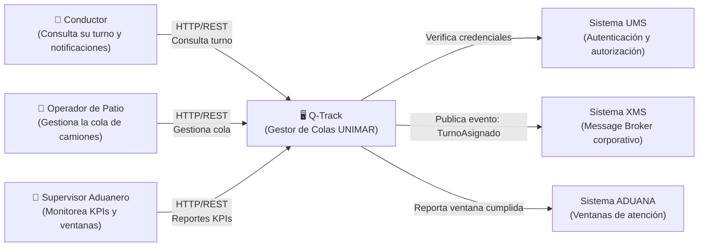
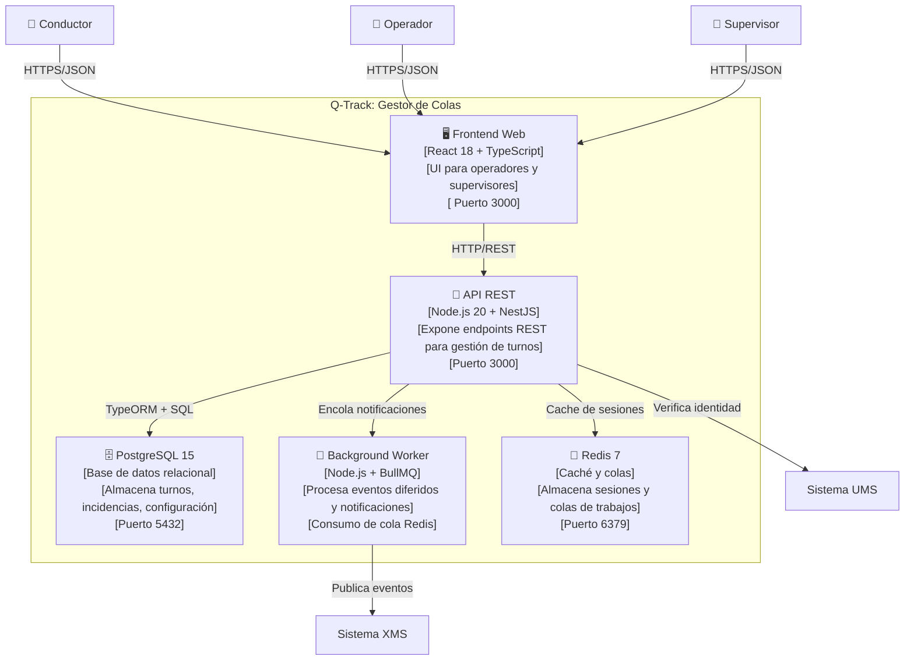

# Ejemplo Q-Track — Diagramas C4 (Contexto y Contenedores)

> **Módulo:** [2. Diseño y Arquitectura](../../artefactos/modulo-2.md) · **Tipo:** Diagramas de Arquitectura

Ejemplo completamente diligenciado de los diagramas C4 Nivel 1 y Nivel 2 para **Q-Track (Gestor de Colas de Camiones)**.

---

# Diagramas C4 — Q-Track: Gestor de Colas de Camiones

**Versión:** 1.0   **Fecha:** 2025-02-12   **Autor(es):** Alberto Arroyo, Jorge Salas

---

## Nivel 1: Diagrama de Contexto

[Diagrama que muestra Q-Track en el centro, con los actores (usuarios) y sistemas externos con los que interactúa.]



### Descripción de Elementos

| Elemento | Tipo | Descripción |
| :--- | :--- | :--- |
| Conductor | Usuario | Choferes de camiones que ingresan a los patios de UNIMAR. Necesitan saber su número de turno y cuándo serán atendidos. |
| Operador de Patio | Usuario | Personal de UNIMAR que registra camiones, avanza la cola y gestiona incidencias en tiempo real. |
| Supervisor Aduanero | Usuario | Responsable de cumplimiento de ventanas de aduana. Monitorea KPIs de tiempo de espera y throughput del patio. |
| UMS | Sistema Externo | Sistema corporativo de identidad. Provee autenticación SSO y gestión de roles para todos los sistemas de UNIMAR. |
| XMS | Sistema Externo | Message Broker corporativo basado en RabbitMQ. Distribuye eventos de turnos a sistemas downstream (SIL, MMS). |
| ADUANA | Sistema Externo | Sistema de la autoridad aduanera. Recibe notificaciones de ventanas cumplidas para evitar multas. |

---

## Nivel 2: Diagrama de Contenedores

[Diagrama que muestra los contenedores tecnológicos dentro de Q-Track: API, BD, Frontend, etc.]



### Descripción de Contenedores

| Contenedor | Tecnología | Responsabilidad |
| :--- | :--- | :--- |
| API REST | Node.js 20 + NestJS | Expone endpoints REST para CRUD de turnos, gestión de cola y reportes. Implementa reglas de negocio y validaciones. |
| PostgreSQL 15 | Base de datos relacional | Almacena persistente de turnos (número, estado, timestamps), incidencias, configuración de patios y usuarios. |
| Frontend Web | React 18 + TypeScript | Interfaz web responsive para operadores (gestión de cola) y supervisores (dashboard de KPIs). |
| Background Worker | Node.js + BullMQ | Procesa trabajos en segundo plano: envío de notificaciones, publicación de eventos a XMS, generación de reportes. |
| Redis 7 | Caché y colas | Almacena sesiones de usuarios en caché y gestiona colas de trabajos para el worker. |

---

## Flujos Principales del Sistema

### Flujo 1: Conductor consulta su turno

```
Conductor → Frontend → API → PostgreSQL → API → Frontend → Conductor
```

1. Conductor ingresa placa en el frontend
2. Frontend llama a `GET /turnos?placa=ABC-123`
3. API consulta PostgreSQL y retorna turno actual
4. Frontend muestra número de turno y tiempo estimado

### Flujo 2: Operador avanza la cola

```
Operador → Frontend → API → PostgreSQL → API → Worker → XMS
```

1. Operador presiona "Avanzar turno" en el frontend
2. Frontend llama a `PATCH /turnos/{id}/avanzar`
3. API actualiza estado en PostgreSQL
4. API encola evento "TurnoAvanzado" en Redis
5. Worker consume evento y publica a XMS para sistemas downstream

---

## Criterios de Aceptación de los Diagramas C4

- [x] C4 Nivel 1 con 3 actores (Conductor, Operador, Supervisor) y 3 sistemas externos (UMS, XMS, ADUANA)
- [x] C4 Nivel 2 con 5 contenedores tecnológicos (API, PostgreSQL, Frontend, Worker, Redis)
- [x] Ambos diagramas renderizables en GitHub sin errores de sintaxis Mermaid
- [x] Descripciones de elementos y contenedores completas
- [x] Revisado y aprobado por el facilitador (Alberto Arroyo, 2025-02-12)

---

*Ejemplo Q-Track generado bajo el estándar del corpus arquitectónico de UNIMAR · Idioma: Español · Versión: 1.0*
