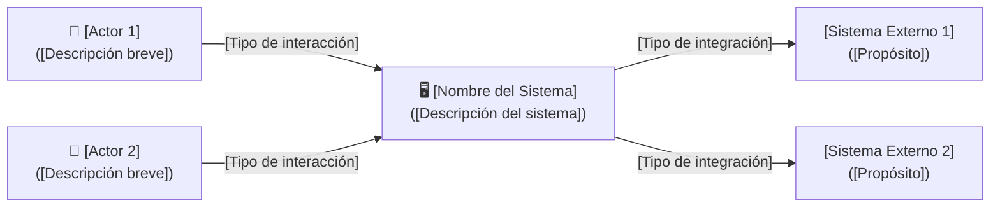
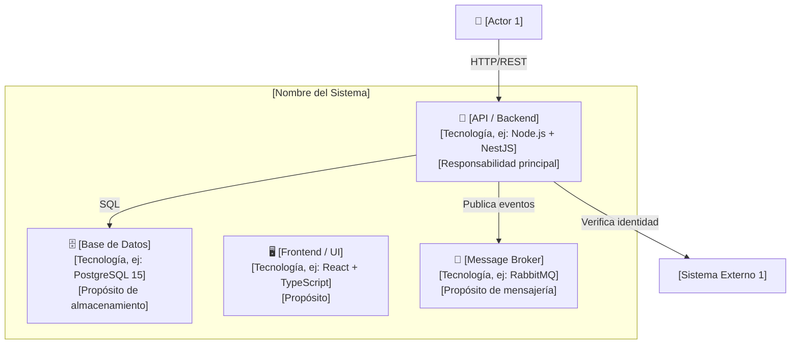

# Plantilla Vacía — Diagramas C4 (Contexto y Contenedores)

> **Módulo:** [2. Diseño y Arquitectura](../../artefactos/modulo-2.md) · **Tipo:** Diagramas de Arquitectura

Copia esta plantilla, completa los diagramas C4 Nivel 1 y Nivel 2 en Mermaid y commitéala al repositorio.

---

# Diagramas C4 — [Nombre del Sistema]

**Versión:** ___   **Fecha:** ___________   **Autor(es):** ___________

---

## Nivel 1: Diagrama de Contexto

[Diagrama que muestra el sistema en el centro, con los actores (usuarios) y sistemas externos con los que interactúa.]

### Descripción de Elementos

| Elemento | Tipo | Descripción |
| :--- | :--- | :--- |
| [Actor 1] | Usuario | [Quiénes son y qué necesitan del sistema] |
| [Actor 2] | Usuario | [Quiénes son y qué necesitan del sistema] |
| [Sistema Externo 1] | Sistema | [Qué sistema es y por qué se integra] |
| [Sistema Externo 2] | Sistema | [Qué sistema es y por qué se integra] |

---

## Nivel 2: Diagrama de Contenedores

[Diagrama que muestra los contenedores tecnológicos dentro del sistema: API, BD, Frontend, Message Broker, etc.]

### Descripción de Contenedores

| Contenedor | Tecnología | Responsabilidad |
| :--- | :--- | :--- |
| [API / Backend] | [ej: Node.js + NestJS] | [Qué hace este contenedor] |
| [Base de Datos] | [ej: PostgreSQL 15] | [Qué datos almacena] |
| [Frontend / UI] | [ej: React + TypeScript] | [Qué interfaz provee] |
| [Message Broker] | [ej: RabbitMQ] | [Qué eventos maneja] |

---

## Criterios de Aceptación de los Diagramas C4

- [ ] C4 Nivel 1 con al menos 2 actores y 2 sistemas externos identificados
- [ ] C4 Nivel 2 con al menos 3 contenedores tecnológicos
- [ ] Ambos diagramas renderizables en GitHub sin errores de sintaxis Mermaid
- [ ] Descripciones de elementos y contenedores completas
- [ ] Revisado y aprobado por el facilitador

---

*Plantilla generada bajo el estándar del corpus arquitectónico de UNIMAR · Idioma: Español · Versión: 1.0*
