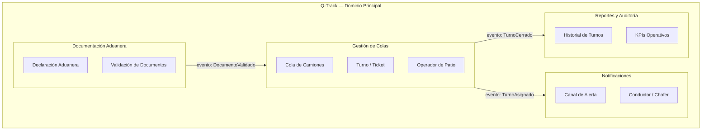

# Ejemplo Q-Track — Product Requirements Document (PRD)

> **Módulo:** [1. Requisitos y Producto](../../artefactos/modulo-1.md) · **Tipo:** Documento de Requisitos de Producto

Ejemplo completamente diligenciado del PRD para el proyecto **Q-Track (Gestor de Colas de Camiones)**.

---

# PRD — Q-Track: Gestor de Colas de Camiones

**Versión:** 1.0   **Fecha:** 2025-01-31   **Autor(es):** Alberto Arroyo, Jorge Salas (Procesos)
**Estado:** ☑ Aprobado

---

## 1. Visión del Producto

Q-Track es el sistema corporativo de UNIMAR para la gestión digital de colas de camiones en los patios aduaneros. Reemplaza el sistema manual (pizarras y llamadas por radio) con una plataforma REST que asigna turnos automáticamente, notifica a los conductores en tiempo real y genera reportes de KPIs operativos. El resultado transformador: los conductores saben exactamente cuándo y dónde presentarse, eliminando la incertidumbre y reduciendo el tiempo de espera en al menos un 40%.

---

## 2. Problema que Resuelve

Los patios Norte y Sur de UNIMAR gestionan entre 35 y 60 camiones diarios mediante pizarras físicas y llamadas por radio. El proceso produce:

- **87 minutos** de tiempo promedio de espera (línea base medida en enero 2025)
- **12 incidentes semanales** de turno perdido (camión no presentado en ventana de 30 min)
- **3 multas por semana** por incumplimiento de ventanas de aduana (costo: USD 450/semana en promedio)
- Incapacidad de los supervisores de ver el estado de la cola en tiempo real

---

## 3. Objetivos del Producto

| Objetivo | Métrica de éxito | Plazo |
| :--- | :--- | :--- |
| Reducir el tiempo de espera de camiones | Tiempo promedio de espera ≤ 50 min (reducción del 43%) | 2025-06-30 |
| Eliminar turnos perdidos | ≤ 2 incidentes de turno perdido por semana | 2025-06-30 |
| Reducir multas aduaneras | 0 multas por incumplimiento de ventana atribuibles al sistema de colas | 2025-06-30 |
| Adopción plena del equipo | ≥ 90% de operadores usando Q-Track vs. gestión manual | 2025-04-30 |

---

## 4. Usuarios y Roles

| Rol | Descripción | Necesidad principal |
| :--- | :--- | :--- |
| Conductor / Chofer | Transportista que ingresa al patio con su camión | Saber su número de turno y cuándo será llamado, sin depender del radio |
| Operador de Patio | Personal de UNIMAR que gestiona la cola de ingreso | Registrar camiones, avanzar turnos y cerrar incidencias rápidamente |
| Supervisor Aduanero | Responsable del cumplimiento de ventanas de aduana | Ver el estado de la cola en tiempo real y actuar ante cuellos de botella |
| Administrador del Sistema | Equipo de TI de UNIMAR | Gestionar accesos, configurar patios y monitorear la salud del sistema |

---

## 5. Bounded Contexts del Dominio

---

## 6. Alcance del Producto

**Incluido (Must Have — v1.0):**
- API REST para registro de ingreso de camiones y asignación de turno
- API REST para avance y cierre de turnos por el Operador
- Notificación al Conductor vía XMS (Message Broker existente) cuando su turno avanza
- Consulta de estado de turno por el Conductor (GET /turnos/{id})
- Dashboard básico de KPIs para el Supervisor (cola activa, tiempo promedio, incidencias)

**Fuera de Alcance:**
- Frontend / UI de Q-Track — la interfaz gráfica es un proyecto independiente posterior al coaching
- Integración con el sistema de facturación de UNIMAR — fuera del dominio de colas
- Migración de datos históricos de turnos del sistema legacy — costo/beneficio no justificado
- Soporte multi-empresa — Q-Track v1.0 es exclusivo para UNIMAR

---

## 7. Restricciones y Supuestos

| Tipo | Descripción |
| :--- | :--- |
| Restricción técnica | El sistema debe usar PostgreSQL como BD de persistencia (ADR-001) |
| Restricción técnica | El broker de mensajería es XMS (sistema UNIMAR existente) — no se cambia |
| Restricción de seguridad | Autenticación delegada al sistema UMS corporativo (OAuth2) |
| Supuesto de negocio | Los conductores tienen un número de teléfono registrado en el sistema UMS |
| Supuesto de negocio | Los Operadores de Patio tienen dispositivos con acceso a la red corporativa |
| Dependencia externa | XMS (Message Broker) debe estar disponible para las notificaciones — SLA 99.5% |

---

## 8. Criterios de Aceptación del PRD

- [x] Todas las secciones completadas sin campos vacíos
- [x] 4 Bounded Contexts identificados con diagrama Mermaid (Gestión de Colas, Documentación, Notificaciones, Reportes)
- [x] Objetivos con métrica medible y plazo definido (4 KPIs con baseline y target)
- [x] Revisado y aprobado por el facilitador en sesión del 2025-01-31

---

*Ejemplo Q-Track generado bajo el estándar del corpus arquitectónico de UNIMAR · Idioma: Español · Versión: 1.0*
