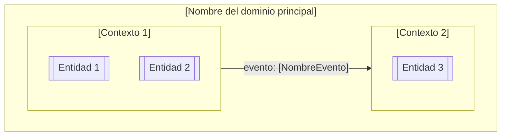

# Plantilla Vacía — Product Requirements Document (PRD)

> **Módulo:** [1. Requisitos y Producto](../../artefactos/modulo-1.md) · **Tipo:** Documento de Requisitos de Producto

Copia esta plantilla, completa cada sección y commitéala al repositorio antes de iniciar el Módulo 2.

---

# PRD — [Nombre del Producto]

**Versión:** ___   **Fecha:** ___________   **Autor(es):** ___________
**Estado:** ☐ Borrador · ☐ En revisión · ☐ Aprobado

---

## 1. Visión del Producto

[En 2-4 oraciones: ¿qué es el producto, a quién sirve y cuál es el resultado transformador que produce para la organización?]

---

## 2. Problema que Resuelve

[Describir el dolor concreto y medible que existe hoy sin este producto. Incluir datos cuantitativos si están disponibles.]

---

## 3. Objetivos del Producto

| Objetivo | Métrica de éxito | Plazo |
| :--- | :--- | :--- |
| [Objetivo 1] | [Cómo se mide] | [Fecha] |
| [Objetivo 2] | | |
| [Objetivo 3] | | |

---

## 4. Usuarios y Roles

| Rol | Descripción | Necesidad principal |
| :--- | :--- | :--- |
| [Rol 1] | [Descripción del usuario] | [Qué necesita del producto] |
| [Rol 2] | | |

---

## 5. Bounded Contexts del Dominio

[Insertar diagrama Mermaid con los contextos identificados]

---

## 6. Alcance del Producto

**Incluido (Must Have):**
- [Funcionalidad 1]
- [Funcionalidad 2]

**Fuera de Alcance:**
- [Funcionalidad excluida 1 — razón]
- [Funcionalidad excluida 2 — razón]

---

## 7. Restricciones y Supuestos

| Tipo | Descripción |
| :--- | :--- |
| Restricción técnica | [Tecnología obligatoria / prohibida] |
| Supuesto de negocio | [Condición que se asume verdadera] |
| Dependencia externa | [Sistema o equipo del que depende] |

---

## 8. Criterios de Aceptación del PRD

- [ ] Todas las secciones completadas sin campos vacíos
- [ ] Al menos 3 Bounded Contexts identificados con diagrama Mermaid
- [ ] Objetivos con métrica medible y plazo definido
- [ ] Revisado y aprobado por el facilitador del programa

---

*Plantilla generada bajo el estándar del corpus arquitectónico de UNIMAR · Idioma: Español · Versión: 1.0*
