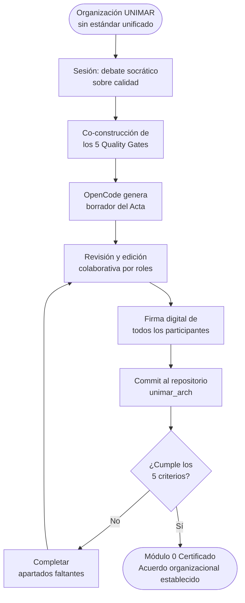

# Ejemplo Q-Track — Módulo 0: Visión, Gates y Kick-off

> **Ruta:** [Plan de Implementación](../../plan-implementacion-arquitectura.md) → [Hub Módulo 0](../hubs/modulo-0.md) → [Plantilla](./modulo-0-template.md) → Ejemplo Q-Track

Sesión real completamente diligenciada usando el proyecto **Q-Track (Gestor de Colas de Camiones)** como caso de referencia.

---

# Sesión: Módulo 0 — Visión, Gates y Kick-off

**Fecha:** 2025-01-20 (Día 1) / 2025-01-21 (Día 2)   **Hora:** 09:00   **Duración:** 1.5 h (Teoría) + 2 h (Taller de redacción)
**Facilitador:** Alberto Arroyo   **Participantes:** Gerencia General, Procesos, Desarrollo, QA, Infraestructura

---

## Propósito de la Sesión

Alinear a toda la organización UNIMAR bajo el Manifiesto de Ingeniería antes de iniciar la construcción de Q-Track. Al finalizar, todos los participantes comparten la misma definición de calidad y los mismos umbrales de los Quality Gates corporativos, plasmados en un Acta de Kick-off firmada que es la evidencia formal de que la organización se comprometió con el estándar antes de iniciar la construcción.

---

## Pre-work Obligatorio

- [x] Leer [Manifiesto de Ingeniería UNIMAR](../../../../reference/governance/standards/engineering/manifiesto-ingenieria.md) — 15 min
- [x] Revisar los [5 Quality Gates corporativos](../../../../reference/governance/sdlc/gates-calidad.es.md)
- [x] Tener VS Code y Git instalados (completado en el Módulo Base)
- [x] Tener acceso al repositorio `unimar_arch` con permisos de escritura verificados

---

## Agenda

| Bloque | Actividad | Duración | Prompt IA |
| :--- | :--- | :--- | :--- |
| 1 | Apertura: "El costo del desorden" — 2 casos reales de UNIMAR (rollbacks, pérdida de trazabilidad) | 15 min | — |
| 2 | Presentación del Manifiesto de Ingeniería UNIMAR (lectura guiada por secciones) | 20 min | [Prompt 1: Resumir Manifiesto](../prompts/modulo-0-prompts.md#prompt-1-resumir-manifiesto) |
| 3 | Debate socrático: ¿Qué es calidad para nosotros? (pizarra colaborativa en Miro) | 30 min | [Prompt 2: Facilitar Debate](../prompts/modulo-0-prompts.md#prompt-2-facilitar-debate) |
| 4 | Presentación formal de los 5 Quality Gates + discusión de umbrales numéricos | 15 min | [Prompt 3: Explicar Quality Gates](../prompts/modulo-0-prompts.md#prompt-3-explicar-quality-gates) |
| 5 | Q&A y distribución de la Plantilla de Acta para pre-lectura | 10 min | — |
| — | BREAK | 15 min | — |
| 6 | OpenCode genera borrador del Acta de Kick-off en vivo (demostración) | 20 min | [Prompt 4: Generar Acta](../prompts/modulo-0-prompts.md#prompt-4-generar-acta) |
| 7 | Revisión crítica del borrador — el equipo señala qué ajustar, qué falta, qué sobra | 15 min | [Prompt 5: Revisar Acta](../prompts/modulo-0-prompts.md#prompt-5-revisar-acta) |
| 8 | Redacción colaborativa por secciones: cada rol completa la suya | 45 min | — |
| 9 | Commit del Acta al repositorio y apertura del PR | 15 min | [Prompt 6: Generar Comandos Git](../prompts/modulo-0-prompts.md#prompt-6-generar-comandos-git) |
| 10 | Verificación del Quality Gate + firma digital + merge | 20 min | — |

---

## Entregable de la Sesión (Quality Gate)

- **Qué debe producir el equipo:** Acta de Kick-off commiteada en el repositorio bajo `docs/planning-artifacts/actas/kick-off-q-track.md` con todas las secciones completas.
- **Criterios de aceptación (los 5 deben cumplirse):**
  - [x] Acta con firmas digitales (Git `user.name` en el commit) de todos los participantes
  - [x] Sección "Métricas de Éxito" con al menos 3 KPIs concretos y medibles
  - [x] Sección "Gates Aceptados" con firma de cada rol representado
  - [x] Cronograma de módulos enlazado desde el Acta al Gantt del repositorio
  - [x] Al menos 1 riesgo con mitigador completo documentado en sección "Riesgos"
- **Forma de entrega:** Pull Request: `feature/kick-off-q-track` → `develop`, con enlace compartido en el chat de Teams.
- **Regla de oro:** No se inicia el Módulo 1 sin el Acta firmada y commiteada al repositorio. Sin patrocinio de Gerencia documentado, el programa no existe formalmente.

---

## Recursos y Herramientas

| Herramienta | Propósito | Enlace |
| :--- | :--- | :--- |
| Manifiesto de Ingeniería UNIMAR | Marco normativo base del debate | [reference/governance/standards/engineering/manifiesto-ingenieria.md](../../../../reference/governance/standards/engineering/manifiesto-ingenieria.md) |
| Miro / Microsoft Whiteboard | Pizarra colaborativa del debate socrático | [https://miro.com](https://miro.com) |
| OpenCode | Generación del borrador del Acta en vivo | Intranet UNIMAR |
| Microsoft Teams | Grabación de la sesión teórica | Intranet UNIMAR |
| Repositorio unimar_arch | Destino del Acta comprometida | [GitHub](https://github.com/mhernandez-unimar/unimar_arch) |

---

## Diagrama — Flujo del Kick-off al Contrato Formal

---

## Notas del Facilitador

- El debate socrático es el corazón de la sesión. No apresurarlo; 30 minutos es el mínimo necesario para generar apropiación real. Si el equipo no llega a consenso, no imponer — facilitar una votación ponderada y documentar las posiciones minoritarias.
- Tener preparados 2-3 casos de incidentes reales de UNIMAR (anonimizados) para la apertura. El impacto emocional de ejemplos reales es el argumento más efectivo para generar compromiso con el estándar.
- El Acta generada por OpenCode es solo un punto de partida. Si el equipo la acepta sin modificaciones sustanciales, hay un problema de participación que debe abordarse antes de continuar.
- Asegurar que Gerencia firme el Acta. Sin esa firma, el programa no tiene patrocinio ejecutivo y los módulos posteriores carecen de respaldo institucional.

---

## Evidencias de Certificación

- [x] Acta en `docs/planning-artifacts/actas/kick-off-q-track.md` — todas las secciones completas
- [x] Firmas digitales (commits) de cada rol: Gerencia, Procesos, Desarrollo, QA, Infra
- [x] PR: `feature/kick-off-q-track` → `develop`, estado: **Merged**
- [x] Grabación de la sesión teórica en Teams — enlace en el comentario del PR

---

*Documento generado bajo el estándar del corpus arquitectónico de UNIMAR · Idioma: Español · Versión: 1.0*
