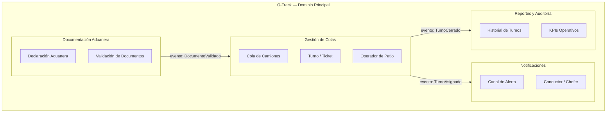

# Ejemplo Q-Track — Módulo 1: Requisitos y Producto

> **Ruta:** [Plan de Implementación](../../plan-implementacion-arquitectura.md) → [Hub Módulo 1](../hubs/modulo-1.md) → [Plantilla](./modulo-1-template.md) → Ejemplo Q-Track

Sesión real completamente diligenciada usando el proyecto **Q-Track (Gestor de Colas de Camiones)** como caso de referencia.

---

# Sesión: Módulo 1 — Requisitos y Producto (PRD + Backlog BDD)

**Fecha:** 2025-01-27 al 2025-01-31   **Duración:** 1 semana (1 sesión teórica + 2 talleres)
**Facilitador:** Alberto Arroyo   **Participantes:** Procesos, Desarrollo, QA

---

## Propósito de la Sesión

Transformar la visión acordada en el Kick-off en contratos de software formales para Q-Track. Al finalizar, el equipo contará con un PRD validado con Bounded Contexts del dominio logístico aduanero de UNIMAR y un Backlog Ágil con 10+ historias en formato BDD priorizadas por valor de negocio. Estos artefactos son el insumo que hace posible el diseño técnico del Módulo 2 y la construcción del Módulo 3.

---

## Pre-work Obligatorio

- [x] Leer [Q-Track Baseline](../q-truck-baseline.md) — 30 min
- [x] Revisar el Acta de Kick-off del Módulo 0 (comprender los KPIs y Gates acordados)
- [x] Leer introducción a Domain-Driven Design: [https://www.domainlanguage.com/ddd/reference/](https://www.domainlanguage.com/ddd/reference/)
- [x] Leer introducción a BDD Gherkin: [https://cucumber.io/docs/gherkin/](https://cucumber.io/docs/gherkin/)

---

## Agenda

| Bloque | Actividad | Duración | Prompt IA |
| :--- | :--- | :--- | :--- |
| 1 | Apertura: ¿Qué pasa cuando construimos sin PRD? (caso real UNIMAR) | 15 min | — |
| 2 | Teoría: PRD, Bounded Contexts y BDD en el contexto logístico aduanero | 45 min | [Prompt 1: Explicar Bounded Contexts](../prompts/modulo-1-prompts.md#prompt-1-explicar-bounded-contexts) |
| 3 | Agente John (PM) genera borrador del PRD de Q-Track en vivo (OpenCode) | 20 min | [Prompt 3: Generar PRD](../prompts/modulo-1-prompts.md#prompt-3-generar-prd) |
| 4 | Q&A y distribución de la Plantilla de PRD | 10 min | — |
| — | BREAK | 15 min | — |
| 5 | Facilitador mapea Bounded Contexts de Q-Track en Mermaid (en vivo) | 30 min | [Prompt 2: Identificar Contextos](../prompts/modulo-1-prompts.md#prompt-2-identificar-contextos) |
| 6 | Identificación de entidades: Camión, Cola, Turno, Documento Aduanero, Operador | 20 min | — |
| — | BREAK 15 min | 15 min | — |
| 7 | Equipos mapean sus propios Bounded Contexts (grupos de 2-3) | 60 min | — |
| 8 | Consolidación del mapa de contextos del grupo | 30 min | — |
| — | SIGUIENTE SESIÓN | — | — |
| 9 | Redacción del PRD sección por sección (cada rol completa la suya) | 60 min | [Prompt 3: Generar PRD](../prompts/modulo-1-prompts.md#prompt-3-generar-prd) |
| 10 | Escritura del Backlog BDD: 10+ historias con Given / When / Then | 60 min | [Prompt 4: Generar Historias BDD](../prompts/modulo-1-prompts.md#prompt-4-generar-historias-bdd) |
| 11 | Priorización con MoSCoW + justificación documentada | 30 min | [Prompt 5: Priorizar MoSCoW](../prompts/modulo-1-prompts.md#prompt-5-priorizar-moscow) |
| 12 | Commit + PR + revisión cruzada | 30 min | [Prompt 6: Validar PRD](../prompts/modulo-1-prompts.md#prompt-6-validar-prd) |

---

## Entregable de la Sesión (Quality Gate)

- **Qué debe producir el equipo:**
  1. PRD de Q-Track en `docs/planning-artifacts/prd-q-track.md`
  2. Backlog Ágil en `docs/planning-artifacts/backlog-q-track.md`
- **Criterios de aceptación (los 5 deben cumplirse):**
  - [x] PRD con secciones: Visión, Problema, Objetivos, Usuarios, Alcance, Fuera de Alcance
  - [x] Al menos 3 Bounded Contexts documentados con diagrama Mermaid
  - [x] Backlog con mínimo 10 historias en formato `Given / When / Then` verificables
  - [x] Historias priorizadas con MoSCoW y justificación por cada Must Have
  - [x] PR aprobado por el facilitador con al menos 1 comentario técnico resuelto
- **Forma de entrega:** Pull Request: `feature/prd-backlog-q-track` → `develop`
- **Regla de oro:** No se inicia el Módulo 2 sin PRD aprobado. No se diseña lo que no está definido como requisito.

---

## Recursos y Herramientas

| Herramienta | Propósito | Enlace |
| :--- | :--- | :--- |
| Agente John (PM) — BMAD | Generación del borrador de PRD | `bmad-agent-pm` en OpenCode |
| Q-Track Baseline | Documento fuente de requisitos | `coaching-arquitectura/q-truck-baseline.md` |
| DDD Reference | Referencia de Bounded Contexts | [domainlanguage.com](https://www.domainlanguage.com/ddd/reference/) |
| BDD Gherkin | Referencia de Given/When/Then | [cucumber.io](https://cucumber.io/docs/gherkin/) |
| Excalidraw | Mapeo visual de contextos | [excalidraw.com](https://excalidraw.com/) |
| OpenCode | IA corporativa en VS Code | Intranet UNIMAR |

---

## Ejemplo de Historias BDD — Q-Track

**Historia 1 — Asignación de turno a un camión:**

> **Dado que** el Operador de Patio tiene sesión iniciada en Q-Track
> **Y** existe una cola activa para el patio Norte
> **Cuando** el Operador registra el ingreso del camión con placa ABC-123
> **Entonces** el sistema asigna automáticamente el número de turno T-042
> **Y** el Conductor recibe una notificación con su número de turno
> **Y** el turno queda en estado PENDIENTE en la cola

**Historia 2 — Rechazo de avance de turno cerrado:**

> **Dado que** el turno T-041 está en estado CERRADO
> **Cuando** el Operador intenta avanzar el turno T-041
> **Entonces** el sistema rechaza la operación con el mensaje "Turno cerrado, no se puede modificar"
> **Y** el turno permanece en estado CERRADO sin cambios

---

## Diagrama — Bounded Contexts de Q-Track

---

## Notas del Facilitador

- El Agente John puede generar un PRD muy genérico. El valor pedagógico está en que el equipo lo critique y lo adapte al contexto logístico aduanero de UNIMAR.
- Insistir en que las historias BDD usen verbos de negocio, no términos técnicos. MAL: `Dado que el endpoint POST /turnos está activo` → BIEN: `Dado que el Operador tiene sesión iniciada`.
- El mapa de Bounded Contexts suele generar el debate más rico del módulo. Reservar tiempo extra si se extiende; es señal de que el equipo está pensando en el dominio correctamente.

---

## Evidencias de Certificación

- [x] PRD en `docs/planning-artifacts/prd-q-track.md` con todas las secciones
- [x] Backlog en `docs/planning-artifacts/backlog-q-track.md` con 10+ historias BDD
- [x] Diagrama Mermaid de Bounded Contexts renderizable en GitHub sin errores de sintaxis
- [x] PR: `feature/prd-backlog-q-track` → `develop`, estado: **Merged**

---

*Documento generado bajo el estándar del corpus arquitectónico de UNIMAR · Idioma: Español · Versión: 1.0*
