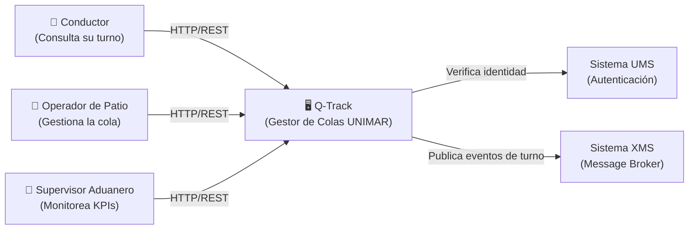

# Ejemplo Q-Track — Módulo 2: Diseño y Arquitectura

> **Ruta:** [Plan de Implementación](../../plan-implementacion-arquitectura.md) → [Hub Módulo 2](../hubs/modulo-2.md) → [Plantilla](./modulo-2-template.md) → Ejemplo Q-Track

Sesión real completamente diligenciada usando el proyecto **Q-Track (Gestor de Colas de Camiones)** como caso de referencia.

---

# Sesión: Módulo 2 — Diseño y Arquitectura (ADR + C4)

**Fecha:** 2025-02-03 al 2025-02-13   **Duración:** 2 semanas (1 sesión teórica + 3 talleres)
**Facilitador:** Alberto Arroyo   **Participantes:** Desarrollo, Arquitectura, QA

---

## Propósito de la Sesión

Traducir el PRD y Backlog de Q-Track en un modelo técnico formal que gobierne todas las decisiones de implementación. Al finalizar, el equipo contará con un ADR de Persistencia aprobado —debatido por los agentes Winston (Arquitecto) y Amelia (Desarrolladora) con alternativas explícitamente rechazadas— y diagramas C4 Nivel 1 y 2 en Mermaid que se convierten en el contrato técnico que todos los desarrolladores respetan durante el Módulo 3.

---

## Pre-work Obligatorio

- x] Leer al menos 2 ADRs completos en [reference/architecture/adrs/
- [x] Revisar el PRD y Backlog validados del Módulo 1
- [x] Leer introducción al modelo C4: [https://c4model.com/](https://c4model.com/)
- [x] Leer sobre Arquitectura Hexagonal: [https://alistair.cockburn.us/hexagonal-architecture/](https://alistair.cockburn.us/hexagonal-architecture/)

---

## Agenda

| Bloque | Actividad | Duración | Prompt IA |
| :--- | :--- | :--- | :--- |
| 1 | Teoría: ¿Qué es un ADR y cuándo se escribe? (ADR real del repo como ejemplo) | 15 min | [Prompt 1: Explicar ADRs](../prompts/modulo-2-prompts.md#prompt-1-explicar-adrs) |
| 2 | El modelo C4: Nivel 1 (Contexto) y Nivel 2 (Contenedores) explicados | 25 min | [Prompt 2: Explicar C4](../prompts/modulo-2-prompts.md#prompt-2-explicar-c4) |
| 3 | Arquitectura Hexagonal de Q-Track: dominio vs. infraestructura | 20 min | [Prompt 3: Explicar Hexagonal](../prompts/modulo-2-prompts.md#prompt-3-explicar-hexagonal) |
| 4 | Presentación del debate Winston (Arquitecto) vs. Amelia (Dev) | 10 min | — |
| — | BREAK | 10 min | — |
| 5 | Winston propone arquitectura de persistencia para Q-Track (OpenCode en vivo) | 15 min | [Prompt 4: Winston Propuesta](../prompts/modulo-2-prompts.md#prompt-4-winston-propuesta) |
| 6 | Amelia critica la propuesta desde perspectiva de implementación (OpenCode) | 15 min | [Prompt 5: Amelia Crítica](../prompts/modulo-2-prompts.md#prompt-5-amelia-crítica) |
| 7 | Debate colectivo: el equipo evalúa ambas perspectivas y argumentos | 30 min | — |
| 8 | Votación y decisión colectiva documentada | 20 min | — |
| — | BREAK 15 min | 15 min | — |
| 9 | Redacción del ADR sección por sección (en grupo) | 60 min | [Prompt 6: Generar ADR](../prompts/modulo-2-prompts.md#prompt-6-generar-adr) |
| 10 | Construcción del C4 Nivel 1 en Mermaid (individual → consolidación) | 60 min | [Prompt 7: Generar C4 N1](../prompts/modulo-2-prompts.md#prompt-7-generar-c4-n1) |
| 11 | Construcción del C4 Nivel 2 en Mermaid | 60 min | [Prompt 8: Generar C4 N2](../prompts/modulo-2-prompts.md#prompt-8-generar-c4-n2) |
| 12 | Revisión cruzada de ADR y C4 + commit + PR | 30 min | — |

---

## Entregable de la Sesión (Quality Gate)

- **Qué debe producir el equipo:**
  1. ADR de Persistencia en `reference/architecture/adrs/adr-001-persistencia-q-track.md`
  2. Documento de arquitectura con C4 N1 y N2 en `docs/planning-artifacts/arquitectura-q-track.md`
- **Criterios de aceptación (los 5 deben cumplirse):**
  - [x] ADR con secciones: Contexto, Decisión, Consecuencias, Alternativas Rechazadas
  - [x] Al menos 1 alternativa técnica rechazada con justificación de negocio documentada
  - [x] Diagrama C4 Nivel 1 renderizable en GitHub (actores + sistema Q-Track + sistemas externos)
  - [x] Diagrama C4 Nivel 2 renderizable en GitHub (API, BD, Broker, Frontend identificados)
  - [x] PR aprobado por el facilitador con comentarios técnicos resueltos
- **Forma de entrega:** Pull Request: `feature/arquitectura-q-track` → `develop`
- **Regla de oro:** No se escribe código en el Módulo 3 de componentes sin ADR o C4 aprobado. La arquitectura documentada es el contrato —no una sugerencia.

---

## Recursos y Herramientas

| Herramienta | Propósito | Enlace |
| :--- | :--- | :--- |
| Agente Winston (Arquitecto) | Propuesta de arquitectura con perspectiva de diseño | `bmad-agent-architect` en OpenCode |
| Agente Amelia (Dev) | Crítica con perspectiva de implementación real | `bmad-agent-dev` en OpenCode |
| ADRs existentes | Referencia de formato y nivel de detalle | `reference/architecture/adrs/` |
| Modelo C4 | Referencia oficial del framework | [c4model.com](https://c4model.com/) |
| Mermaid.js | Renderizado de diagramas en GitHub | [mermaid.js.org](https://mermaid.js.org/) |
| Arquitectura Hexagonal | Referencia del patrón | [alistair.cockburn.us](https://alistair.cockburn.us/hexagonal-architecture/) |

---

## Diagrama — C4 Nivel 1: Contexto del Sistema Q-Track

---

## Notas del Facilitador

- El debate entre Winston y Amelia debe sentirse como un debate real con perspectivas genuinamente diferentes. El facilitador puede hacer preguntas provocadoras: "¿Qué pasa si en 6 meses necesitamos escalar Q-Track a 5 patios simultáneos?"
- Los diagramas C4 en Mermaid son el aprendizaje más desafiante técnicamente para roles no-dev. Preparar una guía rápida de sintaxis Mermaid para los talleres.
- El ADR debe quedar en `reference/architecture/adrs/` (corpus de referencia), NO en `docs/`. Esta distinción entre las dos capas documentales es crítica para mantener la integridad arquitectónica del repositorio.
- Verificar que los bloques Mermaid rendericen correctamente en GitHub antes del merge — usar el validador de `validate-docs.mjs`.

---

## Evidencias de Certificación

- [x] ADR en `reference/architecture/adrs/adr-001-persistencia-q-track.md` completo
- [x] C4 N1 y N2 en Mermaid, renderizables en GitHub sin errores de sintaxis
- [x] Al menos 1 alternativa rechazada con justificación de negocio en el ADR
- [x] PR: `feature/arquitectura-q-track` → `develop`, estado: **Merged**

---

*Documento generado bajo el estándar del corpus arquitectónico de UNIMAR · Idioma: Español · Versión: 1.0*
