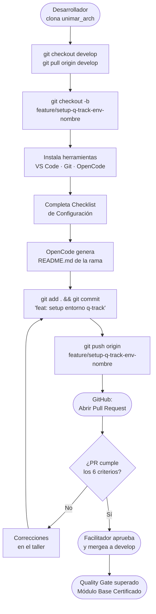

# Ejemplo Q-Track — Módulo Base: Bootcamp SDLC

> **Ruta:** [Plan de Implementación](../../plan-implementacion-arquitectura.md) → [Hub Módulo Base](../hubs/modulo-base.md) → [Plantilla](./modulo-base-template.md) → Ejemplo Q-Track

Sesión real completamente diligenciada usando el proyecto **Q-Track (Gestor de Colas de Camiones)** como caso de referencia.

---

# Sesión: Módulo Base — Bootcamp SDLC (Entorno, GitFlow e IA)

**Fecha:** 2025-01-08 / 2025-01-09 / 2025-01-13   **Hora:** 09:00   **Duración:** 1.5 h (Teoría) + 2 × 3 h (Talleres)
**Facilitador:** Alberto Arroyo   **Participantes:** Equipo completo UNIMAR — Desarrollo, QA, Procesos, Infraestructura

---

## Propósito de la Sesión

Garantizar que cada integrante del equipo parta desde un entorno técnico idéntico y estandarizado antes de iniciar la construcción de Q-Track. Sin este baseline común, cada participante operaría desde una configuración distinta, generando fricción técnica que contamina la calidad de los entregables de todos los módulos posteriores. Al finalizar, todo el equipo puede colaborar bajo el estándar de versionado de UNIMAR y cada commit futuro es un artefacto trazable, revisable y auditable.

---

## Pre-work Obligatorio

- [x] Leer [Manifiesto de Ingeniería UNIMAR](../../../../reference/governance/standards/engineering/manifiesto-ingenieria.md) — 15 min
- [x] Revisar los [5 Quality Gates corporativos](../../../../reference/governance/sdlc/gates-calidad.es.md)
- [x] Descargar e instalar VS Code desde [https://code.visualstudio.com/](https://code.visualstudio.com/)
- [x] Instalar Git y verificar con `git --version`
- [x] Crear cuenta GitHub con correo corporativo (@unimar.com.pe)

---

## Agenda

| Bloque | Actividad | Duración | Prompt IA |
| :--- | :--- | :--- | :--- |
| 1 | Apertura: "El costo del caos sin estándar" — 2 casos reales de UNIMAR con rollbacks | 10 min | [Prompt 1: Casos de Caos Técnico](../prompts/modulo-base-prompts.md#prompt-1-casos-de-caos-técnico) |
| 2 | Marco teórico GitFlow: ramas main, develop, feature/, release/, hotfix/ | 20 min | [Prompt 2: Explicar GitFlow](../prompts/modulo-base-prompts.md#prompt-2-explicar-gitflow) |
| 3 | Introducción a OpenCode y BMAD: demo de generación de README.md en vivo | 25 min | [Prompt 3: Demo BMAD](../prompts/modulo-base-prompts.md#prompt-3-demo-bmad) |
| 4 | Q&A + distribución de la Checklist de Configuración | 15 min | — |
| — | BREAK (entre sesión teórica y Taller 1) | — | — |
| 5 | Facilitador instala en vivo: VS Code + extensiones + Git + clon del repositorio | 30 min | [Prompt 4: Checklist de Instalación](../prompts/modulo-base-prompts.md#prompt-4-checklist-de-instalación) |
| 6 | Creación de rama `feature/setup-q-track-env-[nombre]` (cada participante) | 15 min | — |
| 7 | OpenCode genera `README.md` de la rama (práctica guiada) | 20 min | [Prompt 5: Generar README](../prompts/modulo-base-prompts.md#prompt-5-generar-readme) |
| 8 | Primer commit y push al repositorio | 10 min | — |
| — | BREAK 15 min (a los 90 min del taller) | 15 min | — |
| 9 | Completar Checklist de Configuración y añadirla a la rama | 45 min | [Prompt 6: Verificar Configuración](../prompts/modulo-base-prompts.md#prompt-6-verificar-configuración) |
| 10 | Abrir Pull Request en GitHub (título + descripción + capturas de evidencia) | 30 min | — |
| 11 | Code Review cruzado: revisar el PR de un compañero (mínimo 2 comentarios) | 30 min | — |
| 12 | Verificación del Quality Gate + merge oficial a develop | 25 min | — |

---

## Entregable de la Sesión (Quality Gate)

- **Qué debe producir el participante:** Pull Request en GitHub con la rama `feature/setup-q-track-env-[nombre]` mergeada a `develop`, con la Checklist de Configuración completada adjunta y el `README.md` generado por OpenCode.
- **Criterios de aceptación (los 6 deben cumplirse simultáneamente):**
  - [x] VS Code con OpenCode, GitLens y Markdownlint activos (captura del panel de extensiones)
  - [x] `git config --list` con `user.name` y `user.email` corporativos
  - [x] `git log --oneline -5` mostrando rama `develop` actualizada
  - [x] Rama `feature/setup-q-track-env-[nombre]` visible en GitHub
  - [x] PR abierto con Checklist completada y aprobado por el facilitador
  - [x] PR mergeado a `develop` sin conflictos
- **Forma de entrega:** Pull Request en el repositorio del equipo, enlace compartido en el chat de Teams.
- **Regla de oro:** No se avanza al Módulo 0 si cualquiera de los 6 criterios está incompleto. El participante repite el taller hasta certificarse.

---

## Recursos y Herramientas

| Herramienta | Propósito | Enlace |
| :--- | :--- | :--- |
| VS Code | Editor principal de desarrollo | [https://code.visualstudio.com/](https://code.visualstudio.com/) |
| Git CLI | Control de versiones | [https://git-scm.com/downloads](https://git-scm.com/downloads) |
| GitHub Desktop | Cliente visual Git (roles no técnicos) | [https://desktop.github.com/](https://desktop.github.com/) |
| OpenCode | IA corporativa BMAD en VS Code | Intranet UNIMAR |
| GitLens | Historial y autoría en VS Code | [Marketplace VS Code](https://marketplace.visualstudio.com/items?itemName=eamodio.gitlens) |
| Markdownlint | Validación de Markdown en VS Code | [Marketplace VS Code](https://marketplace.visualstudio.com/items?itemName=DavidAnson.vscode-markdownlint) |
| Node.js | Ejecución de scripts de validación | [https://nodejs.org/](https://nodejs.org/) |
| Repositorio unimar_arch | Corpus arquitectónico corporativo | [GitHub](https://github.com/mhernandez-unimar/unimar_arch) |
| Referencia GitFlow | Estrategia de ramas corporativa | [nvie.com](https://nvie.com/posts/a-successful-git-branching-model/) |

---

## Diagrama Conceptual — Flujo del Commit Local al PR Exitoso

---

## Notas del Facilitador

- Tener el entorno limpio antes de la sesión para demostrar la instalación desde cero. La demostración en vivo de una instalación limpia es el momento pedagógico más poderoso de este módulo.
- Anticipar que participantes con máquinas corporativas con antivirus pueden tardar más en instalar. Tener la extensión de OpenCode lista para instalar manualmente si el marketplace de VS Code está bloqueado.
- Si alguien no supera el Quality Gate en el taller, agendar sesión de recuperación individual de máximo 1 hora antes de avanzar al Módulo 0.
- Grabar la sesión teórica en Microsoft Teams para onboarding de futuros ingresos al equipo.

---

## Evidencias de Certificación

- [x] Captura del panel de extensiones VS Code (OpenCode, GitLens, Markdownlint en verde)
- [x] Salida de `git config --list` con nombre y correo corporativos
- [x] PR en GitHub: `feature/setup-q-track-env-[nombre]` → `develop`, estado: **Merged**
- [x] `git log --oneline -5` en rama `develop` mostrando merge exitoso
- [x] Grabación de la sesión teórica en Teams (enlace en comentario del PR)

---

*Documento generado bajo el estándar del corpus arquitectónico de UNIMAR · Idioma: Español · Versión: 1.0*
