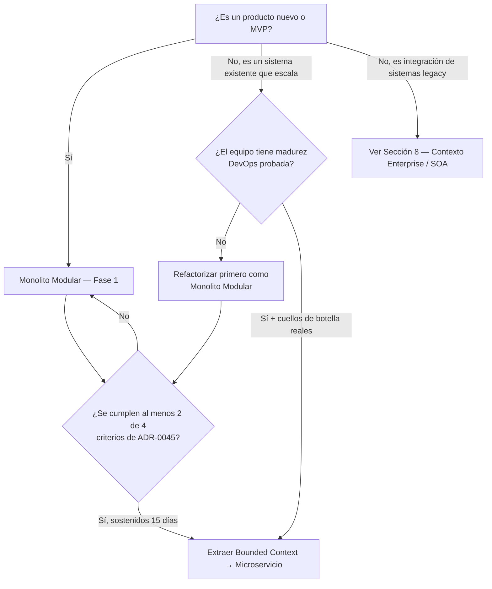
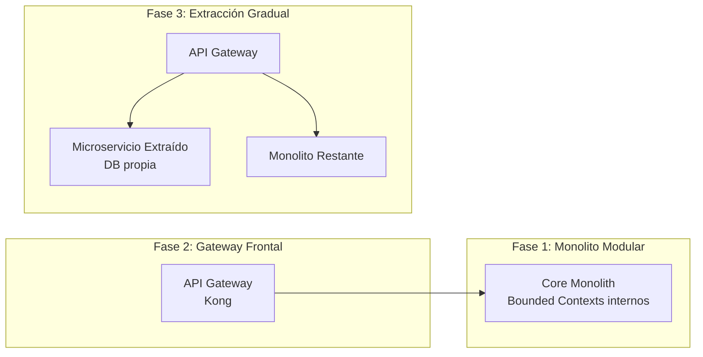

# [ADR 0047](0047-patrones-arquitectonicos-monolito-soa-microservicios.es.md): Marco de Evolución Arquitectónica Progresiva: Monolito Modular → Microservicios

## 1. Metadata
* **ADR ID:** 0047
* **Título:** Marco de Evolución Arquitectónica Progresiva: Monolito Modular → Microservicios
* **Estado:** Aprobado
* **Autores:** Oficina de Arquitectura Enterprise
* **Revisores:** Junta Arquitectónica Corporativa, Oficina del CTO
* **Fecha:** 2026-05-12
* **Tags:** `Governance`, `Architecture-Patterns`, `Scalability`, `Decision-Framework`
* **ADRs Relacionados:**
  * [ADR-0006: Transición Futura a Microservicios con Dapr](0006-transicion-futura-microservicios-dapr.es.md)
  * [ADR-0032: Matriz de Selección de Protocolos](0032-matriz-decision-protocolos-api-rest-grpc-graphql.es.md)

---

## Resumen Ejecutivo (Para el CTO)

La mala elección de un patrón arquitectónico inicial es la principal fuente de quiebra técnica en organizaciones de tecnología moderna. Adoptar microservicios prematuramente destruye el *Time-to-Market* por sobrecarga operativa. Mantener un monolito acoplado en exceso impide el escalamiento organizacional de equipos distribuidos.

Este ADR establece la postura corporativa: **todo sistema nuevo arranca como un Monolito Modular** protegido por Puertos y Adaptadores. Migra hacia Microservicios únicamente cuando los drivers de negocio u operativos lo demanden objetivamente según los umbrales numéricos definidos en este registro. Se prohíbe la imposición dogmática de arquitecturas distribuidas.

SOA (Service-Oriented Architecture) **no forma parte de este eje de evolución**. Es un paradigma de integración para entornos enterprise con sistemas legados preexistentes y se trata por separado en la Sección 8.

---

## 2. Contexto del Problema

Las organizaciones se enfrentan a desafíos dinámicos de escalado. La falta de un marco de referencia estándar para decidir el estilo arquitectónico de nuevos productos genera los siguientes escenarios de fracaso:

1. **Sobre-Ingeniería Prematura:** Implementación de microservicios con menos de 10 ingenieros, resultando en parálisis operativa donde el 80% del esfuerzo se consume en infraestructura en lugar de valor de negocio.
2. **Efecto de Gran Bola de Lodo:** Monolitos que iniciaron bien pero perdieron sus límites lógicos, requiriendo ciclos de regresión de semanas y despliegues que fallan constantemente por acoplamiento lateral.
3. **Extracción Prematura sin Criterios Cuantitativos:** Equipos que extraen módulos a microservicios por presión organizacional o modas tecnológicas, sin que existan cuellos de botella reales que lo justifiquen.

Este documento mitiga dichos riesgos estableciendo reglas de decisión claras, cuantificables y alineadas a la realidad del negocio.

---

## 3. Drivers Arquitectónicos

La evaluación de cada alternativa se pondera contra los siguientes drivers críticos:

1. **Time-to-Market (TTM):** Velocidad para llevar una funcionalidad de idea a producción.
2. **Autonomía de Equipos:** Capacidad de un equipo para diseñar, desarrollar y desplegar sin sincronización con otros.
3. **Complejidad Operacional:** Nivel de especialización técnica en DevOps y plataformas requerida para operar el sistema.
4. **Mantenibilidad:** Facilidad para comprender, depurar y modificar el código fuente.
5. **Escalabilidad (Cómputo/Datos):** Eficiencia para manejar incrementos de carga en funciones específicas.
6. **Resiliencia / Aislamiento de Fallos:** Capacidad de evitar que el colapso de un dominio tumbe el ecosistema completo.
7. **Frecuencia de Despliegue:** Cantidad de despliegues exitosos posibles en un período dado.
8. **Costos Iniciales vs. Operativos:** Eficiencia presupuestaria a corto y largo plazo.
9. **Observabilidad:** Esfuerzo para diagnosticar un error en el flujo de negocio.
10. **Testing:** Complejidad del ciclo de pruebas unitarias, integración y E2E.
11. **Gobernanza de Datos:** Centralización vs. descentralización del ciclo de vida del dato.
12. **Cloud Readiness:** Facilidad de ejecución en arquitecturas Cloud Native vs. servidores tradicionales.
13. **Compliance:** Requisitos de cumplimiento regulatorio de aislamiento físico o regional.

---

## 4. Las Dos Opciones del Eje de Evolución

### Opción A — Monolito Modular (Fase 1, Postura por Defecto)

Artefacto de despliegue único que aloja toda la lógica de negocio. El estándar corporativo exige el sub-patrón **Monolito Modular** con **Arquitectura Hexagonal**: aislamiento absoluto a nivel de código aunque el proceso de runtime y el esquema de base de datos estén unificados. Los módulos son bounded contexts que pueden extraerse en el futuro sin reescribir la lógica de dominio.

* **Ventajas:**
  * Baja latencia intra-proceso (llamadas en memoria).
  * Refactorización trivial entre módulos.
  * CI/CD directo y de bajo costo operacional.
  * Transaccionalidad ACID nativa garantizada por el motor de base de datos.
  * Pruebas E2E simplificadas sin mocks de red.
* **Desventajas:**
  * Único punto de fallo de despliegue.
  * Escalado homogéneo: escalar un módulo exige escalar todo el proceso.
  * Saturación de equipos a partir de >25-30 ingenieros concurrentes.
* **Cuándo Usar:** Fase 1 de cualquier producto; MVP; equipos con <15 ingenieros; dominios altamente transaccionales.
* **Cuándo Dejar de Usar:** Ver Sección 7 — Señales de Evolución.

### Opción B — Microservicios (Fase 2+, Solo Cuando los Umbrales lo Justifiquen)

Descomposición de la aplicación en servicios pequeños, autónomos y desplegables de forma independiente, alineados con Bounded Contexts de DDD. Cada servicio posee su propio almacenamiento (*Database-per-service*) y se comunica mediante red con protocolos ligeros (REST, gRPC, Pub/Sub).

* **Ventajas:**
  * Autonomía operativa total por equipo.
  * Escalabilidad selectiva por módulo.
  * Aislamiento de fallas absoluto entre dominios.
  * Ciclos de despliegue completamente independientes.
* **Desventajas:**
  * Transacciones distribuidas complejas (Patrón Saga).
  * Exige madurez severa en DevOps, CI/CD y Observabilidad.
  * Consistencia eventual forzosa de datos.
  * Costo operativo base muy elevado.
* **Cuándo Usar:** Cuando al menos 2 de los 4 criterios cuantitativos de ADR-0045 se cumplen sostenidamente durante 15 días.

---

## 5. Matriz Comparativa

| Característica | Monolito Modular | Microservicios Cloud-Native |
| :--- | :--- | :--- |
| **Complejidad Inicial** | Muy Baja | Crítica |
| **Time-to-Market Inicial** | Inmediato | Muy Lento |
| **Autonomía de Equipos** | Limitada (>25 devs) | Máxima |
| **Escalabilidad Cómputo** | Vertical / Homogénea | Granular / Selectiva |
| **Consistencia de Datos** | Fuertemente ACID | Consistencia Eventual |
| **Depuración / Debugging** | Simple (Local) | Extremadamente Compleja |
| **Despliegue (DevOps)** | Docker Compose / VM | Kubernetes / Service Mesh |
| **Observabilidad** | Estándar Logs/APM | Trazado Distribuido W3C |
| **Tolerancia a Fallos** | Nula (Un solo proceso) | Excelente (Circuit Breaker) |
| **Costo Operativo Base** | Muy Bajo ($) | Crítico ($$$$) |

---

## 6. Framework de Decisión

### Árbol de Decisión

### Checklist de Habilitación de Microservicios

Antes de autorizar la extracción de cualquier bounded context, el equipo DEBE responder **"Sí"** a un mínimo de 4 de los siguientes 5 puntos:

1. `[ ]` **CI/CD Maduro:** ¿Podemos desplegar de forma automatizada en <10 minutos sin intervención humana manual?
2. `[ ]` **Monitoreo de Producción:** ¿Tenemos logs centralizados y trazado distribuido operacional instrumentados?
3. `[ ]` **Separación de Datos:** ¿Comprendemos y aceptamos el impacto de migrar de base de datos compartida a modelo descentralizado con consistencia eventual?
4. `[ ]` **Personal de Plataforma:** ¿Contamos con un equipo de Platform Engineering capaz de operar clústeres K8s o service meshes?
5. `[ ]` **Dolor Real de Escalado:** ¿Hemos identificado empíricamente un cuello de botella en producción que NO puede resolverse con escalado vertical o aislamiento de colas en el monolito?

---

## 7. Señales de Evolución Arquitectónica

### Cuándo extraer un módulo a Microservicio:
* **Saturación de Pull Requests:** Los ingenieros pasan más tiempo resolviendo conflictos de fusión o esperando para desplegar que escribiendo código de valor.
* **Escalabilidad Desproporcionada:** Un módulo consume el 90% de los recursos y obliga a levantar instancias gigantescas del monolito entero.
* **Requisitos de Seguridad / Compliance Divergentes:** Un sub-dominio maneja datos sensibles (ej. PCI DSS) y debe extraerse físicamente para acotar el alcance de auditoría.

### Cuándo NO extraer a Microservicio:
* **"El código es desordenado":** Migrar un monolito espagueti a microservicios produce un **Monolito Distribuido Espagueti**, exponencialmente peor. Primero se ordena el código como Monolito Modular.
* **"Queremos usar tecnologías de moda":** La arquitectura no se decide por CV-Driven Development.
* **"Somos un equipo de 5 personas":** No hay ancho de banda para mantener la gobernanza de una red de microservicios.

---

## 8. Contexto Enterprise: SOA y Sistemas Legacy

SOA (Service-Oriented Architecture) **no es parte del eje de evolución**. Es un paradigma de integración diseñado para entornos donde coexisten sistemas legados heterogéneos preexistentes: mainframes, ERPs, Core Bancarios, CRMs empaquetados. Se menciona aquí exclusivamente para que los arquitectos puedan reconocerlo en contexto enterprise y entender por qué no se adopta como patrón de construcción de productos nuevos.

### Qué es SOA

Los sistemas exponen sus capacidades mediante servicios interoperables con contratos estrictos (SOAP o REST), gobernados generalmente por un Enterprise Service Bus (ESB). SOA no persigue construir nuevas aplicaciones modulares — persigue **aprovechar y conectar activos existentes**.

### Por qué no construir sobre SOA

| Dimensión | SOA | Monolito Modular → Microservicios |
| :--- | :--- | :--- |
| **Propósito** | Integrar sistemas heterogéneos existentes | Construir productos nuevos progresivamente |
| **Unidad de evolución** | Contrato de servicio (estático) | Bounded Context (extractable) |
| **Gobernanza de datos** | Centralizada en ESB | Schema-per-context, base de datos propia por servicio |
| **Velocidad de cambio** | Lenta (contratos rígidos) | Alta (CI/CD por bounded context) |
| **Cuello de botella estructural** | ESB acumula lógica de negocio | Dominio encapsulado en el módulo, no en la red |

### Cuándo un producto interactúa con entornos SOA

Si un producto debe integrarse con plataformas legacy gobernadas por SOA / ESB, la estrategia es:

1. **Anticorruption Layer (ACL):** Exponer un adaptador de infraestructura que traduce los contratos del ESB al lenguaje del dominio. El dominio nunca habla directamente con el ESB.
2. **API Gateway como frontera:** Kong actúa como punto de entrada único; la lógica de transformación de contratos vive en el adaptador, no en el Gateway.
3. **Contratos versionados:** Publicar OpenAPI / AsyncAPI explícitos hacia el ecosistema legacy para garantizar desacoplamiento en la evolución.

---

## 9. Anti-Patrones y Errores Comunes

1. **Monolito Distribuido:** Servicios físicamente separados pero que se llaman de forma síncrona y secuencial por HTTP para completar cada transacción simple. Rompe la disponibilidad geométricamente ($0.99^5 = 0.95$).
2. **Nanoservicios:** Descomposición atómica ridícula (un servicio para "CrearUsuario", otro para "ActualizarUsuario"). Genera una maraña inmanejable de dependencias.
3. **Base de Datos Compartida entre Microservicios:** Múltiples servicios atacando las mismas tablas. Un cambio de schema rompe todos a la vez.
4. **Lógica de Negocio en el Gateway o ESB:** Escribir transformaciones complejas y reglas de negocio dentro del API Gateway. Concentra el core business fuera del código de dominio controlado.

---

## 10. Recomendación por Tipo de Organización

| Tipo | Postura |
| :--- | :--- |
| **Startup / MVP** | Monolito Modular obligatorio. Cero complejidad operativa prematura. |
| **SaaS Multi-Tenant** | Monolito Modular Fase 1 → Microservicios para el core de alto cómputo cuando ADR-0045 lo autorice. |
| **Fintech / E-commerce de Gran Escala** | Arquitectura híbrida: Microservicios para procesamiento de transacciones; Monolito Modular para back-office administrativo. |
| **Corporativo con Legacy / Banca** | Monolito Modular como producto propio + ACL hacia el ecosistema legacy (ver Sección 8). La capa de integración con SOA/ESB es infraestructura, no arquitectura del producto. |

---

## 11. Estrategia de Evolución Canónica (Strangler Fig)

La evolución del monolito se ejecuta mediante el patrón **Strangler Fig** gobernado por el API Gateway Corporativo, eliminando el riesgo de "Big Bang rewrite":

1. **Paso 1 — Modularizar:** Refactorizar el monolito en módulos físicamente limpios bajo Puertos y Adaptadores. Sin cross-module imports directos.
2. **Paso 2 — Gateway Frontal:** Colocar Kong enfrente del monolito. Toda comunicación externa viaja por ahí desde el inicio.
3. **Paso 3 — Aislar Datos:** Separar el schema de datos del bounded context candidato dentro del motor de base de datos actual (schema-per-context).
4. **Paso 4 — Extraer Servicio:** Convertir el módulo en un proceso de red independiente y redirigir el tráfico en el Gateway de forma transparente. El resto del monolito no lo nota.

---

## 12. Consecuencias de la Adopción

### Positivas:
* **Eficiencia Presupuestaria:** Reducción significativa de costos de infraestructura al evitar clústeres sobredimensionados en Fase 1.
* **Claridad Organizacional:** Los líderes técnicos saben exactamente bajo qué métricas solicitar la extracción de un servicio, eliminando discusiones dogmáticas.
* **Baja Deuda Estructural:** El Monolito Modular con Puertos y Adaptadores asegura que la eventual migración a microservicios no requiera reescribir la lógica de dominio.

### Negativas (Riesgos Aceptados):
* **Resistencia de Ingeniería:** Ingenieros con sesgo Cloud-Native pueden percibir "Monolith First" como un paso atrás, requiriendo mentoría sobre economía de la arquitectura.
* **Mayor Rigor Interno:** Mantener limpio un Monolito Modular exige herramientas de análisis de fronteras estáticas (`ArchUnit`, `NetArchTest`, `eslint-plugin-boundaries`) aplicadas en CI.

---

## Conclusión Estratégica

El **Monolito Modular** no es una tecnología obsoleta: es el punto de partida correcto para cualquier producto nuevo porque maximiza la velocidad inicial y garantiza cohesión de dominio. Los **Microservicios** no son la meta — son la herramienta adecuada cuando los umbrales cuantitativos de ADR-0045 lo justifican objetivamente.

**SOA no pertenece a esta línea de evolución.** Es un paradigma de integración enterprise para entornos con sistemas legados preexistentes, no una etapa en el journey de un producto nuevo.

Postura corporativa: **Modularidad estricta siempre. Distribución en red solo cuando el dolor sea medible y verificable.**

---
[Volver al Índice](../README.md)
