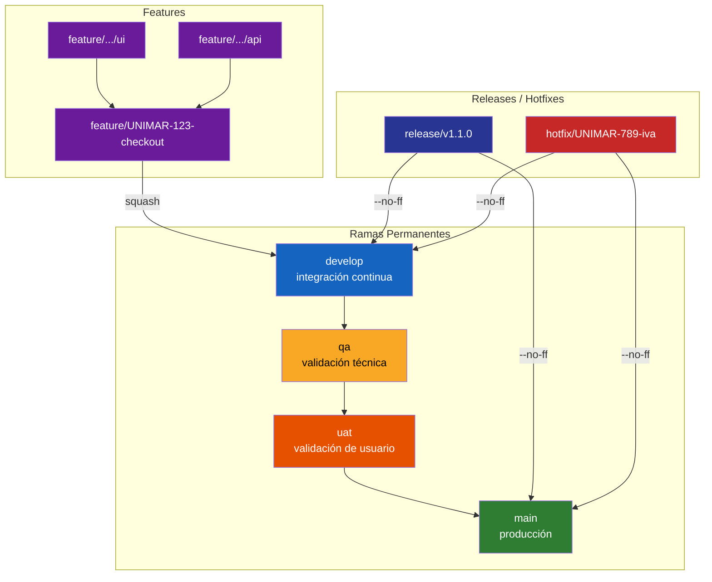
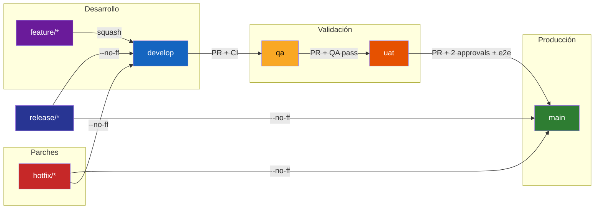

# [ADR 0050](0050-estrategia-ramificacion-gitflow.es.md): Estrategia de Ramificación GitFlow

## Estado
Aprobado

## Fecha
2026-06-05

## Decisores
Architecture Board

## Contexto

La estrategia de ramificación debe ser predecible, soportar releases concurrentes, hotfixes urgentes y merges auditables. El equipo trabaja con entregas simultáneas (features largas, parches correctivos, releases programados) sobre un monorepo orquestado con Nx. Sin una convención explícita, se producen merges caóticos, pérdida de trazabilidad y promociones manuales sin control de calidad.

## Decisión

Adoptar **GitFlow extendido** como estrategia de ramificación, añadiendo los entornos `qa` y `uat` como ramas de integración pre-release. Queda definido el siguiente modelo:



Flujo de promoción entre ambientes:



**Nota:** Los diagramas usan `flowchart` de Mermaid, compatible con GitHub. El comportamiento real descrito en las secciones siguientes es la especificación fuente.

### Ramas del modelo

| Rama | Propósito | Base | Fusiona a | Vida útil |
|---|---|---|---|---|
| `main` | Producción. Estado desplegado en producción | — | — | Permanente |
| `develop` | Integración continua. Feature branches convergen aquí | `main` | — | Permanente |
| `qa` | Validación técnica y funcional (QA interna) | `develop` | `uat` | Permanente |
| `uat` | Validación del usuario de negocio (UAT) | `qa` | `main` vía `release/*` | Permanente |
| `feature/*` | Desarrollo de una funcionalidad o historia | `develop` | `develop` (merge o squash) | Temporal |
| Ramas de miembro (`feature/X/name`) | Sub-tareas dentro de una feature (UI, API, DB, DOC) | `feature/*` padre | `feature/*` padre | Temporal |
| `release/*` | Preparación de release (changelog, versión, últimos retoques) | `develop` | `main` y `develop` | Temporal |
| `hotfix/*` | Corrección urgente en producción | `main` | `main` y `develop` | Temporal |

### Responsables y controles por ambiente

| Ambiente | Rama | Responsable | Controles requeridos |
|---|---|---|---|
| Desarrollo local | `feature/*` | Desarrollador | Lint + pruebas unitarias + compilación |
| Integración | `develop` | Tech Lead | CI completa + code review + cobertura ≥ 70% |
| QA | `qa` | QA Engineer | Pruebas funcionales + integración + smoke tests |
| UAT | `uat` | Product Owner / Analista de negocio | Validación de aceptación + criterios de historia |
| Producción | `main` | Architecture Board / Release Manager | CodeQL + pruebas e2e + aprobación ≥ 2 reviewers |

## Flujo de creación, integración, promoción y cierre

### 1. Feature branch

```
1. git checkout develop
2. git pull origin develop
3. git checkout -b feature/UNIMAR-123-descripcion
4. (trabajo + commits convencionales)
5. git push origin feature/UNIMAR-123-descripcion
6. (abrir Pull Request contra develop)
7. (superar checks → aprobación → merge squash)
8. git branch -d feature/UNIMAR-123-descripcion
```

Para features grandes que requieren múltiples contribuyentes, cada miembro crea ramas desde la `feature/*`:

```
feature/UNIMAR-123-checkout
  ├── feature/UNIMAR-123-checkout/ui
  ├── feature/UNIMAR-123-checkout/api
  └── feature/UNIMAR-123-checkout/db
```

Las ramas individuales fusionan (merge commit) a la `feature/*` padre. La `feature/*` fusiona (squash) a `develop`.

### 2. Promoción entre ambientes

```
develop  ──(PR con aprobación + CI)──►  qa
   qa    ──(PR con aprobación + QA pass)──►  uat
   uat   ──(PR con aprobación + UAT pass)──►  main
```

**Criterios de promoción:**

| Promoción | Criterios |
|---|---|
| `develop` → `qa` | PR aprobado (mín. 1 reviewer distinto del autor), CI verde (lint, test, build, CodeQL, cobertura ≥ 70%), sin conflictos |
| `qa` → `uat` | PR aprobado (mín. 1 reviewer), QA reporta pruebas funcionales OK, smoke tests OK, CodeQL sin findings High/Critical |
| `uat` → `main` | PR aprobado (mín. 2 reviewers, uno del Architecture Board), pruebas e2e OK, UAT firmado por Product Owner, release tag creado |

### 3. Release branch

Al alcanzar el punto de congelación de código:

```
git checkout develop
git checkout -b release/v1.2.0
# (ajustes de changelog, versiones, último pulido)
git commit -m "chore(release): prepare v1.2.0"
git checkout main
git merge --no-ff release/v1.2.0
git tag v1.2.0
git push origin main --tags
git checkout develop
git merge --no-ff release/v1.2.0
git branch -d release/v1.2.0
```

Los cambios en `release/*` se fusionan a `main` (merge commit) y se rebobinan a `develop`.

### 4. Hotfix

```
git checkout main
git checkout -b hotfix/UNIMAR-456-correccion-pago
# (corrección + commits)
git commit -m "fix(payment): corregir cálculo de igv en exportación"
git checkout main
git merge --no-ff hotfix/UNIMAR-456-correccion-pago
git tag v1.2.1
git push origin main --tags
git checkout develop
git merge --no-ff hotfix/UNIMAR-456-correccion-pago
git branch -d hotfix/UNIMAR-456-correccion-pago
```

### 5. Cierre de rama

Toda rama temporal se elimina después de fusionar. Las ramas `main`, `develop`, `qa` y `uat` son permanentes y protegidas.

## Convenciones de nombres

| Tipo | Patrón | Ejemplo |
|---|---|---|
| Feature | `feature/<id-tracker>-<kebab-case>` | `feature/UNIMAR-123-checkout` |
| Sub-feature | `feature/<id-tracker>-<nombre>/<area>` | `feature/UNIMAR-123-checkout/api` |
| Bug desde develop | `fix/<id-tracker>-<kebab-case>` | `fix/UNIMAR-456-iva-incorrecto` |
| Release | `release/v<major>.<minor>.<patch>` | `release/v1.2.0` |
| Hotfix | `hotfix/<id-tracker>-<kebab-case>` | `hotfix/UNIMAR-789-hotfix-pago` |
| Mejora técnica | `chore/<kebab-case>` | `chore/actualizar-jest-config` |

- Usar solo minúsculas, guiones, números y barras.
- El `<id-tracker>` corresponde al identificador del issue en Jira (o herramienta equivalente).
- Longitud máxima recomendada: 72 caracteres.

## Estándar de commits

Se adopta **Conventional Commits v1.0.0**:

```
<tipo>(<alcance opcional>): <descripción>

[cuerpo opcional]

[pie opcional con BREAKING CHANGE o footers]
```

Tipos permitidos:

| Tipo | Uso | Release |
|---|---|---|
| `feat` | Nueva funcionalidad | Minor |
| `fix` | Corrección de bug | Patch |
| `chore` | Mantenimiento, tooling, refactors | No release |
| `docs` | Cambios en documentación | No release |
| `style` | Formato, lint (sin cambio lógico) | No release |
| `refactor` | Refactor sin cambio funcional | No release |
| `perf` | Mejora de rendimiento | Patch |
| `test` | Añadir o corregir pruebas | No release |
| `ci` | Cambios en CI/CD | No release |
| `build` | Cambios en sistema de build | No release |

`BREAKING CHANGE` en el pie del commit produce un **Major release** independientemente del tipo.

### Validación de commits

Se usa **commitlint** con configuración `@commitlint/config-conventional`. El hook `commit-msg` de husky valida cada commit localmente antes de permitirlo.

```
// commitlint.config.js
module.exports = { extends: ['@commitlint/config-conventional'] };
```

**commit-msg hook (.husky/commit-msg):**
```
npx --no -- commitlint --edit $1
```

## Pull Requests: reglas, revisiones, aprobaciones y merge

### Reglas generales

1. Toda fusión a `develop`, `qa`, `uat` y `main` se realiza exclusivamente mediante Pull Request.
2. El autor del PR no puede auto-aprobar su propio PR.
3. El PR debe incluir una descripción con: qué cambia, por qué cambia, cómo se probó.
4. El título del PR debe seguir el estándar Conventional Commits.

### Template de Pull Request

```markdown
## Descripción
[Resumen del cambio y motivación]

## Tipo de cambio
- [ ] feat: nueva funcionalidad
- [ ] fix: corrección de bug
- [ ] refactor: refactorización
- [ ] chore: mantenimiento / tooling
- [ ] docs: documentación

## Criterios de aceptación
- [ ] Pruebas unitarias pasan
- [ ] Cobertura ≥ 70%
- [ ] Lint pasa
- [ ] CodeQL sin findings High/Critical
- [ ] Build exitoso

## Evidencia de pruebas
[Capturas, logs, o descripción de cómo se probó]

## Referencias
[UNIMAR-123](https://jira.unimar.compe/browse/UNIMAR-123)
```

### Estrategia de merge por rama destino

| Rama destino | Estrategia | Razón |
|---|---|---|
| `feature/*` (sub-rama → padre) | `merge --no-ff` | Conserva historial de trabajo individual |
| `develop` | `squash` | Mantiene historial limpio; un commit por feature |
| `qa`, `uat` | `merge --no-ff` o `squash` | Trazabilidad de la promoción |
| `main` | `merge --no-ff` | Preserva el merge de release/hotfix |
| `release/*` → `main` | `merge --no-ff` | Trazabilidad del release |

### Número mínimo de aprobaciones

| Rama destino | Aprobaciones mínimas | Reviewers requeridos |
|---|---|---|
| `develop` | 1 | Tech Lead o par senior |
| `qa` | 1 | Tech Lead |
| `uat` | 1 | QA Engineer |
| `main` | 2 | 1 Tech Lead + 1 Architecture Board |
| `release/*` | 2 | Tech Lead + Release Manager |
| `hotfix/*` | 1 | Architecture Board |

## Versionado, tags y releases

### Versionado Semántico (SemVer)

```
v<MAJOR>.<MINOR>.<PATCH>
```

| Componente | Disparado por |
|---|---|
| MAJOR | `BREAKING CHANGE` en commit |
| MINOR | `feat:` en commit |
| PATCH | `fix:`, `perf:` en commit |

### Tags

- Todo merge a `main` produce un tag anotado: `git tag -a v1.2.0 -m "Release v1.2.0"`
- Tags pre-release para candidatos: `v1.2.0-rc.1`
- Nombres de tag: `v<major>.<minor>.<patch>` sin prefijos adicionales.

### Releases automatizadas

Se usa **Nx Release** para:

1. Calcular versión desde Conventional Commits.
2. Generar/actualizar `CHANGELOG.md`.
3. Crear tag anotado.
4. Publicar GitHub Release.

Comando: `npx nx release` (integrado en CI al mergear a `main`).

## Protección de ramas

Se configuran las siguientes reglas de protección en GitHub para `main`, `develop`, `qa` y `uat`:

| Regla | `main` | `uat` | `qa` | `develop` |
|---|---|---|---|---|
| Requerir PR | Sí | Sí | Sí | Sí |
| Requerir approvals | 2 | 1 | 1 | 1 |
| Dismiss stale reviews | Sí | Sí | Sí | Sí |
| Requerir status checks | Sí | Sí | Sí | Sí |
| Requerir branches actualizadas | Sí | Sí | No | No |
| Restringir push directo | Sí | Sí | Sí | Sí |
| Restringir eliminación | Sí | Sí | Sí | No |
| Incluir administradores | Sí | Sí | Sí | Sí |

### Status checks obligatorios

```
- lint (eslint, prettier)
- test (jest — todas las pruebas)
- build (nx build)
- coverage (≥ 70%)
- codeql (sin findings High/Critical)
- dependency-check (npm audit --audit-level=high)
- secret-scan (Github secret scanning)
- nx-affected (solo proyectos afectados)
```

## Controles automáticos de calidad, seguridad, pruebas y cobertura

### Pipeline de CI/CD

El siguiente pipeline se ejecuta en cada PR y push a ramas protegidas:

| Paso | Herramienta | Comando | Falla si |
|---|---|---|---|
| Lint | ESLint + Prettier | `npx nx affected:lint` | Error de lint |
| Type-check | TypeScript | `npx tsc --noEmit` | Error de tipos |
| Pruebas unitarias | Jest | `npx nx affected:test` | Test falla |
| Cobertura | Jest --coverage | `npx nx affected:test --coverage` | Cobertura < 70% |
| Build | Nx | `npx nx affected:build` | Build falla |
| Seguridad (SAST) | CodeQL | `github/codeql-action/analyze` | Finding High/Critical |
| Dependencias | npm audit | `npm audit --audit-level=high` | CVE High/Critical |
| Análisis de secretos | GitHub Secret Scanning | Nativo | Secreto detectado |

### Hook de pre-push (opcional recomendado)

```
# .husky/pre-push
npx nx affected:lint
npx nx affected:test --coverage
```

## Herramientas estándar

| Propósito | Herramienta | Configuración |
|---|---|---|
| Validación de commits | commitlint + husky | `.husky/commit-msg`, `commitlint.config.js` |
| Lint | ESLint + Prettier | `.eslintrc.js`, `.prettierrc` |
| Pruebas | Jest + Testing Library | `jest.config.ts` |
| Cobertura | Jest --coverage | Umbral 70% en `jest.config.ts` |
| Build | Nx | `nx.json`, `project.json` |
| SAST | GitHub CodeQL | `.github/workflows/codeql.yml` |
| Dependencias | npm audit + Renovate | `renovate.json` |
| PR template | GitHub | `.github/PULL_REQUEST_TEMPLATE.md` |
| Branch protection | GitHub | Settings → Branches |
| Release | Nx Release | `nx.json` → `release` block |
| Detección de secretos | GitHub Secret Scanning | Nativo (repo settings) |

## Ejemplos

### Ejemplo 1: Feature simple

```bash
# Desarrollador crea feature
git checkout develop && git pull
git checkout -b feature/UNIMAR-123-checkout

# Trabajo y commits
git commit -m "feat(checkout): agregar formulario de dirección"
git commit -m "fix(checkout): validar RUC antes de enviar"
git push origin feature/UNIMAR-123-checkout

# PR → develop → squash merge
# CI pasa, 1 approval → merge squash
# Rama eliminada automáticamente post-merge
```

### Ejemplo 2: Release programado

```bash
# Release Manager
git checkout develop && git pull
git checkout -b release/v2.1.0
npx nx release --dry-run  # preview
npx nx release             # genera tag, changelog
git push origin release/v2.1.0

# PR release/v2.1.0 → main (2 approvals, CI verde)
# PR release/v2.1.0 → develop (backport)
# Rama eliminada
```

### Ejemplo 3: Hotfix urgente

```bash
# Desarrollador
git checkout main && git pull
git checkout -b hotfix/UNIMAR-789-iva-incorrecto
git commit -m "fix(tax): corregir cálculo de IGV para regímenes especiales"
git push origin hotfix/UNIMAR-789-iva-incorrecto

# PR hotfix → main (1 approval de Architecture Board)
# Merge --no-ff a main, tag v2.1.1
# Merge --no-ff a develop
```

### Ejemplo 4: Feature con sub-ramas

```bash
# Tech Lead crea feature branch base
git checkout -b feature/UNIMAR-456-checkout-multimoneda

# Miembro 1: UI
git checkout -b feature/UNIMAR-456-checkout-multimoneda/ui
git commit -m "feat(checkout): agregar selector de moneda"
git push origin feature/UNIMAR-456-checkout-multimoneda/ui
# PR → feature/UNIMAR-456-checkout-multimoneda (merge commit)

# Miembro 2: API
git checkout -b feature/UNIMAR-456-checkout-multimoneda/api
git commit -m "feat(checkout): endpoint de tipos de cambio"
git push origin feature/UNIMAR-456-checkout-multimoneda/api
# PR → feature/UNIMAR-456-checkout-multimoneda (merge commit)

# Tech Lead: PR feature/UNIMAR-456-checkout-multimoneda → develop (squash)
```

## Mejoras incrementales (futuras)

| Mejora | Cuándo | Beneficio |
|---|---|---|
| Merge automático con labels | Cuando el equipo esté familiarizado | Reduce fricción en PRs triviales |
| Auto-delete branches post-merge | Inmediato (configuración GitHub) | Mantiene limpieza |
| Análisis de impacto con Nx | Ya disponible | Solo construir/probar proyectos afectados |
| Bloquear merge si hay dependencias Renovate abiertas | Próximo sprint | Evita merges con CVEs conocidos |
| Dashboard de salud de ramas | Cuando el repo tenga +10 contribuyentes | Visibilidad de ramas antiguas |
| Plantilla de release automática con Nx Release | Ya disponible | Changelog y release notes sin esfuerzo |
| Pruebas de regresión visual (Playwright) | En roadmap de QA | Captura cambios visuales no intencionados |

## Consecuencias

### Positivas

- Modelo predecible para releases concurrentes y hotfixes urgentes.
- Separación clara de responsabilidades por ambiente (dev → QA → UAT → prod).
- Trazabilidad completa: commits → PRs → releases → tags → changelog.
- Convenciones explícitas que eliminan ambigüedad en el equipo.
- Controles automáticos que previenen código defectuoso antes de llegar a entornos superiores.

### Negativas

- Mayor número de ramas que un flujo trunk-based; requiere disciplina para mantenerlas sincronizadas.
- Los merges entre `develop`, `qa` y `uat` pueden acumular deuda de sincronización si no se promueven con frecuencia.
- Desarrolladores nuevos necesitan curva de aprendizaje del modelo extendido.

## Referencias

- [ADR 0001: Orquestación de Monorepo con Nx](0001-orquestacion-monorepo-nx.es.md)
- [ADR 0005: Puertas de Calidad de Seguridad CI/CD con CodeQL](0005-ci-cd-calidad-codeql.es.md)
- [ADR 0018: Pirámide de Pruebas y Puertas de Calidad](0018-piramide-pruebas-gates-calidad.es.md)
- [Estrategia de Auditoría Continua y Versionado Automatizado](../../../governance/standards/estrategia-auditoria-release.es.md)
- [Conventional Commits v1.0.0](https://www.conventionalcommits.org/)
- [GitFlow original (Vincent Driessen)](https://nvie.com/posts/a-successful-git-branching-model/)

---
[Volver al Índice](../README.md)
