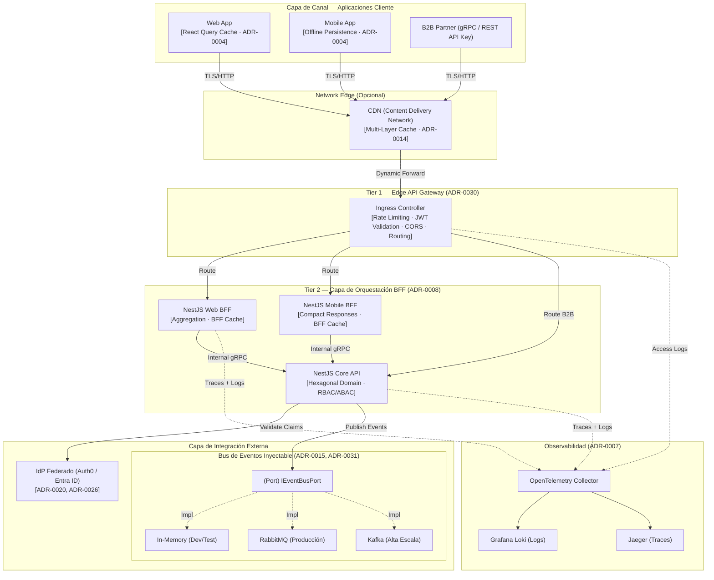
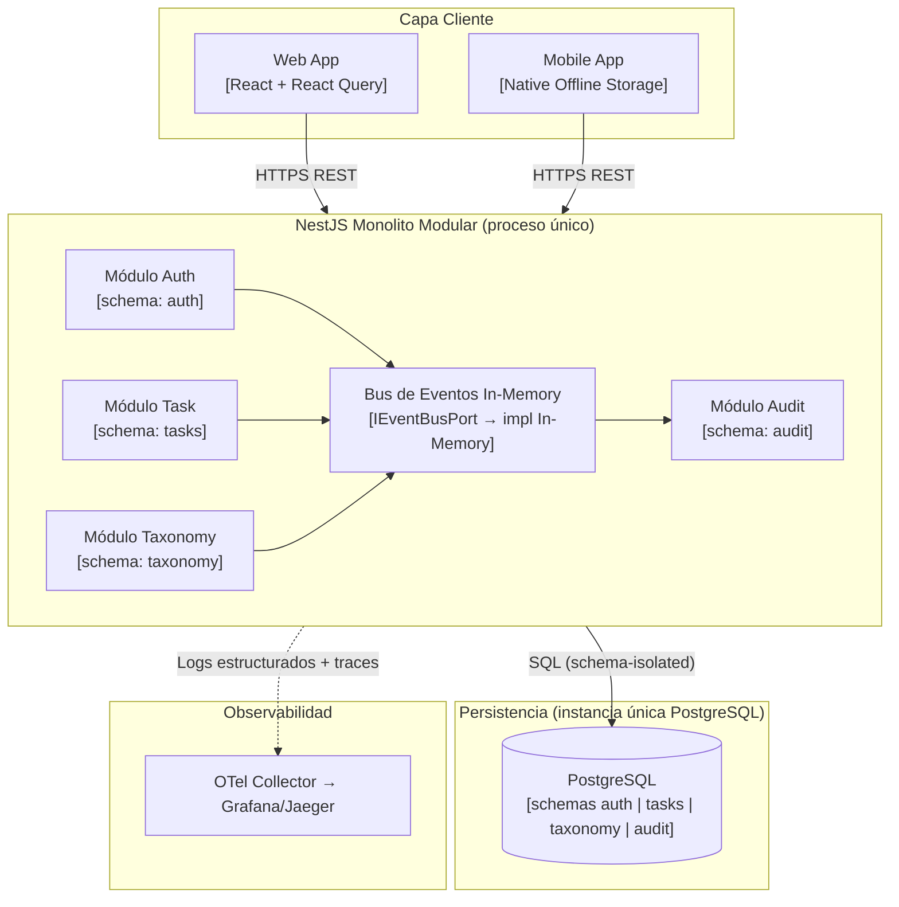

# Arquitectura de Referencia Corporativa (Multi-Runtime / arc42)

  
  
  
  

> [!IMPORTANT]
> **Blueprint Unificado de Referencia Corporativa**: Este documento define el modelo arquitectónico global en toda la organización. Las restricciones arquitectónicas y los principios de diseño son agnósticos de runtime. Las etiquetas concretas de tecnología, diagramas y ejemplos representan un perfil de implementación de referencia y no deben interpretarse como mandatos universales de producto.

> [!NOTE]
> **Regla de Abstracción**: usa este documento para entender fronteras, responsabilidades, etapas de evolución, atributos de calidad y lógica de decisión. Usa los perfiles de stack runtime para seleccionar herramientas concretas. Usa la documentación demo cuando necesites un ejemplo ejecutable específico.

---

## 1. Introducción y Objetivos

Esta arquitectura de referencia provee un blueprint estandarizado para construir sistemas modernos y altamente escalables.

### 1.1 Propósito y Aplicabilidad
Este patrón está diseñado específicamente para sistemas que:

* Tienen una fuerte orientación hacia la **utilización intensiva de APIs** con clientes multicanal (Web, Móvil, B2B).
* Gestionan **operaciones distribuidas por sucursal** — los datos llevan `sucursal_id` como atributo de negocio y el acceso cross-sucursal está gobernado por autorización RBAC/ABAC ([ADR-0010](../adrs/core/0010-estrategia-arquitectura-multitenant.es.md), [ADR-0012](../adrs/nodejs/0012-autorizacion-avanzada-rbac-abac.es.md)).
* Deben soportar **evolución progresiva** desde Monolito Modular hasta Microservicios Distribuidos.

> [!IMPORTANT]
> **Canon de Evolución Progresiva**: La Arquitectura evoluciona mediante complejidad incremental. La Fase 1 es deliberadamente simple y no impone tecnologías, patrones o procesos que excedan las necesidades centrales de un monolito modular. Cada requerimiento adicional se introduce precisamente en la fase donde la arquitectura del sistema lo justifica objetivamente, nunca antes.

### 1.2 Estrategia Multi-Runtime Corporativa (Políglota)
La organización promueve una arquitectura políglota deliberada donde los runtimes se eligen estrictamente basados en la idoneidad de la carga de trabajo, validados vía ADR:

| Runtime | Rol Canónico | Caso de Uso Típico |
| :--- | :--- | :--- |
| **Node.js / TypeScript** | Perfil runtime Web/API | APIs REST/gRPC, orquestación BFF, servicios web transaccionales, SSR frontend. |
| **.NET (C#)** | Perfil runtime/backend empresarial | APIs, cómputo batch, pipelines ETL, tareas computacionales pesadas, interoperabilidad legacy. |
| **Android (Kotlin/Java)** | Cliente Móvil Nativo | Apps operativas industriales, captura offline, integración de hardware scan/GPS. |

> **Regla de Contratos**: La comunicación entre runtimes distintos DEBE utilizar estrictamente definiciones de contrato explícitas y versionadas (OpenAPI para HTTP, Protobuf para gRPC, AsyncAPI para Mensajería) garantizando opacidad absoluta de implementación.

### 1.3 Atributos de Calidad Obligatorios
| Atributo de Calidad | ADR Fuente | Objetivo |
| :--- | :--- | :--- |
| **Evolución Progresiva** | [ADR-0006](../adrs/core/0006-transicion-futura-microservicios-dapr.es.md), [ADR-0008](../adrs/nodejs/0008-evolucion-multimodulo-progresiva-gateway-bff.es.md) | Camino a microservicios zero-refactoring vía Dapr |
| **Sucursal como Dimensión de Negocio** | [ADR-0010](../adrs/core/0010-estrategia-arquitectura-multitenant.es.md), [ADR-0012](../adrs/nodejs/0012-autorizacion-avanzada-rbac-abac.es.md) | `sucursal_id` como atributo de dato; acceso cross-sucursal gobernado por RBAC/ABAC |
| **Desacoplamiento Estricto** | [ADR-0002](../adrs/nodejs/0002-arquitectura-limpia-nestjs.es.md), [ADR-0003](../adrs/nodejs/0003-estandares-estrictos-typescript.es.md) | Aplicación de frontera ESLint |
| **Resiliencia** | [ADR-0011](../adrs/core/0011-patrones-resiliencia-tolerancia-fallos.es.md) | Circuit Breakers Distribuidos (Redis + Ingress) |
| **Seguridad** | [ADR-0005](../adrs/core/0005-ci-cd-calidad-codeql.es.md), [ADR-0012](../adrs/nodejs/0012-autorizacion-avanzada-rbac-abac.es.md), [ADR-0020](../adrs/core/0020-estrategia-abstraccion-proveedor-identidad.es.md), [ADR-0026](../adrs/nodejs/0026-autenticacion-adaptativa-mfa-passwordless.es.md) | Perímetro zero-trust + RBAC/ABAC |
| **Latencia API Interna** | [ADR-0014](../adrs/core/0014-estrategia-cache-distribuido-redis.es.md), [ADR-0021](../adrs/nodejs/0021-compilacion-graph-auth-alto-rendimiento.es.md) | Caché de 4 Niveles (Cliente + CDN + BFF + Core) |
| **Observabilidad** | [ADR-0007](../adrs/nodejs/0007-observabilidad-telemetria-loki-opentelemetry.es.md), [ADR-0046](../adrs/core/0046-dapr-observabilidad-unificada.es.md) | OTel + Loki + trazado distribuido |
| **Auditoría Inmutable** | [ADR-0016](../adrs/core/0016-pista-auditoria-inmutable-negocio.es.md) | Ledger de auditoría append-only |
| **Soberanía Técnica** | [ADR-0002](../adrs/nodejs/0002-arquitectura-limpia-nestjs.es.md), [ADR-0028](../adrs/core/0028-infraestructura-hibrida-autogestionada.es.md) | Infra/AOP 100% Intercambiable sin impacto en lógica |
| **Modularización UI** | [ADR-0055](../adrs/core/0055-estrategia-arquitectura-microfrontends.es.md) | Microfrontends (Module Federation) para Fase 3+ |

#### Marcos Estratégicos Complementarios
Para comprender profundamente la postura matemática y de riesgo de esta arquitectura, consulta:

* -> **[Evaluación de Madurez y Patrones de Diseño](../../governance/standards/vision/evaluacion-madurez.es.md)**
* -> **[Análisis Estratégico del Teorema CAP](../analisis-estrategico-cap.es.md)**
* -> **[Escenarios de Despliegue Multi-Cloud](../escenarios-despliegue-multinube.es.md)**

---

## 2. Restricciones Arquitectónicas y Pilares Baseline

Cualquier sistema basado en este blueprint debe adherirse a los siguientes pilares no negociables:

* **Gobernanza de Stack ([ADR-0001](../adrs/core/0001-orquestacion-monorepo-nx.es.md))**: Nx Monorepo + npm Workspaces para gobernanza centralizada de dependencias.
* **Mandato de Ingeniería ([ADR-0002](../adrs/nodejs/0002-arquitectura-limpia-nestjs.es.md), [ADR-0003](../adrs/nodejs/0003-estandares-estrictos-typescript.es.md))**: SOLID, Clean Code, Arquitectura Hexagonal (Ports/Adapters simples obligatorios), TypeScript estricto.
* **Seguridad de Dependencias ([ADR-0009](../adrs/core/0009-gestion-vulnerabilidades-dependencias-estrictas.es.md))**: Todas las versiones de dependencias fijadas. Sin rangos `^` o `~`. Escaneo de vulnerabilidades automatizado en CI.
* **Quality Gates ([ADR-0018](../adrs/core/0018-piramide-pruebas-gates-calidad.es.md))**: Pirámide de testing automatizada. Mínimo 80% de cobertura de lógica de negocio aplicada en CI. La distribución objetivo es 70% unitarias / 20% integración / 10% E2E (ver [Gates de Calidad SDLC](../../governance/sdlc/gates-calidad.es.md) como fuente de verdad de umbrales).
* **Portabilidad de Infraestructura ([ADR-0028](../adrs/core/0028-infraestructura-hibrida-autogestionada.es.md))**: OSS auto-hospedado (MinIO, RabbitMQ, Vault) priorizado sobre lock-in cloud.

---

## 3. Contexto y Alcance (Modelo Operacional)

### 3.1 Patrón de Contexto General — Stack Completo con Niveles de Gateway y Bus de Eventos Inyectable

Este diagrama captura el contexto completo del sistema. Refleja:

* **[ADR-0030](../adrs/core/0030-api-gateway-ingress-vs-nestjs.es.md)**: Gateway de Dos Niveles (Ingress Edge + NestJS BFF)
* **[ADR-0008](../adrs/nodejs/0008-evolucion-multimodulo-progresiva-gateway-bff.es.md)**: Evolución Multi-Módulo progresiva con BFF dedicado por canal de cliente
* **[ADR-0015](../adrs/core/0015-arquitectura-eventos-intradominio.es.md)**: Abstracción inyectable `IEventBusPort` (In-Memory -> RabbitMQ -> Kafka)
* **[ADR-0020](../adrs/core/0020-estrategia-abstraccion-proveedor-identidad.es.md)**: Identity Provider enchufable vía Patrón Strategy
* **[ADR-0007](../adrs/nodejs/0007-observabilidad-telemetria-loki-opentelemetry.es.md)**: Trazado OpenTelemetry a través de todos los niveles

---

## 4. Estrategia de Solución

### 4.1 Arquitectura Hexagonal — Ports and Adapters ([ADR-0002](../adrs/nodejs/0002-arquitectura-limpia-nestjs.es.md))
Toda la lógica de negocio en las capas de Dominio y Aplicación tiene **cero dependencias runtime** de frameworks, ORMs o servicios cloud. La capa de infraestructura implementa Puertos TypeScript puros.

### 4.2 Sucursal como Dimensión de Negocio ([ADR-0010](../adrs/core/0010-estrategia-arquitectura-multitenant.es.md))

UNIMAR opera desde múltiples sucursales (depósitos, patios, almacenes). Las sucursales **no son tenants aislados**: un contenedor puede transferirse de Paita a Callao, un supervisor puede tener acceso a múltiples sucursales, y los reportes gerenciales consolidan datos cross-sucursal. Estas son operaciones de negocio válidas, no violaciones de seguridad.

`sucursal_id` es un **atributo de negocio** en las entidades operativas — registra la sucursal donde ocurre la operación. El control de acceso a los datos de una sucursal lo ejerce el sistema RBAC/ABAC ([ADR-0012](../adrs/nodejs/0012-autorizacion-avanzada-rbac-abac.es.md)) a través del claim `sucursales_autorizadas` del JWT: si el operador tiene el claim, puede operar; si no lo tiene, recibe `403 Forbidden`. No se implementa Row-Level Security (RLS) de base de datos — la autorización en capa de aplicación es el único y suficiente mecanismo de control.

### 4.3 Patrón de Gateway de Dos Niveles ([ADR-0030](../adrs/core/0030-api-gateway-ingress-vs-nestjs.es.md))

| Nivel | Tecnología | Responsabilidad |
| --- | --- | --- |
| **Nivel 1 — Edge** | Ingress Controller (NGINX/OpenResty) | Rate Limiting, validación JWT, terminación SSL, Routing |
| **Nivel 2 — BFF** | NestJS | Agregación de datos, conformación de payloads, lógica específica de cliente |

### 4.4 Bus de Eventos Inyectable ([ADR-0015](../adrs/core/0015-arquitectura-eventos-intradominio.es.md))
El dominio nunca importa un broker de mensajes concreto. Toda comunicación asíncrona se enruta a través de `IEventBusPort`. La implementación concreta (In-Memory / RabbitMQ / Kafka) se inyecta por el contenedor DI de NestJS al inicio, controlada por una variable de entorno.

### 4.5 Ruta de Evolución Progresiva ([ADR-0006](../adrs/core/0006-transicion-futura-microservicios-dapr.es.md))
1. **Milestone 1 — Monolito Modular**: Proceso único, módulos de dominio lógicamente aislados.
2. **Milestone 2 — Extracción de Servicios**: Dominios críticos extraídos como micro-proyectos Nx con DBs aisladas, consumidos vía gRPC/Dapr.
3. **Milestone 3 — Mesh Completo de Microservicios**: Sidecars Dapr, Service Mesh, Ingress como superficie API unificada, y **extracción de Microfrontends** ([ADR-0055](../adrs/core/0055-estrategia-arquitectura-microfrontends.es.md)).

---

## 5. Bloques Técnicos Constructivos

### 5.0 Vista de Contenedor Fase 1 — Lean MVP (Monolito Modular)

> [!NOTE]
> **Empieza aquí.** Este diagrama refleja el **despliegue real de Fase 1** — un proceso único, infraestructura mínima y sin broker de mensajería externo. Es el punto de partida recomendado para todos los productos nuevos. El diagrama completo en la Sección 5.1 muestra el estado maduro de Fase 3+.

**Reglas Fase 1:**

* Un proceso NestJS. Una instancia PostgreSQL. Docker Compose para dev local.
* Sin Ingress gateway — HTTPS directo a la app. Añade Ingress en Fase 2 cuando un segundo canal de cliente o partner externo se incorpore.
* Bus de eventos in-memory. Reemplaza con RabbitMQ solo cuando se necesite entrega asíncrona cross-servicio ([ADR-0015](../adrs/core/0015-arquitectura-eventos-intradominio.es.md)).
* Redis es opcional. Añade solo cuando se incumpla un umbral de latencia específico ([ADR-0014](../adrs/core/0014-estrategia-cache-distribuido-redis.es.md)).

---

