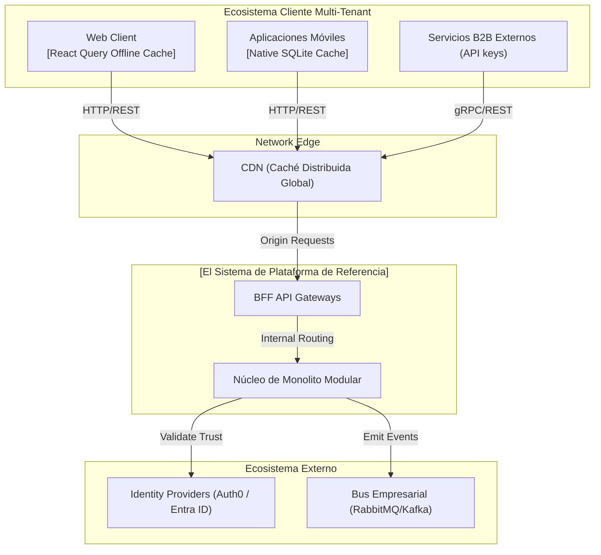
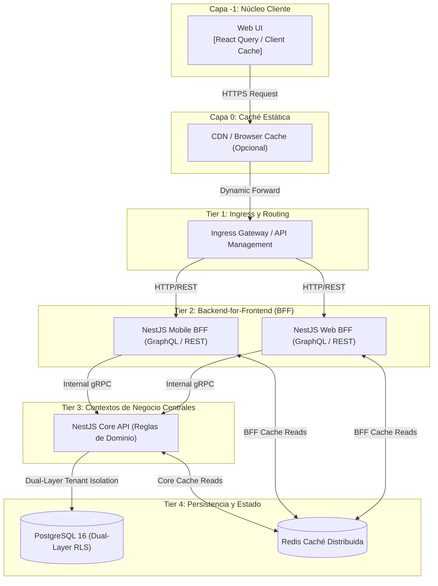
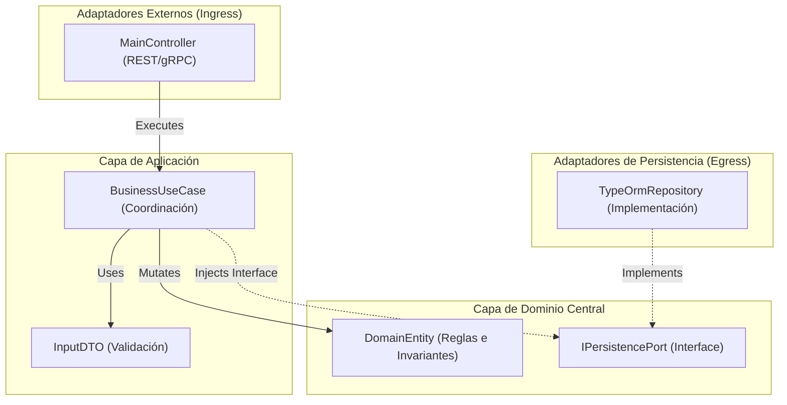

# Especificación Arquitectónica y Especificaciones del Modelo C4

  
  
  
  

> Alcance: esta es una **topología de referencia**. Los equipos de producto pueden mapear las mismas responsabilidades arquitectónicas a diferentes runtimes o herramientas aprobados a través de los perfiles de runtime y el proceso de ADR. Las etiquetas concretas como nombres de framework, base de datos, gateway o broker son ejemplos a menos que un ADR referenciado las marque explícitamente como obligatorias.

---

## 1. Estructura Estática del Sistema (Modelo C4)

### Nivel 1: Diagrama de Contexto del Sistema
Define nuestro sistema delimitado dentro del ecosistema empresarial, sus consumidores (tenants) y actores externos activos.

### Nivel 2: Diagrama de Contenedores (Runtime de Alta Densidad)
Demuestra la segregación física de los puntos de entrada de comunicación (BFFs) hasta la infraestructura de base de datos multi-tenant.

### Nivel 3: Diagrama de Componentes API (Arquitectura Hexagonal)
Explosión del acoplamiento interno dentro de la **NestJS Core API**.

---

## 2. El Ledger de Decisiones Aprobadas (ADRs)

Todas las decisiones fundacionales están **oficialmente Aprobadas** y son obligatorias para la implementación del sistema.

### Grupo A: Fundación Core y Estándares

1. **[ADR 0001: Orquestación Monorepo](../adrs/core/0001-orquestacion-monorepo-nx.es.md)**: Nx y npm workspaces para CI/CD lineal y centralizado.
2. **[ADR 0002: Arquitectura Hexagonal Limpia](../adrs/nodejs/0002-arquitectura-limpia-nestjs.es.md)**: Separación de la lógica central del código de framework.
3. **[ADR 0003: Estándares Estrictos de TypeScript](../adrs/nodejs/0003-estandares-estrictos-typescript.es.md)**: Tipado absoluto, sin `any`, reglas ESLint obligatorias.
4. **[ADR 0005: Seguridad CodeQL Zero-Cost](../adrs/core/0005-ci-cd-calidad-codeql.es.md)**: Detección automatizada de vulnerabilidades dentro del pipeline.
5. **[ADR 0009: Fijación Estricta de Dependencias](../adrs/core/0009-gestion-vulnerabilidades-dependencias-estrictas.es.md)**: Bloqueo de actualizaciones dinámicas para prevenir brechas de supply-chain.

### Grupo B: SaaS, Escalabilidad y Distribución

6. **[ADR 0006: Transición futura a Microservicios vía Dapr](../adrs/core/0006-transicion-futura-microservicios-dapr.es.md)**: Disparadores de desacoplamiento para romper monolitos en redes de nodos mesh.
7. **[ADR 0007: Observabilidad vía OpenTelemetry](../adrs/nodejs/0007-observabilidad-telemetria-loki-opentelemetry.es.md)**: Trazado distribuido a través de BFF, API y DB.
8. **[ADR 0008: Patrones BFF](../adrs/nodejs/0008-evolucion-multimodulo-progresiva-gateway-bff.es.md)**: Integración multicanal vía capas de traducción dedicadas.
9. **[ADR 0010: Aislamiento Multi-Sucursal](../adrs/core/0010-estrategia-arquitectura-multitenant.es.md)**: Aplicando aislamiento de doble capa con filtros de sucursal a nivel de aplicación y failsafes nativos de base de datos específicos del runtime.
10. **[ADR 0011: Circuit Breakers de Tolerancia a Fallos](../adrs/core/0011-patrones-resiliencia-tolerancia-fallos.es.md)**: Previniendo degradación en cascada usando `opossum`.
11. **[ADR 0013: Topología de Disaster Recovery](../adrs/core/0013-topologia-infraestructura-cloud-dr.es.md)**: Diseño de nodos multi-región.
12. **[ADR 0014: Caché Distribuida](../adrs/core/0014-estrategia-cache-distribuido-redis.es.md)**: Descargando la base de datos vía Redis centralizado.
13. **[ADR 0015: Arquitectura Event-Driven](../adrs/core/0015-arquitectura-eventos-intradominio.es.md)**: Mensajería asíncrona entre bounded contexts.
14. **[ADR 0016: Auditoría de Negocio Inmutable](../adrs/core/0016-pista-auditoria-inmutable-negocio.es.md)**: Sistema ledger registrando diffs completos de estado transaccional.

### Grupo C: Integración, Identidad y Gobernanza

15. **[ADR 0020: Abstracción del Identity Provider](../adrs/core/0020-estrategia-abstraccion-proveedor-identidad.es.md)**: Abstracción Port para Okta/Entra ID/Auth0.
16. **[ADR 0021: Auth Graphs de Alto Rendimiento](../adrs/nodejs/0021-compilacion-graph-auth-alto-rendimiento.es.md)**: Requisitos de latencia por debajo de 5ms.
17. **[ADR 0026: MFA y Seguridad Adaptativa](../adrs/nodejs/0026-autenticacion-adaptativa-mfa-passwordless.es.md)**: Soporte WebAuthn y Passkeys.
18. **[ADR 0027: Protocolos Duales REST y gRPC](../adrs/nodejs/0027-api-gateway-dual-protocolo-rest-grpc.es.md)**: Streaming interno performante vía gRPC.
19. **[ADR 0030: Ingress Gateway vs NestJS Gateway](../adrs/core/0030-api-gateway-ingress-vs-nestjs.es.md)**: Separación de proxies de infraestructura de orquestación de negocio.
20. **[ADR 0029: Primitivas Tácticas DDD](../adrs/nodejs/0029-libreria-primitivas-ddd-tactico.es.md)**: Utilización obligatoria de la librería estandarizada `@nestjslatam/ddd`.
21. **[ADR 0032: Matriz de Decisión de Protocolo API](../adrs/core/0032-matriz-decision-protocolos-api-rest-grpc-graphql.es.md)**: Marco de evaluación que obliga REST para exposición pública, gRPC para backbones internos y GraphQL para agregación BFF optimizada.

### Grupo D: Preparación para Evolución a Microservicios

22. **[ADR 0031: Schema-por-Contexto y Catálogo de Eventos de Dominio](../adrs/core/0031-esquema-por-contexto-catalogo-eventos-dominio.es.md)**: Cada bounded context posee un esquema PostgreSQL dedicado (`auth` | `tasks` | `taxonomy` | `audit`). Toda la comunicación cross-context se gobierna por un Catálogo formal de Eventos de Dominio con contratos de payload tipados, permitiendo extracción de microservicios zero-migration.

---

  
  

  <strong>© Unimar S.A.</strong> · RUC 20100412447 · Operador Logístico Aduanero desde 1978 
  Última revisión: 2026-06-05

