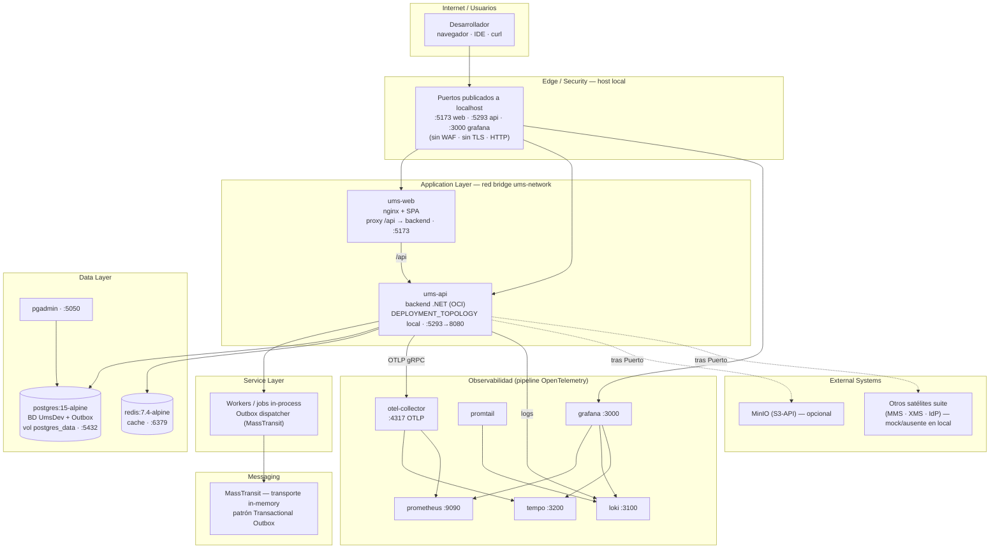

# Diagrama de despliegue — Docker (Compose local)

**← [Volver a Docker](./README.md)** · [Deployment Hub](../../hub/deployment-architecture-hub.md)

> Topología de la suite en la estación del desarrollador con Docker Compose. Basado en el Compose canónico de UMS (`src/infra/local/compose/docker-compose.yml`): red *bridge* `ums-network`, una réplica por servicio, puertos publicados a `localhost`.

## Diagrama por capas

## Leyenda

- **Líneas continuas:** tráfico/dependencia activa en el ambiente local. **Líneas punteadas:** integraciones abstraídas tras un Puerto ([ADR-0028](../../../adrs/core/0028-infraestructura-hibrida-autogestionada.es.md)) que en local suelen estar ausentes o *mockeadas*.
- **Edge/Security** se reduce a la publicación de puertos a `localhost`: no hay DNS, CDN, WAF ni TLS.
- **Messaging** usa transporte in-memory de MassTransit con Outbox en Postgres; el broker AMQP autorizado (RabbitMQ) no está presente en local.
- **Observabilidad** es el mismo stack OpenTelemetry que en Kind y producción, dando paridad de instrumentación.
- Una sola réplica por servicio, sin alta disponibilidad ni escalado (ver [README §5](./README.md#5-escalabilidad-y-alta-disponibilidad)).

---

  <strong>© Unimar S.A.</strong> · RUC 20100412447 · Operador Logístico Aduanero desde 1978 
  Última revisión: 2026-07-22

