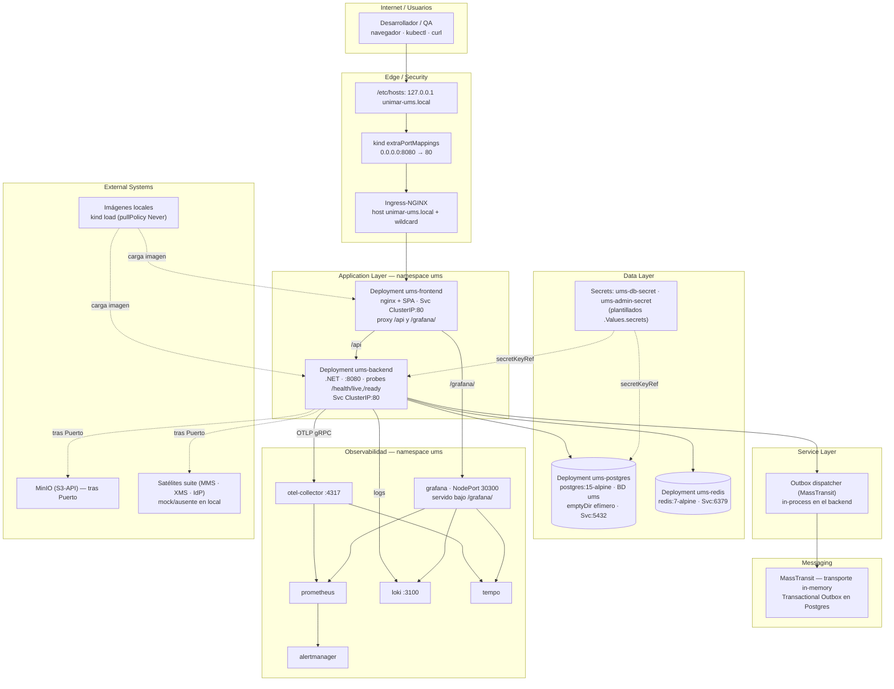

# Diagrama de despliegue — Kind (Kubernetes en Docker)

**← [Volver a Kind](./README.md)** · [Deployment Hub](../../hub/deployment-architecture-hub.md)

> Topología del clúster kind `unimar-cluster-ums` (namespace `ums`) desplegado con el chart `src/infra/ums-helm`. `extraPortMappings` de kind publica el Ingress-NGINX en `localhost:8080`. Una réplica por servicio; imágenes inyectadas por `kind load` (`pullPolicy: Never`).

## Diagrama por capas

## Leyenda

- **Líneas continuas:** tráfico/dependencia activa dentro del clúster. **Líneas punteadas:** inyección de secretos/imágenes o integraciones abstraídas tras un Puerto ([ADR-0028](../../../adrs/core/0028-infraestructura-hibrida-autogestionada.es.md)), ausentes o *mockeadas* en local.
- **Edge/Security:** la entrada real es Ingress-NGINX; `extraPortMappings` de kind hace el puente host→clúster en `:8080` (no 80/443, retenidos por Docker Desktop). Sin WAF ni TLS externo.
- **Data:** Postgres con `emptyDir` (efímero) — ver [README §9](./README.md#9-relación-con-el-sdlc-de-unimar-arch); Secrets plantillados por el chart (G-019).
- **Messaging:** transporte in-memory de MassTransit con Outbox en Postgres; RabbitMQ (AMQP autorizado) no presente en local.
- **Paridad:** estos son los **mismos manifests/Helm** que se despliegan en AKS/EKS/on-prem — el diferencial es el sustrato (nodos-contenedor de kind) y la ausencia de HA.

---

  <strong>© Unimar S.A.</strong> · RUC 20100412447 · Operador Logístico Aduanero desde 1978 
  Última revisión: 2026-07-22

