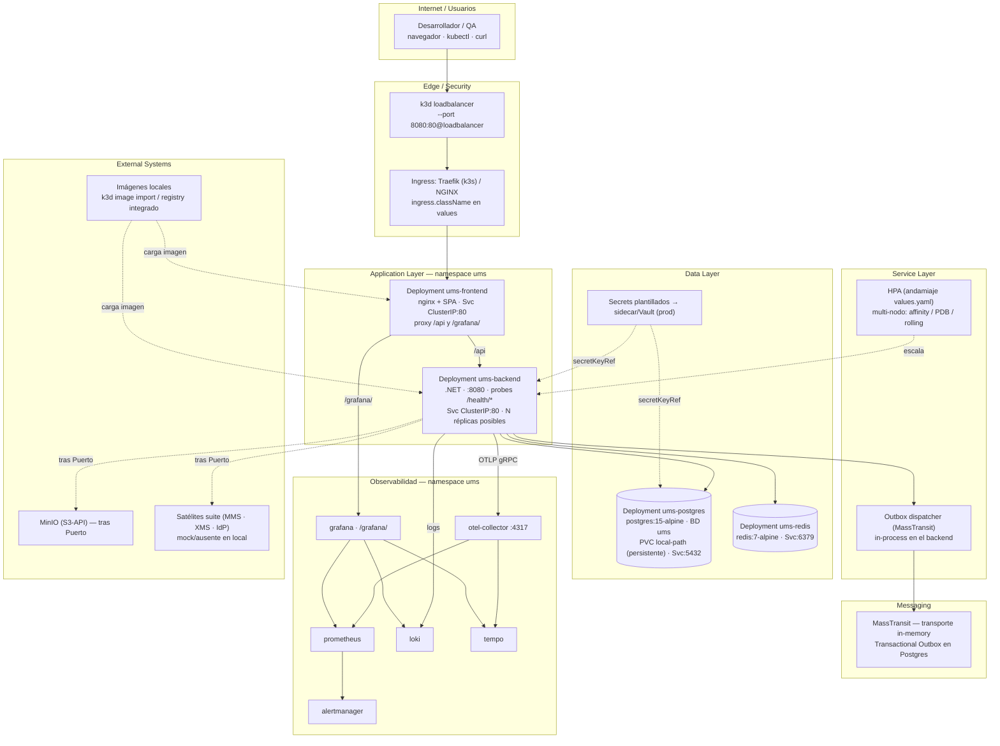

# Diagrama de despliegue — Kubernetes Local (k3d recomendado)

**← [Volver a Kubernetes Local](./README.md)** · [Deployment Hub](../../hub/deployment-architecture-hub.md)

> Topología del chart `ums-helm` sobre una distribución de Kubernetes local. Se ilustra la variante **recomendada (k3d/k3s)**: `--port 8080:80@loadbalancer` publica el ingress al host, Traefik como controlador, `local-path` como PVC dinámico y multi-nodo opcional. Con Minikube/Rancher/Docker Desktop cambia el sustrato, no los manifests.

## Diagrama por capas

## Leyenda

- **Líneas continuas:** tráfico/dependencia activa. **Líneas punteadas:** escalado por HPA, inyección de secretos/imágenes o integraciones tras un Puerto ([ADR-0028](../../../adrs/core/0028-infraestructura-hibrida-autogestionada.es.md)).
- **Edge/Security:** el `loadbalancer` de k3d publica el ingress en `:8080`; el controlador puede ser Traefik (default k3s) o Ingress-NGINX según `ingress.className`. Sin WAF ni TLS externo.
- **Diferencias frente a [kind](../kind/deployment-diagram.md):** PVC `local-path` da **Postgres persistente** (no `emptyDir`), multi-nodo habilita afinidad/PDB/rolling reales, y la config del clúster es **versionable**. Los manifests/Helm son idénticos.
- **Messaging/Observabilidad:** mismos que kind y producción (in-memory local + Outbox; pipeline OpenTelemetry).
- **Estado Proposed:** la promoción a `Approved` requiere un ADR que ratifique k3d como *baseline* local (ver [README §9](./README.md#9-relación-con-el-sdlc-de-unimar-arch)).

---

  <strong>© Unimar S.A.</strong> · RUC 20100412447 · Operador Logístico Aduanero desde 1978 
  Última revisión: 2026-07-22

