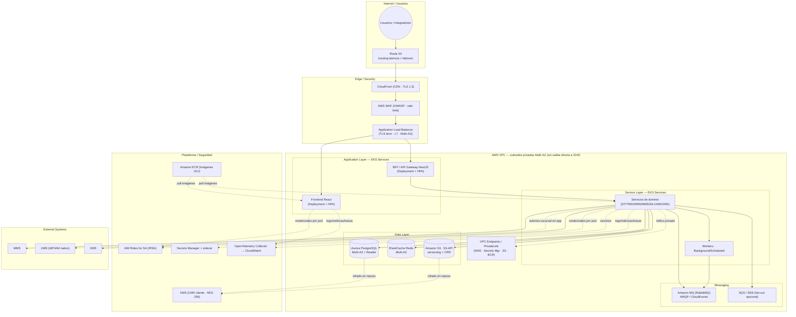

# AWS EKS — Diagrama de despliegue

  
  

**← [Volver a la alternativa AWS EKS](./README.md)**

> Diagrama **Mermaid por capas** (de arriba hacia abajo): Internet/Usuarios → Edge/Security → Application → Service → Messaging → Data → External Systems. Consolida el [Escenario 3 AWS](../../../escenarios-despliegue-multinube.es.md#3-escenario-aws-resiliencia-global-y-privacidad-total) de los escenarios multinube.

## Topología Multi-AZ activo-activo

## Notas del diagrama

- **Sin salida directa a Internet:** los pods alcanzan servicios AWS (KMS, Secrets Manager, S3, ECR) por **VPC Endpoints (PrivateLink)**; el tráfico no cruza Internet pública (ISO 27001 A.13.1.1).
- **Entrada de red global:** Route 53 con health-checks habilita el failover a la región secundaria ([ADR-0013](../../../adrs/core/0013-topologia-infraestructura-cloud-dr.es.md)).
- **Autorización por sucursal:** se resuelve en la capa de aplicación contra UMS ([ADR-0010](../../../adrs/core/0010-estrategia-arquitectura-multitenant.es.md)); no hay RLS de base de datos.
- **Mismo chart:** cada Deployment proviene del chart agnóstico [`ums-helm`](../../local/kind/README.md); IRSA sustituye a las llaves estáticas.

---

  <strong>© Unimar S.A.</strong> · RUC 20100412447 · Operador Logístico Aduanero desde 1978 
  Última revisión: 2026-07-22

