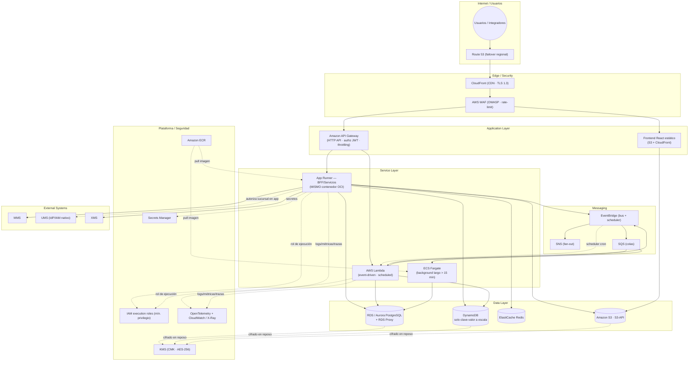

# AWS Serverless — Diagrama de despliegue

  
  

**← [Volver a la alternativa AWS Serverless](./README.md)**

> Diagrama **Mermaid por capas** (de arriba hacia abajo): Internet/Usuarios → Edge/Security → Application → Service → Messaging → Data → External Systems. El color de la ejecución distingue **contenedor** (App Runner/Fargate) de **serverless puro** (Lambda).

## Topología serverless / PaaS

## Notas del diagrama

- **Contenedor vs serverless puro:** App Runner y Fargate ejecutan **los mismos contenedores OCI** que EKS/Kind; Lambda cubre lo event-driven y programado. El frontend es estático en S3/CloudFront.
- **Protección de RDS:** las funciones y servicios acceden a PostgreSQL vía **RDS Proxy** para no agotar el pool de conexiones bajo alta concurrencia serverless.
- **DynamoDB por excepción:** solo donde el patrón clave-valor y la escala elástica lo justifican; el motor relacional del stack sigue siendo PostgreSQL.
- **Autorización por sucursal:** en la capa de aplicación contra UMS ([ADR-0010](../../../adrs/core/0010-estrategia-arquitectura-multitenant.es.md)); sin RLS.

---

  <strong>© Unimar S.A.</strong> · RUC 20100412447 · Operador Logístico Aduanero desde 1978 
  Última revisión: 2026-07-22

