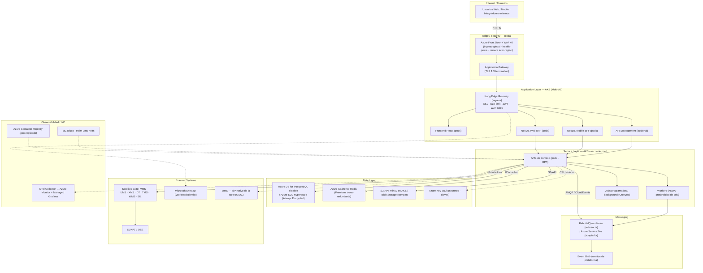

# Azure AKS — Diagrama de Despliegue

  
  

**← [Volver a Azure AKS](./README.md)** · [Deployment Hub](../../hub/deployment-architecture-hub.md)

> Diagrama **Mermaid por capas** (Internet → Edge/Security → Application → Service → Messaging → Data → External Systems), conforme a la [convención del Hub §5](../../hub/deployment-architecture-hub.md#5-convención-de-diagramas-de-despliegue). Consolida el [Escenario Azure de cumplimiento estricto](../../../escenarios-despliegue-multinube.es.md#2-escenario-azure-cumplimiento-estricto-empresarial).

## Vista por capas

## Notas del diagrama

- **Ingreso global** por Azure Front Door + WAF v2 con reroute inter-región ([ADR-0013](../../../adrs/core/0013-topologia-infraestructura-cloud-dr.es.md)).
- **Dos capas de gateway**: Kong Edge (no funcional) + BFF NestJS (composición) según [ADR-0030](../../../adrs/core/0030-api-gateway-ingress-vs-nestjs.es.md).
- **Tráfico privado** a BD y Key Vault vía Private Link; secretos por sidecar/CSI, nunca en Git ([stack §5.2](../../../stack-tecnologico-autorizado-agnostico.es.md)).
- **Caché multi-capa** (borde CDN opcional · BFF · núcleo) tras `ICachePort` ([ADR-0014](../../../adrs/core/0014-estrategia-cache-distribuido-redis.es.md)).
- **Portabilidad**: cada recurso Azure (línea punteada a servicios gestionados) se consume tras un Puerto ([ADR-0028](../../../adrs/core/0028-infraestructura-hibrida-autogestionada.es.md)); el mismo chart corre en Kind/EKS/RKE2.

---

  <strong>© Unimar S.A.</strong> · RUC 20100412447 · Operador Logístico Aduanero desde 1978 
  Última revisión: 2026-07-22

