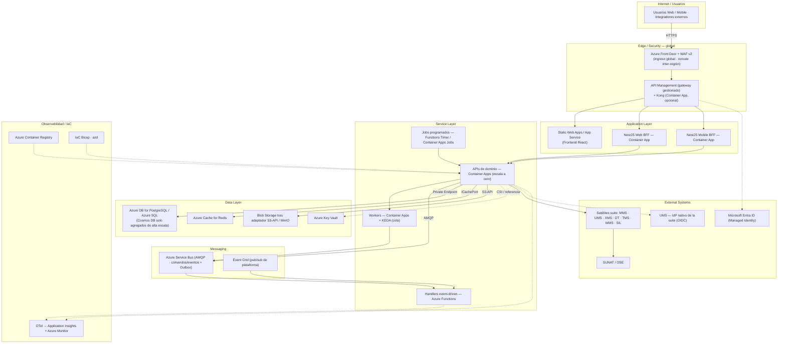

# Azure Serverless — Diagrama de Despliegue

  
  

**← [Volver a Azure Serverless](./README.md)** · [Deployment Hub](../../hub/deployment-architecture-hub.md)

> Diagrama **Mermaid por capas** (Internet → Edge/Security → Application → Service → Messaging → Data → External Systems), conforme a la [convención del Hub §5](../../hub/deployment-architecture-hub.md#5-convención-de-diagramas-de-despliegue). Modelo serverless seleccionado por tipo de workload: **contenedores en Container Apps** para lo de larga vida, **Functions** solo para eventos/timers.

## Vista por capas

## Notas del diagrama

- **Contenedor vs función**: BFF, APIs, workers y Kong son **contenedores en Container Apps** (reúso del artefacto `ums-helm`, paridad con AKS); solo los **handlers de eventos** (Service Bus/Event Grid) y **timers** son **Azure Functions**.
- **Escala a cero** en Container Apps y Functions; KEDA para workers por profundidad de cola.
- **Ingreso** por Front Door + WAF v2 ([ADR-0013](../../../adrs/core/0013-topologia-infraestructura-cloud-dr.es.md)) y APIM como gateway gestionado; Kong como Container App si se exige el patrón de dos capas ([ADR-0030](../../../adrs/core/0030-api-gateway-ingress-vs-nestjs.es.md)).
- **Portabilidad**: Service Bus, Cosmos, Blob y Key Vault (líneas punteadas) se consumen tras Puertos ([ADR-0028](../../../adrs/core/0028-infraestructura-hibrida-autogestionada.es.md)); `DEPLOYMENT_TOPOLOGY=SAAS_CLOUD` ([ADR-0039](../../../adrs/core/0039-switcher-abstraccion-topologia-despliegue.es.md)).
- **Cold start**: mitigar con réplicas mínimas / Always Ready en rutas C1 sensibles a p95.

---

  <strong>© Unimar S.A.</strong> · RUC 20100412447 · Operador Logístico Aduanero desde 1978 
  Última revisión: 2026-07-22

