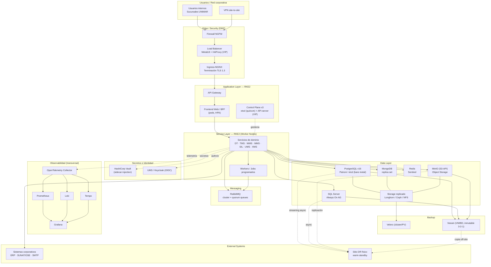
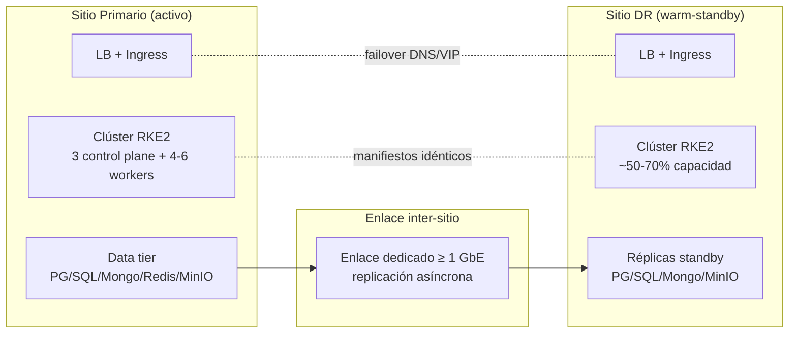

# Diagrama de despliegue — Producción On-Premise con Kubernetes

  
  
  
  

**← [Inicio](../../../../../../README.md) / [Hub de Arquitectura](../../../README.md) / [Deployment Hub](../../hub/deployment-architecture-hub.md) / [On-Premise K8s](./README.md) / Diagrama**

> Diagrama **Mermaid por capas** del despliegue On-Premise con RKE2, según la [convención del Hub §5](../../hub/deployment-architecture-hub.md#5-convención-de-diagramas-de-despliegue): Usuarios/Red corporativa → Edge/Security → Application → Service → Messaging → Data → External Systems, con observabilidad transversal y Sitio DR físico.

---

## 1. Vista por capas — Sitio Primario

## 2. Vista de doble sitio — Primario y DR

## 3. Leyenda de capas

| Capa | Componentes | Referencia |
| :-- | :-- | :-- |
| Usuarios / Red corporativa | Usuarios internos, VPN site-to-site | [Escenario 4](../../../escenarios-despliegue-multinube.es.md#4-escenario-on-premise-control-total-y-soberanía-extrema) |
| Edge / Security | NGFW, MetalLB+HAProxy, Ingress (TLS 1.3) | [ADR-0028](../../../adrs/core/0028-infraestructura-hibrida-autogestionada.es.md) |
| Application | Control plane (etcd/API-server), Frontend/BFF, API Gateway | [ADR-0039](../../../adrs/core/0039-switcher-abstraccion-topologia-despliegue.es.md) |
| Service | Servicios de dominio (7 sistemas), Workers/Jobs | [stack §7](../../../stack-tecnologico-autorizado-agnostico.es.md) |
| Messaging | RabbitMQ (quorum queues) | [ADR-0028](../../../adrs/core/0028-infraestructura-hibrida-autogestionada.es.md) |
| Data | PostgreSQL/Patroni, SQL Server, MongoDB, Redis, MinIO, Storage replicado | [ADR-0051](../../../adrs/core/0051-estrategia-motor-base-datos-empresarial.es.md) |
| Secretos / Identidad | Vault (sidecar), UMS/Keycloak (OIDC) | [ADR-0010](../../../adrs/core/0010-estrategia-arquitectura-multitenant.es.md) |
| Observabilidad | OpenTelemetry, Prometheus, Grafana, Loki, Tempo | [stack §6](../../../stack-tecnologico-autorizado-agnostico.es.md) |
| Backup / DR | Velero, Veeam (3-2-1 inmutable), Sitio DR físico | [ADR-0013](../../../adrs/core/0013-topologia-infraestructura-cloud-dr.es.md) |

---

  
  

  <strong>© Unimar S.A.</strong> · RUC 20100412447 · Operador Logístico Aduanero desde 1978 
  Última revisión: 2026-07-22

</content>
