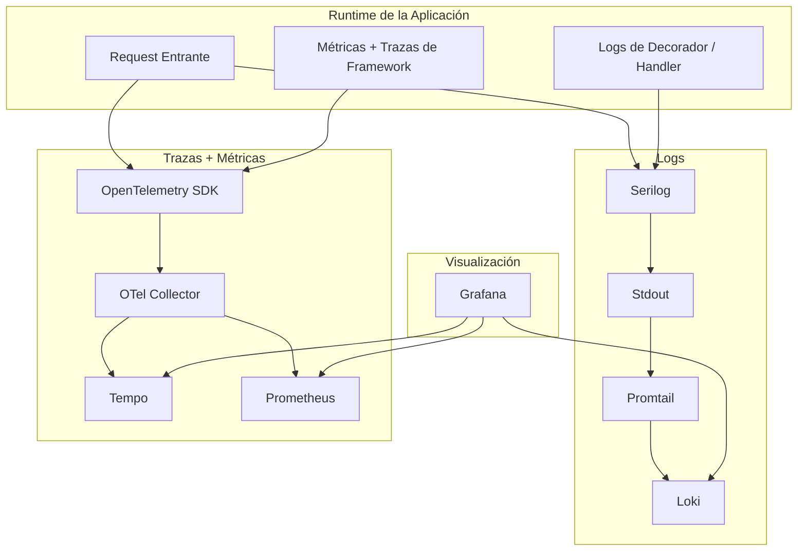
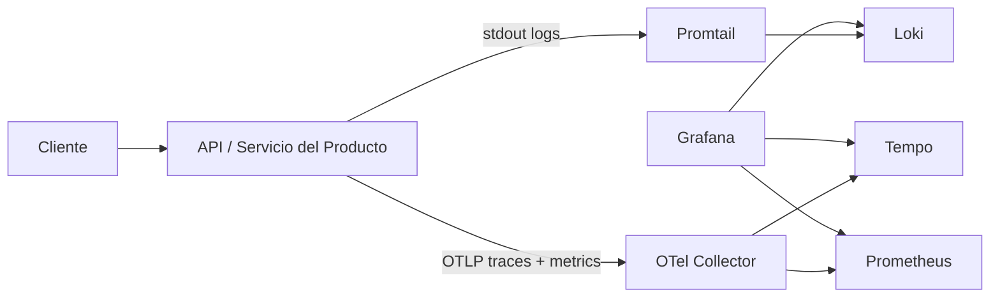

# Flujo de Arquitectura de Observabilidad

Este blueprint explica cómo un servicio alineado con los estándares debe propagar correlación por request, correlación de sesión, trazas, logs y métricas a través de middleware, decoradores de aplicación, instrumentación de runtime y la plataforma de observabilidad.

Complementa:
- [Observability Playbook](../governance/standards/engineering/playbook-observabilidad.es.md)
- [CP-01: Propagación de Contexto Scoped por Request](./canonical-patterns/dotnet/cp-01-propagacion-contexto-scope-request.es.md)
- [CP-02: Logging PII-Safe con Serilog](./canonical-patterns/dotnet/cp-02-logging-serilog-seguro-pii.es.md)
- [CP-04: Decorador AOP de Logging](./canonical-patterns/dotnet/cp-04-decorador-logging-aop.es.md)
- [ADR-0064: .NET Request-Scope Observability Context](./adrs/dotnet/0064-contexto-observabilidad-scope-request-dotnet.es.md)

## 1. Flujo Lógico de Señales

```mermaid
flowchart LR
    Client["Cliente / Navegador / Consumidor Upstream"]
    Correlation["Middleware de Correlación"]
    Session["Middleware de Session Tracking"]
    Context["Contexto de Ejecución Scoped"]
    RequestLog["Structured Request Logging"]
    Endpoint["Endpoint REST / GraphQL / gRPC"]
    Handler["Handler / Caso de Uso"]
    Aop["Decorador AOP de Logging"]
    ProductLogger["Logger Estructurado del Producto"]
    Activity["Activity.Current / Contexto W3C"]
    Mel["Microsoft ILogger"]
    Serilog["Pipeline Serilog"]
    Stdout["Stdout / Consola"]
    OTel["OpenTelemetry SDK"]
    Collector["OTel Collector"]
    Tempo["Tempo"]
    Promtail["Promtail"]
    Loki["Loki"]
    Prometheus["Prometheus"]
    Grafana["Grafana"]

    Client -->|"X-Correlation-Id\nX-Session-Tracking-Id"| Correlation
    Correlation --> Session
    Correlation -->|"baggage: correlation.id"| Activity
    Session --> Context
    Session -->|"baggage/tag: session.tracking_id"| Activity
    Session --> RequestLog
    RequestLog --> Endpoint
    Endpoint --> Handler
    Handler --> Aop
    Aop --> ProductLogger
    ProductLogger -->|"CorrelationId\nSessionTrackingId\nTraceId\nSpanId\nBoundedContext\nTenantId o Scope"| Mel
    Mel --> Serilog
    Serilog --> Stdout
    Stdout --> Promtail
    Promtail --> Loki

    Endpoint -. "ASP.NET / HttpClient / Runtime" .-> OTel
    Activity -. "trace/span actual" .-> OTel
    OTel -->|"OTLP traces + metrics"| Collector
    Collector --> Tempo
    Collector --> Prometheus

    Grafana --> Loki
    Grafana --> Tempo
    Grafana --> Prometheus
```

## 2. Responsabilidades por Capa

| Componente | Responsabilidad |
| --- | --- |
| Middleware de correlación | Resolver o generar un identificador por request y propagarlo a headers, scope de logs y `Activity` baggage. |
| Middleware de session tracking | Resolver o generar un identificador de sesión y persistirlo en contexto scoped y en `Activity` baggage/tags. |
| Contexto de ejecución scoped | Proveer un snapshot seguro consumible por AOP, exception handling, request logging y continuidad asíncrona. |
| Structured request logging | Emitir un log operativo por request con timing, path, status code, correlación, sesión, trace y span. |
| Decorador AOP de logging | Instrumentar entrada, salida, duración y excepciones sin acoplar la lógica de negocio al framework de logs. |
| Logger estructurado del producto | Aplicar enriquecimiento específico como `TenantId`, `BoundedContext`, `CorrelationId`, `SessionTrackingId`, `TraceId` y `SpanId`. |
| OpenTelemetry SDK | Generar trazas y métricas desde instrumentación de framework y la `Activity` activa. |
| OTel Collector | Recibir señales OTLP y distribuirlas a los backends de trazas y métricas. |
| Promtail | Enviar flujos de stdout a Loki cuando no se usa exportación directa de logs por OTLP. |

## 3. Ruteo por Tipo de Señal

## 4. Reglas Canónicas de Correlación

1. El cliente debería enviar `X-Session-Tracking-Id` en cada request cuando importe correlacionar el journey de negocio.
2. El servicio debe responder siempre con `X-Correlation-Id` y `X-Session-Tracking-Id`.
3. Los request logs, decorator logs y exception logs deben compartir el mismo envelope de correlación.
4. `SessionTrackingId` no debe emitirse como label general de métricas por su alta cardinalidad.
5. El contexto específico del producto como `TenantId` debe enriquecerlo el logger del producto, no el middleware genérico.

## 5. Vista de Despliegue

## 6. Aclaración Importante

Existen dos estilos válidos de despliegue:

- **Logs vía shipper de stdout**
  `Serilog -> stdout -> Promtail -> Loki`
- **Logs vía exportador OTLP directo**
  `Serilog -> OTLP -> OTel Collector -> backend de logs`

Ambos son compatibles con el estándar. El primero es más simple para entornos locales y containerizados. El segundo puede reducir moving parts cuando el runtime y la estrategia de sinks lo justifican.

## 7. Decisión de Promoción

Este blueprint es transversal porque no es específico de un producto. Generaliza las mismas necesidades para cualquier servicio `.NET + Serilog + OpenTelemetry + AOP` alineado con la plataforma.
