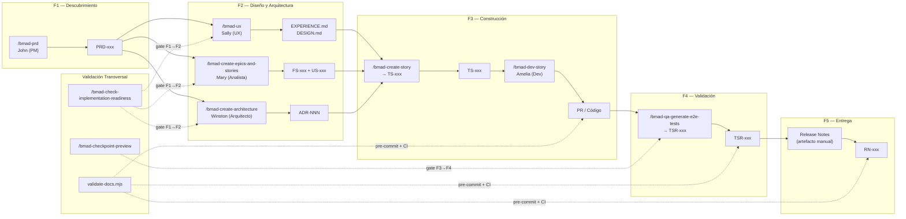

# Flujo Asistido por Agentes de IA

  
  
  
  

> **Audiencia:** Equipos de producto, arquitectos, desarrolladores, QA, PMs
> **Modo alternativo al manual:** Esta guía describe cómo ejecutar la cadena de trazabilidad SDLC completa mediante agentes de IA, como alternativa a la producción manual de artefactos.

---

<strong>Propósito</strong>

Este documento describe cómo gestionar todo el flujo de artefactos del SDLC —desde el PRD hasta las Notas de Lanzamiento— utilizando agentes de IA que aplican el [método BMAD](https://docs.bmad-method.org/) v6.8.0 con herramientas como VS Code, Claude, OpenCode y Antigravity.

El modelo de trazabilidad puede ejecutarse en dos modos:

| Modo | Descripción |
| :--- | :---------- |
| **Manual** | Los artefactos se producen siguiendo las plantillas del [catálogo de plantillas](../governance/sdlc/04-plantillas-artefactos/README.md). |
| **Asistido por agentes** | Los artefactos se generan, validan y encadenan mediante agentes de IA que aplican skills BMAD. **Este documento describe este modo.** |

---

<strong>Sobre el Método BMAD</strong>

[BMAD Method](https://docs.bmad-method.org/) v6.8.0 es la capa de planificación y orquestación con IA instalada en este repositorio. Define 59 skills de agente que cubren todo el ciclo de vida del producto. Toda la documentación y configuración del framework está en español.

**Para empezar a usar BMAD:**

1. Abre el repositorio en VS Code con OpenCode.
2. Ejecuta `/bmad-help` — el agente analizará tu fase actual y recomendará el siguiente skill.
3. Sigue la secuencia de la [Visión General del Flujo](#2-visión-general-del-flujo) invocando cada skill en orden.

> **Documentación local en español:** [`docs/README.md`](../../docs/README.md) — guía completa de artefactos BMAD, configuración y lista de skills instalados.
>
> **Documentación oficial:** [https://docs.bmad-method.org/](https://docs.bmad-method.org/) — referencia completa del método, ejemplos y patrones.
>
> **Guía rápida de 60 segundos:** Ejecuta `/bmad-help` en OpenCode y selecciona tu objetivo actual. El agente te guiará paso a paso.

**Mapeo de skills BMAD a la cadena de trazabilidad SDLC:**

| Cadena SDLC | Skill BMAD | Agente | ¿Qué produce? |
| :---------- | :--------- | :----- | :------------ |
| PRD → | `bmad-prd` | John (PM) | Documento de Requisitos de Producto |
| FS → | `bmad-create-epics-and-stories` | Mary (Analista) | Historias Funcionales |
| US → | `bmad-create-epics-and-stories` + `bmad-create-story` | Mary / Amelia | Historias de Usuario |
| ADR → | `bmad-create-architecture` | Winston (Arquitecto) | Architecture Decision Records |
| TS → | `bmad-create-story` | Amelia (Dev) | Historias Técnicas |
| PR → | `bmad-dev-story` | Amelia (Dev) | Código + Pull Request |
| TSR → | `bmad-qa-generate-e2e-tests` | Agente QA | Reporte Resumen de Pruebas |
| RN → | *(manual)* | Paige (Tech Writer) | Notas de Lanzamiento |

---

<strong>Visión General del Flujo</strong>

## 2. Visión General del Flujo

---

<strong>Secuencia Paso a Paso</strong>

| # | Artefacto | Agente / Skill | ¿Cómo se ejecuta? | ¿Por qué se realiza? | ¿Dónde? | Herramientas |
| :-: | :-------- | :------------- | :----------------- | :------------------- | :------- | :----------- |
| 1 | **PRD** | John (PM) — `/bmad-prd` | Se invoca el skill `bmad-prd` con la intención de producto. El agente John guía una conversación de descubrimiento y produce el archivo `PRD-<producto>-<NNN>.es.md` con la estructura canónica. | Congelar alcance antes de diseñar. Toda la cadena deriva de este artefacto. | VS Code — OpenCode — `docs/planning-artifacts/prd/` | OpenCode, Claude, skill `bmad-prd` |
| 2 | **EXPERIENCE.md + DESIGN.md** | Sally (UX) — `/bmad-ux` | Se invoca `bmad-ux` con el PRD como entrada. Sally produce los archivos de experiencia y diseño de UX, con flujos, prototipos y especificaciones. | Formalizar la experiencia de usuario antes de la arquitectura técnica. | VS Code — OpenCode — `docs/planning-artifacts/ux/` | OpenCode, Claude, skill `bmad-ux` |
| 3 | **ADR** | Winston (Arquitecto) — `/bmad-create-architecture` | Se invoca `bmad-create-architecture` con el PRD y los artefactos de UX como contexto. Winston guía la creación de decisiones arquitectónicas y produce los ADRs correspondientes. | Documentar decisiones técnicas que regirán la implementación. Los ADRs alimentan las TS. | VS Code — OpenCode — `reference/architecture/adrs/` | OpenCode, Claude, skill `bmad-create-architecture` |
| 4 | **FS + US** | Mary (Analista) — `/bmad-create-epics-and-stories` | Se invoca `bmad-create-epics-and-stories` con el PRD y los ADRs. Mary descompone el alcance en épicas, historias funcionales (FS) e historias de usuario (US), cada una con sus criterios de aceptación. | Descomponer el alcance en unidades atómicas verificables. Las FS y US son la entrada de las TS. | VS Code — OpenCode — `docs/planning-artifacts/stories/` | OpenCode, Claude, skill `bmad-create-epics-and-stories` |
| 5 | **TS** | Amelia (Dev) — `/bmad-create-story` | Por cada historia a implementar, se invoca `bmad-create-story` con la US y los ADRs aplicables. Amelia genera la historia técnica (TS) que detalla tareas, dependencias, riesgos y cobertura de pruebas. | Traducir el diseño funcional en trabajo técnico concreto. Cada TS declara su ADR padre (validado en CI). | VS Code — OpenCode — `docs/planning-artifacts/stories/` | OpenCode, Claude, skill `bmad-create-story` |
| 6 | **PR / Código** | Amelia (Dev) — `/bmad-dev-story` | Se invoca `bmad-dev-story` con el archivo de la TS. Amelia implementa el código, escribe pruebas, ejecuta linting y produce el Pull Request que referencia la TS en el título o cuerpo. | Implementar la solución validada por la TS. El PR es la evidencia de que el código fue producido. | VS Code — OpenCode — repositorio de producto | OpenCode, Claude, skill `bmad-dev-story`, GitHub CLI |
| 7 | **TSR** | Agente QA — `/bmad-qa-generate-e2e-tests` | Se invoca `bmad-qa-generate-e2e-tests` con las TS implementadas. El agente genera pruebas E2E automatizadas y produce el Reporte Resumen de Pruebas (TSR) que lista explícitamente los identificadores TS cubiertos. | Evidenciar la calidad antes de sellar el release. El TSR sin TS listadas bloquea el gate RC Sellado. | VS Code — OpenCode — `docs/planning-artifacts/qa/` | OpenCode, Claude, skill `bmad-qa-generate-e2e-tests`, Playwright/Cypress |
| 8 | **RN** | Manual / Paige (Tech Writer) | Con el RC sellado, se producen las Notas de Lanzamiento (RN) siguiendo la [plantilla correspondiente](../governance/sdlc/04-plantillas-artefactos/plantilla-notas-lanzamiento.es.md). La RN referencia el TSR que validó el release. | Comunicar cambios, limitaciones y dependencias de la versión a stakeholders. | VS Code — OpenCode — `docs/releases/` | OpenCode, skill `bmad-agent-tech-writer` |

---

<strong>Ejemplo Concreto End-to-End</strong>

**Contexto:** Producto UMS (Unimar Management System) — Módulo de trazabilidad aduanera.

| Paso | Invocación | Artefacto Generado | ID |
| :--- | :---------- | :----------------- | :-: |
| 1 | `bmad-prd` con la intención "Módulo de trazabilidad aduanera para seguimiento de expedientes" | `PRD-UMS-001.es.md` | `PRD-UMS-001` |
| 2 | `bmad-ux` con entrada `PRD-UMS-001` | `EXPERIENCE-UMS-001.es.md`, `DESIGN-UMS-001.es.md` | — |
| 3 | `bmad-create-architecture` con entrada `PRD-UMS-001` | `ADR-0041.es.md` (selección de base de datos), `ADR-0042.es.md` (patrón de trazabilidad) | `ADR-0041`, `ADR-0042` |
| 4 | `bmad-create-epics-and-stories` con entradas anteriores | Épica `EP-UMS-001`, `FS-UMS-012.es.md`, `US-UMS-034.es.md` | `FS-UMS-012`, `US-UMS-034` |
| 5 | `bmad-create-story` con `US-UMS-034` + `ADR-0041`, `ADR-0042` | `TS-UMS-056.es.md` (declara `Parent: US-UMS-034`, `ADR: ADR-0041, ADR-0042`) | `TS-UMS-056` |
| 6 | `bmad-dev-story` con `TS-UMS-056` | PR en GitHub: `feat: implementar trazabilidad aduanera (TS-UMS-056)` | `PR-UMS-042` |
| 7 | `bmad-qa-generate-e2e-tests` con `TS-UMS-056` | `TSR-UMS-001.es.md` (lista `TS-UMS-056` en su contenido) | `TSR-UMS-001` |
| 8 | Redacción manual siguiendo plantilla RN | `RN-UMS-1.0.0.es.md` (referencia `TSR-UMS-001`) | `RN-UMS-1.0.0` |

---

<strong>Puntos de Validación Automática</strong>

El script `validate-docs.mjs` verifica en pre-commit y CI:

| Validación | Impacto |
| :--------- | :------ |
| Toda `TS` referencia un `ADR` con `Estado: Aceptado` | Bloquea el commit si la TS no declara su ADR padre |
| Todo `TSR` lista identificadores `TS-xxx` | Bloquea el commit si el TSR no menciona las TS cubiertas |
| Gaps: `FS` sin `US` asociadas, `US` sin `TS` asociadas | Genera advertencia informativa |
| Encoding UTF-8, sin BOM ni CRLF | Bloquea el commit |

---

<strong>Beneficios del Flujo Asistido</strong>

| Aspecto | Modo Manual | Modo Asistido por Agentes |
| :------ | :---------- | :------------------------ |
| Tiempo de producción de PRD | 2–5 días | 1–2 horas |
| Consistencia de artefactos | Depende del autor | Garantizada por plantillas y validación automática |
| Trazabilidad cruzada | Verificación manual | Validada en cada commit |
| Curva de aprendizaje | Alta (requiere leer todo el corpus) | Guiada por agentes especializados |
| Reproducibilidad | Variable | Consistente (mismo método cada vez) |

---

<strong>Glosario de Herramientas</strong>

| Herramienta | Rol en el flujo | Instalación en Windows |
| :---------- | :-------------- | :--------------------- |
| **VS Code** | Editor principal donde se crean y modifican los artefactos. | Descargar el instalador desde [code.visualstudio.com](https://code.visualstudio.com/) y ejecutar `VSCodeSetup-*.exe`. Marcar "Agregar a PATH" durante la instalación. |
| **OpenCode** | Runner de agentes que ejecuta las skills BMAD en el contexto del repositorio. Ejecuta `/bmad-help` para comenzar. | Requiere **Node.js 18+** ([nodejs.org](https://nodejs.org/)). Instalar con: `npm install -g @opencode/cli`. Verificar con `opencode --version`. |
| **BMAD Method** | Framework de planificación y orquestación con IA v6.8.0. Documentación oficial: [docs.bmad-method.org](https://docs.bmad-method.org/). Guía local en español: [`docs/README.md`](../../docs/README.md). | Ya incluido en este repositorio en `_bmad/`. En proyectos nuevos, instalar con: `npx bmad-method install --action full --project-dir .` (requiere Python 3.9+ y Node.js 18+). |
| **Claude** | Motor de IA que potencia los agentes BMAD. | Acceso vía web en [claude.ai](https://claude.ai/) o mediante API con clave desde [console.anthropic.com](https://console.anthropic.com/). Para uso local con OpenCode, configurar la clave `ANTHROPIC_API_KEY` en las variables de entorno del sistema. |
| **Antigravity** | Extensión VS Code que integra agentes de IA en el editor para ediciones contextuales. | Instalar desde el marketplace de VS Code: buscar "Antigravity" y hacer clic en "Instalar". Alternativamente, desde la terminal: `code --install-extension antigravity.antigravity`. |
| **GitHub Actions** | Ejecuta `validate-docs.mjs` y `markdownlint` en cada PR para bloquear cadenas incompletas. | No requiere instalación local. El workflow se define en `.github/workflows/docs.yml`. Para depuración local, usar [act](https://github.com/nektos/act): `winget install nektos.act`. |
| **Husky + lint-staged** | Ejecuta validaciones en pre-commit antes de que el código salga del entorno local. | Husky requiere Git y Node.js. Instalar en el proyecto: `npm install --save-dev husky lint-staged && npx husky init`. En Windows, asegurar que Git esté instalado con "Git Bash" habilitado. |

---

<strong>Documentos Relacionados</strong>

| Documento | Propósito |
| :-------- | :-------- |
| [Modelo de Trazabilidad](../governance/sdlc/modelo-trazabilidad.es.md) | Cadena de evidencia end-to-end y reglas de derivación de artefactos. |
| [Mapeo SDLC–Artefactos](../governance/sdlc/mapeo-artefactos-sdlc.es.md) | Define los artefactos requeridos por fase. |
| [Gates de Calidad SDLC](../governance/sdlc/gates-calidad.es.md) | Compuertas de promoción entre fases y política de waivers. |
| [Framework SDLC Orientado a Construcción](../governance/sdlc/02-ingenieria/framework-sdlc-enfoque-construccion.es.md) | Visión general del SDLC y Definición de Hecho. |
| [Catálogo de Plantillas](../governance/sdlc/04-plantillas-artefactos/README.md) | Plantillas reutilizables para cada artefacto del SDLC. |
| [Centro de Gobernanza SDLC](../governance/sdlc/README.md) | Hub de navegación del SDLC. |

---

  
  

  <strong>© Unimar S.A.</strong> · RUC 20100412447 · Operador Logístico Aduanero desde 1978 
  Última revisión: 2026-06-11

