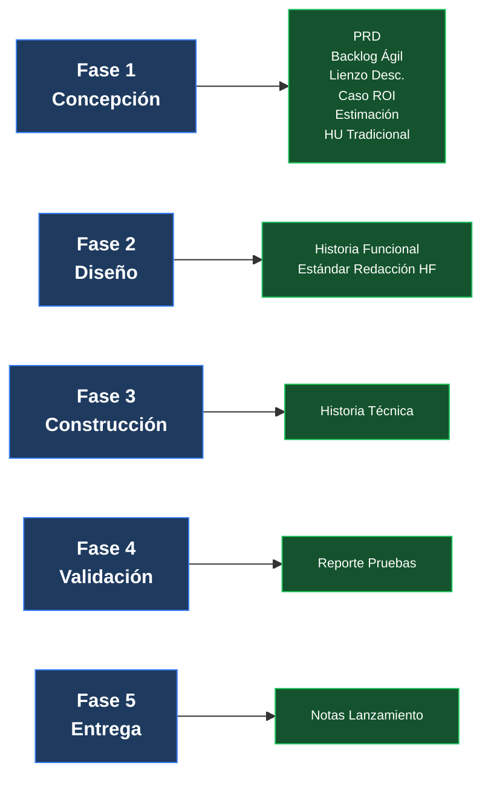

# Plantillas de Artefactos

<p align="right">
  
  
  
  
</p>

**← [Inicio](../../../../README.md) / [SDLC](../README.md) / Plantillas de Artefactos**

> **Fase:** Transversal

Catálogo de plantillas reutilizables y ejemplos del SDLC de Unimar, organizadas por fase del ciclo de vida. Cada plantilla incluye una versión fuente (copiable) y un ejemplo renderizado completo.

---

## Vista General — Artefactos por Fase

<details>
<summary><strong>Diagrama de flujo de artefactos por fase</strong></summary>



</details>

---

## Fase 1 — Concepción y Descubrimiento

<details>
<summary><strong>Gate:</strong> Aprobación de Negocio — Alcance Congelado</summary>

| Plantilla | Propósito | Req | Fuente | Ejemplo |
|---|---|---|---|---|
| [PRD](./plantilla-prd.es.md) | Documento de requisitos del producto con visión, objetivos y especificaciones | **R** | [Fuente](./fuente/plantilla-prd-fuente.es.md) | UMS |
| [Épica](./plantilla-epica.es.md) | Contenedor de alto nivel que agrupa historias funcionales con objetivo de negocio común | O | [Fuente](./fuente/plantilla-epica-fuente.es.md) | UMS |
| [Backlog Ágil](./plantilla-backlog-agil.es.md) | Agrupación versionada de historias listas para priorización | **R** | [Fuente](./fuente/plantilla-backlog-agil-fuente.es.md) | UMS |
| [Historia de Usuario](./plantilla-historia-usuario.es.md) | Formato tradicional de historia de usuario con contexto de negocio | **R** | [Fuente](./fuente/plantilla-historia-usuario-fuente.es.md) | UMS |
| [Lienzo de Descubrimiento](./plantilla-lienzo-descubrimiento.es.md) | Exploración rápida de problemas y soluciones | O | [Fuente](./fuente/plantilla-lienzo-descubrimiento-fuente.es.md) | UMS |
| [Caso de Negocio ROI](./plantilla-caso-negocio-roi.es.md) | Análisis de retorno de inversión | O | [Fuente](./fuente/plantilla-caso-negocio-roi-fuente.es.md) | UMS |
| [Estimación Preliminar](./plantilla-estimacion-preliminar.es.md) | Estimación de esfuerzo, duración y costo del proyecto | O | [Fuente](./fuente/plantilla-estimacion-preliminar-fuente.es.md) | UMS |

</details>

---

## Fase 2 — Diseño y Arquitectura

<details>
<summary><strong>Gate:</strong> Baseline de Diseño Aprobado</summary>

| Plantilla | Propósito | Req | Fuente | Ejemplo |
|---|---|---|---|---|
| [Historia Funcional](./plantilla-historia-funcional.es.md) | Contrato de comportamiento verificable entre Producto y Construcción, estructurado en épicas e historias | **R** | [Fuente](./fuente/plantilla-historia-funcional-fuente.es.md) | UMS |
| [ADR](./plantilla-adr.es.md) | Registro de decisiones arquitectónicas | **R** | [Fuente](./fuente/plantilla-adr-fuente.es.md) | UMS |
| [Blueprint de Arquitectura](./plantilla-blueprint-arquitectura.es.md) | Documento arc42 por-producto: fronteras, contenedores (C4), atributos de calidad y fase de evolución. Instancia de la [Arquitectura de Referencia](../../../architecture/blueprints/blueprint-referencia.es.md). Se inicia como borrador en Discovery (Fase 1) | **R** | [Fuente](./fuente/plantilla-blueprint-arquitectura-fuente.es.md) | [Q-Track](./ejemplos/ejemplo-blueprint-arquitectura-qtrack.es.md) |

</details>

---

## Fase 3 — Construcción

<details>
<summary><strong>Gate:</strong> Build Exitoso — Merge de PR Autorizado</summary>

| Plantilla | Propósito | Req | Fuente | Ejemplo |
|---|---|---|---|---|
| [Historia Técnica](./plantilla-historia-tecnica.es.md) | Traducción de la historia funcional en tareas técnicas de diseño e implementación | **R** | [Fuente](./fuente/plantilla-historia-tecnica-fuente.es.md) | UMS |

</details>

---

## Fase 4 — Validación y QA

<details>
<summary><strong>Gate:</strong> RC Sellado</summary>

| Plantilla | Propósito | Req | Fuente | Ejemplo |
|---|---|---|---|---|
| [Reporte Resumen de Pruebas](./plantilla-reporte-resumen-pruebas.es.md) | Resumen de resultados de pruebas, métricas de umbral y evidencia RC | **R** | [Fuente](./fuente/plantilla-reporte-pruebas-fuente.es.md) | UMS |

</details>

---

## Fase 5 — Entrega y Operaciones

<details>
<summary><strong>Gate:</strong> Producción Activa — Monitoreo Nominal</summary>

| Plantilla | Propósito | Req | Fuente | Ejemplo |
|---|---|---|---|---|
| [Notas de Lanzamiento](./plantilla-notas-lanzamiento.es.md) | Notas de release para el equipo y stakeholders | **R** | [Fuente](./fuente/plantilla-notas-lanzamiento-fuente.es.md) | UMS |

</details>

---

## Estructura de Carpetas

<details>
<summary><strong>Árbol de directorios del catálogo de plantillas</strong></summary>

```
04-plantillas-artefactos/
├── README.md                        ← Este archivo (índice por fases)
├── plantilla-*.es.md                ← Portadas de cada plantilla
├── fuente/
│   └── plantilla-*-fuente.es.md     ← Plantillas fuente reutilizables
└── ejemplos/
    └── ejemplo-*-ums.es.md          ← Ejemplos completos renderizados
```

</details>

---

## Artefactos Relacionados

<details>
<summary><strong>Documentos complementarios del SDLC</strong></summary>

| Documento | Ubicación |
|---|---|
| Mapeo SDLC–Artefactos | [`../mapeo-artefactos-sdlc.es.md`](../mapeo-artefactos-sdlc.es.md) |
| Framework SDLC | [`../02-ingenieria/framework-sdlc-enfoque-construccion.es.md`](../02-ingenieria/framework-sdlc-enfoque-construccion.es.md) |
| Gates de Calidad | [`../gates-calidad.es.md`](../gates-calidad.es.md) |
| Modelo de Trazabilidad | [`../modelo-trazabilidad.es.md`](../modelo-trazabilidad.es.md) |

</details>

---

<p align="center">
  
  
</p>

<p align="center">
  <strong>© Unimar S.A.</strong> · RUC 20100412447 · Operador Logístico Aduanero desde 1978<br>
  Última revisión: 2026-06-08
</p>