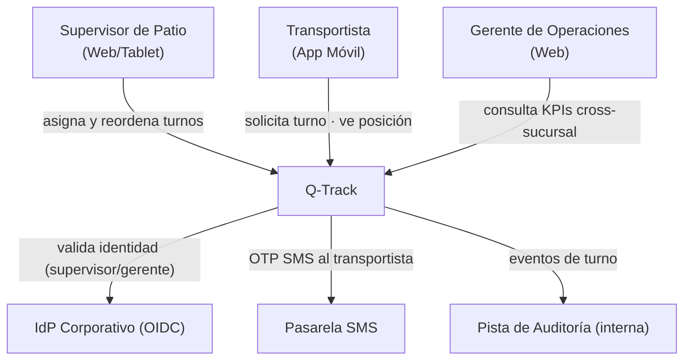
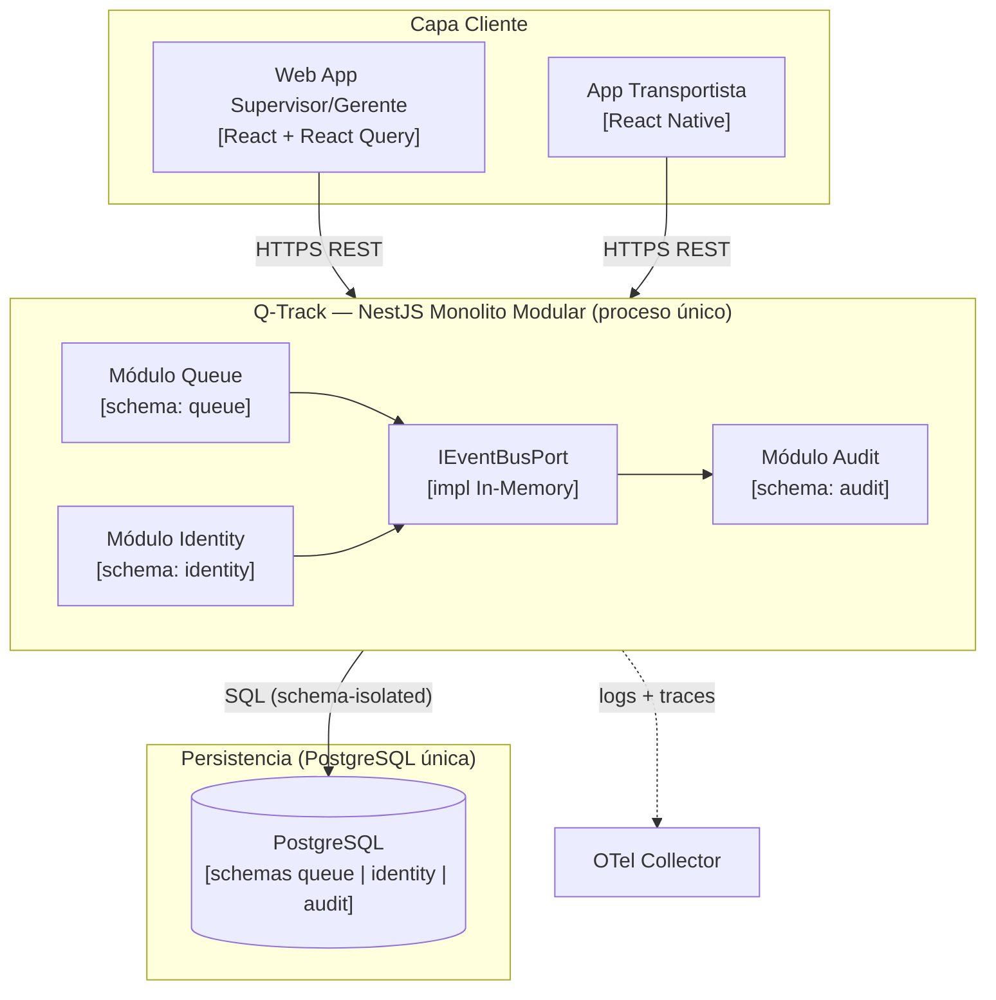
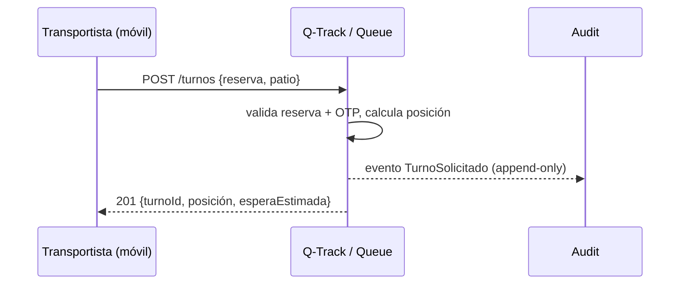

# Ejemplo: Blueprint de Arquitectura — Q-Track (Gestión de Turnos de Camiones)

  
  
  
  

> **Estado:** Ejemplo ilustrativo (no es un producto en producción)
> **Producto:** Q-Track — Sistema de gestión de turnos y colas de camiones
> **Plantilla fuente:** [plantilla-blueprint-arquitectura-fuente](../fuente/plantilla-blueprint-arquitectura-fuente.es.md)
> **Referencia corporativa:** [Arquitectura de Referencia](../../../../architecture/blueprints/blueprint-referencia.es.md)

---

## 1. Metadatos

- **Identificador:** `BP-QTRACK-001`
- **Producto:** Q-Track
- **PRD padre:** `PRD-QTRACK-001`
- **Versión:** 0.1.0
- **Estado:** Aprobado (Baseline de Diseño)
- **Fase de evolución actual:** Monolito Modular
- **Runtime(s) primario(s):** Node.js / TypeScript (NestJS)
- **Autor(es):** Equipo de Arquitectura — Operaciones Portuarias
- **Aprobador de Arquitectura:** Architecture Board
- **Fecha de Aprobación:** 2026-06-26

---

## 2. Introducción y Objetivos

### 2.1 Propósito del producto
Q-Track gestiona la asignación de turnos y la cola de camiones en los patios de Unimar para reducir el tiempo de espera promedio y eliminar la asignación manual por radio. Sustituye una hoja de cálculo compartida y llamadas telefónicas.

### 2.2 Objetivos arquitectónicos clave
1. Operación **multicanal**: tablet del supervisor de patio (web) y app del transportista (móvil).
2. **Baja latencia** en la asignación de turno (respuesta percibida inmediata).
3. **Operación por sucursal**: cada patio (Paita, Callao) opera su propia cola, con consolidación gerencial cross-sucursal.
4. **Trazabilidad/auditoría** de cada cambio de estado del turno (cumplimiento aduanero).

### 2.3 Atributos de Calidad Obligatorios

| Atributo de Calidad | Objetivo medible | ADR / Estándar fuente |
| --- | --- | --- |
| Latencia de asignación de turno | p95 < 300 ms | [ADR-0014](../../../../architecture/adrs/core/0014-estrategia-cache-distribuido-redis.es.md) |
| Cobertura de pruebas (lógica de negocio) | ≥ 80% (70/20/10) | [ADR-0018](../../../../architecture/adrs/core/0018-piramide-pruebas-gates-calidad.es.md) |
| Seguridad de acceso por patio | RBAC/ABAC vía claim `sucursales_autorizadas` | [ADR-0010](../../../../architecture/adrs/core/0010-estrategia-arquitectura-multitenant.es.md) |
| Auditoría de cambios de estado | Pista append-only inmutable | [Directivas Arquitectónicas](../../../../governance/standards/vision/directivas-arquitectonicas.es.md) |

---

## 3. Restricciones Arquitectónicas

| # | Restricción | Origen | ¿Negociable? |
| --- | --- | --- | --- |
| 1 | Cumplir la Baseline Agnóstica corporativa | [stack-autorizado](../../../../architecture/stack-tecnologico-autorizado-agnostico.es.md) | No |
| 2 | Arquitectura Hexagonal (Ports & Adapters) | [ADR-0002](../../../../architecture/adrs/nodejs/0002-arquitectura-limpia-nestjs.es.md) | No |
| 3 | Topología inicial = Monolito Modular | [ADR-0047](../../../../architecture/adrs/core/0047-patrones-arquitectonicos-monolito-soa-microservicios.es.md) | Solo vía ADR |
| 4 | El transportista no autentica con cuenta corporativa: usa código de reserva + OTP SMS | PRD-QTRACK-001 | Sí (revisable en Fase 2) |

---

## 4. Contexto y Alcance (C4 Nivel 1)

### 4.1 Diagrama de Contexto del Sistema

### 4.2 Sistemas externos e integraciones

| Sistema externo | Dirección | Contrato | Notas |
| --- | --- | --- | --- |
| IdP Corporativo | Saliente | OIDC | Solo supervisores y gerentes |
| Pasarela SMS | Saliente | REST (OpenAPI) | OTP para transportistas sin cuenta |

---

## 5. Estrategia de Solución

| Driver | Enfoque elegido | ADR |
| --- | --- | --- |
| Estilo arquitectónico | Hexagonal + Monolito Modular | [ADR-0002](../../../../architecture/adrs/nodejs/0002-arquitectura-limpia-nestjs.es.md), [ADR-0047](../../../../architecture/adrs/core/0047-patrones-arquitectonicos-monolito-soa-microservicios.es.md) |
| Límites de datos | Schema-per-context (`queue`, `identity`, `audit`) | [ADR-0031](../../../../architecture/adrs/core/0031-esquema-por-contexto-catalogo-eventos-dominio.es.md) |
| Protocolos de API | REST (sin gRPC/GraphQL en Fase 1) | [ADR-0032](../../../../architecture/adrs/core/0032-matriz-decision-protocolos-api-rest-grpc-graphql.es.md) |
| Dimensión de negocio (patio) | `sucursal_id` como atributo + claim RBAC/ABAC | [ADR-0010](../../../../architecture/adrs/core/0010-estrategia-arquitectura-multitenant.es.md) |

**Fase de evolución declarada:** Monolito Modular. **Justificación:** un único proceso cubre los 2 patios actuales y < 500 turnos/día. La extracción de servicios solo se justificará si se incorporan > 5 patios o se requiere un motor de optimización de colas independiente — detonante registrado, no implementado hoy.

---

## 6. Vista de Bloques Constructivos (C4 Nivel 2 — Contenedores)

### 6.1 Módulos / Bounded Contexts

| Módulo | Responsabilidad | Schema | Owner |
| --- | --- | --- | --- |
| Queue | Ciclo de vida del turno: solicitar, asignar, reordenar, llamar, cerrar | `queue` | Equipo Operaciones |
| Identity | Autenticación de supervisor/gerente (OIDC) y OTP de transportista | `identity` | Equipo Operaciones |
| Audit | Registro append-only de cada transición de estado del turno | `audit` | Equipo Operaciones |

---

## 7. Vista en Ejecución (flujo clave: solicitud de turno)

---

## 8. Vista de Despliegue
Fase 1: un proceso NestJS, una instancia PostgreSQL, Docker Compose para dev local. Sin Ingress gateway (HTTPS directo) y bus de eventos in-memory. OTel Collector para logs/traces. Redis se añadirá solo si se incumple el umbral p95 < 300 ms ([ADR-0014](../../../../architecture/adrs/core/0014-estrategia-cache-distribuido-redis.es.md)).

---

## 9. Conceptos Transversales

| Concepto | Decisión del producto | ADR / Estándar |
| --- | --- | --- |
| Seguridad / AuthZ | Supervisores/gerentes vía OIDC; transportistas vía OTP. Acceso a cola filtrado por claim `sucursales_autorizadas` | [Directivas Arquitectónicas](../../../../governance/standards/vision/directivas-arquitectonicas.es.md) |
| Observabilidad | OTel + logs estructurados desde el día 1 | [Flujo de Observabilidad](../../../../architecture/flujo-arquitectura-observabilidad.es.md) |
| Manejo de datos | Schema-per-context; sin RLS (autorización en capa de aplicación) | [ADR-0031](../../../../architecture/adrs/core/0031-esquema-por-contexto-catalogo-eventos-dominio.es.md) |
| Auditoría | Pista append-only de transiciones de turno | [ADR-0010](../../../../architecture/adrs/core/0010-estrategia-arquitectura-multitenant.es.md) |

---

## 10. Decisiones Arquitectónicas (registro consolidado)

| ADR | Decisión | Estado | Aplicabilidad en este producto |
| --- | --- | --- | --- |
| [ADR-0047](../../../../architecture/adrs/core/0047-patrones-arquitectonicos-monolito-soa-microservicios.es.md) | Topología inicial Monolito Modular | Aceptado | 2 patios, < 500 turnos/día |
| [ADR-0002](../../../../architecture/adrs/nodejs/0002-arquitectura-limpia-nestjs.es.md) | Arquitectura Hexagonal | Aceptado | Dominio Queue sin dependencias de framework |
| [ADR-0010](../../../../architecture/adrs/core/0010-estrategia-arquitectura-multitenant.es.md) | Sucursal como dimensión de negocio | Aceptado | Patio = `sucursal_id`, no tenant aislado |
| [ADR-0018](../../../../architecture/adrs/core/0018-piramide-pruebas-gates-calidad.es.md) | Pirámide de testing | Aceptado | 70/20/10, cobertura ≥ 80% |
| [ADR-0032](../../../../architecture/adrs/core/0032-matriz-decision-protocolos-api-rest-grpc-graphql.es.md) | Protocolos API | Aceptado | REST únicamente en Fase 1 |

---

## 11. Requisitos de Calidad y Escenarios

| ID | Escenario de calidad | Estímulo | Respuesta esperada | Métrica |
| --- | --- | --- | --- | --- |
| Q-01 | Pico de llegada matutina | 80 solicitudes de turno en 1 min | Asignación sin degradación perceptible | p95 < 300 ms |
| Q-02 | BD temporalmente no disponible | Caída de PostgreSQL | 503 controlado + reintento; sin pérdida de turnos confirmados | Detección < 1 s |
| Q-03 | Supervisor sin permiso sobre el patio | Intento de reordenar cola de otro patio | 403 Forbidden | 100% de los intentos bloqueados |

---

## 12. Riesgos y Deuda Técnica

| # | Riesgo / Deuda | Impacto | Probabilidad | Mitigación / Plan |
| --- | --- | --- | --- | --- |
| 1 | OTP SMS depende de pasarela de tercero | Medio | Media | Circuit breaker + fallback a validación manual del supervisor; owner: Tech Lead, 2026-Q3 |
| 2 | Cálculo de espera estimada simplificado (FIFO) | Bajo | Alta | Aceptado en Fase 1; motor de optimización como detonante de extracción de servicio |

---

## 13. Glosario

| Término | Definición |
| --- | --- |
| Turno | Solicitud de un transportista para ingresar a un patio en una ventana de tiempo |
| Patio | Instalación física (Paita, Callao); equivale a `sucursal_id` |
| Llamar turno | Acción del supervisor que habilita el ingreso físico del camión |

---

## 14. Trazabilidad

- **PRD padre:** `PRD-QTRACK-001`
- **Historias Funcionales derivadas:** `FS-QTRACK-001` (solicitar turno), `FS-QTRACK-002` (reordenar cola), `FS-QTRACK-003` (consolidado gerencial)
- **ADR referenciados:** ADR-0002, ADR-0010, ADR-0018, ADR-0031, ADR-0032, ADR-0047
- **Blueprint corporativo de referencia:** [Arquitectura de Referencia](../../../../architecture/blueprints/blueprint-referencia.es.md)

---

  
  

  <strong>© Unimar S.A.</strong> · RUC 20100412447 · Operador Logístico Aduanero desde 1978 
  Última revisión: 2026-06-26

