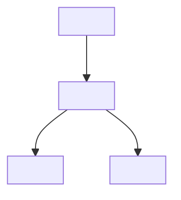
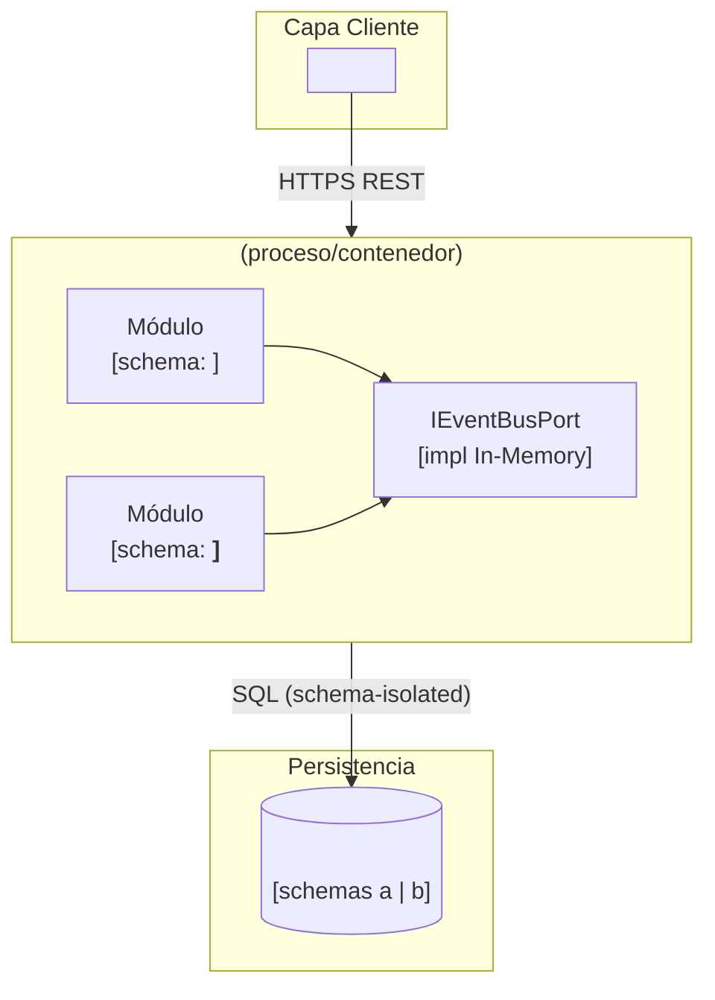

# Plantilla: Blueprint de Arquitectura de Producto (arc42)

  
  
  
  

> **Fase:** 2 — Diseño y Arquitectura (borrador desde Fase 1 — Discovery)
> **Padre:** [Plantillas de Artefactos](../README.md)

<!--
  CÓMO USAR ESTE ARCHIVO
  1. Copia este archivo al repositorio del producto: docs/architecture/blueprint-<producto>.es.md
  2. Reemplaza todo <placeholder> y borra los comentarios de guía.
  3. Mantén la numeración arc42; elimina subsecciones que no apliquen, no las renumeres.
  4. Cada decisión significativa debe enlazar a un ADR Aceptado; no documentes decisiones nuevas aquí.
  5. Respeta la Baseline Agnóstica y las Directivas Arquitectónicas corporativas.
  NOTA: las rutas a /architecture y /governance abajo asumen que el archivo vive en este repo
  (reference/.../04-plantillas-artefactos/fuente/). Al copiarlo a un producto, reemplázalas
  por enlaces absolutos a unimar_arch (https://github.com/mhernandez-unimar/unimar_arch/...).
-->

## 1. Metadatos

- **Identificador:** `BP-<Producto>-<NNN>`
- **Producto:** <Nombre del producto o servicio>
- **PRD padre:** `PRD-<Producto>-<NNN>`
- **Versión:** <SemVer, e.g., 0.1.0>
- **Estado:** Borrador | En Revisión | Aprobado | Congelado | Supersedido
- **Fase de evolución actual:** Monolito Modular | Extracción de Servicios | Mesh de Microservicios
- **Runtime(s) primario(s):** Node.js/TypeScript | .NET (C#) | Android (Kotlin) | <otro vía ADR>
- **Autor(es):** <Roles y nombres>
- **Aprobador de Arquitectura:** <Architecture Board / Tech Lead>
- **Fecha de Aprobación:** <AAAA-MM-DD>

---

## 2. Introducción y Objetivos

### 2.1 Propósito del producto
<Qué problema de negocio resuelve este producto, en 2–3 frases. Trazable al Resumen Ejecutivo del PRD.>

### 2.2 Objetivos arquitectónicos clave
<Los 3–5 drivers que condicionan la arquitectura: escalabilidad, latencia, multicanal, integración, cumplimiento, etc.>

### 2.3 Atributos de Calidad Obligatorios

| Atributo de Calidad | Objetivo medible | ADR / Estándar fuente |
| --- | --- | --- |
| <e.g., Latencia API interna> | <e.g., p95 < 300 ms> | ADR-NNNN |
| <e.g., Cobertura de pruebas> | <≥ 80% lógica de negocio> | [ADR-0018](../../../../architecture/adrs/core/0018-piramide-pruebas-gates-calidad.es.md) |
| <e.g., Seguridad de acceso> | <RBAC/ABAC, zero-trust> | [Directivas Arquitectónicas](../../../../governance/standards/vision/directivas-arquitectonicas.es.md) |

---

## 3. Restricciones Arquitectónicas

| # | Restricción | Origen | ¿Negociable? |
| --- | --- | --- | --- |
| 1 | Cumplir la Baseline Agnóstica corporativa | [stack-autorizado](../../../../architecture/stack-tecnologico-autorizado-agnostico.es.md) | No |
| 2 | Arquitectura Hexagonal (Ports & Adapters) | [ADR-0002](../../../../architecture/adrs/nodejs/0002-arquitectura-limpia-nestjs.es.md) | No |
| 3 | Topología inicial = Monolito Modular salvo criterios de extracción satisfechos | [ADR-0047](../../../../architecture/adrs/core/0047-patrones-arquitectonicos-monolito-soa-microservicios.es.md) | Solo vía ADR |
| 4 | <Restricción propia del producto> | <Origen> | <Sí/No> |

---

## 4. Contexto y Alcance (C4 Nivel 1)

### 4.1 Diagrama de Contexto del Sistema

### 4.2 Sistemas externos e integraciones

| Sistema externo | Dirección | Contrato | Notas |
| --- | --- | --- | --- |
| <IdP federado> | Saliente | OpenAPI / OIDC | <e.g., validación de claims> |
| <Sistema legado> | Entrante/Saliente | <gRPC/REST/Mensajería> | <versión de contrato> |

---

## 5. Estrategia de Solución

| Driver | Enfoque elegido | ADR |
| --- | --- | --- |
| Estilo arquitectónico | <Hexagonal + Monolito Modular> | [ADR-0002](../../../../architecture/adrs/nodejs/0002-arquitectura-limpia-nestjs.es.md), [ADR-0047](../../../../architecture/adrs/core/0047-patrones-arquitectonicos-monolito-soa-microservicios.es.md) |
| Límites de datos | <Schema-per-context> | [ADR-0031](../../../../architecture/adrs/core/0031-esquema-por-contexto-catalogo-eventos-dominio.es.md) |
| Protocolos de API | <REST / gRPC / GraphQL> | [ADR-0032](../../../../architecture/adrs/core/0032-matriz-decision-protocolos-api-rest-grpc-graphql.es.md) |
| Dimensión de negocio (sucursal) | <`sucursal_id` como atributo + RBAC/ABAC> | [ADR-0010](../../../../architecture/adrs/core/0010-estrategia-arquitectura-multitenant.es.md) |

**Fase de evolución declarada:** <Monolito Modular>. **Justificación:** <por qué esta fase es suficiente hoy y qué detonaría la siguiente>.

---

## 6. Vista de Bloques Constructivos (C4 Nivel 2 — Contenedores)

### 6.1 Módulos / Bounded Contexts

| Módulo | Responsabilidad | Schema | Owner |
| --- | --- | --- | --- |
| <Contexto A> | <responsabilidad> | <schema> | <equipo> |
| <Contexto B> | <responsabilidad> | <schema> | <equipo> |

---

## 7. Vista en Ejecución (flujos clave)
<Describe 1–3 flujos runtime críticos: autenticación, comando principal, evento de dominio. Usa secuencia Mermaid si aporta.>

---

## 8. Vista de Despliegue
<Topología de la fase actual: procesos, instancias de BD, broker (si aplica), observabilidad. Para Fase 1: un proceso, una BD, Docker Compose local.>

---

## 9. Conceptos Transversales

| Concepto | Decisión del producto | ADR / Estándar |
| --- | --- | --- |
| Seguridad / AuthZ | <RBAC/ABAC, claims> | [Directivas Arquitectónicas](../../../../governance/standards/vision/directivas-arquitectonicas.es.md) |
| Observabilidad | <OTel + logs estructurados> | [Flujo de Observabilidad](../../../../architecture/flujo-arquitectura-observabilidad.es.md) |
| Manejo de datos | <Schema-per-context, migraciones> | [ADR-0031](../../../../architecture/adrs/core/0031-esquema-por-contexto-catalogo-eventos-dominio.es.md) |
| Auditoría | <Pista append-only si aplica> | <ADR> |

---

## 10. Decisiones Arquitectónicas (registro consolidado)

| ADR | Decisión | Estado | Aplicabilidad en este producto |
| --- | --- | --- | --- |
| ADR-NNNN | <decisión propia del producto> | Aceptado | <por qué aplica> |
| [ADR-0047](../../../../architecture/adrs/core/0047-patrones-arquitectonicos-monolito-soa-microservicios.es.md) | Topología inicial | Aceptado | Monolito Modular |
| [ADR-0018](../../../../architecture/adrs/core/0018-piramide-pruebas-gates-calidad.es.md) | Pirámide de testing | Aceptado | 70/20/10, cobertura ≥80% |

---

## 11. Requisitos de Calidad y Escenarios

| ID | Escenario de calidad | Estímulo | Respuesta esperada | Métrica |
| --- | --- | --- | --- | --- |
| Q-01 | <e.g., pico de carga> | <1000 req/s> | <degradación controlada> | <p95 < 300 ms> |
| Q-02 | <e.g., fallo de dependencia> | <BD no disponible> | <circuit breaker + 503> | << 1 s detección> |

---

## 12. Riesgos y Deuda Técnica

| # | Riesgo / Deuda | Impacto | Probabilidad | Mitigación / Plan |
| --- | --- | --- | --- | --- |
| 1 | <riesgo> | <Alto/Medio/Bajo> | <Alta/Media/Baja> | <acción + owner + fecha> |

---

## 13. Glosario

| Término | Definición |
| --- | --- |
| <Término ubicuo> | <definición canónica del lenguaje del dominio> |

---

## 14. Trazabilidad

- **PRD padre:** `PRD-<Producto>-<NNN>`
- **Historias Funcionales derivadas:** `FS-<Producto>-<NNN>`, …
- **ADR referenciados:** <lista de IDs>
- **Blueprint corporativo de referencia:** [Arquitectura de Referencia](../../../../architecture/blueprints/blueprint-referencia.es.md)

---

  
  

  <strong>© Unimar S.A.</strong> · RUC 20100412447 · Operador Logístico Aduanero desde 1978 
  Última revisión: 2026-06-26

