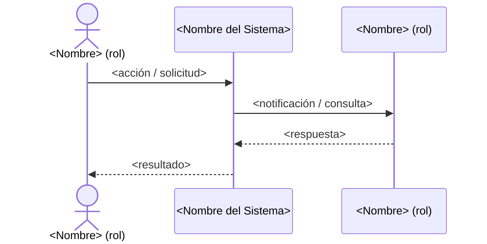
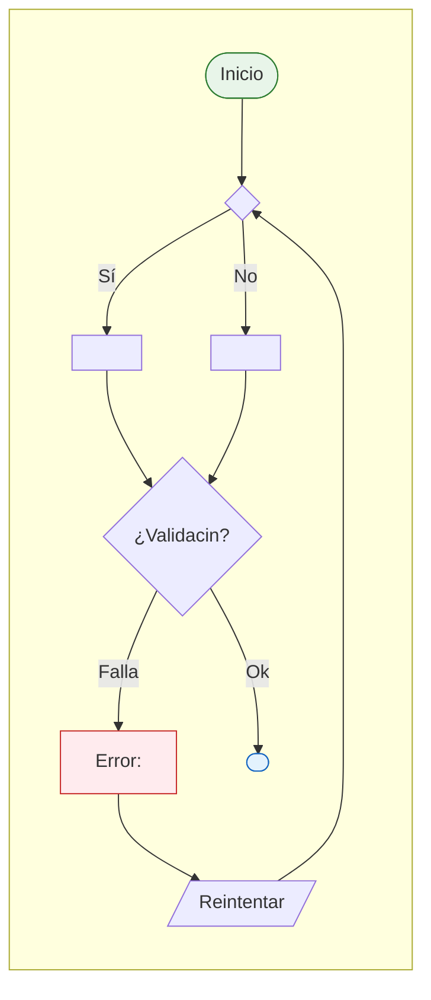

# Plantilla: Épica

<p align="right">
  
  
  
  
</p>

> **Fase:** 1 — Concepción y Descubrimiento (o 2 — Diseño según alcance)
> **Puerta de salida:** Aprobación de Negocio / Baseline de Diseño
> **Padre:** Plantillas de Artefactos

---

## Propósito

Una Épica es un contenedor de alto nivel que agrupa historias funcionales relacionadas bajo un objetivo de negocio común. Serve como contrato de planificación entre Producto y Arquitectura, descompuesto en historias trazables con criterios de aceptación verificables.

---

## Tabla de Navegación

| Elemento | Descripción |
|---|---|
| [Metadatos](#1-metadatos) | Identificación, versión, estado yOwnership |
| [Descripcin Funcional](#2-descripcin-funcional) | Objetivo de negocio de la épica |
| [Actores y Stakeholders](#3-actores-y-stakeholders) | Actor principal, secundario y diagrama de interaccin |
| [Historias Funcionales](#4-historias-funcionales) | Lista de historias que componen la épica |
| [Criterios de Aceptacin](#5-criterios-de-aceptacin) | Escenarios BDD/Gherkin transversales |
| [Reglas de Negocio](#6-reglas-de-negocio) | Reglas aplicables a toda la épica |
| [Requisitos Tcnicos](#7-requisitos-tcnicos) | Bounded context, dependencias, restricciones |
| [Diagrama de Flujo](#8-diagrama-de-flujo) | Mermaid flowchart de comportamiento |
| [Mtricas de xito](#9-mtricas-de-xito) | KPIs para medir éxito de la épica |
| [Definicin de Hecho](#10-definicin-de-hecho-dod) | Checklist de entrega |

---

## 1. Metadatos

- **Identificador:** `EP-<Producto>-<NNN>`
- **Ttulo:** <Frase nominal que describa el objetivo de negocio>
- **Fase SDLC:** <Fase 1 — Concepcin / Fase 2 — Diseo>
- **Versin:** <SemVer>
- **Estado:** Borrador | En Revisin | Aprobada | En Construccin | Cerrada
- **Autor:** <Rol y nombre>
- **Producto:** <Nombre del producto o servicio>
- **Prioridad:** Crtica | Alta | Media | Baja
- **Responsable de Producto:** <Nombre>
- **Responsable de Arquitectura:** <Nombre>

---

## 2. Descripcin Funcional

<Una sola idea principal: por qu existe esta épica, qu problema resuelve, qu objetivo de negocio persigue. Tamaño objetivo: 3 a 8 oraciones. Sin detalles tcnicos.>

---

## 3. Actores y Stakeholders

### 3.1 Actor Principal

| Campo | Descripcin |
|---|---|
| **Nombre** | <nombre del rol> |
| **Tipo** | Usuario Interno | Usuario Externo | Sistema | Bot |
| **Descripcin** | <breve descripcin del actor> |
| **Canal** | Web | Mobile | API | Chatbot |

### 3.2 Actores Secundarios

| Actor | Rol en esta épica | Necesidad |
|---|---|---|
| <nombre> | <cmo participa> | <qu necesita del sistema> |

### 3.3 Diagrama de Interaccin



---

## 4. Historias Funcionales

| # | Identificador | Ttulo | Prioridad | Estado | Fase SDLC |
|---|---|---|---|---|---|
| 1 | FS-<Producto>-001 | <ttulo> | Alta | Borrador | Fase 2 |
| 2 | FS-<Producto>-002 | <ttulo> | Alta | Borrador | Fase 2 |
| N | FS-<Producto>-NNN | <ttulo> | Media | Borrador | Fase 2 |

> Cada historia funcional tiene su propio archivo en `../stories/` con criterios de aceptacin detallados.

---

## 5. Criterios de Aceptacin (Transversales)

*Estos criterios aplican a toda la épica. Las historias individuales tienen criterios especficos.*

```gherkin
Escenario: <nombre del escenario base>
  Dado que   <contexto inicial estable>
  Cuando     <accin del usuario o evento de negocio>
  Entonces   <resultado esperado, observable y medible>

Escenario: <nombre del escenario alterno>
  Dado que   <contexto inicial>
  Cuando     <accin o evento alterno>
  Entonces   <resultado esperado>

Escenario: <nombre del escenario de error>
  Dado que   <contexto inicial>
  Cuando     <accin o evento que produce error>
  Entonces   <resultado observable del error>
```

---

## 6. Reglas de Negocio Aplicables

| ID | Regla | Descripcin |
|---|---|---|
| BR-<NN> | <nombre> | <descripcin declarativa, sin verbos tecnolgicos> |

---

## 7. Requisitos Tcnicos (Aislados)

*Seccin completada por Arquitectura durante la fase de diseo.*

### 7.1 Dominio y Contexto

| Campo | Descripcin | Valor |
|---|---|---|
| **Bounded Context** | Nombre del contexto delimitado DDD donde opera esta épica | `<Contexto>` |
| **Módulo / Aggregate** | Mdulo o aggregate responsable dentro del contexto | `<Mdulo>` |

### 7.2 Dependencias

| Tipo | Nombre | Descripcin |
|---|---|---|
| **Base de datos** | `<nombre>` | Tablas, esquemas o databasesimpactados |
| **APIs externas** | `<servicio>` | APIs de terceros requeridas |
| **Servicios internos** | `<servicio>` | Microservicios internos del ecosistema Unimar |
| **Eventos de dominio** | `<nombre>` | Eventos publicados o consumidos |

### 7.3 Restricciones Tcnicas

- **Tiempo de respuesta:** <num> ms mximo end-to-end
- **Throughput esperado:** <num> requests/segundo pico
- **Disponibilidad:** <num>% SLA
- **Región / Zona:** <ubicacin> donde debe desplegarse

### 7.4 ADRs Relevantes

| ADR | Tema | Relevancia para esta épica |
|---|---|---|
| ADR-XXXX | <tema> | <por qu aplica> |
| ADR-YYYY | <tema> | <por qu aplica> |

### 7.5 Notas Tcnicas Adicionales

- <detalle 1>
- <detalle 2>

---

## 8. Diagrama de Flujo



---

## 9. Mtricas de xito

| Mtrica | Descripcin | Meta | Mtodo de medicin |
|---|---|---|---|
| <nombre> | <descripcin> | <valor> | <fuente de datos> |
| <nombre> | <descripcin> | <valor> | <fuente de datos> |

---

## 10. Definicin de Hecho (DoD)

- [ ] Todas las historias funcionales asociadas completadas.
- [ ] Todos los criterios de aceptacin verificados.
- [ ] Code review completado y aprobado.
- [ ] Pruebas unitarias e integracin superan los umbrales definidos.
- [ ] Documentacin tcnica actualizada.
- [ ] Integraciones con sistemas externos probadas y documentadas.
- [ ] Reglas de negocio implementadas y verificadas.
- [ ] Diagrama de flujo validado con el equipo de arquitectura.

---

## 11. Historial de Cambios

| Versin | Fecha | Autor | Cambios |
| --- | --- | --- | --- |
| 0.1.0 | <AAAA-MM-DD> | <Rol> | Versin inicial |

---

<p align="center">
  
  
</p>

<p align="center">
  <strong>© Unimar S.A.</strong> · RUC 20100412447 · Operador Logístico Aduanero desde 1978<br>
  Última revisin: 2026-06-08
</p>