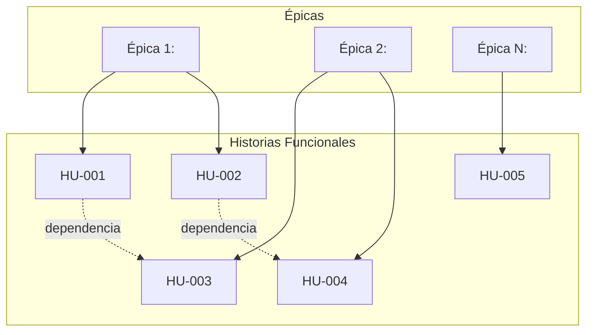
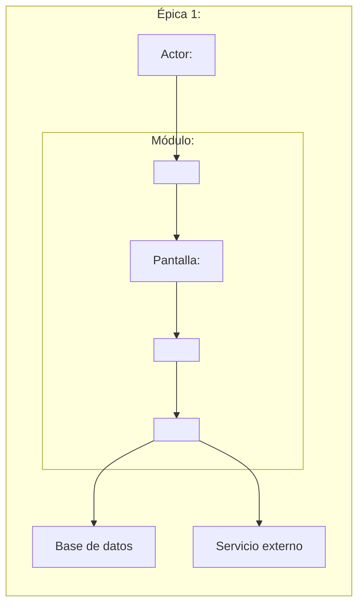
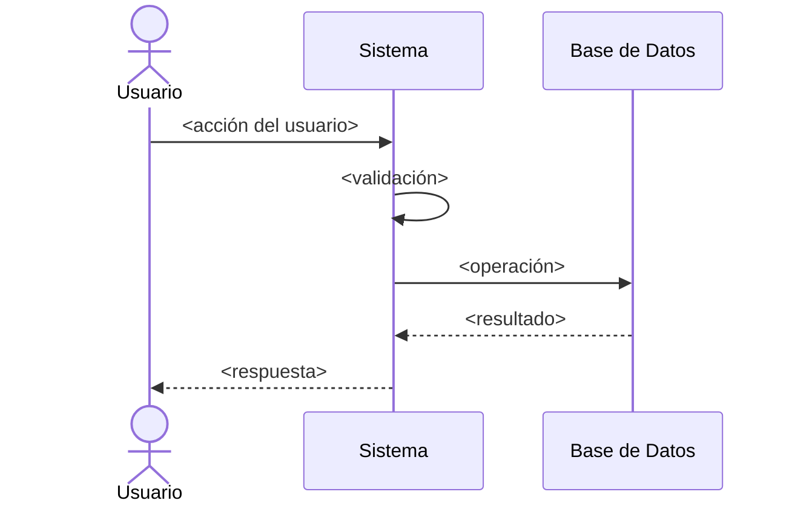
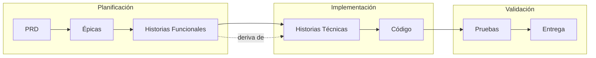

# Plantilla: Historia Funcional

<p align="right">
  
  
  
  
</p>

> **Fase:** 2 — Diseño Funcional
> **Puerta de salida:** Backlog de Iteración Listo
> **Padre:** [Plantillas de Artefactos](../README.md)

---

## Propósito

Una Historia Funcional es la unidad más pequeña de valor de negocio y reemplaza la tradicional "historia de usuario" para evitar el anti-patrón de entregar texto vago a construcción. Sirve como contrato de comportamiento verificable entre Producto y Construcción, asegurando que la intención funcional y los criterios de aceptación sean atómicos y revisables.

Este documento está estructurado en **Épicas** que agrupan **Historias Funcionales** relacionadas, con navegación integrada y diagramas que ilustran el comportamiento esperado.

---

## Tabla de Navegación

| Elemento | Descripción |
|---|---|
| [Épica 1: Nombre](#épica-1-nombre-de-la-épica) | Resumen de la épica |
| [Épica 2: Nombre](#épica-2-nombre-de-la-épica) | Resumen de la épica |
| [Trazabilidad General](#5-trazabilidad-general) | Vista completa de dependencias |

---

## 1. IDENTIFICACIÓN DEL PROYECTO

- **Nombre del Proyecto:** `<Nombre del proyecto o servicio>`
- **Producto:** `<Nombre del producto>`
- **Versión del Documento:** `<SemVer>`
- **Estado:** Borrador | En Revisión | Aprobada | En Construcción | Cerrada
- **Autor:** `<Rol y nombre>`
- **Fecha de Creación:** `<AAAA-MM-DD>`
- **PRD Origen:** `PRD-<Producto>-<NNN>`

---

## 2. LISTA DE ÉPICAS E HISTORIAS

### Diagrama General del Proyecto



---

## 3. ÉPICAS

---

### Épica 1: `<Nombre de la Épica>`

**Identificador:** `EP-<Producto>-001`

| Campo | Valor |
|---|---|
| **Título** | `<Título descriptivo de la épica>` |
| **Objetivo** | `<Frase que describa el valor de negocio de esta épica>` |
| **Prioridad** | Crítica · Alta · Media · Baja |
| **Responsable de Producto** | `<Nombre>` |
| **Historias Asociadas** | HU-001, HU-002 |

#### Diagrama de la Épica



#### Historias de Usuario Asociadas

| ID | Título | Prioridad | Estado |
|---|---|---|---|
| [HU-001](#hu-001-título-de-la-historia) | `<Título de HU-001>` | Alta | `Borrador` |
| [HU-002](#hu-002-título-de-la-historia) | `<Título de HU-002>` | Media | `Borrador` |

---

### Épica 2: `<Nombre de la Épica>`

**Identificador:** `EP-<Producto>-002`

| Campo | Valor |
|---|---|
| **Título** | `<Título descriptivo de la épica>` |
| **Objetivo** | `<Frase que describa el valor de negocio de esta épica>` |
| **Prioridad** | Crítica · Alta · Media · Baja |
| **Responsable de Producto** | `<Nombre>` |
| **Historias Asociadas** | HU-003, HU-004 |

#### Diagrama de la Épica


#### Historias de Usuario Asociadas

| ID | Título | Prioridad | Estado |
|---|---|---|---|

---

## 4. HISTORIAS FUNCIONALES

---

### HU-001: `<Título de la Historia>`

**Identificador:** `FS-<Producto>-001`
**Épica Padre:** [EP-<Producto>-001](#épica-1-nombre-de-la-épica)
**[Volver a tabla de navegación](#tabla-de-navegación)**

#### 4.1 Metadatos

| Campo | Valor |
|---|---|
| **Título** | `<Frase nominal que describa el valor, no la implementación>` |
| **PRD Origen** | `PRD-<Producto>-<NNN>` § `<sección>` |
| **Versión** | `<SemVer>` |
| **Estado** | Borrador · En Revisión · Aprobada · En Construcción · Cerrada |
| **Autor** | `<Rol y nombre>` |
| **Historia(s) Padre(s)** | `EP-<Producto>-001` |

#### 4.2 Diagrama de Flujo



#### 4.3 Contexto de Negocio

Una sola idea principal: por qué esta historia existe, qué problema resuelve, qué relación tiene con el PRD. Tamaño objetivo: 3 a 6 oraciones. Sin detalles técnicos.

#### 4.4 Personas y Roles Involucrados

| Rol | Necesidad | Resultado esperado |
| --- | --- | --- |
| `<Rol 1>` | `<Necesidad observable>` | `<Lo que el rol consigue>` |
| `<Rol 2>` | `<Necesidad observable>` | `<Lo que el rol consigue>` |

#### 4.5 Escenarios de Comportamiento (Criterios de Aceptación)

```gherkin
Escenario: <nombre del escenario base>
  Dado que   <contexto inicial estable>
  Cuando     <acción del usuario o evento de negocio>
  Entonces   <resultado esperado, observable y medible>

Escenario: <nombre del escenario alterno 1>
  Dado que   <contexto inicial>
  Cuando     <acción o evento alterno>
  Entonces   <resultado esperado>

Escenario: <nombre del escenario de error>
  Dado que   <contexto inicial>
  Cuando     <acción o evento que produce error>
  Entonces   <resultado observable del error>
```

#### 4.6 Reglas de Negocio Explícitas

- Regla 1: <Descripción declarativa, sin verbos tecnológicos>
- Regla 2: <Descripción declarativa>
- Regla N: <Descripción declarativa>

#### 4.7 Dependencias Declaradas

| Tipo | ID | Descripción |
|---|---|---|
| **Bloquea a:** | `<IDs>` | `<Descripción>` |
| **Depende de:** | `<IDs>` | `<Descripción>` |
| **Sistemas externos requeridos:** | `<Lista>` | `<Descripción>` |

#### 4.8 Supuestos

- Supuesto 1: <Asunción del negocio, verificable>
- Supuesto 2: <Asunción del negocio, verificable>

#### 4.9 Fuera del Alcance de Esta Historia

- <Funcionalidad explícitamente excluida>
- <Funcionalidad explícitamente excluida>

#### 4.10 Lista de Verificación de Listo

- [ ] Identificador y título estables.
- [ ] Contexto de Negocio redactado en una sola idea principal.
- [ ] Mínimo 2 escenarios de aceptación (feliz + alterno).
- [ ] Reglas de Negocio Explícitas cuando apliquen.
- [ ] Sin verbos ni sustantivos tecnológicos.
- [ ] Enlace al PRD y al reporte de trazabilidad.
- [ ] Al menos un par (rol, valor de negocio) claramente identificable.
- [ ] Diagrama de flujo incluido.
- [ ] Epica padre correctamente referenciada.

---

### HU-002: `<Título de la Historia>`

**Identificador:** `FS-<Producto>-002`
**Épica Padre:** [EP-<Producto>-001](#épica-1-nombre-de-la-épica)
**[Volver a tabla de navegación](#tabla-de-navegación)**

> *(Repetir estructura de HU-001)*

---

## 5. TRAZABILIDAD GENERAL



| Elemento | Artefacto Siguiente |
|---|---|
| Épica | Desglose en Historias Funcionales |
| Historia Funcional | [Historia Técnica](../plantilla-historia-tecnica.es.md) que traduzca la historia en trabajo de diseño técnico |
| Pruebas | [Reporte Resumen de Pruebas](../plantilla-reporte-resumen-pruebas.es.md) |
| Entrega | [Notas de Lanzamiento](../plantilla-notas-lanzamiento.es.md) |

---

## 6. HISTORIAL DE CAMBIOS

| Versión | Fecha | Autor | Cambios |
| --- | --- | --- | --- |
| 0.1.0 | 2026-06-05 | Architecture Board | Versión inicial |
| 0.2.0 | 2026-06-08 | Architecture Board | Estructura con épicas, navegación y diagramas integrados |

---

<p align="center">
  
  
</p>

<p align="center">
  <strong>© Unimar S.A.</strong> · RUC 20100412447 · Operador Logístico Aduanero desde 1978<br>
  Última revisión: 2026-06-08
</p>
