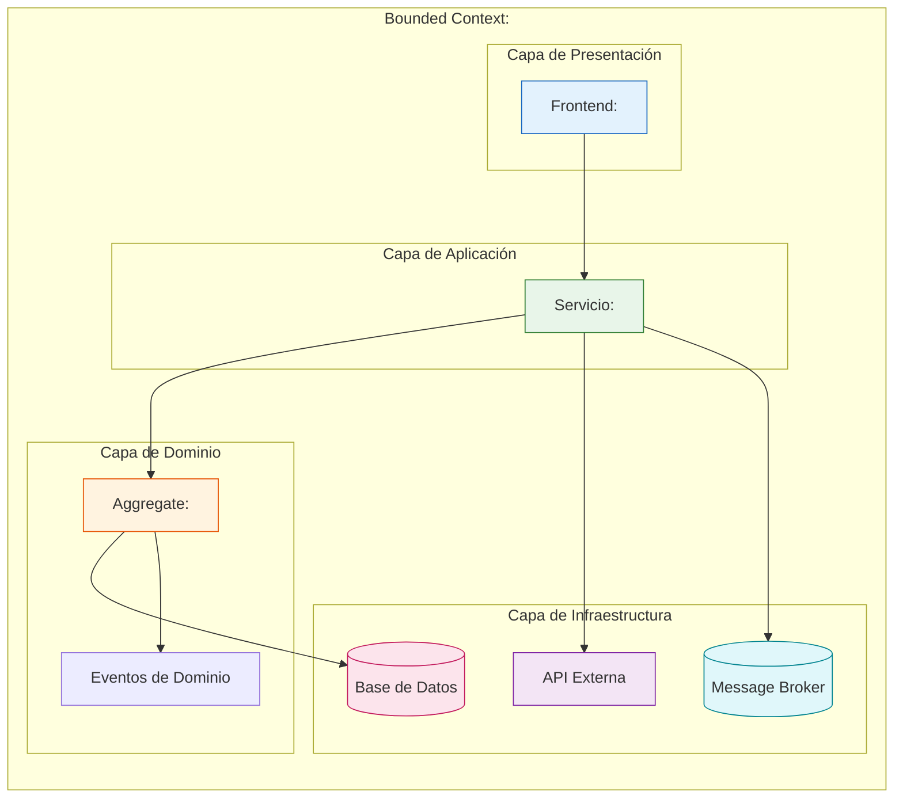
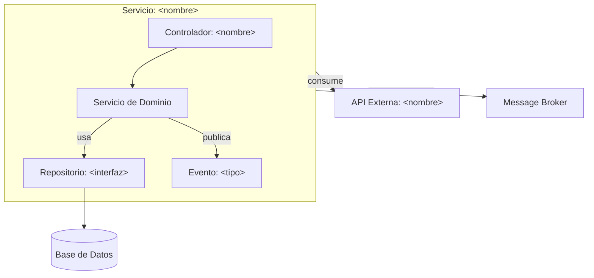
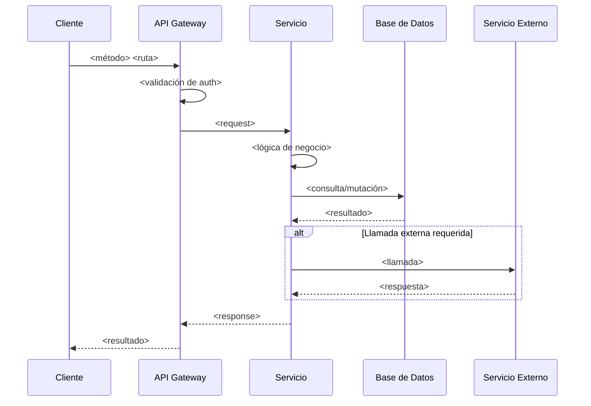
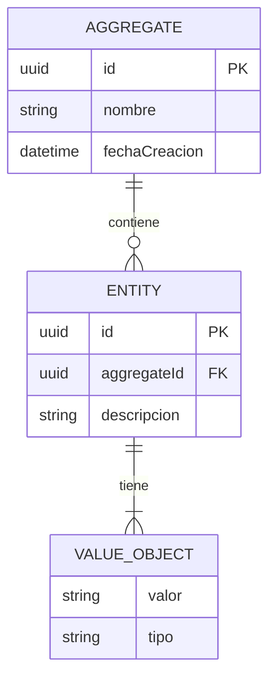
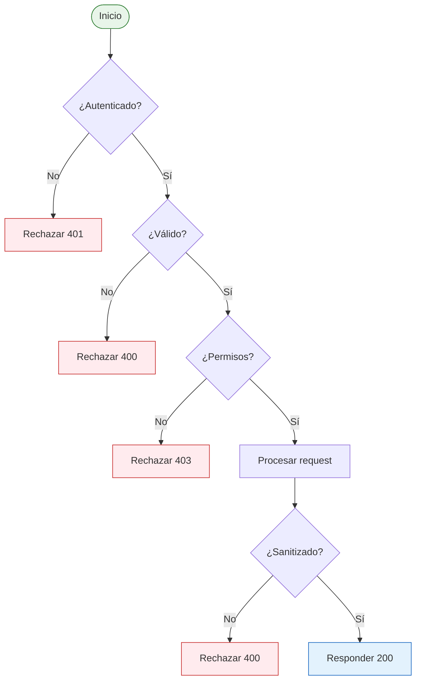
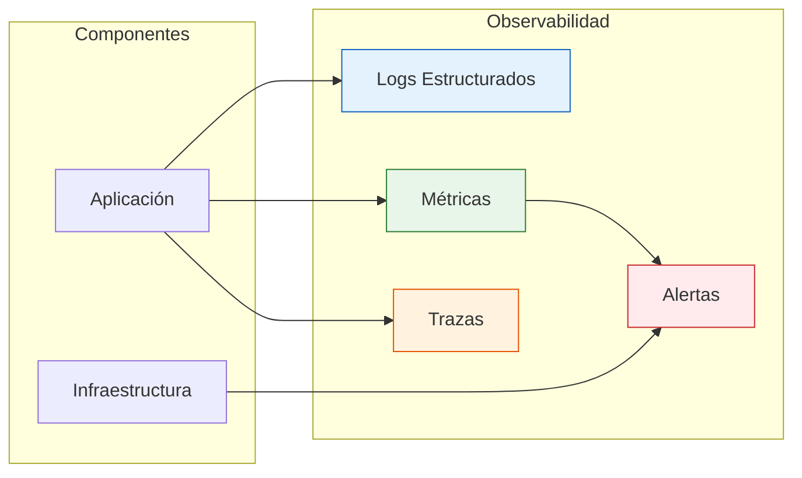
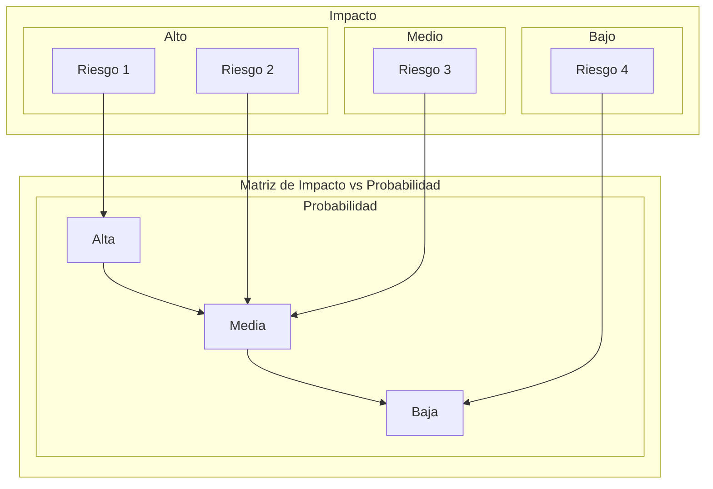

# Plantilla: Historia Técnica

<p align="right">
  
  
  
  
</p>

> **Fase:** 3 — Diseño Técnico
> **Puerta de salida:** Backlog de Construcción Listo
> **Padre:** [Plantillas de Artefactos](../README.md)

---

## Propósito

Una Historia Técnica traduce una Historia Funcional en trabajo de diseño técnico verificable. Es el contrato entre Arquitectura y Construcción que define qué se construirá, dónde vive en la arquitectura (Bounded Context, capa, sistema), y por qué este enfoque es el más simple que cumple la Historia Funcional. Este documento incluye diagramas estructurales y de comportamiento para asegurar claridad en las decisiones de diseño.

---

## Tabla de Navegación

| Elemento | Descripción |
|---|---|
| [Metadatos](#1-metadatos) | Identificación, versión, estado y Ownership |
| [Resumen Técnico](#2-resumen-técnico) | Descripción del cambio técnico y enfoque de diseño |
| [Diagrama de Arquitectura](#3-diagrama-de-arquitectura) | Mermaid flowchart del impacto arquitectónico |
| [Diagrama de Componentes](#4-diagrama-de-componentes) | Mermaid component diagram de los componentes afectados |
| [Componentes Afectados](#5-componentes-afectados) | Lista de componentes nuevos, modificados o eliminados |
| [Contratos de API](#6-contratos-de-api) | Endpoints nuevos y contratos OpenAPI |
| [Modelo de Datos](#7-modelo-de-datos) | Entidades, objetos de valor y cambios de esquema |
| [Seguridad](#8-seguridad) | Autenticación, autorización y cumplimiento |
| [Observabilidad](#9-observabilidad) | Logs, métricas, trazas y alertas |
| [Pruebas](#10-pruebas) | Tipos de prueba, cobertura mínima y responsables |
| [Riesgos Técnicos](#11-riesgos-técnicos) | Matriz de riesgos con mitigaciones |
| [ADRs Aplicables](#12-adrs-aplicables) | Decisiones arquitectónicas que aplican |
| [Lista de Verificación de Hecho](#13-lista-de-verificación-de-hecho) | Checklist de entrega |
| [Referencias y Trazabilidad](#14-referencias-y-trazabilidad) | Artefactos relacionados y flujo de entrega |
| [Historial de Cambios](#15-historial-de-cambios) | Registro de versiones del documento |

---

## 1. Metadatos

- **Identificador:** `TS-<Producto>-<NNN>`
- **Título:** <Frase nominal que describa el cambio técnico>
- **Historia Funcional Origen:** `FS-<Producto>-<NNN>`
- **PRD Origen:** `PRD-<Producto>-<NNN>` § <sección>
- **Versión:** <SemVer>
- **Estado:** Borrador | En Revisión | Aprobada | En Construcción | Cerrada
- **Autor:** <Rol y nombre>
- **Producto:** <Nombre del producto o servicio>
- **Historias Padre(s):** <IDs o vacío>
- **Bounded Context:** <Contexto delimitado DDD>
- **Capa Arquitectónica:** <Presentación | Aplicación | Dominio | Infraestructura>

---

## 2. Resumen Técnico

Descripción breve (3 a 6 oraciones) del cambio técnico: qué se construirá, dónde vive en la arquitectura (Bounded Context, capa, sistema) y por qué este enfoque es el más simple que cumple la Historia Funcional.

---

## 3. Diagrama de Arquitectura



---

## 4. Diagrama de Componentes



---

## 5. Componentes Afectados

| Componente | Tipo | Cambio |
| --- | --- | --- |
| <Nombre> | Nuevo / Modificado / Eliminado | <Descripción de alto nivel> |
| <Nombre> | Nuevo / Modificado / Eliminado | <Descripción de alto nivel> |

---

## 6. Contratos de API

### 6.1 Puntos de Conexión Nuevos

| Método | Ruta | Propósito | Autenticación |
| --- | --- | --- | --- |
| <GET/POST/...> | <ruta> | <Propósito> | <JWT/OAuth/API-Key> |
| <GET/POST/...> | <ruta> | <Propósito> | <JWT/OAuth/API-Key> |

### 6.2 Diagrama de Secuencia de la API



### 6.3 Contratos OpenAPI (Extracto)

```yaml
openapi: 3.0.3
info:
  title: <API>
  version: <SemVer>
paths:
  /<ruta>:
    get:
      summary: <Propósito>
      responses:
        '200':
          description: <Descripción>
        '400':
          description: <Descripción>
        '401':
          description: <Descripción>
      security:
        - bearerAuth: []
    post:
      summary: <Propósito>
      requestBody:
        content:
          application/json:
            schema:
              $ref: '#/components/schemas/<Esquema>'
      responses:
        '201':
          description: <Descripción>
```

---

## 7. Modelo de Datos

### 7.1 Entidades y Objetos de Valor

| Elemento | Tipo | Cardinalidad | Persistencia |
| --- | --- | --- | --- |
| <Nombre> | Entity / Value Object / Aggregate Root | 1..N | <Tabla/colección> |
| <Nombre> | Entity / Value Object / Aggregate Root | 1..N | <Tabla/colección> |

### 7.2 Diagrama de Entidades



### 7.3 Cambios de Esquema

- **Migración:** <Nombre de la migración>
- **Rollback:** <Reversible sí/no; cómo>
- **Datos a migrar:** <Volumen y estrategia>

---

## 8. Seguridad

### 8.1 Medidas de Seguridad

- **Autenticación:** <Mecanismo>
- **Autorización:** <Roles y permisos>
- **Validación de entrada:** <Reglas y sanitización>
- **Datos sensibles:** <Manejo de PII, encriptación en tránsito y en reposo>

### 8.2 Cumplimiento

- **Estándares:** <PCI-DSS, Ley 29733, etc.>
- **Auditoría:** <Requisitos de logging de auditoría>

### 8.3 Diagrama de Flujo de Seguridad



---

## 9. Observabilidad

- **Logs estructurados:** <Campos mínimos, nivel, redacción de PII>
- **Métricas:** <Prometheus / Application Insights: counters, histograms>
- **Trazas:** <OpenTelemetry: spans clave>
- **Alertas:** <Condiciones críticas y umbrales>

### 9.1 Diagrama de Trazabilidad



---

## 10. Pruebas

| Tipo | Cobertura mínima | Responsable |
| --- | --- | --- |
| Unitarias | 80% líneas críticas | <Equipo> |
| Integración | Escenarios de aceptación | <Equipo> |
| Contrato | Puntos de conexión nuevos | <Equipo> |
| E2E | Escenarios críticos | <QA> |
| Seguridad | SAST + DAST | <Sec> |
| Performance | Carga y estrés | <QA> |

### 10.1 Diagrama de Estrategia de Pruebas

```mermaid
flowchart TD
    subgraph "Estrategia de Pruebas"
        START([Inicio]) --> UNIT[Pruebas Unitarias]
        UNIT --> INT[Pruebas de Integración]
        INT --> CONTRACT[Pruebas de Contrato]
        CONTRACT --> E2E[Pruebas E2E]
        E2E --> SEC[Pruebas de Seguridad]
        SEC --> PERF[Pruebas de Performance]
        PERF --> DONE([Listo para Release])
    end

    style START fill:#e8f5e9,stroke:#2e7d32
    style UNIT fill:#e3f2fd,stroke:#1565c0
    style INT fill:#e3f2fd,stroke:#1565c0
    style CONTRACT fill:#e3f2fd,stroke:#1565c0
    style E2E fill:#e3f2fd,stroke:#1565c0
    style SEC fill:#ffebee,stroke:#c62828
    style PERF fill:#fff3e0,stroke:#e65100
    style DONE fill:#e8f5e9,stroke:#2e7d32
```



---

## 11. Riesgos Técnicos

| Riesgo | Probabilidad | Impacto | Mitigación |
| --- | --- | --- | --- |
| <Descripción> | Alta/Media/Baja | Alto/Medio/Bajo | <Plan> |
| <Descripción> | Alta/Media/Baja | Alto/Medio/Bajo | <Plan> |

### 11.1 Diagrama de Matriz de Riesgos



---

## 12. ADRs Aplicables

| ADR | Tema | Relevancia para esta historia |
| --- | --- | --- |
| `ADR-<NNN>-<slug>` | <Título> | <Por qué aplica> |
| `ADR-<NNN>-<slug>` | <Título> | <Por qué aplica> |

---

## 13. Lista de Verificación de Hecho

- [ ] Código revisado y aprobado por al menos 1 par.
- [ ] Cobertura de pruebas cumple con la sección 10.
- [ ] Análisis estático (SAST, lint) sin issues críticos.
- [ ] Documentación de API actualizada (OpenAPI).
- [ ] Migraciones probadas en entorno de staging.
- [ ] Alertas y dashboards creados o actualizados.
- [ ] Cambios de configuración documentados.
- [ ] Notas de release redactadas (cuando aplique).
- [ ] Diagramas de arquitectura y componentes validados.
- [ ] Trazabilidad con Historia Funcional y PRD verificable.

---

## 14. Referencias y Trazabilidad

### 14.1 Artefactos Relacionados

| Artefacto | Tipo | Enlace |
| --- | --- | --- |
| `FS-<Producto>-<NNN>` | Historia Funcional | Ver historia funcional |
| `PRD-<Producto>-<NNN>` | Product Requirement Document | Ver PRD |
| `EP-<Producto>-<NNN>` | Épica | [Ver épica](../plantilla-epica.es.md) |
| `ADR-<NNN>-<slug>` | Architecture Decision Record | Ver ADR |

### 14.2 Flujo de Trazabilidad

```mermaid
flowchart LR
    subgraph "Planificación"
        PRD["PRD"] --> FS["Historia Funcional"]
    end

    subgraph "Diseño Técnico"
        FS --> HT["Historia Técnica"]
        HT --> ARCH["Arquitectura"]
    end

    subgraph "Implementación"
        ARCH --> CODE["Código"]
        CODE --> TEST["Pruebas"]
    end

    subgraph "Entrega"
        TEST --> STAGING["Staging"]
        STAGING --> PROD["Producción"]
    end

    FS -.->|deriva de| HT
    HT -.->|implementa| ARCH

    style PRD fill:#e3f2fd,stroke:#1565c0
    style FS fill:#e8f5e9,stroke:#2e7d32
    style HT fill:#fff3e0,stroke:#e65100
    style ARCH fill:#f3e5f5,stroke:#7b1fa2
    style CODE fill:#e0f7fa,stroke:#00838f
    style TEST fill:#fce4ec,stroke:#c2185b
    style STAGING fill:#ffebee,stroke:#c62828
    style PROD fill:#e8f5e9,stroke:#2e7d32
```



### 14.3 Artefacto Siguiente

| Este artefacto | Artefacto siguiente | Propósito |
| --- | --- | --- |
| Historia Técnica | [Reporte Resumen de Pruebas](../plantilla-reporte-resumen-pruebas.es.md) | Documentar resultados de pruebas |
| Historia Técnica | [Notas de Lanzamiento](../plantilla-notas-lanzamiento.es.md) | Comunicar cambios en release |

---

## 15. Historial de Cambios

| Versión | Fecha | Autor | Cambios |
| --- | --- | --- | --- |
| 0.1.0 | <AAAA-MM-DD> | <Rol> | Versión inicial |
| 0.2.0 | 2026-06-08 | Architecture Board | Estructura con navegación, diagramas de arquitectura y componentes, sección de referencias y trazabilidad |

---

<p align="center">
  
  
</p>

<p align="center">
  <strong>© Unimar S.A.</strong> · RUC 20100412447 · Operador Logístico Aduanero desde 1978<br>
  Última revisión: 2026-06-08
</p>