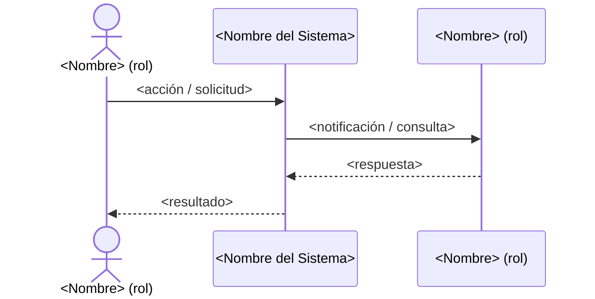

# Plantilla: Historia de Usuario

> **Propósito:** Definir una historia funcional atómica, clara para el negocio, aislando los detalles técnicos, e incluyendo criterios de aceptación verificables (Gherkin/BDD).
> **Fase SDLC:** 01 — Discovery / Ideación (y refinamiento continuo)
> **Responsable:** Product Owner / PM
> **Quality Gate:** Sprint Planning / Aprobación Técnica a Diseño

---

## Historia: [US-XXX] — [Título Descriptivo]

### 1. Descripción Funcional

**Como** [tipo de usuario / rol]
**Quiero** [acción a realizar]
**Para** [valor o beneficio de negocio esperado]

### 2. Actores y Stakeholders

#### 2.1 Actor Principal

| Campo | Descripción |
|---|---|
| **Nombre** | `<nombre del rol>` |
| **Tipo** | Usuario Interno · Usuario Externo · Sistema · Bot |
| **Descripción** | `<breve descripción del actor>` |
| **Canal** | Web · Mobile · API · Chatbot |

#### 2.2 Actores Secundarios

| Actor | Rol en esta historia | Necesidad |
|---|---|---|
| `<nombre>` | `<cómo participa>` | `<qué necesita del sistema>` |

#### 2.3 Diagrama de Interacción

#### 2.4 Interacciones del Actor Principal

| # | Interacción | Pantalla/Vista | Resultado esperado |
|---|---|---|---|
| 1 | `<accin>` | `<pantalla>` | `<resultado>` |
| 2 | `<accin>` | `<pantalla>` | `<resultado>` |

### 3. Criterios de Aceptación (BDD/Gherkin)

**Escenario 1:** [Nombre del escenario]

- **Dado que** [contexto inicial]
- **Cuando** [acción ejecutada]
- **Entonces** [resultado esperado]

**Escenario 2:** [Nombre del escenario alternativo]

- **Dado que** [contexto inicial]
- **Cuando** [acción ejecutada]
- **Entonces** [resultado esperado]

### 4. Requisitos Técnicos (Aislados)

*Sección reservada para Arquitectos / Devs. Completa solo cuando la historia avance a Sprint Planning.*

#### 4.1 Dominio y Contexto

| Campo | Descripción | Ejemplo |
|---|---|---|
| **Bounded Context** | Nombre del contexto delimitado DDD donde opera esta historia | `IdentityVerificationContext`, `OrderManagementContext` |
| **Módulo / Aggregate** | Módulo o aggregate responsable dentro del contexto | `Verification`, `UserAggregate` |

#### 4.2 Dependencias

| Tipo | Nombre | Descripción |
|---|---|---|
| **Base de datos** | `<nombre>` | Tablas, esquemas o databasesimpactados |
| **APIs externas** | `<servicio>` | APIs de terceros requeridas |
| **Servicios internos** | `<servicio>` | Microservicios internos del ecosistema Unimar |
| **Eventos de dominio** | `<nombre>` | Eventos publicados o consumidos |

#### 4.3 Restricciones Técnicas

- **Tiempo de respuesta:** `<num>` ms máximo
- **Throughput esperado:** `<num>` requests/segundo
- **Disponibilidad:** `<num>%` SLA
- **Región / Zona:** `<ubicación>` donde debe desplegarse

#### 4.4 ADRs Relevantes

| ADR | Tema | Relevancia para esta historia |
|---|---|---|
| [ADR-XXXX](../../architecture/adrs/...) | `<tema>` | `<por qué aplica>` |

#### 4.5 Notas Técnicas Adicionales

- `<detalle 1>`
- `<detalle 2>`

> **Nota:** Esta sección se completa durante la Sprint Planning cuando el equipo de desarrollo refina la historia. No es necesario llenarla en la fase de discovery.

### 5. Definición de Hecho (DoD)

- [ ] Código implementado y revisado.
- [ ] Pruebas unitarias superan el umbral definido.
- [ ] Criterios de aceptación verificados.
- [ ] Documentación actualizada si aplica.

---

  
  

  <strong>© Unimar S.A.</strong> · RUC 20100412447 · Operador Logístico Aduanero desde 1978 
  Última revisión: 2026-06-08

