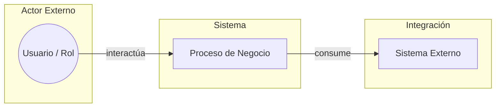

# Plantilla: Documento de Requisitos de Producto (PRD)

  
  
  
  

> **Fase:** 1 — Concepción y Descubrimiento
> **Padre:** [Plantillas de Artefactos](../README.md)

## 1. Metadatos

- **Identificador:** `PRD-<Producto>-<NNN>`
- **Producto:** <Nombre del producto o servicio>
- **Versión:** <SemVer, e.g., 0.1.0>
- **Estado:** Borrador | En Revisión | Aprobado | Congelado
- **Autor(es):** <Roles y nombres>
- **Aprobador de Negocio:** <Rol y nombre>
- **Aprobador de Arquitectura:** <Rol y nombre>
- **Fecha de Aprobación:** <AAAA-MM-DD>

## 2. Resumen Ejecutivo

Resumen de un párrafo del PRD para audiencia ejecutiva. Contiene: problema, oportunidad, valor esperado y horizonte de entrega. No debe exceder 200 palabras.

## 3. Contexto y Problema

- **Situación actual:** descripción del escenario de negocio antes de la iniciativa.
- **Problema:** dolor o brecha detectable, con su métrica base.
- **Oportunidad:** valor que se desbloquea al resolver el problema.
- **Audiencia afectada:** segmentos, roles y volumen estimado.

## 4. Objetivos y Métricas de Éxito

| Objetivo | Métrica | Valor Inicial | Meta | Horizonte |
| --- | --- | --- | --- | --- |
| <Objetivo medible> | <KPI> | <Hoy> | <Esperado> | <Q/Mes/Año> |

## 5. Alcance

### 5.1 Dentro del Alcance

- Funcionalidad 1
- Funcionalidad 2
- Funcionalidad 3

### 5.2 Fuera del Alcance

- Funcionalidad explícitamente excluida
- Funcionalidad explícitamente excluida

### 5.3 Mapa Conceptual

Diagrama de bloques que muestra, desde una vista de negocio simple, el enfoque y alcance del sistema: actores externos, el sistema y las integraciones clave. Usar lenguaje de negocio, no técnico.

## 6. Actores y Casos de Uso de Alto Nivel

| Actor | Necesidad | Caso de uso de alto nivel | Prioridad |
| --- | --- | --- | --- |
| <Rol> | <Necesidad> | <Caso> | Must / Should / Could / Won't |

## 7. Reglas de Negocio Explícitas

- Regla 1: <Descripción declarativa>
- Regla 2: <Descripción declarativa>
- Regla N: <Descripción declarativa>

## 8. Restricciones y Supuestos

- **Restricciones regulatorias:** <Ley 29733, PCI-DSS, SOX, etc.>
- **Restricciones técnicas:** <Integraciones obligatorias, plataformas fijadas>
- **Supuestos:** <Lista de asunciones que el PRD hace como ciertas>

## 9. Riesgos de Negocio

| Riesgo | Probabilidad | Impacto | Mitigación |
| --- | --- | --- | --- |
| <Descripción> | Alta/Media/Baja | Alto/Medio/Bajo | <Plan> |

## 10. Criterios de Aceptación del PRD

El PRD se considera aprobado cuando:

- [ ] El resumen ejecutivo está validado por el Aprobador de Negocio.
- [ ] Las métricas de éxito tienen valor inicial y meta medibles.
- [ ] El alcance está firmado por Producto y Arquitectura.
- [ ] Las reglas de negocio explícitas no tienen contradicciones.
- [ ] Los riesgos tienen mitigación documentada.

## 11. Trazabilidad

- Las **Historias Funcionales** posteriores referencian este PRD por identificador.
- El **Reporte Resumen de Pruebas** cita los criterios de aceptación funcionales del PRD.
- Las **Notas de Lanzamiento** resumen el valor entregado contra los objetivos declarados aquí.
- Los **ADRs** referenciados en este PRD se enlazan desde la sección de Restricciones y Supuestos.

## 12. Glosario

- **Término 1:** <Definición>
- **Término 2:** <Definición>

## 13. Historial de Cambios

| Versión | Fecha | Autor | Cambios |
| --- | --- | --- | --- |
| 0.1.0 | <AAAA-MM-DD> | <Rol> | Versión inicial |

---

  
  

  <strong>© Unimar S.A.</strong> · RUC 20100412447 · Operador Logístico Aduanero desde 1978 
  Última revisión: 2026-06-05

