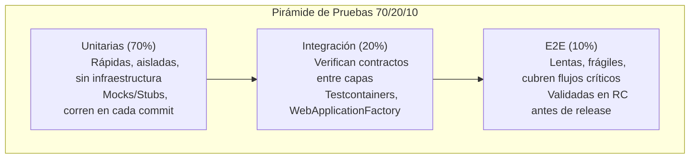
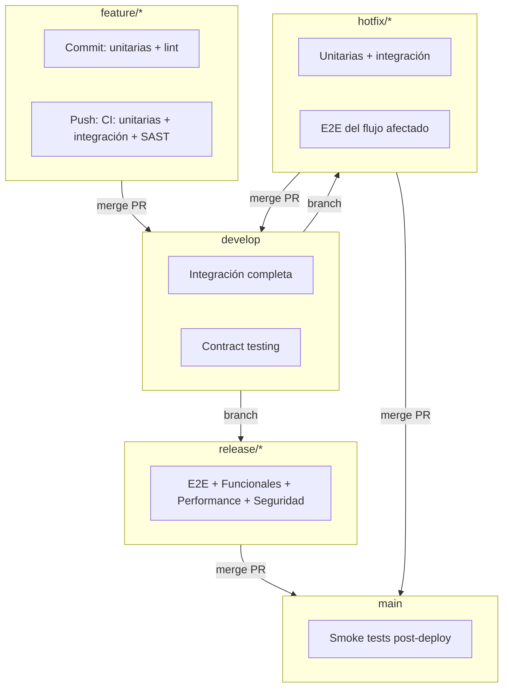

# Estrategia de Pruebas

> **Fase SDLC:** 3 — Construcción y 4 — Validación (transversal)
> **Audiencia:** Desarrolladores, QA, Tech Leads, Architecture Board
> **Propósito:** Definir las estrategias de **pruebas funcionales**, **automatizadas** y de **performance** organizadas por tipo, con su propósito, cuándo aplican, por qué, dónde se ejecutan, plantillas asociadas y cómo analizar sus resultados.

---

## 1. Metodología General: Pirámide de Pruebas 70/20/10

La distribución objetivo de esfuerzo sigue el principio de la **pirámide de pruebas** ([Mike Cohn](https://www.oreilly.com/library/view/succeeding-with-agile/9780321665982/), [Martin Fowler](https://martinfowler.com/bliki/TestPyramid.html)). Maximiza velocidad de retroalimentación y minimiza costo de mantenimiento.



| Capa | Proporción | Velocidad | Dependencia externa | Responsable |
| :--- | :--------- | :-------- | :------------------ | :---------- |
| **Unitarias** | 70% | Milisegundos | Ninguna (mocks/stubs) | Desarrollador |
| **Integración** | 20% | Segundos | Contenedores reales (Testcontainers) | Desarrollador + QA |
| **E2E** | 10% | Minutos | Entorno completo desplegado | QA |

> **Por qué 70/20/10:** [Google Testing Blog](https://testing.googleblog.com/2015/04/just-say-no-to-more-end-to-end-tests.html) muestra que cuantas más E2E se escriben, más defectos se escapan (cubren caminos felices, no casos borde). Las unitarias cubren casos borde sistemáticamente y cuestan [100x menos que un defecto en producción](https://www.nist.gov/).

---

## 2. Secuencia de Pruebas en el SDLC

```mermaid
flowchart LR
    subgraph F1["F1 — Descubrimiento"]
        F1A["Validación de requisitos<br/>con el negocio (manual)"]
    end
    subgraph F2["F2 — Diseño"]
        F2A["Contract testing temprano<br/>(Pact)"]
    end
    subgraph F3["F3 — Construcción"]
        F3A["Pruebas Unitarias (70%)<br/>— cada commit"]
        F3B["Pruebas de Integración (20%)<br/>— cada push"]
    end
    subgraph F4["F4 — Validación"]
        F4A["Funcionales + E2E + Regresión"]
        F4B["Pruebas de Performance (k6)"]
        F4C["Pruebas de Seguridad (SAST/DAST)"]
    end
    subgraph F5["F5 — Entrega"]
        F5A["Smoke tests post-deploy"]
        F5B["Health checks + monitoreo"]
    end
    F1 --> F2 --> F3 --> F4 --> F5
```



| Fase SDLC | Prueba dominante | Costo de defecto | Responsable |
| :-------- | :--------------- | :--------------- | :---------- |
| **F1 — Descubrimiento** | Validación manual de requisitos | 1x | PM / Analista |
| **F2 — Diseño** | Contractos tempranos (Pact) | 5x | Arquitecto |
| **F3 — Construcción** | Automatizadas (unitarias + integración) | 10x | Desarrollador |
| **F4 — Validación** | Funcionales + Performance + E2E | 50x | QA |
| **F5 — Entrega** | Smoke + Health checks | 100x | DevOps + QA |

---

## 3. Flujo de Pruebas Integrado con GitFlow



| Rama | Pruebas obligatorias | Gates |
| :--- | :------------------- | :---- |
| **feature** | Unitarias (commit) + Integración (push) | Cobertura ≥ 80%, complejidad ≤ 15 |
| **develop** | Integración + Contract testing | Cobertura ≥ 80%, cero CVEs críticos |
| **release** | E2E + Funcionales + Performance + Seguridad | Cobertura ≥ 80%, cero CVEs altos/críticos |
| **hotfix** | Unitarias + Integración + E2E del flujo | Cobertura ≥ 80% en código modificado |
| **main** | Smoke tests post-deploy | Health checks + HTTP 200 |

---

## 4. Pruebas Funcionales

### ¿Qué son?

Validan que el sistema **se comporta según lo esperado por el usuario y el negocio**. Se centran en **qué** hace el sistema, no en **cómo** lo hace. Incluyen pruebas manuales, exploratorias y de aceptación (UAT).

### Propósito

Asegurar que el software cumple los **requisitos funcionales** definidos en las Historias Funcionales (FS) y Criterios de Aceptación. Detectan problemas de **usabilidad, flujo y lógica de negocio** que las pruebas automatizadas no capturan.

### ¿Cuándo?

| Momento | Tipo de prueba funcional |
| :------ | :----------------------- |
| **F2 — Diseño** | Validación de prototipos con el negocio |
| **F4 — Validación** | Pruebas de aceptación en entorno staging |
| **Pre-release** | UAT (User Acceptance Testing) con usuarios reales |
| **Post-release** | Pruebas exploratorias en producción (monitoreadas) |

### ¿Por qué?

- Las pruebas automatizadas solo verifican lo que el desarrollador programó. Las funcionales verifican **lo que el usuario necesita**.
- Según [ISQTB](https://www.istqb.org/), el 30-50% de los defectos funcionales se detectan solo con pruebas exploratorias.

### ¿Dónde?

| Entorno | Propósito |
| :------ | :-------- |
| **Staging** | Aceptación formal con datos sintéticos |
| **UAT** | Entorno espejo de producción con datos reales anonimizados |
| **Producción** | Smoke testing exploratorio post-despliegue (solo lectura) |

### Plantillas

| Recurso | Propósito |
| :------ | :-------- |
| [Historias Funcionales](../sdlc/04-plantillas-artefactos/plantilla-historia-funcional.es.md) | Definen los criterios de aceptación que guían las pruebas funcionales |
| [Caso de Prueba Funcional](../standards/testing/formato-caso-prueba-funcional.es.md) | Formato para documentar escenarios, pasos y resultados esperados |
| [Reporte Resumen de Pruebas (TSR)](../sdlc/04-plantillas-artefactos/plantilla-reporte-resumen-pruebas.es.md) | Reporte final que incluye resultados de pruebas funcionales |

### ¿Cómo analizar los resultados?

| Resultado | Acción |
| :-------- | :----- |
| **PASA** | Escenario cubierto. Sin acción adicional. |
| **FALLA con bug conocido** | El bug ya está reportado y tiene TS asignada. No bloquea el RC si hay plan de mitigación. |
| **FALLA sin bug reportado** | Crear bug en el tracker, asignar a desarrollador. Bloquea el RC si es funcionalidad crítica. |
| **Inconcluso** | Falta entorno, datos o criterio. No bloquea pero queda como riesgo documentado. |

> **Métrica clave:** Tasa de aprobación funcional ≥ 90% para sellar RC. Por debajo, el QA Lead puede rechazar el release.

---

## 5. Pruebas Automatizadas

### ¿Qué son?

Validan el código mediante **ejecución automática** (sin intervención humana) en cada commit, push o release. Cubren la pirámide 70/20/10 y el contract testing.

### Propósito

- **Velocidad:** Retroalimentación en segundos/minutos en lugar de horas/días.
- **Regresión continua:** Cada cambio valida que no rompió nada existente.
- **Confianza para refactorizar:** El equipo puede mejorar el código sin miedo.

### 5.1 Pruebas Unitarias (70%)

| Aspecto | Detalle |
| :------ | :------ |
| **Propósito** | Validar una unidad de código de forma aislada (función, método, clase). Sin BD, sin red, sin archivos. |
| **¿Cuándo?** | En cada commit (pre-commit hook). Antes de implementar (TDD). |
| **¿Por qué?** | Detectan el 70% de los defectos en el momento más barato de corregir. |
| **¿Dónde?** | Local (máquina del desarrollador) y CI (en cada push). |
| **Plantilla** | No aplica (sigue el estándar del framework del stack). |

| Stack | Framework | Aislamiento | Assertions |
| :---- | :-------- | :---------- | :--------- |
| **.NET** | [xUnit](https://xunit.net/) | [Moq](https://github.com/devlooped/moq) / [NSubstitute](https://nsubstitute.github.io/) | [FluentAssertions](https://fluentassertions.com/) |
| **Node.js** | [Jest](https://jestjs.io/) | `jest.mock()` | Expect nativo |
| **Android** | [JUnit 5](https://junit.org/junit5/) + [MockK](https://mockk.io/) + [Turbine](https://github.com/cashapp/turbine) | MockK | Kotlin Test |

**¿Cómo analizar resultados:** Todo test unitario que falla debe hacerlo por una razón específica. Si falla más de 1 de cada 10 ejecuciones sin cambios de código, es un *flaky test* y debe corregirse o eliminarse. La [cobertura ≥ 80%](https://www.microsoft.com/en-us/research/publication/test-automation/) es obligatoria.

```csharp
[Fact]
public void CreateOrder_WithInvalidCustomer_ReturnsValidationFailed()
{
    var command = new CreateOrderCommand(CustomerId: "", Items: []);
    var result = new CreateOrderHandler(Mock.Of<ICustomerRepository>())
        .Handle(command, CancellationToken.None);
    result.Should().BeOfType<ValidationFailed>();
}
```

### 5.2 Pruebas de Integración (20%)

| Aspecto | Detalle |
| :------ | :------ |
| **Propósito** | Validar que los adaptadores funcionan con infraestructura real (BD, caché, bróker, API externa). |
| **¿Cuándo?** | En cada push a rama compartida. |
| **¿Por qué?** | [40-60% de bugs en producción](https://www.infoq.com/articles/integration-testing-scams/) son de integración. Testcontainers garantiza paridad con producción. |
| **¿Dónde?** | CI pipeline (GitHub Actions). |
| **Plantilla** | No aplica (sigue estándar del stack). |

| Stack | Herramienta | Infraestructura |
| :---- | :---------- | :-------------- |
| **.NET** | [WebApplicationFactory](https://learn.microsoft.com/en-us/aspnet/core/test/integration-tests) + [Testcontainers.NET](https://dotnet.testcontainers.org/) | SQL Server, Redis, RabbitMQ |
| **Node.js** | [Jest](https://jestjs.io/) + [Testcontainers Node](https://node.testcontainers.org/) | PostgreSQL, Redis, RabbitMQ |
| **Android** | [Room](https://developer.android.com/training/data-storage/room) (memoria) + [MockWebServer](https://github.com/square/okhttp/tree/master/mockwebserver) | SQLite, Retrofit |

**¿Cómo analizar resultados:** Una prueba de integración fallida indica un problema real de comunicación entre capas. No debe ignorarse. Si falla por timeout, aumentar el tiempo de espera o revisar la salud del contenedor. Si falla por datos, revisar el setup de la prueba. **No permitir fakes en memoria que no reproduzcan comportamiento real** (ADR-0053).

### 5.3 Pruebas E2E (10%)

| Aspecto | Detalle |
| :------ | :------ |
| **Propósito** | Validar flujos completos desde la interfaz hasta la BD. |
| **¿Cuándo?** | Solo en release candidate. No en cada commit. |
| **¿Por qué?** | Son lentas y frágiles. [Netflix](https://netflixtechblog.com/) recomienda ejecutarlas solo en RC para mantener la confianza en el pipeline. |
| **¿Dónde?** | Entorno de staging completo. |
| **Plantilla** | Ejemplo E2E UMS. |

| Stack | Herramienta | Ámbito |
| :---- | :---------- | :----- |
| **Web** | [Playwright](https://playwright.dev/) / [Cypress](https://www.cypress.io/) | Navegador → API → BD |
| **Android** | [Maestro](https://maestro.mobile.dev/) | Dispositivo → API → BD |
| **API** | [k6](https://k6.io/) + [Pact](https://pact.io/) | Cliente HTTP → Servicio → BD |

**¿Cómo analizar resultados:** Una E2E fallida requiere diagnóstico manual (video, logs, trace ID). No reintentar automáticamente más de 2 veces. Si falla consistentemente, revisar si el cambio rompió el flujo o si la prueba es frágil (selector cambiado, timing). **Regla: si una E2E falla 3 veces seguidas sin cambios en el código, es flaky y debe corregirse antes del próximo RC.**

### 5.4 Pruebas de Contrato

| Aspecto | Detalle |
| :------ | :------ |
| **Propósito** | Garantizar que consumidor y proveedor de una API acuerdan el mismo contrato. |
| **¿Cuándo?** | Durante F2 (diseño) y F3 (construcción), antes de integrar servicios. |
| **¿Por qué?** | Sin contract testing, un cambio en API puede romper consumidores silenciosamente. [Pact](https://pact.io/) detecta la ruptura antes de desplegar. |
| **¿Dónde?** | CI pipeline, después de unitarias y antes de E2E. |
| **Plantilla** | [Guía de Pruebas de Contrato](../standards/engineering/guia-pruebas-contrato.es.md). |

**¿Cómo analizar resultados:** Si el contrato del proveedor no satisface las expectativas del consumidor, el pipeline falla. El equipo del proveedor debe ajustar su API o coordinar con el consumidor un nuevo contrato. **No se permite merge si el contract testing falla** ([Pact workflow](https://docs.pact.io/)).

> **Tendencia 2024-2026:** Pact es estándar de industria. [Adoptado por](https://docs.pact.io/awesome_pact) Google, Microsoft, Amazon, Spotify. [Testcontainers — State of Testing 2024](https://testcontainers.com/Testcontainers_State_of_Testing_Report_2024.pdf).

---

## 6. Pruebas de Performance

### ¿Qué son?

Validan que el sistema cumple los **requisitos no funcionales (NFRs)** de velocidad, capacidad y estabilidad bajo diferentes condiciones de carga.

### Propósito

- Asegurar que el sistema responde dentro de los **SLAs** definidos.
- Identificar **cuellos de botella** antes de que afecten a usuarios reales.
- Validar la **resiliencia** ante fallos parciales (caos engineering).

### 6.1 Pruebas de Carga (Load Testing)

| Aspecto | Detalle |
| :------ | :------ |
| **Propósito** | Validar que el sistema soporta la carga esperada (concurrentes, throughput) dentro de los SLAs. |
| **¿Cuándo?** | En release candidate y antes de eventos de alta demanda (campañas, cierres fiscales). |
| **¿Por qué?** | [k6](https://k6.io/) es proyecto [CNCF incubated](https://www.cncf.io/projects/k6/). Scripts en JS/TS, integración CI/CD nativa. |
| **¿Dónde?** | Entorno de staging con réplica de infraestructura de producción. |
| **Plantillas** | [Plan de Pruebas de Performance (ISO 25000)](../standards/testing/plantilla-plan-performance.es.md) — plan canónico con criterios de aceptación, perfiles de carga, métricas, matriz de decisión y evaluación automatizada con k6. |
| **Ejemplo** | [Script k6 de referencia](../standards/testing/ejemplo-carga-k6.es.md). |

```javascript
import http from 'k6/http';
import { check, sleep } from 'k6';

export const options = {
  stages: [
    { duration: '2m', target: 100 },  // subida gradual
    { duration: '5m', target: 100 },  // meseta
    { duration: '2m', target: 0 },    // descenso
  ],
  thresholds: {
    http_req_duration: ['p(95)<2000'], // 95% de requests < 2s
  },
};

export default function () {
  const res = http.get('https://api.unimar.com/health');
  check(res, { 'status 200': (r) => r.status === 200 });
  sleep(1);
}
```

**¿Cómo analizar resultados:**

| Métrica | Objetivo | ¿Qué indica si se excede? |
| :------ | :------- | :------------------------ |
| **p95 latency** | < 2s | Capacidad insuficiente o cuello de botella en BD/caché. |
| **Error rate** | < 1% | El sistema rechaza requests bajo carga. Revisar conexiones, pool, timeouts. |
| **Throughput** | ≥ esperado | El sistema no escala linealmente. Revisar resource contention. |
| **CPU/Memoria** | < 80% | Necesidad de escalar horizontalmente o de optimizar código. |

> **Referencia:** [k6 documentation](https://k6.io/docs/), [Google SRE Handbook — Load Testing](https://sre.google/sre-book/)

### 6.2 Pruebas de Stress

| Aspecto | Detalle |
| :------ | :------ |
| **Propósito** | Llevar el sistema más allá de su capacidad esperada para identificar el **punto de quiebre** y el comportamiento ante fallo. |
| **¿Cuándo?** | Anual o antes de cambios mayores de infraestructura. |
| **¿Por qué?** | El punto de quiebre debe conocerse antes de que un pico de tráfico real lo descubra. |
| **¿Dónde?** | Entorno de staging. No en producción. |
| **Herramienta** | [k6](https://k6.io/) con escenarios de carga creciente hasta fallo. |

**¿Cómo analizar resultados:** Documentar el punto exacto de quiebre (requests/segundo, conexiones simultáneas). Si el sistema falla **sin degradación graceful** (500 en lugar de 429), hay que implementar rate limiting y circuit breaker (ADR-0011).

### 6.3 Pruebas de Caos (Chaos Engineering)

| Aspecto | Detalle |
| :------ | :------ |
| **Propósito** | Validar que el sistema tolera fallos parciales: caída de BD, Redis, RabbitMQ, servicio externo. |
| **¿Cuándo?** | Trimestral, después de alcanzar Fase 3+ de madurez. |
| **¿Por qué?** | Un sistema se conoce realmente cuando falla. [Netflix Chaos Monkey](https://netflixtechblog.com/tagged/chaos-engineering) demostró que los fallos planeados descubren debilidades que los tests tradicionales no cubren. |
| **¿Dónde?** | Entorno de staging. Producción solo con feature flags y equipo de guardia. |
| **Herramienta** | [Gremlin](https://www.gremlin.com/) / [Chaos Toolkit](https://chaostoolkit.org/) / scripts ad-hoc. |

**¿Cómo analizar resultados:** Cada experimento de caos debe tener una **hipótesis** ("si Redis cae, el sistema responde con datos cacheados locales") y una **métrica de éxito** ("p95 latency < 5s sin Redis"). Si la hipótesis falla, se crea una TS para implementar la resiliencia faltante.

> **Referencia:** [Principles of Chaos Engineering](https://principlesofchaos.org/), [Chaos Engineering (O'Reilly)](https://www.oreilly.com/library/view/chaos-engineering/9781492043850/)

---

## 7. Pruebas de Seguridad

### ¿Qué son?

Validan que el sistema **no presenta vulnerabilidades explotables** en ninguno de sus componentes: web, mobile, servicios API y base de datos. Se basan en estándares internacionales y se ejecutan de forma automatizada (SAST/DAST/SCA) y manual (penetration testing).

### Propósito

- Detectar vulnerabilidades **antes de que lleguen a producción**.
- Cumplir con estándares de seguridad: OWASP ASVS (web), OWASP MASVS (mobile), OWASP API Top 10 (APIs), CIS Benchmarks (BD), ISO 27001 (gestión).
- Reducir el riesgo de incidentes de seguridad que afecten la disponibilidad, integridad o confidencialidad del sistema.

### ¿Cuándo?

| Momento | Tipo de prueba de seguridad |
| :------ | :-------------------------- |
| **F3 — Construcción (cada commit)** | SAST (CodeQL + SonarQube), SCA (Snyk / Dependency Check) |
| **F3 — Construcción (pre-commit)** | Prevención de secretos (GitLeaks / TruffleHog) |
| **F4 — Validación (RC web/API)** | DAST (OWASP ZAP + Burp Suite) contra OWASP ASVS L2 |
| **F4 — Validación (RC mobile)** | SAST + DAST móvil (MobSF + Frida) contra OWASP MASVS L2 |
| **Anual o cambio mayor** | Pruebas de penetración manual (Burp Suite, Frida, Objection) |
| **Cada deploy** | Escaneo de contenedores e IaC (Trivy) |

### ¿Por qué?

- Las pruebas SAST detectan vulnerabilidades en **minutos** (en lugar de días/semanas en penetration testing tradicional).
- Según [Veracode State of Software Security 2024](https://www.veracode.com/state-of-software-security), el 76% de las aplicaciones tienen al menos una vulnerabilidad en sus dependencias. El SCA automatizado (Snyk / Dependency Check) bloquea CVEs críticos antes del merge.
- Una vulnerabilidad explotada en producción puede costar [3.9M USD en promedio](https://www.ibm.com/reports/data-breach) (IBM Data Breach Report 2024).

### ¿Dónde?

| Entorno | Propósito |
| :------ | :-------- |
| **CI/CD Pipeline** | SAST, SCA, secret scanning en cada push |
| **Entorno de staging** | DAST automatizado (ZAP) y penetración manual |
| **Local (pre-commit)** | Secret scanning y linting de seguridad |

### Plantillas

| Recurso | Propósito |
| :------ | :-------- |
| [Plan de Pruebas de Seguridad](../standards/testing/plan-seguridad.es.md) | Estrategia completa con estándares, herramientas, formato de plan por tipo de producto, criterios de aceptación y ejemplo de reporte |
| [Formato Caso de Prueba Funcional](../standards/testing/formato-caso-prueba-funcional.es.md) | Reutilizable para documentar escenarios de seguridad funcional (ej. autenticación, autorización) |
| [Gates de Calidad SDLC](./gates-calidad.es.md) | Umbrales de aceptación: cero CVEs críticos/altos, cobertura SAST |

### Herramientas por Tipo de Producto

| Tipo | SAST | SCA | DAST | Penetración Manual |
| :--- | :--- | :-- | :--- | :----------------- |
| **Web** | CodeQL, SonarQube | Snyk / Dependency Check | OWASP ZAP | Burp Suite |
| **Mobile (Android)** | MobSF, CodeQL | Snyk / Dependency Check | MobSF (DAST), Frida | Frida, Objection |
| **Servicios API** | CodeQL, SonarQube | Snyk / Dependency Check | OWASP ZAP | Burp Suite |
| **Base de Datos** | Trivy (config), CIS | Trivy | SQLMap | Auditoría manual DBA |

### ¿Cómo analizar los resultados?

| Resultado | Acción |
| :-------- | :----- |
| **PASA** | Cero críticas, cero altas. Sin acción adicional. |
| **PASA CON CONDICIONES** | Medias documentadas con plan de mitigación aprobado por Security Lead. |
| **FALLA** | Una o más críticas/altas sin plan de mitigación. ❌ Bloquea el RC. |
| **Inconcluso** | Herramienta no pudo completar el escaneo (entorno, permisos, timeout). Re-ejecutar antes de decidir. |

> **Métrica clave:** Cero vulnerabilidades críticas y altas en SAST + SCA + DAST para sellar RC. Las vulnerabilidades medias se documentan con plan de mitigación en el reporte de seguridad.

> **Referencia principal:** [Plan de Pruebas de Seguridad](../standards/testing/plan-seguridad.es.md)

---

## 8. Informes y Evidencias

El **Reporte Resumen de Pruebas (TSR)** unifica los resultados de los tres tipos de prueba.

| Elemento | Pruebas Funcionales | Pruebas Automatizadas | Pruebas de Performance |
| :------- | :------------------ | :-------------------- | :--------------------- |
| **Cobertura** | % casos ejecutados | Cobertura de código ≥ 80% | Escenarios cubiertos |
| **Resultados** | PASA/FALLA/Inconcluso | PASA/XX por tipo | p95, error rate, throughput |
| **Evidencia** | Videos, capturas, logs | Reporte CI, screenshots | Reporte k6 (JSON+HTML) |
| **Decisión** | Aprobado si ≥ 90% | Aprobado si pasa CI + cobertura | Aprobado si cumple thresholds |

Ver [Plantilla TSR](../sdlc/04-plantillas-artefactos/plantilla-reporte-resumen-pruebas.es.md) y Ejemplo UMS.

---

## 9. Referencias y Tendencias

| Recurso | Tipo | ¿Qué contiene? |
| :------ | :--- | :------------- |
| [Google Testing Blog](https://testing.googleblog.com/) | Blog | Artículos seminales sobre pirámide de pruebas, mocks, E2E |
| [Martin Fowler — TestPyramid](https://martinfowler.com/bliki/TestPyramid.html) | Artículo | Definición canónica de la pirámide de pruebas |
| [Testcontainers — State of Testing 2024](https://testcontainers.com/Testcontainers_State_of_Testing_Report_2024.pdf) | Reporte | Adopción de Testcontainers, tendencias en testing |
| [State of JS 2024 — Testing](https://stateofjs.com/) | Encuesta | Frameworks más usados y valorados |
| [CNCF Annual Survey 2024](https://www.cncf.io/reports/) | Reporte | Adopción de k6, OpenTelemetry |
| [OWASP Testing Guide](https://owasp.org/www-project-web-security-testing-guide/) | Guía | Metodologías de pruebas de seguridad |
| [Principles of Chaos Engineering](https://principlesofchaos.org/) | Manifiesto | Principios de chaos engineering |
| [Google SRE Handbook](https://sre.google/sre-book/) | Libro | SLIs, SLOs, load testing, capacity planning |
| [Pact — Awesome Pact](https://docs.pact.io/awesome_pact) | Directorio | Casos de uso de contract testing |

---

## 10. ADRs Relacionados

| ADR | Título | ¿Qué define? |
| :-- | :----- | :----------- |
| ADR-0018 | Pirámide de Pruebas y Gates de Calidad | Distribución 70/20/10 y umbrales |
| ADR-0052 | Aislamiento de Pruebas Unitarias | Disciplina de mocks y stubs |
| ADR-0053 | Pruebas de Integración y E2E | Testcontainers, alcance E2E |
| ADR-0050 | Estrategia de Ramificación GitFlow | Pruebas integradas en ramas |
| ADR-0011 | Resiliencia y Tolerancia a Fallos | Circuit breaker, retry, timeout |

---

## 11. Documentos Relacionados

| Documento | Propósito |
| :-------- | :-------- |
| [Gates de Calidad SDLC](./gates-calidad.es.md) | Umbrales numéricos (cobertura, complejidad, CVEs) |
| [Guía de Pruebas de Contrato](../standards/engineering/guia-pruebas-contrato.es.md) | Contract testing con Pact |
| [Estándar de Diseño de API](../standards/engineering/estandar-diseno-api.es.md) | API testing: formato de respuesta, errores, versionado, idempotencia |
| [Estrategia de Frontend Web](../standards/engineering/estrategia-frontend-web.es.md) | Pruebas frontend: unitarias, integración, E2E, accesibilidad, rendimiento |
| [Estrategia de Integraciones Corporativas](../standards/engineering/estrategia-integraciones.es.md) | Pruebas de integración con SUNAT, SAP, clientes y proveedores |
| [Estrategia de Monitoreo](../standards/engineering/estrategia-monitoreo.es.md) | Métricas RED/USE, dashboards, alertas para validar SLOs en pruebas de performance |
| [Plantilla TSR](./04-plantillas-artefactos/plantilla-reporte-resumen-pruebas.es.md) | Formato canónico del reporte de pruebas |
| [Manifiesto de Ingeniería](../standards/engineering/manifiesto-ingenieria.md) | Principios SOLID, DRY, KISS, test-first |
| [Formato Caso de Prueba Funcional](../standards/testing/formato-caso-prueba-funcional.es.md) | Documentación de escenarios funcionales |
| [Plan de Pruebas de Performance (ISO 25000)](../standards/testing/plantilla-plan-performance.es.md) | Plan canónico con criterios, perfiles, métricas, matriz de decisión y validación con k6 |
| [Ejemplo Script k6](../standards/testing/ejemplo-carga-k6.es.md) | Script de carga de referencia |
| [Plan de Pruebas de Seguridad](../standards/testing/plan-seguridad.es.md) | Estrategia de seguridad por tipo de producto (web, mobile, API, BD) con estándares OWASP/NIST/ISO/CIS, herramientas, formato de plan y criterios de aceptación |

---

[Volver al Índice](README.md)
