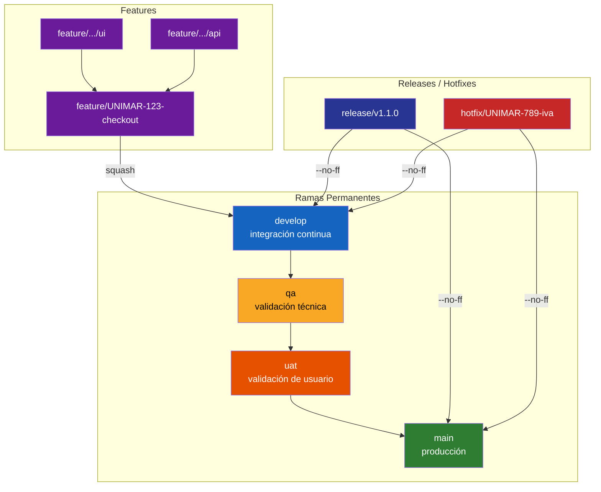
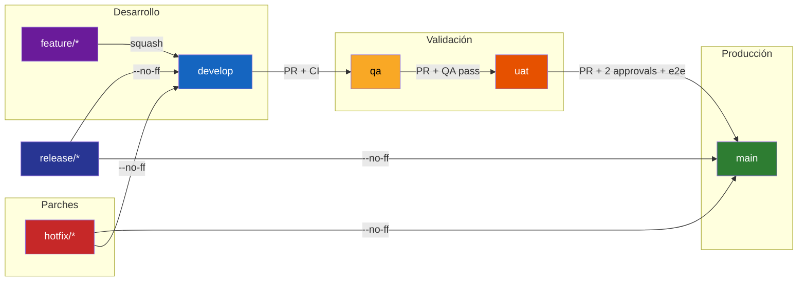

# Estrategia de Ramificación

> **Estándares de Referencia:** ADR-0050 (modelo GitFlow extendido), [Conventional Commits v1.0.0](https://www.conventionalcommits.org/) (estándar de commits), [SemVer](https://semver.org/) (versionado semántico).
> **Propósito:** Definir el modelo de ramas, flujo de promoción entre ambientes, reglas de Pull Request, estándar de commits y herramientas de validación que gobiernan todo el ciclo de vida del código fuente en Unimar.

---

## 1. ¿Qué? / ¿Por qué? / ¿Cuándo?

| Aspecto | Respuesta |
| :------ | :-------- |
| **¿Qué?** | GitFlow extendido con 4 ramas permanentes (`main`, `develop`, `qa`, `uat`) y 3 tipos de ramas temporales (`feature/*`, `release/*`, `hotfix/*`). |
| **¿Por qué?** | Sin una convención explícita se producen merges caóticos, pérdida de trazabilidad y promociones manuales sin control de calidad. Este modelo soporta releases concurrentes, hotfixes urgentes y merges auditables sobre un monorepo Nx. |
| **¿Cuándo usarlo?** | Desde F2 (creación de ramas de feature) hasta F5 (merge de release/hotfix a main). Cada merge entre ambientes sigue los criterios de promoción definidos. |
| **¿Quién lo usa?** | Desarrolladores (feature/*), Tech Lead (develop → qa), QA (qa → uat), Architecture Board (uat → main, hotfix). |

---

## 2. Modelo de Ramas



### Descripción de Ramas

| Rama | Propósito | Base | Fusiona a | Vida útil |
| :--- | :-------- | :--- | :-------- | :-------- |
| `main` | Producción. Estado desplegado en producción | — | — | Permanente |
| `develop` | Integración continua. Feature branches convergen aquí | `main` | — | Permanente |
| `qa` | Validación técnica y funcional (QA interna) | `develop` | `uat` | Permanente |
| `uat` | Validación del usuario de negocio (UAT) | `qa` | `main` vía `release/*` | Permanente |
| `feature/*` | Desarrollo de una funcionalidad o historia | `develop` | `develop` (squash) | Temporal |
| `feature/X/name` | Sub-tareas dentro de una feature (UI, API, DB, DOC) | `feature/*` padre | `feature/*` padre (--no-ff) | Temporal |
| `release/*` | Preparación de release (changelog, versión, últimos retoques) | `develop` | `main` y `develop` (--no-ff) | Temporal |
| `hotfix/*` | Corrección urgente en producción | `main` | `main` y `develop` (--no-ff) | Temporal |

---

## 3. Flujo de Promoción entre Ambientes



### Criterios de Promoción

| Promoción | Criterios |
| :--------- | :-------- |
| `develop` → `qa` | PR aprobado (mín. 1 reviewer distinto del autor), CI verde (lint, test, build, CodeQL, cobertura ≥ 70%), sin conflictos |
| `qa` → `uat` | PR aprobado (mín. 1 reviewer), QA reporta pruebas funcionales OK, smoke tests OK, CodeQL sin findings High/Critical |
| `uat` → `main` | PR aprobado (mín. 2 reviewers, uno del Architecture Board), pruebas e2e OK, UAT firmado por Product Owner, release tag creado |

---

## 4. Pull Requests y Gates de Merge

### Estrategia de Merge por Rama Destino

| Rama destino | Estrategia | Razón |
| :----------- | :--------- | :---- |
| `feature/*` (sub-rama → padre) | `merge --no-ff` | Conserva historial de trabajo individual |
| `develop` | `squash` | Mantiene historial limpio; un commit por feature |
| `qa`, `uat` | `merge --no-ff` o `squash` | Trazabilidad de la promoción |
| `main` | `merge --no-ff` | Preserva el merge de release/hotfix |
| `release/*` → `main` | `merge --no-ff` | Trazabilidad del release |

### Aprobaciones Mínimas

| Rama destino | Aprobaciones | Reviewers requeridos |
| :----------- | :----------: | :------------------- |
| `develop` | 1 | Tech Lead o par senior |
| `qa` | 1 | Tech Lead |
| `uat` | 1 | QA Engineer |
| `main` | 2 | 1 Tech Lead + 1 Architecture Board |
| `release/*` | 2 | Tech Lead + Release Manager |
| `hotfix/*` | 1 | Architecture Board |

### Protección de Ramas (GitHub)

| Regla | `main` | `uat` | `qa` | `develop` |
| :---- | :----: | :---: | :--: | :-------: |
| Requerir PR | Sí | Sí | Sí | Sí |
| Requerir approvals | 2 | 1 | 1 | 1 |
| Dismiss stale reviews | Sí | Sí | Sí | Sí |
| Requerir status checks | Sí | Sí | Sí | Sí |
| Restringir push directo | Sí | Sí | Sí | Sí |
| Incluir administradores | Sí | Sí | Sí | Sí |

---

## 5. Estándar de Commits

Se adopta **Conventional Commits v1.0.0** con validación automática vía commitlint + husky.

```
<tipo>(<alcance opcional>): <descripción>

[cuerpo opcional]

[pie opcional con BREAKING CHANGE o footers]
```

| Tipo | Uso | Release |
| :--- | :-- | :------ |
| `feat` | Nueva funcionalidad | Minor |
| `fix` | Corrección de bug | Patch |
| `chore` | Mantenimiento, tooling, refactors | No release |
| `docs` | Cambios en documentación | No release |
| `style` | Formato, lint (sin cambio lógico) | No release |
| `refactor` | Refactor sin cambio funcional | No release |
| `perf` | Mejora de rendimiento | Patch |
| `test` | Añadir o corregir pruebas | No release |
| `ci` | Cambios en CI/CD | No release |
| `build` | Cambios en sistema de build | No release |

`BREAKING CHANGE` en el pie del commit produce un **Major release** independientemente del tipo.

---

## 6. Herramientas

| Herramienta | Propósito | Instalación | Uso | Licencia |
| :---------- | :-------- | :---------- | :-- | :------- |
| [Git](https://git-scm.com/) | Control de versiones distribuido | [instalación](https://git-scm.com/downloads) | [docs](https://git-scm.com/doc) | GPL 2.0 (gratuita) |
| [commitlint](https://commitlint.js.org/) | Validación de commits Conventional Commits | `npm install -D @commitlint/cli @commitlint/config-conventional` | [docs](https://commitlint.js.org/#/) | MIT (gratuita) |
| [husky](https://typicode.github.io/husky/) | Git hooks para validación pre-commit y commit-msg | `npm install -D husky` | [docs](https://typicode.github.io/husky/get-started.html) | MIT (gratuita) |
| [Nx Release](https://nx.dev/features/manage-releases) | Versionado automático y generación de changelog | Incluido con Nx | [docs](https://nx.dev/features/manage-releases) | MIT (gratuita) |
| [GitHub Branch Protection](https://docs.github.com/en/repositories/configuring-branches-and-merges-in-your-repository/managing-protected-branches) | Reglas de protección de ramas | Nativo en GitHub | [docs](https://docs.github.com/en/repositories/configuring-branches-and-merges-in-your-repository/managing-protected-branches) | Gratuito |
| [GitHub Secret Scanning](https://docs.github.com/en/code-security/secret-scanning) | Detección de secretos en commits | Nativo en GitHub | [docs](https://docs.github.com/en/code-security/secret-scanning) | Gratuito para repos públicos |

---

## 7. ADRs Relacionados

| ADR | Propósito |
| :-- | :-------- |
| ADR-0050 — GitFlow Extendido | Especificación detallada del modelo de ramificación con ejemplos, convenciones de nombres, flujo de creación/cierre y herramientas |
| ADR-0001 — Orquestación de Monorepo con Nx | Monorepo orquestado con Nx que determina cómo se ejecutan builds y pruebas por proyecto afectado |
| ADR-0005 — Puertas de Calidad CI/CD con CodeQL | Gates de seguridad en CI/CD que se ejecutan en cada PR a ramas protegidas |
| ADR-0018 — Pirámide de Pruebas y Puertas de Calidad | Cobertura mínima y calidad de pruebas exigida en cada merge |

---

## 8. Documentos Relacionados

| Documento | Relación |
| :-------- | :------- |
| [Estrategia de Pruebas](./estrategia-pruebas.es.md) | La secuencia de pruebas sigue el flujo de promoción entre ramas (unitarias en develop, integración en qa, e2e en uat) |
| [Estrategia de Monitoreo](../standards/engineering/estrategia-monitoreo.es.md) | Las métricas RED/USE se verifican post-merge a main en F5 |
| [Plan de Despliegue](../standards/engineering/plantilla-plan-despliegue.es.md) | La creación de release/* branches dispara el plan de despliegue |
| [Guía Post-Despliegue](../standards/engineering/guia-post-despliegue.es.md) | Checklist post-merge a main que incluye verificación de tag y changelog |
| [Gates de Calidad SDLC](./gates-calidad.es.md) | Los gates de calidad (cobertura, CodeQL, CVEs) se ejecutan en cada PR a ramas protegidas |

---

[Volver al Hub de Gobernanza](./README.md)
