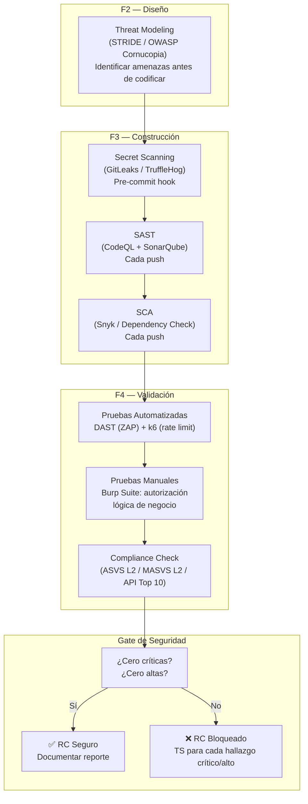
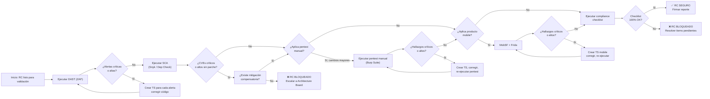

# Estrategia de Pruebas de Seguridad

> **Fase SDLC:** F2 (Diseño) a F4 (Validación) — transversal
> **Audiencia:** Security Lead, QA, Desarrolladores, DevOps
> **Propósito:** Secuencia ordenada de pasos que un experto debe seguir para ejecutar las pruebas de seguridad al 100%, desde el threat modeling hasta el reporte final, con flujos claros, decisiones y criterios de aceptación.

---

## 1. Flujo General de Seguridad en el SDLC



---

## 2. Secuencia Detallada de Ejecución

### Etapa 1: Threat Modeling (F2 — Diseño)

> **Propósito:** Identificar amenazas de seguridad antes de escribir una línea de código. Es la etapa más barata para corregir.

| Aspecto | Detalle |
| :------ | :------ |
| **Propósito** | Modelar el sistema para identificar amenazas usando STRIDE (Spoofing, Tampering, Repudiation, Information Disclosure, Denial of Service, Elevation of Privilege) |
| **¿Cuándo?** | Durante F2 — Diseño, antes de comenzar la construcción de cada feature o integración |
| **¿Quién?** | Arquitecto + Security Lead + Desarrollador senior del feature |
| **Entrada** | Documento de diseño de arquitectura, diagrama de componentes, flujos de datos |
| **Herramienta** | [OWASP Threat Dragon](https://owasp.org/www-project-threat-dragon/) (gratuita) o [Microsoft Threat Modeling Tool](https://learn.microsoft.com/en-us/azure/security/develop/threat-modeling-tool) |
| **Salida** | Matriz de amenazas priorizadas (Crítica/Alta/Media/Baja) con mitigaciones propuestas |

**Pasos para el experto:**

1. Dibujar el diagrama de flujo de datos (DFD) del componente bajo análisis
2. Identificar los trust boundaries (límites de confianza entre componentes)
3. Aplicar STRIDE a cada elemento del DFD
4. Priorizar amenazas usando DREAD (Damage, Reproducibility, Exploitability, Affected Users, Discoverability)
5. Documentar mitigaciones para cada amenaza críticas/altas
6. Cerrar el threat modeling antes de pasar a F3 — Construcción

> **Salida obligatoria:** `docs/planning-artifacts/security/threat-model-<feature>.es.md`

---

### Etapa 2: Secret Scanning (F3 — Construcción, pre-commit)

> **Propósito:** Evitar que credenciales, tokens, API keys o certificados lleguen al repositorio.

| Aspecto | Detalle |
| :------ | :------ |
| **¿Qué busca?** | Claves, tokens, contraseñas, certificados, conexiones strings con credenciales |
| **¿Cuándo?** | En el hook pre-commit (local) y en CI (cada push) |
| **¿Quién?** | Desarrollador (pre-commit) + pipeline CI |
| **Herramienta** | GitLeaks (MIT, gratuita) o TruffleHog (AGPL, gratuita) |
| **Criterio** | **Tolerancia cero.** Cualquier secreto encontrado bloquea el commit/push. |

**Pasos para el experto:**

1. Configurar el hook pre-commit con GitLeaks en cada repositorio
2. Verificar que el pipeline CI ejecute GitLeaks/TruffleHog antes de SAST
3. Si se encuentra un secreto: rotarlo inmediatamente (no solo borrar el commit)
4. Documentar el incidente en el reporte de seguridad

> **Regla:** Si un secreto llegó a main aunque sea por un solo commit, debe rotarse. No basta con borrar el historial.

---

### Etapa 3: SAST — Análisis Estático (F3 — Construcción, cada push)

> **Propósito:** Detectar vulnerabilidades en el código fuente sin ejecutarlo.

| Aspecto | Detalle |
| :------ | :------ |
| **¿Qué detecta?** | SQLi, XSS, path traversal, hardcoded secrets, deserialización insegura, inyección de código, uso inseguro de criptografía |
| **¿Cuándo?** | En cada push a cualquier rama compartida |
| **¿Quién?** | Pipeline CI (automático) |
| **Herramientas** | CodeQL (SAST en pipeline) + SonarQube (quality gate + security hotspots) |
| **Cobertura** | 100% del código nuevo y modificado |
| **Criterio** | **Cero vulnerabilidades críticas y altas.** Si aparecen, el pipeline falla y bloquea el merge. |

**Pasos para el experto:**

1. Verificar que el pipeline ejecute CodeQL en todos los lenguajes del stack (.NET, Node.js, Kotlin)
2. Configurar SonarQube Quality Gate para que incluya security hotspots como condición de fallo
3. Revisar manualmente los falsos positivos reportados por SAST: si un hallazgo es falso positivo, documentar por qué en el propio reporte de SonarQube/CodeQL
4. Para cada hallazgo verdadero: crear TS (Technical Story) asignada al desarrollador del componente
5. Validar que la TS se resuelva antes del merge

> **Salida:** Reporte automatizado de CodeQL + SonarQube en cada push.

---

### Etapa 4: SCA — Análisis de Dependencias (F3 — Construcción, cada push)

> **Propósito:** Detectar CVEs conocidos en librerías de terceros y dependencias del proyecto.

| Aspecto | Detalle |
| :------ | :------ |
| **¿Qué detecta?** | CVEs en dependencias directas y transitivas (npm, NuGet, Gradle, Docker images) |
| **¿Cuándo?** | En cada push, después de SAST |
| **¿Quién?** | Pipeline CI (automático) |
| **Herramientas** | Snyk (recomendada, free limitado) o Dependency Check (Apache 2.0, gratuita) |
| **Cobertura** | 100% de dependencias del proyecto |
| **Regla** | **Cero CVEs críticos y altos sin parche disponible.** Si un CVE crítico no tiene parche, documentar mitigación (WAF rule, feature flag, aislamiento de red, etc.). |

**Pasos para el experto:**

1. Configurar Snyk/Dependency Check en el pipeline CI
2. Definir threshold: fallo del pipeline si hay CVEs críticos o altos con exploit conocido
3. Si un CVE no tiene parche disponible:
   - Evaluar el riesgo real (CVSS base vs. entorno)
   - Documentar mitigación compensatoria
   - Si no hay mitigación posible, escalar al Architecture Board
4. Revisar SCA al menos semanalmente en busca de nuevos CVES que afecten dependencias existentes

> **Salida:** Reporte automatizado de SCA en cada push. Reporte de monitoreo continuo semanal.

---

### Etapa 5: DAST — Análisis Dinámico (F4 — Validación, RC)

> **Propósito:** Ejecutar ataques simulados contra la aplicación en ejecución para descubrir vulnerabilidades que SAST no detecta.

| Aspecto | Detalle |
| :------ | :------ |
| **¿Qué detecta?** | XSS reflejado/persistente, SQLi, CSRF, misconfiguraciones de servidor, cabeceras de seguridad faltantes, exposición de información sensible en respuestas |
| **¿Cuándo?** | En cada release candidate (RC), antes de sellar |
| **¿Quién?** | QA / DevOps ejecuta ZAP automatizado. Security Lead revisa resultados. |
| **Herramienta** | OWASP ZAP (Apache 2.0, gratuita) |
| **Cobertura** | Todos los endpoints del alcance definido en el plan |
| **Criterio** | **Cero alertas críticas y altas.** Alertas medias se documentan y planifica su corrección. |

**Pasos para el experto:**

1. Definir el alcance del DAST en el Plan de Pruebas de Seguridad
2. Configurar ZAP en modo automatizado (ZAP API + Docker)
3. Ejecutar el escaneo pasivo primero (spider): mapear todos los endpoints
4. Ejecutar el escaneo activo: inyectar payloads maliciosos en cada parámetro
5. Revisar manualmente cada alerta: ZAP puede generar falsos positivos, especialmente en escaneo activo
6. Para alertas verdaderas:
   - Crear TS para cada hallazgo crítico/alto
   - Documentar hallazgos medios con prioridad para el siguiente sprint
7. Si el RC tiene hallazgos críticos o altos: ❌ **bloquear el sellado**

> **Referencia:** [OWASP ZAP User Guide](https://www.zaproxy.org/docs/desktop/start/)

---

### Etapa 6: Pruebas Manuales de Penetración (F4 — Validación, pre-release mayor)

> **Propósito:** Probar escenarios de seguridad que las herramientas automatizadas no pueden cubrir: autorización horizontal/vertical, lógica de negocio, bypass de autenticación, business logic abuse.

| Aspecto | Detalle |
| :------ | :------ |
| **¿Qué prueba?** | Omisión de autorización (IDOR, privilege escalation), business logic abuse, autenticación multifactor, rate limiting, session management |
| **¿Cuándo?** | Anual o antes de cambios mayores de arquitectura |
| **¿Quién?** | Auditor externo o Security Lead certificado (OSCP, OSWE, CISSP) |
| **Herramienta** | Burp Suite Professional (paga) |
| **Cobertura** | 100% de los flujos críticos del producto |
| **Criterio** | **Cero hallazgos críticos y altos.** Si se encuentran, el release se retrasa hasta que se corrijan y re-validen. |

**Pasos para el experto:**

1. Preparar el entorno: staging con datos de prueba realistas
2. Configurar Burp Suite como proxy de interceptación
3. Mapear manualmente la aplicación (identificar todos los endpoints, parámetros, métodos HTTP)
4. Probar cada endpoint contra:
   - **API1 — Broken Object Level Authorization:** modificar IDs en requests para acceder a datos de otro usuario
   - **API2 — Broken Authentication:** intentar login con tokens robados, session fixation, JWT débiles
   - **API5 — Broken Function Level Authorization:** acceder a endpoints admin desde rol user
   - **Business Logic:** realizar operaciones fuera de orden, bypass de límites, manipulación de montos/cantidades
5. Documentar cada hallazgo con: paso a paso de la explotación, impacto, severidad (CVSS v3.1), evidencia (screenshot o video)
6. Evaluar cada hallazgo con el equipo de desarrollo y definir plan de mitigación
7. Re-testear después de las correcciones

> **Salida obligatoria:** `docs/planning-artifacts/security/reporte-pentest-<producto>-<YYYY-MM>.es.md`

---

### Etapa 7: Pruebas de Seguridad Mobile (F4 — Validación, RC mobile)

> **Propósito:** Validar la seguridad específica de aplicaciones Android/iOS contra OWASP MASVS L2.

| Aspecto | Detalle |
| :------ | :------ |
| **¿Qué prueba?** | Almacenamiento inseguro, comunicación no cifrada, autenticación débil, ofuscación de código, root/jailbreak detection, certificate pinning |
| **¿Cuándo?** | En cada RC mobile |
| **¿Quién?** | QA Mobile ejecuta MobSF. Security Lead o auditor externo ejecuta Frida. |
| **Herramientas** | MobSF (análisis estático + dinámico) + Frida (instrumentación) + Objection (exploración runtime) |
| **Cobertura** | 100% del APK/IPA y sus permisos |
| **Criterio** | **Cero hallazgos críticos y altos en MASVS.** |

**Pasos para el experto:**

1. **Estático (MobSF):**
   - Subir el APK/AAB a MobSF
   - Revisar: permisos solicitados vs. necesarios, almacenamiento de datos sensibles (SharedPrefs, SQLite sin cifrar), hardcoded keys/API tokens
   - Verificar ofuscación (ProGuard/R8/ DexGuard)
2. **Dinámico (Frida + Objection):**
   - Instalar la app en un dispositivo rooteado/emulador
   - Probar bypass de root detection
   - Verificar certificate pinning (si falla, la app debe negar la conexión)
   - Interceptar tráfico con Burp Suite para verificar TLS
   - Probar almacenamiento en KeyStore/EncryptedSharedPreferences
3. **Documentar:**
   - Cada hallazgo con severidad, paso a paso y evidencia
   - Plan de mitigación por cada hallazgo crítico/alto

> **Salida obligatoria:** Reporte MobSF (JSON/PDF) + reporte manual de Frida.

---

### Etapa 8: Compliance Check y Reporte Final (F4 — Validación, Gate)

> **Propósito:** Verificar que el producto cumple con todos los estándares aplicables y generar el reporte de seguridad que el Architecture Board necesita para autorizar el release.

| Aspecto | Detalle |
| :------ | :------ |
| **¿Qué verifica?** | Cumplimiento contra OWASP ASVS L2 (web), OWASP MASVS L2 (mobile), OWASP API Top 10 (servicios), CIS Benchmarks (BD) |
| **¿Cuándo?** | Inmediatamente antes de sellar el RC |
| **¿Quién?** | Security Lead |
| **Entrada** | Resultados de todas las etapas anteriores (SAST, SCA, DAST, pentest, mobile) |
| **Salida** | Reporte consolidado de seguridad con decisión final |

**Lista de verificación (checklist):**

```markdown
### Checklist de Compliance de Seguridad

- [ ] Threat Modeling completado y documentado (F2)
- [ ] Secret Scanning: cero secretos en repositorio (F3 - pre-commit)
- [ ] SAST: cero vulnerabilidades críticas y altas (F3 - push)
- [ ] SCA: cero CVEs críticos y altos sin mitigación (F3 - push)
- [ ] DAST: cero alertas críticas y altas (F4 - RC)
- [ ] Pentest manual (si aplica): cero hallazgos críticos y altos
- [ ] Mobile: cero hallazgos críticos y altos en MASVS (si aplica)
- [ ] Base de Datos: CIS Benchmark aprobado (si aplica)
- [ ] Reporte consolidado firmado por Security Lead
```

**Decisión final:**

| Estado | Condición | Acción |
| :----- | :-------- | :----- |
| ✅ **APROBADO** | Checklist 100% completo, cero críticas/altas | RC puede sellarse |
| ⚠️ **APROBADO CON CONDICIONES** | Checklist completo, medias documentadas con plan de mitigación | RC puede sellarse. Seguimiento obligatorio en el próximo sprint |
| ❌ **RECHAZADO** | Checklist incompleto o críticas/altas sin mitigación | RC no se sella. El equipo debe corregir y re-ejecutar DAST + pentest |

---

## 3. Matriz de Etapas vs. Tipo de Producto

No todas las etapas aplican a todos los productos. Esta matriz indica qué ejecutar según el alcance:

| Etapa | Web | Mobile | API | BD | ¿Cuándo? |
| :---- | :-: | :----: | :-: | :-: | :------- |
| 1 — Threat Modeling | ✅ | ✅ | ✅ | ✅ | F2 |
| 2 — Secret Scanning | ✅ | ✅ | ✅ | ✅ | F3, pre-commit |
| 3 — SAST | ✅ | ✅ | ✅ | — | F3, cada push |
| 4 — SCA | ✅ | ✅ | ✅ | ✅ | F3, cada push |
| 5 — DAST | ✅ | — | ✅ | — | F4, RC |
| 6 — Pentest manual | ✅ | ✅ | ✅ | ✅ | Anual / cambio mayor |
| 7 — Mobile security | — | ✅ | — | — | F4, RC mobile |
| 8 — Compliance + Reporte | ✅ | ✅ | ✅ | ✅ | F4, Gate |

---

## 4. Flujo de Decisión: ¿El RC es Seguro?



---

## 5. Checklist Práctico para el Experto (Ejecución Diaria)

### Antes de empezar el día

| # | Acción | Herramienta | Tiempo estimado |
| :- | :----- | :---------- | :-------------- |
| 1 | Revisar alerts de SAST del último push | CodeQL + SonarQube | 10 min |
| 2 | Revisar nuevos CVEs en dependencias activas | Snyk / Dependency Check | 10 min |
| 3 | Verificar que el pipeline CI de seguridad pasó en develop | GitHub Actions | 5 min |

### Durante el sprint

| # | Acción | Herramienta | ¿Cuándo? |
| :- | :----- | :---------- | :------- |
| 1 | Threat modeling de nuevas features | Threat Dragon | Antes de codificar |
| 2 | Revisar hallazgos SAST por cada PR | CodeQL | En cada code review |
| 3 | Ejecutar DAST en entorno de staging | ZAP | Después de merge a develop |
| 4 | Verificar secret scanning en nuevos repos | GitLeaks | Al crear el repo |

### En release candidate

| # | Acción | Herramienta | Responsable |
| :- | :----- | :---------- | :---------- |
| 1 | Ejecutar DAST completo | ZAP (full active scan) | QA / DevOps |
| 2 | Ejecutar SCA completo | Snyk | QA / DevOps |
| 3 | Ejecutar MobSF (si mobile) | MobSF | QA Mobile |
| 4 | Ejecutar compliance checklist | Manual | Security Lead |
| 5 | Firmar reporte consolidado | — | Security Lead |

---

## 6. Indicadores Clave (KPIs)

| Métrica | Objetivo | Frecuencia de medición |
| :------ | :------- | :--------------------- |
| **Tiempo entre detección y corrección (MTTR)** | < 48h para críticas, < 7d para altas | Por incidente |
| **Vulnerabilidades críticas en producción** | Cero | Por release |
| **Cobertura SAST** | 100% del código nuevo | Por push |
| **Cobertura SCA** | 100% de dependencias | Por push |
| **Tasa de falsos positivos SAST** | < 20% | Mensual |
| **Checklist de compliance completado** | 100% antes de sellar RC | Por release |
| **Pruebas de seguridad ejecutadas vs. planificadas** | 100% | Por sprint |

---

## 7. Referencias

| Recurso | Tipo | URL |
| :------ | :--- | :-- |
| OWASP Threat Dragon | Herramienta | https://owasp.org/www-project-threat-dragon/ |
| OWASP ZAP User Guide | Documentación | https://www.zaproxy.org/docs/desktop/start/ |
| OWASP ASVS v4.0 | Estándar | https://owasp.org/www-project-application-security-verification-standard/ |
| OWASP WSTG v5.0 | Guía | https://owasp.org/www-project-web-security-testing-guide/ |
| OWASP MASVS v2.0 | Estándar | https://mas.owasp.org/ |
| NIST SP 800-115 | Guía | https://csrc.nist.gov/publications/detail/sp/800-115/final |
| Mozilla Observatory | Herramienta | https://observatory.mozilla.org/ |
| securityheaders.com | Herramienta | https://securityheaders.com/ |
| [Plan de Pruebas de Seguridad](../standards/testing/plan-seguridad.es.md) | Plan | Herramientas, controles por tipo de producto, criterios de aceptación |
| [Gates de Calidad SDLC](./gates-calidad.es.md) | Estándar | Umbrales numéricos de aceptación |

---

Volver a Fase 4 — Validación
