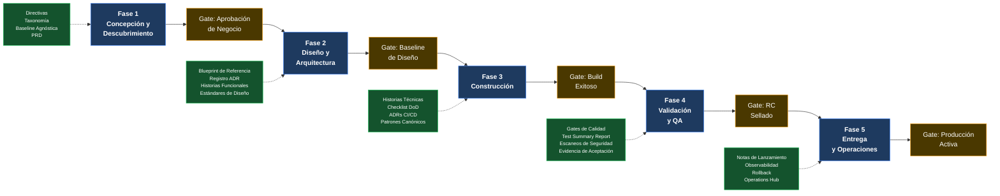

# Mapeo SDLC–Artefactos

  
  
  
  

> **Propietario:** Architecture Board
> **Estado:** Referencia activa
> **Padre:** [Centro de Gobernanza SDLC](./README.md)

---

## Propósito

El [Framework SDLC Orientado a Construcción](./02-ingenieria/framework-sdlc-enfoque-construccion.es.md) define cinco fases formales del ciclo de vida y sus puertas de salida. Este documento responde una pregunta diferente: **en cada fase, qué artefactos son obligatorios como entradas, cuáles son recomendados y qué papel juegan?**

Usa este mapeo para:

- Incorporar un nuevo equipo de producto y comunicar exactamente qué debe consultar en cada etapa.
- Realizar revisiones de gates del Architecture Board con una lista trazable de artefactos.
- Identificar brechas cuando una fase carece de artefactos requeridos.
- Alinear equipos técnicos, QA, Producto, Operaciones y Directores de Tecnología alrededor del mismo modelo de evidencia.

---

## Cómo Leer Este Documento

| Valor | Significado |
|---|---|
| `Req` | **Requerido.** Debe consultarse o producirse antes de activar el gate de salida de fase. Su ausencia bloquea el gate. |
| `Opc` | **Opcional.** Buena práctica recomendada; situacional según complejidad del producto, madurez del equipo o fase de roadmap evolutivo. |
| `Cond` | **Condicional.** Requerido solo cuando aplica la condición detonante indicada en la columna Notas. |
| _(vacío)_ | No aplica en esta fase. |

---

## 1. Vista General del Ciclo de Vida

---

## 2. Fase 1 — Concepción y Descubrimiento

**Gate de salida:** Aprobación de Negocio — Alcance Congelado

| Artefacto | Tipo | Ubicación | Notas |
|---|---|---|---|
| **Historia de Usuario** | `Req` | [plantilla-historia-usuario.es.md](./04-plantillas-artefactos/plantilla-historia-usuario.es.md) | Definición atómica con criterios BDD y separación técnica. |
| **PRD — Documento de Requisitos de Producto** | `Req` | [plantilla-prd.es.md](./04-plantillas-artefactos/plantilla-prd.es.md) | Captura alcance, personas, objetivos, restricciones, no-objetivos y evidencia de aprobación. |
| **Backlog Ágil** | `Req` | [plantilla-backlog-agil.es.md](./04-plantillas-artefactos/plantilla-backlog-agil.es.md) | Agrupación versionada de historias listas para priorización. |
| **Directivas Arquitectónicas** | `Req` | [directivas-arquitectonicas.es.md](../standards/vision/directivas-arquitectonicas.es.md) | Restricciones no negociables que acotan todo el alcance del producto. |
| **Baseline Agnóstica** | `Req` | [stack-tecnologico-autorizado-agnostico.es.md](../../architecture/stack-tecnologico-autorizado-agnostico.es.md) | Baseline neutral a tecnología que todo producto debe cumplir. |
| **ADR-0047 — Selección de Topología Inicial** | `Req` | [ADR-0047](../../architecture/adrs/core/0047-patrones-arquitectonicos-monolito-soa-microservicios.es.md) | Confirma topología de Monolito Modular salvo que criterios de extracción ya estén satisfechos. |
| **Roadmap de Estrategia Evolutiva** | `Req` | [roadmap-estrategia-evolutiva.es.md](../standards/vision/roadmap-estrategia-evolutiva.es.md) | Define horizonte de producto y fases de entrega antes de comprometer alcance. |
| Lienzo de Descubrimiento | `Opc` | [plantilla-lienzo-descubrimiento.es.md](./04-plantillas-artefactos/plantilla-lienzo-descubrimiento.es.md) | Registro de iniciativa, dolor del cliente y valor esperado. |
| Business Case ROI | `Opc` | [plantilla-caso-negocio-roi.es.md](./04-plantillas-artefactos/plantilla-caso-negocio-roi.es.md) | Cuando se requiere sustento formal de viabilidad financiera. |
| Estimación Preliminar | `Opc` | [plantilla-estimacion-preliminar.es.md](./04-plantillas-artefactos/plantilla-estimacion-preliminar.es.md) | Cuando el equipo necesita tallas relativas antes de comprometer capacidad. |
| Taxonomía de Repositorio | `Opc` | [taxonomia-repositorio.md](../standards/taxonomia-repositorio.md) | Cuando se crean repositorios o módulos nuevos en esta fase. |
| Manifiesto de Ingeniería | `Opc` | [manifiesto-ingenieria.md](../standards/engineering/manifiesto-ingenieria.md) | Referencia de expectativas de ingeniería; obligatorio antes de construcción (F3). |

---

## 3. Fase 2 — Diseño y Arquitectura

**Gate de salida:** Baseline de Diseño Aprobado

| Artefacto | Tipo | Ubicación | Notas |
|---|---|---|---|
| **Blueprint de Referencia** | `Req` | [blueprint-referencia.es.md](../../architecture/blueprints/blueprint-referencia.es.md) | Modelo C4 canónico. Los diagramas del producto deben ser trazables a él. |
| Blueprint de Arquitectura de Producto | `Cond` | [plantilla-blueprint-arquitectura.es.md](./04-plantillas-artefactos/plantilla-blueprint-arquitectura.es.md) | Instancia arc42 por-producto del Blueprint de Referencia. Requerido cuando el producto define arquitectura propia (fronteras, contenedores C4, ADRs); se inicia como borrador en Discovery (F1) y se congela en este gate. Ver [ejemplo Q-Track](./04-plantillas-artefactos/ejemplos/ejemplo-blueprint-arquitectura-qtrack.es.md). |
| **Tech Stack Autoritativo** | `Req` | [stack-tecnologico-autorizado-agnostico.es.md](../../architecture/stack-tecnologico-autorizado-agnostico.es.md) | Solo pueden introducirse tecnologías aprobadas salvo nuevo ADR. |
| **Matriz de Decisión ADR** | `Req` | [matriz-adr.es.md](../../architecture/adrs/matriz-adr.es.md) | Previene decisiones arquitectónicas duplicadas o contradictorias. |
| **ADR-0002 — Arquitectura Hexagonal** | `Req` | [ADR-0002](../../architecture/adrs/nodejs/0002-arquitectura-limpia-nestjs.es.md) | Límite obligatorio de Ports and Adapters. |
| **ADR-0018 — Pirámide de Testing** | `Req` | [ADR-0018](../../architecture/adrs/core/0018-piramide-pruebas-gates-calidad.es.md) | Distribución objetivo de pruebas: 70/20/10. Diseñar antes de construcción. |
| **ADR-0031 — Schema-per-Context** | `Req` | [ADR-0031](../../architecture/adrs/core/0031-esquema-por-contexto-catalogo-eventos-dominio.es.md) | Límites de schema por bounded context deben decidirse antes de construcción. |
| **ADR-0032 — Matriz de Selección de Protocolo** | `Req` | [ADR-0032](../../architecture/adrs/core/0032-matriz-decision-protocolos-api-rest-grpc-graphql.es.md) | REST/gRPC/GraphQL deben resolverse antes de producir contratos API. |
| **Mapa de Contextos Acotados** | `Req` | [contextos-acotados.md](../../knowledge/dominio/contextos-acotados.md) | Lenguaje ubicuo, nombres canónicos y ownership de contextos deben establecerse antes de nombrar entidades y endpoints. |
| **Plantilla de Historia Funcional** | `Req` | [plantilla-historia-funcional.es.md](./04-plantillas-artefactos/plantilla-historia-funcional.es.md) | Estructura requerida para especificaciones de comportamiento de negocio. |
| **Estándar de Escritura de Historias Funcionales** | `Req` | [estandar-redaccion-historias-funcionales.es.md](./03-documentacion/estandar-redaccion-historias-funcionales.es.md) | Asegura historias legibles por negocio y separación de detalles de implementación. |
| **Buenas Prácticas de Documentación SDLC** | `Req` | [mejores-practicas-documentacion-sdlc.es.md](./03-documentacion/mejores-practicas-documentacion-sdlc.es.md) | Gobierna cómo se producen, versionan y revisan los artefactos de diseño. |
| **Checklist de Simplicidad Fase 1** | `Req` | [lista-verificacion-simplicidad-fase-01.es.md](../../architecture/blueprints/lista-verificacion-simplicidad-fase-01.es.md) | Bloquea sobre-ingeniería antes de aprobar la Baseline de Diseño. |
| ADR-0010 — Sucursal como Dimensión de Negocio | `Cond` | [ADR-0010](../../architecture/adrs/core/0010-estrategia-arquitectura-multitenant.es.md) | Cuando el producto gestiona operaciones diferenciadas por sucursal. |
| ADR-0045 — Criterios de Extracción a Microservicios | `Opc` | [ADR-0045](../../architecture/adrs/core/0045-criterios-extraccion-microservicios.es.md) | Cuando el roadmap incluye posible extracción a microservicios. |
| Especificación de Topología C4 | `Opc` | [especificacion-topologia-c4.es.md](../../architecture/blueprints/especificacion-topologia-c4.es.md) | Cuando se producen diagramas C4 formales. |
| Análisis Estratégico CAP | `Opc` | [analisis-estrategico-cap.es.md](../../architecture/analisis-estrategico-cap.es.md) | Cuando se hacen tradeoffs explícitos entre consistencia y disponibilidad. |
| Flujo de Arquitectura de Observabilidad | `Opc` | [flujo-arquitectura-observabilidad.es.md](../../architecture/flujo-arquitectura-observabilidad.es.md) | Al diseñar tracing distribuido y agregación de logs. |
| Patrones Canónicos | `Opc` | [canonical-patterns/README.md](../../architecture/canonical-patterns/README.md) | Cuando se adoptan implementaciones de referencia runtime-specific. |
| Vista Técnica UMS | `Opc` | vista-tecnica-ums.es.md | Cuando patrones de identidad o autorización de UMS son directamente aplicables. |

---

## 4. Fase 3 — Construcción

**Gate de salida:** Build Exitoso — Merge de PR Autorizado

| Artefacto | Tipo | Ubicación | Notas |
|---|---|---|---|
| **Plantilla de Historia Técnica** | `Req` | [plantilla-historia-tecnica.es.md](./04-plantillas-artefactos/plantilla-historia-tecnica.es.md) | Descompone Historias Funcionales en unidades de implementación con criterios técnicos y DoD. |
| **Manifiesto de Ingeniería** | `Req` | [manifiesto-ingenieria.md](../standards/engineering/manifiesto-ingenieria.md) | Gobierna SOLID, DRY, KISS, YAGNI, anti-patrones y disciplina de PR. |
| **Framework SDLC — §3 y §4** | `Req` | [framework-sdlc-enfoque-construccion.es.md](./02-ingenieria/framework-sdlc-enfoque-construccion.es.md) | Define ciclo de construcción, métricas de umbral y checklist DoD. |
| **Gates de Calidad SDLC** | `Req` | [gates-calidad.es.md](./gates-calidad.es.md) | Baseline bloqueante: cobertura >= 80%, complejidad <= 15, cero CVEs high/critical, deuda < 5%. |
| **ADR-0005 — Pipeline CI/CD** | `Req` | [ADR-0005](../../architecture/adrs/core/0005-ci-cd-calidad-codeql.es.md) | Ningún merge se autoriza sin CI, linting, testing y escaneo de seguridad aprobados. |
| **ADR-0018 — Pirámide de Testing** | `Req` | [ADR-0018](../../architecture/adrs/core/0018-piramide-pruebas-gates-calidad.es.md) | Distribución objetivo 70/20/10. El umbral de cobertura lo gobiernan los Gates de Calidad. |
| ADR-0049 — Naming y Clean Code | `Cond` | [ADR-0049](../../architecture/adrs/core/0049-politica-naming-semantica-codigo-limpio.es.md) | Supersedido por ADR-0056 (Clean Code como base de ingeniería); aplíquese ADR-0056. |
| ADR-0050 — GitFlow Branching | `Cond` | [ADR-0050](../../architecture/adrs/core/0050-estrategia-ramificacion-gitflow.es.md) | Aceptado; estrategia de ramificación GitFlow vigente para los repositorios de la suite. |
| **Buenas Prácticas de Documentación SDLC** | `Req` | [mejores-practicas-documentacion-sdlc.es.md](./03-documentacion/mejores-practicas-documentacion-sdlc.es.md) | El delta documental es parte del DoD. |
| **Patrones Canónicos** | `Req` | [canonical-patterns/README.md](../../architecture/canonical-patterns/README.md) | Las implementaciones runtime-specific deben seguir patrones gobernados por ADR. |
| Guía de Contract Testing | `Cond` | [guia-pruebas-contrato.es.md](../standards/engineering/guia-pruebas-contrato.es.md) | Cuando el producto expone o consume contratos entre servicios. |
| Evaluación de Riesgo de Proveedor | `Opc` | [evaluacion-riesgo-proveedor.es.md](../standards/engineering/evaluacion-riesgo-proveedor.es.md) | Al introducir una librería o servicio de tercero. |
| ADR-0019 — Primitivas DDD Tácticas | `Opc` | [ADR-0019](../../architecture/adrs/core/0019-patrones-diseno-tactico-escalabilidad-futura.es.md) | Al aplicar Aggregates, Value Objects, Domain Events. |
| ADR-0033 — Transactional Outbox | `Cond` | [ADR-0033](../../architecture/adrs/core/0033-patron-transactional-outbox.es.md) | Aceptado como catálogo del patrón: lo describe y no obliga a usarlo; aplíquese solo cuando el diseño del producto lo justifique. |
| ADR-0034 — Aplicabilidad CQRS | `Cond` | [ADR-0034](../../architecture/adrs/core/0034-matriz-aplicabilidad-patron-cqrs.es.md) | Pendiente de importación; requiere revisión del Architecture Board antes de separar modelos comando/consulta. |
| ADR-0035 — Sagas Distribuidas | `Cond` | [ADR-0035](../../architecture/adrs/core/0035-estrategia-sagas-distribuidas.es.md) | Pendiente de importación; requiere revisión del Architecture Board antes de implementar compensaciones distribuidas. |
| Flujo Asistido por Agentes de IA | `Opc` | [README.md](../../flujo-asistido-ai/README.md) | Alternativa al flujo manual de artefactos SDLC mediante agentes de IA. |

---

## 5. Fase 4 — Validación y QA

**Gate de salida:** RC Sellado

| Artefacto | Tipo | Ubicación | Notas |
|---|---|---|---|
| **Plantilla de Test Summary Report** | `Req` | [plantilla-reporte-resumen-pruebas.es.md](./04-plantillas-artefactos/plantilla-reporte-resumen-pruebas.es.md) | Captura métricas de umbral, resultados de pruebas, escaneos de seguridad y aprobación RC. |
| **Gates de Calidad SDLC** | `Req` | [gates-calidad.es.md](./gates-calidad.es.md) | Gate matemático: cobertura >= 80%, complejidad <= 15, cero CVEs high/critical, deuda < 5%. |
| **ADR-0018 — Pirámide de Testing** | `Req` | [ADR-0018](../../architecture/adrs/core/0018-piramide-pruebas-gates-calidad.es.md) | Distribución objetivo de pruebas: 70% unitarias / 20% integración / 10% E2E. |
| **ADR-0052 — Aislamiento de Pruebas Unitarias** | `Req` | [ADR-0052](../../architecture/adrs/core/0052-estrategia-aislamiento-pruebas-unitarias.es.md) | Gobierna disciplina de mocks y stubs. |
| **ADR-0053 — Pruebas de Integración y E2E** | `Req` | [ADR-0053](../../architecture/adrs/core/0053-estrategia-pruebas-integracion-e2e.es.md) | Integration testing con Testcontainers y alcance E2E. |
| Guía de Contract Testing | `Cond` | [guia-pruebas-contrato.es.md](../standards/engineering/guia-pruebas-contrato.es.md) | Cuando el producto expone contratos entre servicios. |
| ADR-0037 — Performance y Chaos | `Cond` | [ADR-0037](../../architecture/adrs/core/0037-estrategia-rendimiento-concurrencia-caos.es.md) | Pendiente de importación; usar como referencia anticipada cuando la validación incluye carga, stress, performance o chaos scenarios. |
| Evaluación de Riesgo de Proveedor | `Opc` | [evaluacion-riesgo-proveedor.es.md](../standards/engineering/evaluacion-riesgo-proveedor.es.md) | Cuando la validación incluye auditoría de dependencias de terceros. |
| Flujo de Arquitectura de Observabilidad | `Opc` | [flujo-arquitectura-observabilidad.es.md](../../architecture/flujo-arquitectura-observabilidad.es.md) | Al validar telemetría, logs estructurados y cobertura productiva. |

---

## 6. Fase 5 — Entrega y Operaciones

**Gate de salida:** Producción Activa — Monitoreo Nominal

| Artefacto | Tipo | Ubicación | Notas |
|---|---|---|---|
| **Plantilla de Notas de Lanzamiento** | `Req` | [plantilla-notas-lanzamiento.es.md](./04-plantillas-artefactos/plantilla-notas-lanzamiento.es.md) | Captura alcance, pasos de despliegue, rollback, observabilidad y enlaces a evidencia RC. |
| **ADR-0007 — OTel y Loki** | `Req` | [ADR-0007](../../architecture/adrs/nodejs/0007-observabilidad-telemetria-loki-opentelemetry.es.md) | Tracing distribuido y logging estructurado son obligatorios en producción. |
| **ADR-0013 — Topología Cloud y DR** | `Req` | [ADR-0013](../../architecture/adrs/core/0013-topologia-infraestructura-cloud-dr.es.md) | Define topología de despliegue y runbook de disaster recovery. |
| **ADR-0005 — Pipeline CI/CD** | `Req` | [ADR-0005](../../architecture/adrs/core/0005-ci-cd-calidad-codeql.es.md) | El pipeline de despliegue debe aplicar los mismos gates de calidad que construcción. |
| **Operations Hub** | `Req` | [operations/README.md](../../operations/README.md) | Especificación de observabilidad en producción y runbooks operativos. |
| **Infrastructure Hub** | `Req` | [infrastructure/README.md](../../infrastructure/README.md) | Especificaciones de aprovisionamiento de infraestructura. |
| **Buenas Prácticas de Documentación SDLC** | `Req` | [mejores-practicas-documentacion-sdlc.es.md](./03-documentacion/mejores-practicas-documentacion-sdlc.es.md) | Notas de Lanzamiento y runbooks deben versionarse con el lanzamiento. |
| ADR-0011 — Patrones de Resiliencia | `Opc` | [ADR-0011](../../architecture/adrs/core/0011-patrones-resiliencia-tolerancia-fallos.es.md) | Cuando producción incluye circuit breakers, bulkheads, retry o fallback. |
| ADR-0017 — Feature Flagging | `Opc` | [ADR-0017](../../architecture/adrs/core/0017-estrategia-feature-flags.es.md) | Cuando se usa rollout gradual, dark launches o exposición controlada. |
| ADR-0060 — Feature Flags UMS | `Opc` | ADR-0060 | Especificación autoritativa de implementación cuando se adopta feature flags con UMS. |
| ADR-0028 — Infraestructura OSS Self-Hosted | `Opc` | [ADR-0028](../../architecture/adrs/core/0028-infraestructura-hibrida-autogestionada.es.md) | Cuando se despliega on-premise o en cloud híbrida. |
| ADR-0046 — Dapr Observabilidad Unificada | `Opc` | [ADR-0046](../../architecture/adrs/core/0046-dapr-observabilidad-unificada.es.md) | Cuando Dapr está activo y la observabilidad de sidecars debe unificarse. |
| Escenarios de Despliegue Multi-Cloud | `Opc` | [escenarios-despliegue-multinube.es.md](../../architecture/escenarios-despliegue-multinube.es.md) | Cuando el target productivo abarca múltiples cloud providers. |
| Flujo de Arquitectura de Observabilidad | `Opc` | [flujo-arquitectura-observabilidad.es.md](../../architecture/flujo-arquitectura-observabilidad.es.md) | Al construir o validar pipelines Grafana, Loki, Tempo y OTel Collector. |

---

## 7. Artefactos Transversales — Siempre Requeridos

Estos artefactos no son específicos de fase: gobiernan todo el ciclo de vida desde el primer artefacto producido hasta el último despliegue ejecutado.

| # | Artefacto | Ubicación | Restricción |
|---|---|---|---|
| 1 | **Baseline Agnóstica** | [stack-tecnologico-autorizado-agnostico.es.md](../../architecture/stack-tecnologico-autorizado-agnostico.es.md) | Ninguna decisión tecnológica puede violar esta baseline. |
| 2 | **Arquitectura de Referencia (Blueprint)** | [blueprint-referencia.es.md](../../architecture/blueprints/blueprint-referencia.es.md) | Toda arquitectura de producto se mide contra este blueprint. |
| 3 | **Manifiesto de Ingeniería** | [manifiesto-ingenieria.md](../standards/engineering/manifiesto-ingenieria.md) | Principios de ingeniería que gobiernan código y comportamiento del equipo. |
| 4 | **Definición de Hecho** | [framework-sdlc-enfoque-construccion.es.md](./02-ingenieria/framework-sdlc-enfoque-construccion.es.md) | Aplica a cada iteración y transición de fase. |
| 5 | **Taxonomía de Repositorio** | [taxonomia-repositorio.md](../standards/taxonomia-repositorio.md) | Naming, estructura y taxonomía aplican desde la creación del repositorio. |

---

## 8. Documentos Relacionados

| Documento | Propósito |
|---|---|
| [Centro de Gobernanza SDLC](./README.md) | Hub principal de fases SDLC y navegación. |
| [Gates de Calidad SDLC](./gates-calidad.es.md) | Umbrales canónicos de calidad y política de waivers. |
| [Modelo de Trazabilidad SDLC](./modelo-trazabilidad.es.md) | Cadena de evidencia end-to-end desde PRD hasta producción. |
| [Framework SDLC Orientado a Construcción](./02-ingenieria/framework-sdlc-enfoque-construccion.es.md) | Definiciones de fase, ciclo de construcción y condiciones DoD. |
| [Buenas Prácticas de Documentación SDLC](./03-documentacion/mejores-practicas-documentacion-sdlc.es.md) | Cómo deben escribirse y versionarse los artefactos producidos en cada fase. |
| [Hub de Plantillas de Artefactos](./04-plantillas-artefactos/README.md) | Plantillas oficiales en blanco y ejemplos trabajados con UMS. |
| [Architecture Hub](../../architecture/README.md) | Punto de entrada al registro completo de ADRs, blueprints y patrones canónicos. |
| [Getting Started by Role](../../getting-started/README.md) | Rutas de lectura por rol alineadas con las fases del ciclo de vida. |

---

  
  

  <strong>© Unimar S.A.</strong> · RUC 20100412447 · Operador Logístico Aduanero desde 1978 
  Última revisión: 2026-06-08

