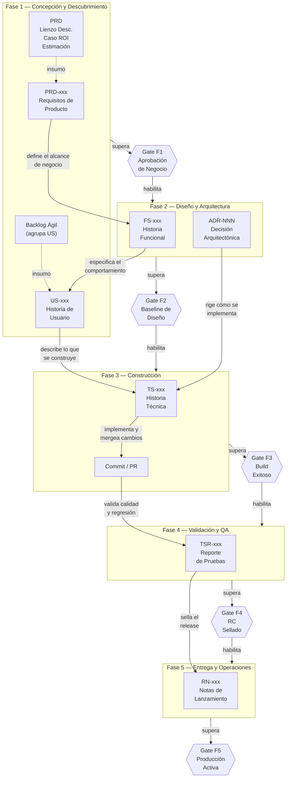

# Modelo de Trazabilidad

<p align="right">
  
  
  
  
</p>

> **Fase SDLC:** Transversal
> **Puerta de salida:** Aplica a todos los gates
> **Padre:** [Mapeo SDLC–Artefactos](./mapeo-artefactos-sdlc.es.md)
> **Audiencia:** Architecture Board, Product Owners, QA Engineers, Tech Leads

---

## Propósito

Este documento establece el modelo canónico de trazabilidad que conecta los artefactos del SDLC desde el valor de negocio hasta la evidencia de release. Define la cadena de evidencia mínima, los identificadores cruzados obligatorios y los criterios para considerar una cadena de trazabilidad como completa antes de activar cada gate de salida.

Una cadena de trazabilidad completa garantiza que ningún código llega a producción sin poder responder: **¿de qué requisito de negocio viene? ¿bajo qué decisión arquitectónica fue construido? ¿cómo fue verificado? ¿cuándo fue entregado?**

> **Cadena canónica:** PRD (requisitos) → FS (diseño funcional) → US (especificación) → TS (implementación) + ADR (decisión arquitectónica) → PR (código) → TSR (validación) → RN (release)

---

## 1. Identificadores de Artefacto

Cada artefacto en el SDLC usa un identificador estable que no cambia aunque el archivo se mueva de carpeta.

| Prefijo | Tipo de Artefacto | Formato | Ejemplo |
|---|---|---|---|
| `PRD` | Documento de Requisitos de Producto | `PRD-<Producto>-<NNN>` | `PRD-UMS-001` |
| `FS` | Historia Funcional | `FS-<Producto>-<NNN>` | `FS-UMS-012` |
| `US` | Historia de Usuario | `US-<Producto>-<NNN>` | `US-UMS-034` |
| `TS` | Historia Técnica | `TS-<Producto>-<NNN>` | `TS-UMS-056` |
| `ADR` | Registro de Decisión Arquitectónica | `ADR-<NNN>` | `ADR-0002` |
| `TSR` | Reporte Resumen de Pruebas | `TSR-<Producto>-<NNN>` | `TSR-UMS-001` |
| `RN` | Notas de Lanzamiento | `RN-<Producto>-<Versión>` | `RN-UMS-1.0.0` |
| `PR` | Pull Request | `PR-<Producto>-<NNN>` | `PR-UMS-042` |
| `HF` | Hotfix | `HF-<Producto>-<NNN>` | `HF-UMS-002` |

---

## 2. Cadena de Evidencia Canónica

La cadena de trazabilidad mínima conecta los artefactos a través de las 5 fases del SDLC. Cada flecha representa una relación de derivación obligatoria y cada gate verifica que la cadena esté completa antes de avanzar.



### Flujo narrativo paso a paso

| Paso | De | A | Mensaje | Gate que libera |
| :--: | :- | :- | :------ | :------------- |
| 1 | **PRD** (requisitos de producto) | **FS** (historia funcional) | El PRD define el alcance del producto. La FS descompone ese alcance en comportamientos de negocio verificables. Toda FS debe declarar su PRD padre. | G1 — Aprobación de Negocio |
| 2 | **FS** (historia funcional) | **US** (historia de usuario) | La FS se descompone en una o más US que describen, desde la perspectiva del usuario final, qué funcionalidad se entrega. Cada US referencía su FS padre. | G2 — Baseline de Diseño |
| 3 | **US** + **ADR** (decisión arquitectónica) | **TS** (historia técnica) | La US describe _qué_ construir. La ADR define _cómo_ debe construirse (patrones, restricciones). La TS traduce ambos en tareas técnicas concretas. | G2 — Baseline de Diseño |
| 4 | **TS** (historia técnica) | **PR** (pull request) | El desarrollador implementa la TS y abre un PR que la referencia en el título o cuerpo. El PR es la evidencia de que el código fue producido. | G3 — Build Exitoso |
| 5 | **PR** + **TS** | **TSR** (reporte de pruebas) | El código mergeado se valida. El TSR lista explícitamente todas las TS cubiertas y sus resultados de prueba. | G4 — RC Sellado |
| 6 | **TSR** (reporte de pruebas) | **RN** (notas de lanzamiento) | Con el RC sellado, se producen las notas de lanzamiento que referencian el TSR que lo validó. | G5 — Producción Activa |

### Reglas de derivación obligatorias

| # | Regla |
| :-: | :---- |
| 1 | Toda `FS` debe referenciar su `PRD` padre en el campo **Padre** de los metadatos. |
| 2 | Toda `US` debe referenciar su `FS` padre. |
| 3 | Toda `TS` debe referenciar su `US` o `FS` padre **y** al menos un `ADR` que rige su implementación. |
| 4 | Todo PR de código debe referenciar su `TS` en el título o cuerpo. |
| 5 | Todo `TSR` debe listar los identificadores `TS` cubiertos en la validación. |
| 6 | Todo `RN` debe referenciar el `TSR` que sella el release candidate. |

### Catálogo de plantillas

| Artefacto | Descripción | Objetivo | Ejemplo |
| :-------- | :---------- | :------- | :------ |
| [PRD](04-plantillas-artefactos/plantilla-prd.es.md) | Documento de Requisitos de Producto | Congelar alcance del producto antes de diseñar | PRD-UMS-001 |
| [FS](04-plantillas-artefactos/plantilla-historia-funcional.es.md) | Historia Funcional — contrato de comportamiento verificable | Formalizar el diseño funcional antes de codificar | FS-UMS-012 |
| [US](04-plantillas-artefactos/plantilla-historia-usuario.es.md) | Historia de Usuario — requisito atómico con criterios BDD | Capturar necesidades del usuario | US-UMS-034 |
| [TS](04-plantillas-artefactos/plantilla-historia-tecnica.es.md) | Historia Técnica — traducción a tareas de implementación | Descomponer el diseño en tareas implementables | TS-UMS-056 |
| [ADR](04-plantillas-artefactos/plantilla-adr.es.md) | Architecture Decision Record — registro de decisión técnica | Documentar decisiones que rigen la implementación | ADR-0041 |
| [TSR](04-plantillas-artefactos/plantilla-reporte-resumen-pruebas.es.md) | Test Summary Report — reporte de métricas y evidencia RC | Evidenciar la calidad antes de sellar el release | TSR-UMS-001 |
| [RN](04-plantillas-artefactos/plantilla-notas-lanzamiento.es.md) | Release Notes — notas de lanzamiento | Comunicar cambios, limitaciones y dependencias | RN-UMS-1.0.0 |

---

## 3. Matriz de Trazabilidad Mínima por Tipo de Artefacto

| Artefacto | Campo obligatorio | Referencia a | Regla de validación |
|---|---|---|---|
| `PRD` | `PRD-ID` | — | Debe existir antes de producir cualquier `FS`. |
| `FS` | `Padre: PRD-xxx` | `PRD` | No puede existir `FS` sin `PRD` activo aprobado. |
| `US` | `Padre: FS-xxx` | `FS` | Toda `US` pertenece a exactamente una `FS`. |
| `TS` | `Padre: US-xxx o FS-xxx` + `ADR: ADR-NNN` | `US` o `FS`, `ADR` | La `TS` sin `ADR` referenciado falla la revisión de gate. |
| `ADR` | `ID: ADR-NNN`, `Estado` | — | El estado debe ser `Aceptado` para que la `TS` sea válida. |
| `TSR` | `Release: RN-xxx`, lista de `TS` cubiertos | `TS`, `RN` | El `TSR` sin lista de `TS` cubiertos bloquea el gate RC Sellado. |
| `RN` | `RC-sellado-por: TSR-xxx` | `TSR` | Un `RN` sin `TSR` vinculado bloquea el gate Producción Activa. |

---

## 4. Reglas de Completitud de Cadena

Una cadena de trazabilidad se considera **completa** cuando todas las condiciones siguientes son verdaderas:

* [ ] Existe al menos un `PRD` con estado `Aprobado` para el producto en release.
* [ ] Cada `FS` en alcance del release tiene un `PRD` padre referenciado.
* [ ] Cada `US` en alcance tiene una `FS` padre referenciada.
* [ ] Cada `TS` en alcance tiene: padre (`US` o `FS`) + al menos un `ADR` vigente referenciado.
* [ ] Cada PR mergeado en el release referencia una `TS` activa.
* [ ] El `TSR` del release lista explícitamente los identificadores `TS` cubiertos.
* [ ] El `RN` del release referencia el `TSR` que sella el RC.

Si alguna condición falla, el Architecture Board puede emitir un **waiver de trazabilidad** siguiendo la política de waivers de [Gates de Calidad SDLC](./gates-calidad.es.md).

---

## 5. Derivación Inversa — Responsabilidad por Artefacto

La derivación inversa permite determinar, dado cualquier artefacto, qué otros artefactos son responsables de su existencia y qué artefactos dependen de él.

| Artefacto | Depende de | Es requerido por |
|---|---|---|
| `PRD` | Aprobación de negocio | `FS`, Gate F1 |
| `FS` | `PRD` | `US`, `TS`, Gate F2 |
| `US` | `FS` | `TS`, Gate F2 |
| `TS` | `US` o `FS`, `ADR` | PR, `TSR`, Gate F3 |
| `ADR` | Contexto arquitectónico | `TS`, Blueprint, Gate F2/F3 |
| `TSR` | `TS`, CI results | `RN`, Gate F4 |
| `RN` | `TSR`, plan de rollback | Gate F5 |

---

## 6. Esquema de Verificación Automatizable

Los siguientes campos en los metadatos de cada artefacto permiten validación automatizada mediante el script `.harness/scripts/validate-docs.mjs` y el pre-commit hook:

```markdown
> **ID:** <prefijo>-<producto>-<NNN>
> **Fase SDLC:** <N> — <Nombre>
> **Puerta de salida:** <Gate que controla este artefacto>
> **Padre:** <ID-padre>
> **ADR:** ADR-NNN   ← solo en TS
> **Estado:** Borrador | En Revisión | Aprobado | Supersedido
```

La ausencia de los campos `ID`, `Padre` o `Estado` en un artefacto requerido debe causar falla en la validación de pre-commit.

---

## 7. Documentos Relacionados

| Documento | Propósito |
|---|---|
| Flujo Asistido por Agentes de IA | Alternativa asistida por agentes BMAD para ejecutar la cadena de trazabilidad. |
| [Mapeo SDLC–Artefactos](./mapeo-artefactos-sdlc.es.md) | Define los artefactos requeridos por fase. |
| [Gates de Calidad SDLC](./gates-calidad.es.md) | Compuertas de promoción entre fases y política de waivers. |
| [Mejores Prácticas de Documentación SDLC](./03-documentacion/mejores-practicas-documentacion-sdlc.es.md) | Convenciones de metadatos, identificadores e identificadores cruzados. |
| [Framework SDLC Orientado a Construcción](./02-ingenieria/framework-sdlc-enfoque-construccion.es.md) | Visión general del SDLC y Definición de Hecho. |
| [Centro de Gobernanza SDLC](./README.md) | Hub de navegación del SDLC. |

---

<p align="center">
  
  
</p>

<p align="center">
  <strong>© Unimar S.A.</strong> · RUC 20100412447 · Operador Logístico Aduanero desde 1978<br>
  Última revisión: 2026-06-08
</p>
