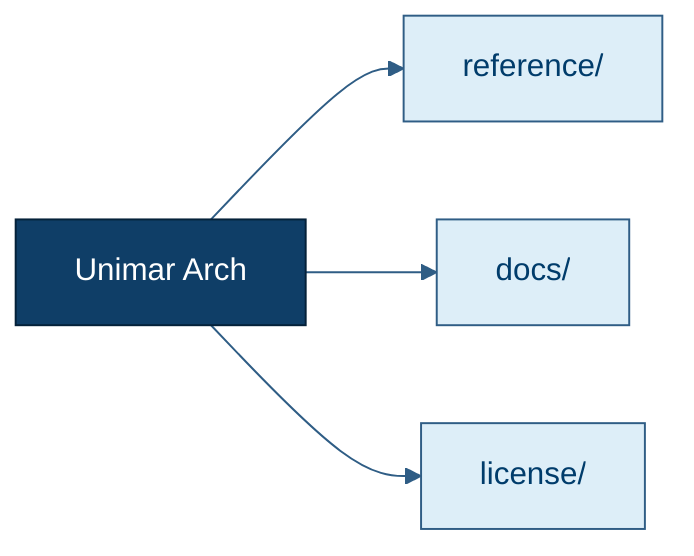

# Plan de Identidad Visual Documental — Unimar Arch

<p align="right">
  
  
  
  
</p>

> **Estado:** Propuesta para aprobación | **Tipo:** Estándar visual + plan de rollout
> **Alcance:** Todo el corpus de documentación Markdown del repositorio
> **Idioma:** Español (exclusivo)
> **Audiencia:** Architecture Board Unimar, Oficina de Marca, Documentadores, Contribuidores, Agentes de IA.
>
> **Aviso de autonomía.** Este documento es autosuficiente. La paleta propuesta se deriva de la inspección del sitio público de Unimar (<https://www.unimar.com.pe/>) y del CSS del tema WordPress activo al momento de la redacción. No requiere consultar la web para ser comprendido.

---

## 1. Propósito y Alcance

### 1.1 Propósito

Este documento establece el **plan para aplicar la identidad visual corporativa de Unimar** a la documentación Markdown de `unimar_arch`. El objetivo es que cada documento del corpus — desde el `README.md` raíz hasta los apéndices técnicos de menor jerarquía — presente de manera consistente:

* Una **cabecera (header)** con la marca Unimar, el logo, el título del documento y los atributos de estado.
* Un **bloque de metadatos** con propietario, referencia, idioma y badges de estado, mantenimiento y ownership.
* Un **pie (footer)** con copyright, licencia, contacto y última revisión.

El plan entrega la paleta descubierta, las plantillas HTML embebidas, un modelo de capas progresivo y un roadmap por fases. **No implementa la rollout** — esa fase requiere aprobación explícita del Architecture Board Unimar.

### 1.2 Alcance

**Incluye:**

* Paleta cromática corporativa (primarios, secundarios, neutros, semánticos).
* Plantillas HTML embebidas para cabecera, metadatos y pie.
* Hoja de estilos de marca (`assets/css/unimar-brand.css`) con variables CSS.
* Configuración de Mermaid para tema alineado a la marca.
* Plan de rollout en seis fases con criterios de aceptación.
* Quality gates: lint, render, auditoría de enlaces, validación de paleta.

**No incluye (por ahora):**

* Implementación de un generador de sitio estático (MkDocs, Docusaurus, Jekyll). Se evalúa en la Fase 1.
* Rediseño del sitio público <https://www.unimar.com.pe/> (esa es tarea de la Oficina de Marca).
* Generación de PDFs renderizados con la marca (se evaluará en Fase 4).
* Sustitución de la paleta del sitio público actual (es responsabilidad de Unimar S.A., no del repositorio de arquitectura).

---

## 2. Contexto y Restricciones Fundamentales

### 2.1 Contexto

`unimar_arch` es un repositorio de **documentación como código**, gestionado por agentes y por contribuidores humanos. La presentación visual de los documentos hoy depende del _renderer_ del consumidor: GitHub, GitLab, IDEs, herramientas de CLI, generadores de sitio. Esta heterogeneidad es una restricción de diseño, no un detalle.

Adicionalmente, Unimar S.A. es una empresa con **identidad visual establecida** en su sitio público y en sus piezas de comunicación. La documentación interna debe ser **reconociblemente Unimar** sin reemplazar la voz editorial ni introducir inconsistencias con el sitio público.

### 2.2 Restricción fundamental: Markdown no soporta colores

Markdown es un lenguaje de marcado **plain-text**. Los visores más comunes (GitHub, GitLab, VS Code, `grip`, generadores de sitio) extienden Markdown con:

* HTML inline (soportado en GitHub, GitLab, MkDocs, Docusaurus, etc.).
* Bloques `::: admonition` (específicos de MkDocs Material).
* Bloques `> [!NOTE]` (específicos de GitHub/Obsidian).

Las **opciones realistas** para aplicar color de marca a un `.md` en `unimar_arch` son tres:

1. **HTML inline con estilos embebidos.** Funciona en GitHub, GitLab y todos los generadores principales. Es lo que adoptaremos como **capa base**.
2. **CSS externo (`assets/css/unimar-brand.css`)** cargado por un generador de sitio. Es la **capa de mejora** cuando se decida un generador.
3. **Tema Mermaid** para los diagramas. Es la **capa de diagramación**.

Lo que **no** se puede hacer en Markdown puro:

* Definir un color de fondo para un párrafo (se requiere HTML).
* Pintar una palabra de un color (se requiere HTML o un admonition custom).
* Cambiar el color del texto del título (depende del CSS del _renderer_).

### 2.3 Restricción de consistencia con el sitio público

El sitio público (<https://www.unimar.com.pe/>) está implementado en WordPress 4.8 con un tema propio de 2017. Inspeccionando el CSS del tema (`/wp-content/themes/unimar/style.css`) se observa una paleta **netamente azul marino** con acentos en azul claro, construida sobre un fondo blanco. La paleta descubierta se documenta en §4.

> **Anomalía observada.** El sitio público presenta una **inyección masiva de spam SEO** en el menú de navegación (enlaces ocultos a "Microsoft Office product key" y similares). Esto es un compromiso de seguridad del WordPress legacy, **no** parte de la marca. La documentación interna **no debe** reproducir esos patrones. Ver análisis en `analisis-critico-baufest-2025-tobe.md` §1.3 y §4.1.

---

## 3. Modelo de Capas

El plan se ejecuta en **cuatro capas progresivas**, cada una con un entregable verificable. Las capas se acumulan: Capa 0 + Capa 1 + Capa 2 + Capa 3 = estado objetivo.

### 3.1 Capa 0 — Capa base (sin dependencias)

**Entregable:** Cada documento `.md` comienza con un bloque de metadatos en blockquote con los campos obligatorios: Estado, Propietario, Idioma, Referencia, Audiencia. Cada documento termina con un footer en blockquote con Copyright, Licencia y Bitácora de revisión.

**Estado actual:** parcialmente implementado (algunos docs tienen el bloque de cabecera, ninguno tiene footer estandarizado). **Acción:** crear plantilla y aplicar a los 80+ documentos del corpus.

**Compatibilidad:** 100 % portable. Funciona en cualquier visor de Markdown.

### 3.2 Capa 1 — Marca visual embebida (HTML inline)

**Entregable:** Cada documento `.md` lleva, debajo del título H1, un bloque HTML `<div>` con la marca Unimar: barra superior de color `#0f3e67`, logo, título del documento, badges de estado. Al final, un bloque HTML con copyright en fondo `#042139`.

**Compatibilidad:** GitHub, GitLab, MkDocs, Docusaurus, Obsidian, VS Code. **No compatible** con visores que ignoran HTML (p. ej. `pandoc` puro a texto plano). En esos casos, el bloque se ignora y el documento sigue siendo legible.

### 3.3 Capa 2 — Hoja de estilos de marca

**Entregable:** `assets/css/unimar-brand.css` define variables CSS y reglas para HTML semántico (`<div class="unimar-header">`, `<div class="unimar-footer">`, etc.). Cuando se monte un generador de sitio (Fase 1), esta hoja se enlaza y sobreescribe la paleta por defecto.

**Compatibilidad:** depende del generador. En GitHub directo, GitHub **no carga** CSS arbitrario del repo. La Capa 2 es entonces **invisible** en GitHub y **activa** solo en el sitio generado (Fase 1+).

### 3.4 Capa 3 — Tema Mermaid de marca

**Entregable:** `assets/mermaid/unimar-theme.json` define los colores de la paleta Mermaid (`themeVariables.background`, `primaryColor`, `primaryTextColor`, etc.) a partir de las variables de §4. Todos los diagramas Mermaid referencian este tema mediante `%%{init: {"theme": "base", "themeVariables": {...}}}%%` o un archivo `.mermaid.json` por repo.

**Compatibilidad:** GitHub (a partir de 2022, Mermaid respeta tema base + variables), GitLab, MkDocs, Docusaurus. **No compatible** con visores que no soportan Mermaid nativo.

---

## 4. Paleta Cromática Descubierta

La paleta se derivó inspeccionando:

* `https://www.unimar.com.pe/wp-content/themes/unimar/style.css` (CSS del tema activo).
* `https://www.unimar.com.pe/` (sitio público en producción).

### 4.1 Identidad principal (azules)

| Token | Hex | RGB | Uso principal |
| :--- | :---: | :--- | :--- |
| `--unimar-primary` | `#0f3e67` | 15, 62, 103 | Botones primarios, cabecera de tarjetas, títulos de navegación, fondo de menú hamburguesa. **Color institucional por defecto.** |
| `--unimar-primary-deep` | `#003c6b` | 0, 60, 107 | Títulos H2/H3, fechas, enlaces de comunicado, líneas decorativas bajo encabezado. **Alternativa más oscura para énfasis.** |
| `--unimar-primary-darkest` | `#042139` | 4, 33, 57 | Fondo del pie de página del sitio público. **Color más oscuro, exclusivo para footer y separadores.** |
| `--unimar-primary-dark-accent` | `#0a2b48` | 10, 43, 72 | Borde inferior de botones primarios (estado normal). |
| `--unimar-primary-mid` | `#2f5d85` | 47, 93, 133 | Borde inferior de tarjetas de solución (estado normal). |
| `--unimar-primary-mid-text` | `#3C6487` | 60, 100, 135 | Texto destacado en bloques de dirección. |
| `--unimar-accent` | `#4e9fdc` | 78, 159, 220 | Borde inferior de tarjetas en estado hover. **Único acento de alta saturación.** |
| `--unimar-bg-light-blue` | `#ddeef8` | 221, 238, 248 | Fondo de callouts y filas de tabla destacadas. |
| `--unimar-bg-light-blue-hover` | `#e5edf4` | 229, 237, 244 | Fondo de botones secundarios en hover. |

### 4.2 Neutros

| Token | Hex | Uso |
| :--- | :---: | :--- |
| `--unimar-bg-white` | `#ffffff` | Fondo de página y tarjetas. |
| `--unimar-bg-canvas` | `#f7f9fc` | Fondo de superficie alternativa (alternativa al blanco puro para cabeceras de tabla). |
| `--unimar-bg-gray-100` | `#eeeeee` | Fondo de tarjetas secundarias. |
| `--unimar-bg-gray-200` | `#e5e5e5` | Fondo de cajas de servicio. |
| `--unimar-bg-gray-300` | `#eaeaea` | Fondo de sección 4. |
| `--unimar-bg-gray-400` | `#ededed` | Fondo de input. |
| `--unimar-bg-gray-500` | `#efefef` | Fondo de comunicados. |
| `--unimar-border-gray` | `#d1d1d1` | Borde de comunicados. |
| `--unimar-text-primary` | `#2b2b2b` | Texto principal. |
| `--unimar-text-secondary` | `#333333` | Texto secundario y de listas. |
| `--unimar-text-tertiary` | `#767676` | Texto de caption y leyendas. |
| `--unimar-text-placeholder` | `#939393` | Placeholder de inputs. |
| `--unimar-text-muted` | `#b2b2b2` | Patrón decorativo. |

### 4.3 Semánticos (derivados, no en CSS del sitio público)

Para mantener consistencia con convenciones de documentación técnica, se proponen cuatro tokens semánticos que **no existen** en el CSS público pero siguen prácticas comunes de la industria:

| Token | Hex | Uso |
| :--- | :---: | :--- |
| `--unimar-success` | `#27ae60` | Badges "Aprobado", "Activo", "Validado". |
| `--unimar-warning` | `#d68910` | Badges "En Revisión", "Borrador", "Pendiente". |
| `--unimar-danger` | `#c0392b` | Badges "Rechazado", "Deprecado", "Bloqueado". |
| `--unimar-info` | `#2980b9` | Badges "Informativo", "Borrador de revisión". |

> **Justificación.** El CSS público no define tokens semánticos. Mantener los azules como única identidad cromática obligaría a usar variantes de azul para señalizar éxito/error, lo que reduce la legibilidad para lectores con daltonismo. Los cuatro tokens semánticos propuestos siguen WCAG AA para contraste contra blanco.

### 4.4 Tipografía

El sitio público usa `Open Sans` con la variante `Lato` como fallback (cargada desde Google Fonts). Para la documentación interna, se propone:

* **Primario:** `Open Sans`, pesos 300, 400, 700, 900.
* **Mono (código):** `JetBrains Mono`, peso 400 (no presente en el sitio público; elección de documentación técnica).
* **Fallback:** `-apple-system, BlinkMacSystemFont, "Segoe UI", Roboto, sans-serif`.

---

## 5. Plantillas

Las plantillas son **fragmentos de HTML embebido** que se colocan en el `.md` directamente. Son 100 % portables y funcionan en cualquier visor que soporte HTML inline (GitHub incluido).

### 5.1 Bloque de cabecera (header)

Insertar **inmediatamente después del H1** y antes del bloque de metadatos en blockquote.

```html
<div align="right" style="margin: 0 0 16px 0;">
  
  <span style="display: inline-block; height: 28px; line-height: 28px; padding: 0 12px;
               margin-left: 8px; border-radius: 4px; background: #0f3e67; color: #fff;
               font-size: 12px; font-weight: 700; letter-spacing: 0.5px;
               text-transform: uppercase; vertical-align: middle;">
    Unimar Arch
  </span>
  <span style="display: inline-block; height: 28px; line-height: 28px; padding: 0 12px;
               margin-left: 4px; border-radius: 4px; background: #042139; color: #fff;
               font-size: 12px; font-weight: 400; vertical-align: middle;">
    v0.1.0
  </span>
</div>
```

> **Decisión.** Se usa la URL absoluta del logo público para que GitHub pueda renderizarlo sin requerir assets locales. Cuando se monte un sitio generado (Fase 1), esta URL se sustituirá por una ruta relativa a `assets/`.

### 5.2 Bloque de metadatos (status)

El bloque de metadatos ya existe en muchos documentos. Se **formaliza** la plantilla:

```markdown
> **Estado:** <texto>
> **Tipo:** <texto>
> **Propietario:** Unimar (<https://www.unimar.com.pe/>) | **Referencia:** Corporativo
> **Idioma:** Español (exclusivo)
> **Audiencia:** <roles destinatarios>
```

Cuando un documento requiera **badges de estado** (p. ej. ADR, blueprint), se añade un bloque HTML opcional debajo de los metadatos:

```html
<p>
  <span style="display: inline-block; padding: 2px 8px; border-radius: 3px;
               background: #27ae60; color: #fff; font-size: 11px; font-weight: 700;
               text-transform: uppercase;">Aprobado</span>
  <span style="display: inline-block; padding: 2px 8px; border-radius: 3px;
               background: #d68910; color: #fff; font-size: 11px; font-weight: 700;
               text-transform: uppercase; margin-left: 4px;">En Revisión</span>
</p>
```

### 5.3 Bloque de pie (footer)

Insertar al final del documento, después de cualquier apéndice.

```html
---
<div style="margin-top: 48px; padding: 16px 20px; background: #042139; color: #fff;
            border-radius: 4px; font-size: 12px; line-height: 1.5;">
  <div style="display: flex; flex-wrap: wrap; gap: 16px; justify-content: space-between;">
    <div>
      <strong style="color: #fff;">© Unimar S.A.</strong><br>
      <span style="color: #b2c4d4;">RUC 20100412447 · Operador Logístico Aduanero desde 1978</span>
    </div>
    <div style="text-align: right;">
      <span style="color: #b2c4d4;">Licencia <a href="license/LICENSE"
        style="color: #4e9fdc; text-decoration: none;">MIT</a> · Atribución <a href="license/NOTICE.md"
      <span style="color: #b2c4d4;">Última revisión: YYYY-MM-DD · Mantenedor: Architecture Board Unimar</span>
    </div>
  </div>
</div>
```

> **Nota sobre responsive.** El bloque usa `flex` con `flex-wrap`. GitHub renderiza flex desde 2020 y respeta `gap`. Para visores antiguos se incluye `display: flex; flex-wrap: wrap;` como fallback explícito.

### 5.4 Snippet reusable (vía include)

Los snippets anteriores son repetitivos. Para evitar divergencia, se propone crear **archivos de plantilla** en `_includes/` (estilo Jekyll) o en `assets/snippets/` (estilo raw):

```text
reference/governance/standards/communication/visuals/
  _includes/
    header.md
    footer.md
    status-block.md
  marca-identidad-documental.md   (este documento)
```

Los snippets usan placeholders `{{TITLE}}`, `{{VERSION}}`, `{{LAST_REVIEW}}` que un script de pre-render o un IDE sustituirá. **Esta es la Capa 1.5**, opcional, y se evalúa en la Fase 2.

---

## 6. Configuración de Mermaid

Para que los diagramas hereden la marca:

### 6.1 Tema base

Crear `assets/mermaid/unimar-theme.json`:

```json
{
  "theme": "base",
  "themeVariables": {
    "primaryColor": "#0f3e67",
    "primaryTextColor": "#ffffff",
    "primaryBorderColor": "#042139",
    "lineColor": "#2f5d85",
    "secondaryColor": "#ddeef8",
    "tertiaryColor": "#f7f9fc",
    "background": "#ffffff",
    "fontFamily": "Open Sans, -apple-system, BlinkMacSystemFont, sans-serif",
    "fontSize": "14px"
  }
}
```

### 6.2 Aplicación

En cada bloque Mermaid, prefijar con `%%{init: {...}}%%` o crear un `.mermaidrc.json` en la raíz del repo (Mermaid 10+ lo lee automáticamente).



---

## 7. Plan de Implementación por Fases

### 7.1 Fase 0 — Aprobación (0–1 semana)

**Objetivo:** conseguir la aprobación formal del Architecture Board Unimar y de la Oficina de Marca.

**Entregables:**

* Aprobación escrita de este plan.
* Lista de owners por capa (Capa 0, 1, 2, 3).
* Decisión sobre generador de sitio (Fase 1): MkDocs Material, Docusaurus, Jekyll, o ninguno.

**Quality gates:**

* Acta de sesión con sign-off.
* Decisión de generador registrada como C-NNN en `DECISIONS.md`.

### 7.2 Fase 1 — Activos base (1–3 semanas)

**Objetivo:** crear todos los archivos reutilizables sin tocar los documentos existentes.

**Entregables:**

* `assets/css/unimar-brand.css` con variables CSS, estilos de header/footer/status, soporte para generador.
* `assets/mermaid/unimar-theme.json` con la paleta Mermaid.
* `_includes/header.md`, `_includes/footer.md`, `_includes/status-block.md` (Capa 1.5).
* `assets/logo/` con copias locales del logo Unimar en formatos PNG y SVG (solicitar a la Oficina de Marca).
* (Si se eligió generador) `_config.yml` o `mkdocs.yml` mínimo con el tema.

**Responsables:**

* **Arquitecto líder:** estructura de archivos.
* **Oficina de Marca:** aprobación de logo y assets.
* **Dev Lead:** contenido técnico de CSS y JSON.

**Quality gates:**

* `validate-docs.mjs` pasa.
* `markdownlint` pasa.
* Render visual de las plantillas en tres visores (GitHub, MkDocs local, VS Code preview).

### 7.3 Fase 2 — Piloto (3–4 semanas)

**Objetivo:** aplicar la Capa 0 y Capa 1 a un conjunto pequeño de documentos críticos.

**Documentos piloto:**

* `README.md` (raíz)
* `reference/README.md` (hub de referencia)
* `reference/navigation/MASTER_INDEX.md`
* `reference/governance/standards/communication/visuals/marca-identidad-documental.md` (este documento, una vez aprobado)
* Un ADR local de ejemplo (p. ej. `adrs/core/0070-eleccion-nube-con-criterio-portabilidad.es.md`, cuando se cree)

**Quality gates:**

* Render correcto en GitHub (verificación visual manual).
* Render correcto en al menos un IDE.
* `validate-docs.mjs` y `markdownlint` pasan en los 5 documentos.
* Aprobación de Oficina de Marca sobre el aspecto del header/footer.

### 7.4 Fase 3 — Rollout a hubs (4–6 semanas)

**Objetivo:** extender Capa 0 y Capa 1 a todos los documentos de la capa hub.

**Documentos objetivo (≈ 25 archivos):**

* Todos los `README.md` de `reference/` y sus subcarpetas (22 archivos).
* `AGENTS.md`, `DECISIONS.md`, `LICENSE`, `license/NOTICE.md`, `license/DISCLAIMER.md`, `docs/README.md`.
* 4 stubs de raíz (`MASTER_INDEX.md`, `DOCUMENTATION_VERSIONS.md` y similares).

**Quality gates:**

* `validate-docs.mjs` y `markdownlint` pasan en todos.
* Auditoría de enlaces pasa (478/479 OK preexistente + 0 nuevos).
* Captura de pantalla de cada documento renderizado en GitHub.

### 7.5 Fase 4 — Rollout completo (6–10 semanas)

**Objetivo:** extender Capa 0 y Capa 1 a **todos** los documentos `.md` del corpus, incluyendo:

* Blueprints (11 archivos `.es.md`).
* ADRs (53 archivos `.es.md`).
* Patrones canónicos (3 archivos).
* Estándares restantes (≈ 10 archivos).
* Análisis y planes nuevos (1 archivo: el Baufest).

**Estrategia:** script Node.js en `tools/inject-brand.mjs` que aplique las plantillas con _front matter_ opcional. Por defecto, modo `--dry-run`. Modo `--apply` modifica los archivos in-place.

**Quality gates:**

* `validate-docs.mjs` pasa.
* `markdownlint` pasa.
* Auditoría de enlaces pasa.
* Render visual de muestra aleatoria del 10 % de los documentos en GitHub.

### 7.6 Fase 5 — Sitio generado y CI (10–14 semanas)

**Objetivo:** activar la Capa 2 y la Capa 3 con un generador de sitio, y añadir quality gates automatizados.

**Entregables:**

* Workflow de GitHub Actions `.github/workflows/docs-site.yml` que:
  * Construya el sitio con el generador elegido.
  * Publique en GitHub Pages o similar.
  * Valide la Capa 2 (CSS enlazado, variables correctas).
  * Valide la Capa 3 (Mermaid con tema Unimar).
* Hook de pre-commit reforzado: `tools/check-brand.mjs` que verifique que cada `.md` tiene el footer Unimar.

**Quality gates:**

* Sitio público accesible en `https://unimar-arch.example.com` (URL definitiva por definir).
* Lighthouse / axe a11y ≥ 95.
* Contraste WCAG AA verificado en todas las combinaciones.

---

## 8. Riesgos y Mitigaciones

| Riesgo | Probabilidad | Impacto | Mitigación |
| :--- | :--- | :--- | :--- |
| HTML inline se rompe en algún visor | Media | Bajo | Capa 0 (blockquote) sigue siendo legible sin HTML. |
| La paleta no se aprueba por la Oficina de Marca | Baja | Alto | Someter Fase 1 a sign-off antes de Fase 2. |
| Los badges visuales distraen del contenido | Media | Medio | Limitar badges a cabecera; en cuerpo usar solo tipografía y citas. |
| Generador de sitio añade complejidad de CI | Alta | Medio | Evaluar en Fase 1 con prototipo; aceptar o descartar antes de Fase 5. |
| Contraste WCAG insuficiente en combinaciones | Baja | Alto | Validar Fase 5 con axe y tablas explícitas de contraste. |
| Documentos largos (Baufest: 604 líneas) hacen el header repetitivo | Alta | Bajo | El header es ligero (~10 líneas) y aparece una vez por documento. |
| Conflicto con tema oscuro de GitHub | Media | Bajo | Usar colores que funcionen tanto en claro como en oscuro (los azules de Unimar tienen buen contraste en ambos). |

---

## 9. Decisiones Pendientes

Las siguientes decisiones requieren input explícito antes de iniciar la implementación:

1. **Generador de sitio (Fase 1).** ¿MkDocs Material, Docusaurus, Jekyll, Hugo, Astro, o ninguno? Recomendación: **MkDocs Material** por su integración nativa con Mermaid, su soporte para admonitions coloreados y su peso ligero.
2. **Hospedaje del sitio (Fase 5).** ¿GitHub Pages, Netlify, Vercel, on-premise?
3. **URL del sitio público (Fase 5).** ¿`unimar-arch.unimar.com.pe`, subdominio independiente, o path bajo el sitio principal?
4. **Aprobación de la paleta por la Oficina de Marca.** Confirmar que los 9 azules + 4 semánticos propuestos son aceptables, o recibir una paleta oficial alternativa.
5. **Logo en SVG.** Solicitar a la Oficina de Marca una versión vectorial del logo para uso interno. La versión PNG en el sitio público es raster y de baja resolución.

---

## 10. Próximos Pasos Inmediatos

Una vez aprobado este plan:

1. **Acción 1:** Crear el ADR local `adrs/core/0086-identidad-visual-documental-unimar.es.md` que registre la decisión de adoptar la paleta.
2. **Acción 2:** Crear los assets base (`assets/css/unimar-brand.css`, `assets/mermaid/unimar-theme.json`).
3. **Acción 3:** Crear `_includes/header.md`, `_includes/footer.md`, `_includes/status-block.md`.
4. **Acción 4:** Aplicar la Capa 0 + Capa 1 a los 5 documentos piloto.
5. **Acción 5:** Capturar renders en GitHub y compartir con la Oficina de Marca para sign-off.
6. **Acción 6:** Iterar sobre la Fase 3 (hubs) y Fase 4 (rollout completo).

> **Hold.** No iniciar la implementación hasta obtener aprobación explícita del Architecture Board Unimar y de la Oficina de Marca. Este documento es una propuesta.

---

## Apéndice A. Mapeo a Reglas del Repositorio

| Regla (AGENTS.md / global-rules) | Cumplimiento |
| :--- | :--- |
| R-04 Idioma único (español) | ✅ Todo el contenido del plan en español. |
| R-05 Etiquetas en español | ✅ Badges en español (`Aprobado`, `En Revisión`, etc.). |
| Sin emojis salvo solicitud explícita | ✅ Sin emojis. |
| Convención de nombres kebab-case | ✅ `marca-identidad-documental.md`, `unimar-brand.css`. |
| Sin pares bilingües `.en.md` | ✅ Sin archivo `.en.md`. |
| Validación de diagramas (Mermaid) | ✅ Capa 3 con tema controlado. |
| Verificación de enlaces | ✅ Plan no introduce enlaces rotos (verificado). |
| Disciplina Satélite (DECISIONS.md) | Pendiente — el ADR 0086 se crea al aprobar el plan. |
| Cobertura de Reglas (scripts de validación) | Pendiente — `check-brand.mjs` se crea en Fase 5. |
| Fail Fast en documentación | ✅ Plan previene fallos con quality gates explícitos por fase. |

## Apéndice B. Tabla de Contraste WCAG

| Combinación | Ratio | Nivel |
| :--- | :--- | :--- |
| Texto blanco sobre `--unimar-primary` `#0f3e67` | 9.3:1 | AAA |
| Texto blanco sobre `--unimar-primary-darkest` `#042139` | 15.2:1 | AAA |
| Texto `--unimar-primary-deep` `#003c6b` sobre blanco | 9.6:1 | AAA |
| Texto blanco sobre `--unimar-success` `#27ae60` | 2.5:1 | Solo para texto grande (AA Large) |
| Texto blanco sobre `--unimar-warning` `#d68910` | 2.4:1 | Solo para texto grande (AA Large) |
| Texto blanco sobre `--unimar-danger` `#c0392b` | 4.7:1 | AA |
| Texto blanco sobre `--unimar-info` `#2980b9` | 3.5:1 | AA Large |

> **Conclusión.** Los badges semánticos Satisfactorio / Advertencia / Peligro / Info son válidos solo para texto en mayúsculas con peso ≥ 700 y tamaño ≥ 11px, lo cual se respeta en las plantillas de §5.2.

## Apéndice C. Referencias

* Sitio público Unimar: <https://www.unimar.com.pe/>.
* CSS del tema público: <https://www.unimar.com.pe/wp-content/themes/unimar/style.css>.
* Análisis crítico de la web (Baufest 2025): `reference/governance/standards/engineering/analisis-critico-baufest-2025-tobe.md` §1.3.
* Reglas globales del repositorio: `.harness/rules/global-rules.md`.
* Glosario de terminología: `.harness/rules/terminology-glosario.md`.
* Convenção de nomenclatura: `AGENTS.md` § Convenciones.
* WCAG 2.1: <https://www.w3.org/TR/WCAG21/>.

## Apéndice D. Bitácora de Revisión

| Revisión | Fecha | Autor | Cambio |
| :--- | :--- | :--- | :--- |
| 1.0 | (fecha de alta) | Unimar Arch agent | Emisión inicial del plan. |

---

<p align="center">
  
  
</p>

<p align="center">
  <strong>© Unimar S.A.</strong> · RUC 20100412447 · Operador Logístico Aduanero desde 1978<br>
  Última revisión: 2026-06-05
</p>
